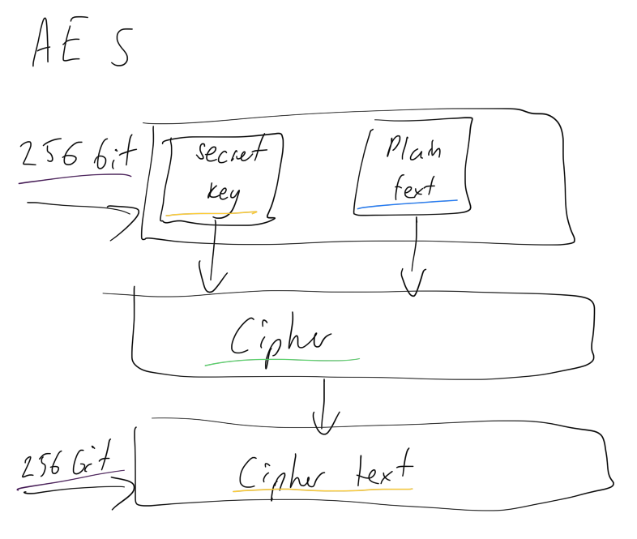

# AES for iOS Developers, Using Swift
## It isn't hard to crack (JOKE)

AES (Advanced Encryption Standard) is a symmetric encryption algorithm, and one that is fairly easy to use for iOS developers. 

Apple use AES-256* which is considered to be a strong encryption standard, and this article seeks to demystify the standard and go into how it might be used as an iOS developer.

Difficulty: Beginner | Easy | **Normal** | Challenging
This article has been developed using Xcode 14.2, and Swift 5.7.2

*Depending on your device

Prerequisites:
- You will be expected to be aware how to make a [Single View](https://medium.com/swlh/your-first-ios-application-using-xcode-9983cf6efb71) Application in Swift, or the [basic use of Playgrounds](https://medium.com/@stevenpcurtis.sc/coding-in-swift-playgrounds-1a5563efa089)

# Terminology
AES (Advanced Encryption Standard): is a widely-used symmetric encryption algorithm that provides strong encryption for data protection.
AES-GCM (Advanced Encryption Standard Galois/Counter Mode): is a mode of operation for the AES encryption algorithm. It is a combination of the Galois mode of operation and the Counter mode, which provides both confidentiality and authenticity for the encrypted data.

# What is AES?
AES is a strong encryption standard and is secure if implemented correctly. the 256-bit variant is used for iOS and is considered to be strong.
For 256-bit keys there are 14 rounds of processing. These rounds include substitution, transposition and mixing of the plaintext to transform it into the final ciphertext (the encrypted version of the original message).
The encryption process looks something like the following:

<br>

To decrypt cipher text, you typically reverse the order of the round keys generated during encryption to create a reverse key schedule. Then you would through a process of substitution, transposition, and mixing using the reverse key schedule.

# AES and iOS
## Where you're already using AES as a user
If you're using secure notes you're already benefiting from AES (in fact AES-GCM) to protect those messages from prying eyes!

However, there are a good number of Apps that use AES to protect data. We can think of some applications:
- Banking and finance apps: To protect personal data
- Messaging: To secure information between users
- Cloud storage: Secure sensitive information on a provider's servers 
- VPN: To ensure communication is secure between a device and VPN server
- Mail: Apple Mail certainly uses AES. AES can be used to protect data in transit, but it can also be used to encrypt data in storage

We should not be limited to these use cases though. AES is great and should be used wherever it can offer value.

## Where you might want to use AES in YOUR App
You always need to think about what suits your particular App and your particular customers when implementing anything. This includes encryption (of course it does).

- Storing data. If you are storing personal information in an iOS app, AES may be a good fit. If you wish to store passwords or banking information you should probably think of a better solution, but AES will be there for you if you decide this is the correct approach. This applies to data and files stored on the device.
- Protecting communication. If you wish to secure communication between a device and a server, AES (in combination with other technologies, [think about ATS and ATL!](https://medium.com/r/?url=https%3A%2F%2Fstevenpcurtis.medium.com%2Fapp-transport-security-has-blocked-a-cleartext-http-http-resource-load-since-it-is-insecure-65d75b598bcc)) may be a fit for your needs.
- Two-factor authentication. AES can be used to encrypt a device token in order to send the secure user credentials back to the authentication server

# An implementation
Apple have provided us with cryptokit and have of course provided documentation:

https://developer.apple.com/documentation/cryptokit/aes#

However I don't know about you, I've always found their documentation a little hard to follow. 

*It's something like, help me out! Give me the code*

There are various implementations on the Web that use an initial vector for this, and others that contain warnings due to their pre-Swift 5ness.

I've got this file (there's a playground in the repo) that uses 'CommonCrypto' to perform AES encryption and decryption in the simplest way I think I can muster. You do need to use a 256 
In Swift, you can use the 'CommonCrypto' framework to perform AES encryption and decryption. The framework provides a set of functions for symmetric encryption, including AES, which you can use to encrypt and decrypt data in a secure manner.

Here's an example of how you can use AES encryption in Swift:

```swift
import Foundation
import CommonCrypto

enum AESError: Error {
    case keySizeError
    case keyDataError
}

public struct AES256 {
    private let key: Data

    public init?(key: String) throws {
        guard key.count == kCCKeySizeAES256 else {
            throw AESError.keySizeError
        }
        guard let keyData = key.data(using: .utf8) else {
            throw AESError.keyDataError
        }
        self.key = keyData
    }

    public func encrypt(messageData: Data?) -> Data? {
        guard let messageData else { return nil}
        return crypt(data: messageData, option: CCOperation(kCCEncrypt))
    }

    public func decrypt(encryptedData: Data?) -> Data? {
        return crypt(data: encryptedData, option: CCOperation(kCCDecrypt))
    }

    private func crypt(data: Data?, option: CCOperation) -> Data? {
        guard let data = data else { return nil }
        var outputBuffer = [UInt8](repeating: 0, count: data.count + kCCBlockSizeAES128)
        var numBytesEncrypted = 0
        let status = CCCrypt(
            option,
            CCAlgorithm(kCCAlgorithmAES),
            CCOptions(kCCOptionPKCS7Padding),
            Array(key),
            kCCKeySizeAES256,
            nil,
            Array(data),
            data.count,
            &outputBuffer, outputBuffer.count, &numBytesEncrypted
        )
        guard status == kCCSuccess else { return nil }
        let outputBytes = outputBuffer.prefix(numBytesEncrypted)
        return Data(outputBytes)
    }
}

let message = "testing that it encrypts and decrypts"
let data = message.data(using: .utf8)
let key = "Uc1gU2FsdGVkX19LW0ZSbvKUJT6TnTfI"

let encryptedData = try? AES256(key: key)?.encrypt(messageData: data)
if let decryptedData = try? AES256(key: key)?.decrypt(encryptedData: encryptedData) {
    let decryptedMessage = String(data: decryptedData, encoding: .utf8)
    if decryptedMessage == message {
        print("Encryption and decryption successful")
    } else {
        print("Encryption and decryption failed")
    }
}
```

In this example, the `encrypt` function takes a plaintext message and a key and returns the encrypted message as a `Data` object. The `decrypt` function takes the encrypted data and returns the string message.
Isn't that nice?

# Alternatives to AES on iOS
## RSA
RSA is a widely used public key encryption algorithm that is often used for secure communications and digital signatures. Available with CryptoSwift (a widely used library) it can process large amounts of data. However, RSA encryption can be slow compared to AES and its security can be weakened if the key size is not large enough.

## Others
There are of course other algorithms and implementations avaliable. Remember to think about your project and which functionality (and implementation) works best for you!

# Conclusion
I hope this article has gone some way to helping with AES in Swift.
As ever, happy coding!
