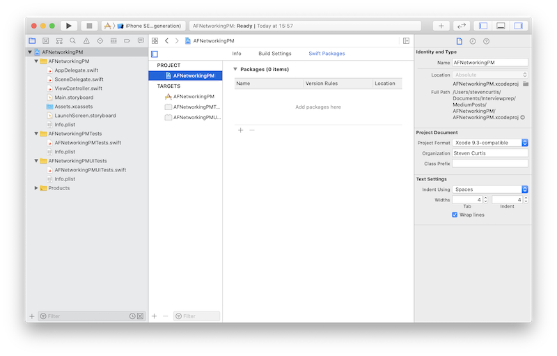
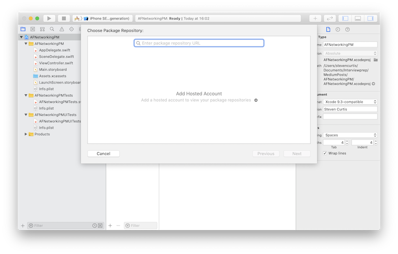
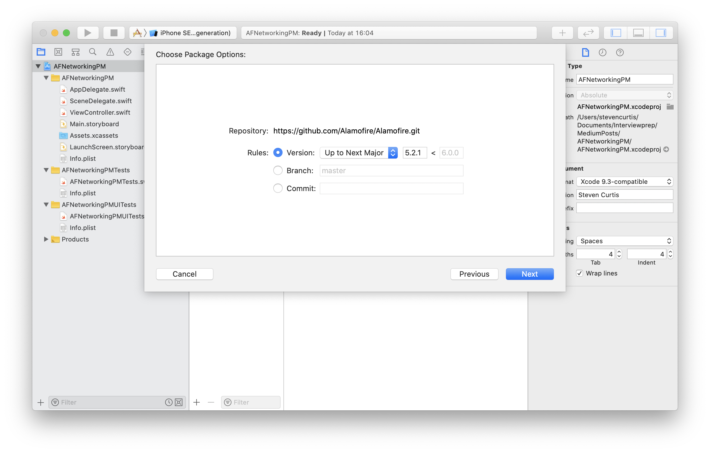
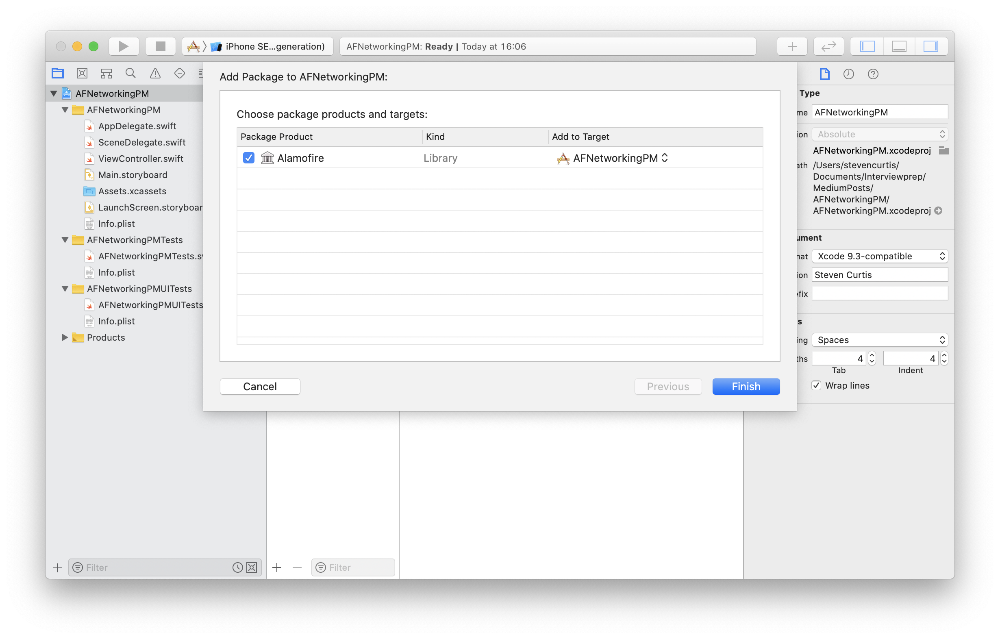
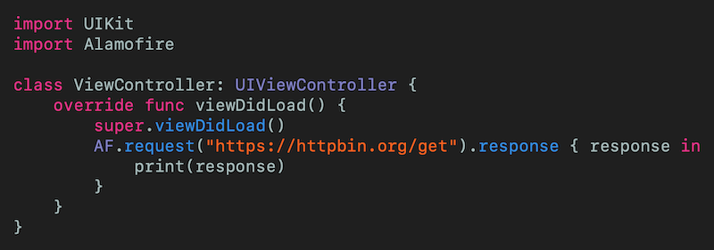

# Use Swift Package Manager to Add Dependencies
## SPM + Xcode + THAT GREAT PACKAGE

 
Photo by Katherine Gu on Unsplash

If you have reusable modules you might already use Swift Package Manager (SPM) to manage these dependencies for you. In this article, we will use SPM to fetch and use third-party code in our project. 

*excellent*

Difficulty: **Beginner** | Easy | Normal | Challenging 
This article has been developed using Xcode 11.4.1, and Swift 5.2.2

# What are dependencies anyway?
Something you depend on. Now, come on, even I can do better than that.
Imagine you want to use an external library for something a little tricky, like networking. 

We can call that library [Alamofire](https://github.com/Alamofire/Alamofire), and indeed many programmers use this for their projects as it avoids using their own network library and can feel secure that the library is already in use and well-tested in a variety of contexts.

Now there is an in-built problem here. If the third-party dependency has a bug in it and they fix it; do you want to use that new version with the fix (probably) and do you want to use that new version with a host of new features (umm, probably - if it doesn't break the code that I'm working on).  Which means that dragging files into your project is a quite immature and unhelpful way of managing depenencies in a larger project. Therefore *package managers* have been developed to help us out.

# Package Managers
Swift Package Manager isn't the only option for managing dependencies and giving us our desired third-party libarary (and version of the said libarary).

There are several other Package Managers you may have heard of - [CocoaPods](https://medium.com/swift-coding/using-development-pods-while-leveraging-local-pods-c36c3bf53491) and [Cathage](https://medium.com/@stevenpcurtis.sc/using-carthage-in-your-xcode-projects-3e06a1423de3)

# Find those dependencies
With so many third-party libaries avaliable for Swift, how do you pick the right one for you? You'll need to consider (amongst other questions) the following:
* support (updates etc.)
* compatibility with your current Swift version
* platform support of the libarary

To help you pick woudn't you like a nice interface giving you the avaliable options?

There are a couple of different sites you can use - [swiftpack.co](https://swiftpack.co/) and 
[swiftpackageindex.com](https://swiftpackageindex.com/) are two that spring to mind - but for the purposes of this tutorial I'm going to use the latter of the two for this article.

# The Example
This example is going to simply be to use [Alamofire](https://github.com/Alamofire/Alamofire) as a dependency in a [new Single View Application](https://medium.com/swlh/your-first-ios-application-using-xcode-9983cf6efb71). So after you've set up the new application (I've called mine `AFNetworkingPM`) follow the steps below:

I've already searched [https://swiftpackageindex.com](https://swiftpackageindex.com) and found the git link to be [https://github.com/Alamofire/Alamofire.git](https://github.com/Alamofire/Alamofire.git)...so we shall get started

## Navigating to packages
You can navigate to packages by clicking the project name and the `Swift Packages` tab. 

## Adding the package
We can click the `+` icon in order to add a Swift Package:

Xcode will then verify the link, and present some wonderful options for us. 

Where the default is `Version - Up to Next Major` which since updates up to the next major version should *not* introduce breaking changes to your code, but also keeps your project up to date (apart from that). If you want an explaination of this versioning - read about [semantic versioning](https://medium.com/@stevenpcurtis.sc/upgrade-to-semantic-versioning-31342b11ce97)

Alamofire will then be resolved and fetched. You can then add the package to your target:

## Using Alamofire

### The glib answer
You can now import Alamofire at the beginning of any file using `import Alamofire` - that's it!

### Using Alamofire
Alamofire is a networking library, so can we do something useful with it? Now I'm not going to use [MVVM-C](https://medium.com/@stevenpcurtis.sc/mvvm-c-architecture-with-dependency-injection-testing-3b7197eb2e4d) or in fact any architecture as this is an article about Swift Package Manager, but I will get it to download from a public API. - in this case I'll use [HTTPGet](https://httpbin.org/) to do just that. Since the request is made to a https site we don't need to worry about [App transport security](https://medium.com/@stevenpcurtis.sc/app-transport-security-has-blocked-a-cleartext-http-http-resource-load-since-it-is-insecure-65d75b598bcc65d75b598bcc) 

 
[Click for Gist](https://gist.github.com/stevencurtis/4edc2a7f3b0b77db41dd1c5d7485cbc2)

# Conclusion
The idea of using Package Manager is a simple one - get those dependencies added right into Xcode. This article has hopefully helped you to do just that, and to get on with the more interesting problems that can be solved using your valuable time. 

I hope this article has helped you out!

If you've any questions, comments or suggestions please hit me up on [Twitter](https://twitter.com/stevenpcurtis) 

Feel free to sign up to my [newsletter](https://slidetosubscribe.com/embed/swiftcoding/)
