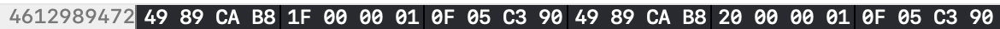
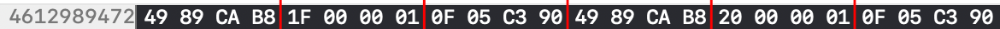
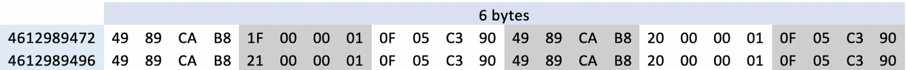
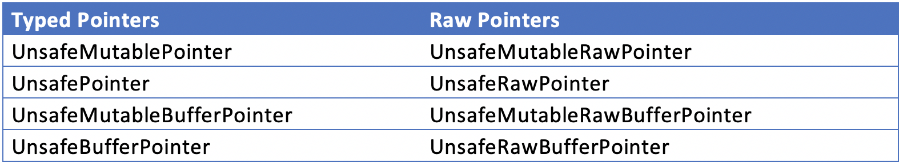

# Access Memory Directly in Swift
## Not just screens of numbers

Difficulty: Beginner | Easy | **Normal** | Challenging
Swift is a memory safe language, but 
To access the screenshot above in Xcode you can go through the menu `Debug>Debug Workflow>View Memory` and can choose an address to view, as well as the number of bytes.

---

Prerequisites:
Be able to produce a "Hello, World!" iOS application (guide [HERE](https://medium.com/swlh/your-first-ios-application-using-xcode-9983cf6efb71))
Understanding of [Bit, Bytes and Nibbles](https://medium.com/swlh/swift-bit-byte-and-nibble-6d34fbf2ee78)

---

# Terminology
Pointer: An object that stores a memory address
UnsafePointer: A pointer for accessing data of a specific type
UnsafeRawPointer: A raw pointer for accessing untyped data. This means there is no type safety and no alignment 

---

# What am I looking at?
The image above showing the memory state of my machine (while running an App through Xcode) isn't that easy to see. 
So we can break it down.
The given memory address is 0x112f4a220, and (0 represents octal while x denotes [hexadecimal](https://medium.com/@stevenpcurtis.sc/hexadecimal-in-programming-691ffe32f707)).
0x112f4a220 in Hex is equivalent to the Decimal number 4612989472, and this is the first Denary number on the left hand side of the screen shot.
The first row of the screenshot shows the following 



Each number (after the memory address) is displayed in Hex. This means that 49, 89, CA and so on is the data at each of these points is 8 bits (Each number can store a maximum of FF in Hex or 255 in Denary) - that is a byte.
4 bytes is a doubleword and (although not clear from the printscreen) the memory is split into these doublewords - to make this clear I've put some red marks on the image:



This gives us the following image of the 24 bits of this particular address:



---

# Prework: Memory layout
To help grasp the use of pointers, MemoryLayout is a great enumeration that can describe types in three great ways.
Swift has some great functions that allow you to see the size of objects, this is called Memory Layout. There is a full article on Memory Layout [HERE](https://medium.com/@stevenpcurtis.sc/memorylayout-in-swift-c4e70bb32e3f), and this works for any type you might use
For example a Boolean is 1 byte in size, calculated through the following function:

`MemoryLayout<Bool>.size // 1`

Although this only makes sense for value types, as a class is a reference type which will return 8 bytes for the size since that is the size of the reference (rather than the pointee that the reference points to).

---

## Pointers
Pointers are memory addresses, that is a pointer is a variable that holds the memory address of another viable.
We might be well-used to the fact that operations in Swift are safe, and the compiler performs static verification (that is Swift is type-safe so we can't assign an Integer to a String without a friendly compiler warning for example). 
We might want more control, or just want direct control over memory operations. Swift (as ever) helps us out.
This is the fundamental difference between Pointer and UnsafePointer, with use of UnsafePointer risking runtime crashes.

---

# Pointers in Swift
There are 8 pointers in swift, separated out into Typed and Raw Pointers. Each of them have an unsafe prefix to make it very obvious that we are managing memory manually.



---

# Dealing with Pointers: The UnsafePointer

Why would you need to deal with Pointers? You might need to, when working with C libraries, although you might gain performance increases by using pointers.
To start with we cover the UnsafePointer type here in Swift.

## Location of an Int

A simple Int is placed in memory, and we can view it's location in memory by using `withUnsafePointer(to:_:)`

```swift
var num: Int = 5

withUnsafePointer(to: &num, { ptr in
    print (ptr, ptr.pointee)
})
```

On my particular machine this returns `0x000000011fbde140`, and if you're using my machine you should give it back! If not, however you will probably be given a different memory address. Don't panic, this is expected. The 0x in the returned pointer is of type Hex.

The data is available from pointee and that is the second term (the `5`) that is output from the data.

## Location of an String

A similar story is for the String type 

```swift
var str: String = "A"

withUnsafePointer(to: &str, { ptr in
    print (ptr, ptr.pointee)
})
```

Which in the case of my machine returns `0x000000011ddc91a8 A`

## Location of an Array

An array operates in exactly the same way, and can be accessed with the following code:

```swift
var nums: [Int] = [5]

withUnsafePointer(to: &nums, {ptr in
    print (ptr, ptr.pointee)
})
```

Which in the case of my machine returns `0x000000011f630210 [5]`

---

## Passing pointers

C pointers can be passed in Swift! This is a great strength of Swift, the interoperability with C and Objective C.
It isn't the topic at discussion here, so this is example is rather trivial and shows you that passing pointers is possible, further reading will be required if you wish to do this type of coding

```swift
var result: CLong = 0
var readersList: UnsafeMutablePointer<CChar>? = nil
var readerLength: CUnsignedLong = 0
result = ListReaders(&readersList, &readerLength)
```

## The point in pointers?

Ahh, now we're getting to the heart of matters. One thing is that interoperability with C (see the section above). The other reason you might want to deal with pointers is for raw performance.
There isn't much more important than performance in some circumstances, so it might be worth making sure you're up to date with this stuff for when you require that performance.

# Conclusion

This article serves as a loose introduction into pointers. It shows you how you might want to show locations on the screen, and even how you might want to pass C pointers.

---

Extend your knowledge
Apple have created documentation for MemoryLayout [HERE](https://developer.apple.com/documentation/swift/memorylayout)
Apple have documentation about Memory Safety [HERE](https://medium.com/r/?url=https%3A%2F%2Fdocs.swift.org%2Fswift-book%2FLanguageGuide%2FMemorySafety.html)
The Swift Evolution proposal for MemoryLayout [HERE](https://github.com/apple/swift-evolution/blob/9cf2685293108ea3efcbebb7ee6a8618b83d4a90/proposals/0101-standardizing-sizeof-naming.md)

---

## The begging section:
Subscribing to Medium using this link shares some revenue with me.
You might even like to give me a hand by [buying me a coffee](https://www.buymeacoffee.com/stevenpcuri)
