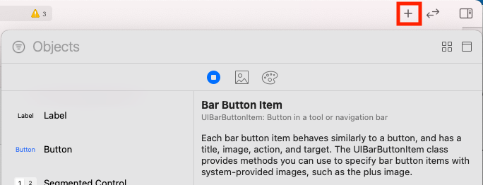
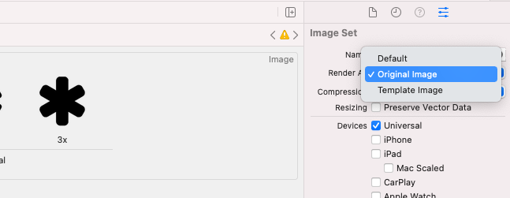
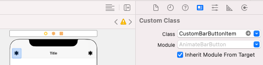

# Animate a UIBarButtonItem using Swift
## Make it look good

# Before we start
Difficulty: Beginner | **Easy** | Normal | Challenging<br>
This article has been developed using Xcode 12.2, and Swift 5.3

## Keywords and Terminology
UINavigationBar: A bar containing buttons for navigating within the hierarchy of screens

# This article
## Background
I've always wanted to create great user experiences. One way of doing this is to put lovely animations onto your UI. The `UINavigationBar` is a great opportunity for that.

## The Repo
I've prepared a [Repo](https://github.com/stevencurtis/SwiftCoding/tree/master/AnimateBarButton)  

## The Project
I started off the project and in the storyboard embedded the `UIViewController` instance in a `UINavigationController`, and then a `UIBarButtonItem` is added using the storyboard.

The image can then be chosen using the storyboard. Select the storyboard, and then find bar button item in the components by choosing with + and selecting the bar button item


this can then be dragged into the `UINavigationBar`.

Set images to be rendered as original image in the asset catalogue to stop them being blue. This can be done by selecting the asset catalog, then the asset and Image Set has the option on the right-hand side of Render As> Original Image.


## Size of the images
For the bar button items the best sizes are 22-44-66 for items @1x, 2x and 3x

## The Solution: Explanation
It is possible to place any sort of `UIView` subclass inside a bar button item as a custom view. It is therefore possible to place a `UIButton` into the custom view property, and then perform any animations as required. 

The intention is to put these animations into place when the view first enters the view, and another animation when the button is pressed.


we can  implement the following target to create a spinning animation when the user taps the button, which must be the target of our icon:

```swift
@objc private func handleStarButtonTap(_ sender: UIButton) {
    // negative is anti-clockwise
    barButtonItem.customView!.transform = CGAffineTransform(rotationAngle: -CGFloat(Double.pi * 6/5))
    UIView.animate(withDuration: 1.0) {
        // restore the identity transform; so the button goes back to the original position
        self.barButtonItem.customView!.transform = .identity
    }
}
```

Which is nice.

## The Solution: In the UIViewController
We can use [property observers](https://stevenpcurtis.medium.com/property-observers-in-swift-dbbb9190ea7c) to allow us to set the enclosed `UIButton` instance as a custom `UIBarButtonItem`

```swift
    @IBOutlet weak var barButtonItem: UIBarButtonItem! {
        didSet {
            // use the image set on the barButtonItem
            let icon = barButtonItem.image
            
            // set the iconSize
            let iconSize = CGRect(origin: .zero, size: icon!.size)
            
            // create a UIButton with the iconSeize
            let iconButton = UIButton(frame: iconSize)
            
            // setBackgroundImage for the UIButton
            iconButton.setBackgroundImage(icon, for: [])

            // the button goes into the right-hand side of the Navigation Bar
            barButtonItem.customView = iconButton
            
            // the custom view starts off small
            barButtonItem.customView!.transform = CGAffineTransform(scaleX: 0, y: 0)
            
            // animate the custom view to the regular size
            UIView.animate(withDuration: 1.0,
                delay: 0.0,
                usingSpringWithDamping: 0.5,
                initialSpringVelocity: 10,
                options: .curveLinear,
                animations: {
                    // restore the identity transform; so the button goes back to the original size
                    self.barButtonItem.customView!.transform = .identity
                },
                completion: nil
            )
            
            // set the target of the button
            iconButton.addTarget(self, action: #selector(handleStarButtonTap), for: .touchUpInside)
        }
    }
```

I do rather hate this solution, but that is because the code is right in the view controller. There must be a way I can do this better. Read on:

## The Solution: Subclass
We can animate the `UIBarButtonItem` by adding the following code into a new file:

```swift
import UIKit

class CustomBarButtonItem: UIBarButtonItem {
    
    required init?(coder: NSCoder) {
        super.init(coder: coder)
        
        // use the image set on the barButtonItem
        let icon = self.image
        
        // set the iconSize
        let iconSize = CGRect(origin: .zero, size: icon!.size)
        
        // create a UIButton with the iconSeize
        let iconButton = UIButton(frame: iconSize)
        
        // setBackgroundImage for the UIButton
        iconButton.setBackgroundImage(icon, for: [])

        // the button goes into the right-hand side of the Navigation Bar
        self.customView = iconButton
        
        // the custom view starts off small
        self.customView!.transform = CGAffineTransform(scaleX: 0, y: 0)
        
        // animate the custom view to the regular size
        UIView.animate(withDuration: 1.0,
            delay: 0.0,
            usingSpringWithDamping: 0.5,
            initialSpringVelocity: 10,
            options: .curveLinear,
            animations: {
                // restore the identity transform; so the button goes back to the original size
                self.customView!.transform = .identity
            },
            completion: nil
        )
    }
}
```

Which must of course be set in the storyboard to use this subclass.


Now when the items appear on the device screen they have a rather nice animation, which is great!

# Conclusion

The [Repo](https://github.com/stevencurtis/SwiftCoding/tree/master/AnimateBarButton) makes things rather easier to follow in this project, and I do recommend you download this project.

If you've any questions, comments or suggestions please hit me up on [Twitter](https://twitter.com/stevenpcurtis) 
