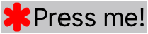
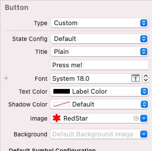
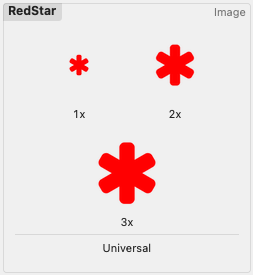
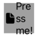

# Animate button labels
## Marquee!

# Before we start
Difficulty: Beginner | Easy | Normal | **Challenging**<br>
This article has been developed using Xcode 12.2, and Swift 5.3

## Keywords and Terminology
UIButton: A control that responds to user interactions
UILabel: A view used by UIKit that displays on or more lines of text

# This article
## Background
Experimenting with user interfaces? That sounds like fun!

We should know that `CABasicAnimation` is a concrete representation of a `CAAnimation`.

# The Project
I've created a project with several different animated buttons on them. They're fantastic! If you want to take a closer look, I'd advise you take a look at the accompanying repo. 
# Adding a target to each of the buttons
Each of these buttons have been added to the storyboard in this example, and the outlets connected up. 

Each of these are going to print out a rather attractive "Button Pressed" message to the console when the button is pressed. In fact, each of them is going to hit the following function when pressed:

```swift
@objc private func buttonAction() {
    print ("Button Pressed")
}
```

so in the case of the initial animatedButton I've set up a property

```swift
@IBOutlet weak var animatedButton: UIButton!
```

and then connected the `animatedButton` to the function

```swift
animatedButton.addTarget(self, action: #selector(buttonAction), for: .touchUpInside)
```

which is repeated for each of the buttons.

## Animating a label on a UIButton
The idea here is to animate the label on the `UIButton` from left to right, and then repeat that animation over and over.

The particular button in the example [repo](https://github.com/stevencurtis/SwiftCoding/tree/master/AnimateButtonLabel).

I've then put the following code in `viewDidAppear` of the `UIViewController` instance that contains all of these buttons

```swift
// confine the subviews to the bounds of the animatedButton
animatedButton.clipsToBounds = true
// create a CABasicAnimation for the x-position animation
let buttonAnimation = CABasicAnimation(keyPath: "position.x")
// begin the animation straight away
buttonAnimation.beginTime = 0.0
// this animation will last 1.5 seconds
buttonAnimation.duration = 1.5
// a property representing the x value where the titleLabel will scroll from
let buttonRHS: Double = Double(((animatedButton.titleLabel?.frame.maxX)! + (animatedButton.titleLabel?.frame.width)!))
// a property representing the x value where the titleLabel will scroll to
let buttonLHS: Double = Double(((animatedButton.titleLabel?.frame.minX)! - ((animatedButton.titleLabel?.frame.width)!)))
// set the from value of the animation
buttonAnimation.fromValue = NSNumber(value: buttonRHS)
// set the to value of the animation
buttonAnimation.toValue = NSNumber(value: buttonLHS )
// repeat the animation forever
buttonAnimation.repeatCount = .infinity
// add the animation to the UIButton's titleLabel
self.animatedButton.titleLabel!.layer.add(buttonAnimation, forKey: "basic")
```

## Animating a label and an image on a UIButton
The idea of this is to have both an image and some text on a UIButton, and have them animate both from right to left.

**The process**
Add both a title and an image in interface builder.
The text automatically changes to white, so it might not be visible (it is better therefore to change this to black or similar).

The finished result looks something like:


where the property inspector shows something like the following: 


Please do bear in mind that I added my own red star assets (feel free to download my repo and use it in your own project though).



We can then add the following code (that I've added in a function called in the `viewDidAppear` function called `animateButtonWithImage()`.

Now of course we are going to need to move both the titleLabel and the imageView 

```swift
// confine the subviews to the bounds of this view
animatedButtonWithImage.clipsToBounds = true
// create a CABasicAnimation for the x-position animation
let labelAnimation = CABasicAnimation(keyPath: "position.x")
// begin the animation straight away
labelAnimation.beginTime = 0.0
// this animation will last 1.5 seconds
labelAnimation.duration = 1.5
// a property representing the x value where the titleLabel will scroll from
let buttonRHS: Double = Double(((animatedButtonWithImage.titleLabel?.frame.maxX)! + (animatedButtonWithImage.titleLabel?.frame.width)!))
// a property representing the x value where the titleLabel will scroll to
let buttonLHS: Double = Double(((animatedButtonWithImage.titleLabel?.frame.minX)! - ((animatedButtonWithImage.titleLabel?.frame.width)!)))
// set the from value of the animation
labelAnimation.fromValue = NSNumber(value: buttonRHS)
// set the to value of the animation
labelAnimation.toValue = NSNumber(value: buttonLHS)
// repeat the animation forever
labelAnimation.repeatCount = .infinity

// create a CABasicAnimation for the x-position animation
let imageAnimation = CABasicAnimation(keyPath: "position.x")
// some padding as the imageview and the titleLabel would overlap each other is not
let imageViewPadding: Double = Double((animatedButtonWithImage.imageView?.frame.width)!) + Double((animatedButtonWithImage.titleLabel?.frame.midX)!)
// begin the animation straight away
imageAnimation.beginTime = 0.0
// this animation will last 1.5 seconds
imageAnimation.duration = 1.5
// a property representing the x value where the imageView will scroll from
let imageRHS: Double = buttonRHS - imageViewPadding
// a property representing the x value where the imageView will scroll to
let imageLHS: Double = buttonLHS - imageViewPadding
// set the from value of the animation
imageAnimation.fromValue = NSNumber(value: imageRHS)
// set the to value of the animations
imageAnimation.toValue = NSNumber(value: imageLHS)
// repeat the animation forever
imageAnimation.repeatCount = .infinity

// add the animation to the UIButton's imageView layer
self.animatedButtonWithImage.imageView!.layer.add(imageAnimation, forKey: "basic")
// add the animation to the UIButton's titleLabel layer
self.animatedButtonWithImage.titleLabel!.layer.add(labelAnimation, forKey: "basic")
```

## animateRoundedButton
Can we do the same, but with a circular image (this would be great for a profile image scrolling the first two letters of your name).

This `roundedAnimatedButton` does of course need to be, well, rounded. I've added this in the `viewWillAppear` function of the enclosing `UIViewController`.

```swift
// confine the subviews to the bounds of the animatedButton
roundedAnimatedButton.layer.masksToBounds = false
// set the corner radius. width / 2 gives this a circular look
roundedAnimatedButton.layer.cornerRadius = roundedAnimatedButton.frame.width/2
// center the text in the text
roundedAnimatedButton.titleLabel?.textAlignment = .center
```

The thing here is that I don't want the textLabel to endlessly scroll in and out endlessly. What I want is the textLabel to stop in the middle of the screen.

In order to do this it is possible to use a `CAAnimationGroup`. In order to make the textLabel stay in the middle of the button for the remaining time the duration of the group is set to be longer that the animation to move the text from the right to the middle of the button and from the middle to the left of the button.

This makes the `UIButton` have the desired effect!

```swift
// confine the subviews to the bounds of this view
animatedButtonImageStop.clipsToBounds = true
        
// create a CABasicAnimation for the x-position animation, which will move the titleLabel from the midpoint to the left
let labelAnimationInitial = CABasicAnimation(keyPath: "position.x")
// begin the animation after 2 seconds. CACurrentMediaTime is the current absolute time
labelAnimationInitial.beginTime = CACurrentMediaTime() + 2.0
// this animation will last 1.5 seconds
labelAnimationInitial.duration = 1.5
// a property representing the mid start point of the titleLabel
let buttonMid: Double = Double(((animatedButtonImageStop.titleLabel?.frame.midX)!))
// a property representing the x value where the titleLabel will scroll to on the left-hand side
let buttonLHS: Double = Double(((animatedButtonImageStop.titleLabel?.frame.minX)! - ((animatedButtonImageStop.titleLabel?.frame.width)!)))
// set the from value of the animation
labelAnimationInitial.fromValue = NSNumber(value: buttonMid)
// set the to value of the animations
labelAnimationInitial.toValue = NSNumber(value: buttonLHS )

// create a CABasicAnimation for the x-position animation, which will move the titleLabel from the right to the midpoint
let labelFromRHSAnimation = CABasicAnimation(keyPath: "position.x")
// a property representing the x value where the titleLabel will scroll from on the right-hand side. The + 15.0 is an offset
let buttonRHS: Double = Double(((animatedButtonImageStop.titleLabel?.frame.maxX)! + (animatedButtonImageStop.titleLabel?.frame.width)!)) + 15.0
// set the from value of the animation
labelFromRHSAnimation.fromValue = NSNumber(value: buttonRHS)
// set the to value of the animations
labelFromRHSAnimation.toValue = NSNumber(value: buttonMid)
// begin the animation after 3 seconds
labelFromRHSAnimation.beginTime = 3.0
// this animation will last 2 seconds
labelFromRHSAnimation.duration = 2

// move from mid to lhs
let labelFromMidAnimation = CABasicAnimation(keyPath: "position.x")
// set the from value of the animation
labelFromMidAnimation.fromValue = NSNumber(value: buttonMid)
// set the to value of the animations
labelFromMidAnimation.toValue = NSNumber(value: buttonLHS)
// begin the animation after 1 second
labelFromMidAnimation.beginTime = 1.0
// this animation will last 2 seconds
labelFromMidAnimation.duration = 2

// The animation group for moving the textLabel
let labelGroupAnimations = CAAnimationGroup()
// Set the animations for this CAAnimationGroup()
labelGroupAnimations.animations = [labelFromRHSAnimation, labelFromMidAnimation]
// the duration - which is longer than the consitiuent animations, so the textLabel will stay in the middle
// of the screen for the remaining time
labelGroupAnimations.duration = 6
// This animation will repeat indefinitely
labelGroupAnimations.repeatCount = .infinity
// animation is added to the titleLabel
self.animatedButtonImageStop.titleLabel!.layer.add(labelGroupAnimations, forKey: "basicRep")
```

## animateRoundedButton with image
This particular `UIButton` is called `roundedAnimatedImageButton` within the repo of this project. 

Now f you put both the image and the label into the button in the storyboard you get the rather upsetting result:


because there isn't really space to show both the textLabel and the imageView. As a result, I'm going to solve this in code.

The image that is going to be used is set up as property in the `UIViewController` instance

```swift
let img = UIImageView(image: UIImage(systemName: "doc.fill"))
```

where doc.fill is from the system images.

The textLabel is going to move from the centre of the screen and then off to the left, to then be replaced in the user's view by an image. This image passes to the center of the screen and then pauses there for little while, and then scrolls off the left-hand side of the screen. The image then appears on the button and then moves across the screen in the same fashion. 

```swift
// confine the subviews to the bounds of this view
roundedAnimatedImageButton.clipsToBounds = true

// a property to represent the midpoint of the button
let buttonMid: Double = Double(((roundedAnimatedImageButton.titleLabel?.frame.midX)!))
// a property to represent the left-hand side of the button to scroll just out of the view of the user
let buttonLHS: Double = Double(((roundedAnimatedImageButton.titleLabel?.frame.minX)! - ((roundedAnimatedImageButton.titleLabel?.frame.width)!)))

// The animation to move the textLabel from the right-hand side to the middle
let labelFromRHSAnimation = CABasicAnimation(keyPath: "position.x")
// a property to represent the right-hand side of a button
let buttonRHS: Double = Double(((roundedAnimatedImageButton.titleLabel?.frame.maxX)! + (roundedAnimatedImageButton.titleLabel?.frame.width)!)) + 15.0

// set the from value of the animation
labelFromRHSAnimation.fromValue = NSNumber(value: buttonRHS)
// set the to value of the animation
labelFromRHSAnimation.toValue = NSNumber(value: buttonMid)
// begin this animation after 5 seconds
labelFromRHSAnimation.beginTime = 5.0
// this animation will last 2 seconds
labelFromRHSAnimation.duration = 2

// move from mid to lhs (happens first)
let labelFromMidAnimation = CABasicAnimation(keyPath: "position.x")
// set the from value of the animation
labelFromMidAnimation.fromValue = NSNumber(value: buttonMid)
// set the to value of the animation
labelFromMidAnimation.toValue = NSNumber(value: buttonLHS)
// begin this animation after 5 seconds
labelFromMidAnimation.beginTime = 1.0
// this animation will last 2 seconds
labelFromMidAnimation.duration = 2

// an animation to hide the label after the from mid animation
let labelStayOffAnimation = CABasicAnimation(keyPath: "hidden")
// set the from value of the animation
labelStayOffAnimation.fromValue = false
// set the to value of the animation
labelStayOffAnimation.toValue = true
// begin this animation after 3 seconds
labelStayOffAnimation.beginTime = 3.0
// The animation is near-instantaneous here
labelStayOffAnimation.duration = 0.01
// the label will stay hidden moving forwards in time
labelStayOffAnimation.fillMode = .forwards

// show the label after the image will perform other animations
let labelAppearBackAnimation = CABasicAnimation(keyPath: "hidden")
// set the from value of the animation
labelAppearBackAnimation.fromValue = true
// set the to value of the animation
labelAppearBackAnimation.toValue = false
// begin this animation after 5 seconds
labelAppearBackAnimation.beginTime = 5.0
// The animation is near-instantaneous here
labelAppearBackAnimation.duration = 0.01
// the label will stay hidden moving forwards in time
labelAppearBackAnimation.fillMode = .forwards

// create an animation group to hold the animations for the label
let labelGroupAnimations = CAAnimationGroup()
// populate the animations array
labelGroupAnimations.animations = [labelFromRHSAnimation, labelFromMidAnimation, labelStayOffAnimation, labelAppearBackAnimation]
// since the duration of the group is longer than the constituent animation, the textLabel will stay in the middle of the UIButton in the remaining time
labelGroupAnimations.duration = 8
// repeat the animation indefinately
labelGroupAnimations.repeatCount = .infinity
// begin the group of animations immediately
labelGroupAnimations.beginTime = CACurrentMediaTime()

// a property to represent the center point of the titleLabel
let imageMid: Double = Double(((roundedAnimatedImageButton.titleLabel?.frame.midX)!))
// a property to represnt the left hand side of the button, where the image will scroll to
let imageLHS: Double = Double(((roundedAnimatedImageButton.titleLabel?.frame.minX)! - ((roundedAnimatedImageButton.titleLabel?.frame.width)!)))

// an animation to hide the image when it is not due to be viewed by the user
let imageHideAnimation = CABasicAnimation(keyPath: "hidden")
// set the from value of the animation
imageHideAnimation.fromValue = 1
// set the to value of the animation
imageHideAnimation.toValue = 0
// begin this animation immediately
imageHideAnimation.beginTime = 0
// the image will be hidden for 8 seconds
imageHideAnimation.duration = 8.0

// an animation to move the image from the middle of the screen to the left-hand side
let imageFromMidAnimation = CABasicAnimation(keyPath: "position.x")
// set the from value of the animation
imageFromMidAnimation.fromValue = NSNumber(value: imageMid)
// set the to value of the animation
imageFromMidAnimation.toValue = NSNumber(value: imageLHS)
// the animation will begin in 6 seconds
imageFromMidAnimation.beginTime = 6.0
// the animation lasts 2 seconds
imageFromMidAnimation.duration = 2

let imageFromRHSAnimation = CABasicAnimation(keyPath: "position.x")
// a property to represent the right-hand side of the screen
let imageRHS: Double = buttonRHS
// set the from value of the animation
imageFromRHSAnimation.fromValue = NSNumber(value: imageRHS)
// set the to value of the animation
imageFromRHSAnimation.toValue = NSNumber(value: imageMid)
// the animation will begin in 3 seconds
imageFromRHSAnimation.beginTime = 3.0
// the animation lasts 2 seconds
imageFromRHSAnimation.duration = 2

let imageGroupAnimations = CAAnimationGroup()
// add the animations to the animations group
imageGroupAnimations.animations = [imageHideAnimation, imageFromRHSAnimation, imageFromMidAnimation]
// the duration is longer than the constituent animations, so the image pauses in the middle of the screen
imageGroupAnimations.duration = 8.0
// repeat the animation group indefinitely
imageGroupAnimations.repeatCount = .infinity
// the animation group begins immediately
imageGroupAnimations.beginTime = 0.0

self.roundedAnimatedImageButton.titleLabel!.layer.add(labelGroupAnimations, forKey: "basicRep")
// add the animation to the img (which has already been added to the UIButton class)
img.layer.add(imageGroupAnimations, forKey: "imageRep")
```

## AnimatedButton: A UIButton subclass
We can use a [UIButton subclass](https://github.com/stevencurtis/SwiftCoding/tree/master/SubclassUIButton) in order to put all of this animation stuff into the `UIButton` rather than the enclosing `UIViewController` class.

This makes everything look rather nicer, and make a much better go at something which would be reusable and functional in a more production-like context.

```swift
class AnimatedButton: UIButton {
    
    override init(frame: CGRect) {
        super.init(frame: frame)
        // run the customize version to set the colours and the UIView
        customize()
    }

    required init?(coder aDecoder: NSCoder) {
        super.init(coder: aDecoder)
        // run the customize version to set the colours and the UIView
        customize()
    }

    override func layoutSubviews() {
        super.layoutSubviews()
        // Whenever the frame changes, run the customize function
        customize()
    }
    
    func customize() {
        // confine the subviews to the bounds of this view
        self.clipsToBounds = true
        // create a CABasicAnimation for the x-position animation
        let buttonAnimation = CABasicAnimation(keyPath: "position.x")
        // begin the animation straight away
        buttonAnimation.beginTime = 0.0
        // this animation will last 1.5 seconds
        buttonAnimation.duration = 1.5
        // a property representing the x value where the titleLabel will scroll from
        let buttonRHS: Double = Double(((self.titleLabel?.frame.maxX)! + (self.titleLabel?.frame.width)!))
        // a property representing the x value where the titleLabel will scroll to
        let buttonLHS: Double = Double(((self.titleLabel?.frame.minX)! - ((self.titleLabel?.frame.width)!)))
        // set the from value of the animation
        buttonAnimation.fromValue = NSNumber(value: buttonRHS)
        // set the to value of the animation
        buttonAnimation.toValue = NSNumber(value: buttonLHS)
        // repeat the animation forever
        buttonAnimation.repeatCount = .infinity
        // add the animation to the UIButton's titleLabel
        self.titleLabel!.layer.add(buttonAnimation, forKey: "basic")
    }
}
```

# Conclusion

This isn't all that easy, but I think the outcome is worth giving it a go. Why? These type of things are fun!

The [Repo](https://github.com/stevencurtis/SwiftCoding/tree/master/AnimateButtonLabel) makes things rather easier to follow in this project, and I do recommend you download this project.

If you've any questions, comments or suggestions please hit me up on [Twitter](https://twitter.com/stevenpcurtis) 
