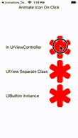

# Animate an Icon in Swift
## Make it look good

# Before we start
Difficulty: Beginner | **Easy** | Normal | Challenging<br>
This article has been developed using Xcode 12.2, and Swift 5.3

## Prerequisites
* You will be expected to be aware of how to make a [Single View Application in Swift](https://medium.com/swlh/your-first-ios-application-using-xcode-9983cf6efb71)

## Keywords and Terminology
UIImage: An object that manages image data
UIImageView: An object that displays a single image or a sequence of animated images

# This article
## Background
I've previously written an article about [UIView Animation](https://stevenpcurtis.medium.com/master-uiview-animation-ac21ebf42589), but I've never covered how to create those little animations that will make your UI a bit better.

This article? It will cover exactly that.

## The Repo
I've prepared a [Repo](https://github.com/stevencurtis/SwiftCoding/tree/master/SwiftUI/AnimateIconClick) 

## What Are we going to achieve?
We will use `UIView.animate` to create icons on the screen that will change when you click on them. There isn't anything much else to say, but the icon and `UILabel` instances are featured in [a UIStackView, which is in fact embedded in a UIStackView](https://stevenpcurtis.medium.com/the-only-uistackview-guide-you-will-ever-need-a2bdd2a2258b). This will cover both animating `UIButton` instances and `UIImageView` instances. 

To the end user, it is going to look like the following:



## Animate a UIImageView with a click
So we can add a plain `UIImageView` to the storyboard (of course connect the property to the `UIViewController` class - `@IBOutlet weak var starImage: UIImageView!`.

Since we are using a `UIImageView` we must make sure that user interaction is enabled (and I have done that in code rather than on the Storyboard) and connect an action to the `UITapGestureRecognizer`.

This is done through my `starImage` property `@IBOutlet weak var starImage: UIImageView!`, and set up with the following in `viewDidLoad`

```swift

```

which then fires off the handler

```swift
@objc private func handleStarTap(tapGestureRecognizer: UITapGestureRecognizer) {
    animate()
}
```

which itself is connected to the following function within the `UIViewController` instance:

```swift
private func animate() {
  UIView.animate(withDuration: 0.1, animations: {
    self.starImage.transform = self.starImage.transform.scaledBy(x: 0.3, y: 0.3)
    self.starImage.image = UIImage(named: "BlackStar")
  }, completion: { _ in
    UIView.animate(withDuration: 0.1, animations: {
        self.starImage.transform = CGAffineTransform.identity
        self.starImage.image = UIImage(named: "RedStar")
    })
  })
}
```

which seems great. But then we think about *The Problem*

*The Problem*
It's all rather not reusable, and this logic is tied up in the `UIViewController` instance. This isn't good, and surely we can do much, much better. So we will.

## Animate a UIImageView with a click: Improved
We could write our animation code in an extension, or as a subclass. I'm going to choose the latter since I only want this animation functionality to be available on specific instances of a `UIImageView` and not just any `UIImageView` that might be used at any given time.

This subclass looks like the following:

```swift
import UIKit

@IBDesignable
class StarImageView: UIImageView {
    func animate() {
      UIView.animate(withDuration: 0.1, animations: {
        self.transform = self.transform.scaledBy(x: 0.3, y: 0.3)
        self.image = UIImage(named: "BlackStar")
      }, completion: { _ in
        UIView.animate(withDuration: 0.1, animations: {
            self.transform = CGAffineTransform.identity
            self.image = UIImage(named: "RedStar")
        })
      })
    }
}
```

which is then connected in the storyboard and connected to a property `@IBOutlet weak var separateStarImage: StarImageView!`.

```swift
let separateTapGestureRecognizer = UITapGestureRecognizer(target: self, action: #selector(handleSeparateStarImageTap(tapGestureRecognizer:)))
separateTapGestureRecognizer.numberOfTapsRequired = 1
separateStarImage.isUserInteractionEnabled = true
separateStarImage.addGestureRecognizer(separateTapGestureRecognizer)
```

which then kicks off the following function

```swift
@objc private func handleSeparateStarImageTap(tapGestureRecognizer: UITapGestureRecognizer) {
    separateStarImage.animate()
}
```

There is a potential **problem** here. That problem: Why aren't we using a `UIButton` instance for this?

## Animate a UIButton image
Connecting up a storyboard `UIButton` to an image gives us `@IBOutlet weak var starButton: StarButton!`, but this time there is a much easier implementation to add the gesture - in this case, it is just adding a target:

```swift
starButton.addTarget(self, action: #selector(handleHeartButtonTap(_:)), for: .touchUpInside)
```

That hits the following function:

```swift
@objc private func handleStarButtonTap(_ sender: UIButton) {
    starButton.animate()
}
```

Of course, we need to have a `UIButton` class that contains our animation:

```swift
class StarButton: UIButton {
    func animate() {
      UIView.animate(withDuration: 0.1, animations: {
        self.transform = self.transform.scaledBy(x: 0.3, y: 0.3)
        let image = UIImage(named: "BlackStar")
        self.setImage(image, for: .normal)
      }, completion: { _ in
        UIView.animate(withDuration: 0.1, animations: {
            self.transform = CGAffineTransform.identity
            let image = UIImage(named: "RedStar")
            self.setImage(image, for: .normal)
        })
      })
    }
}
```

# Conclusion

The [Repo](https://github.com/stevencurtis/SwiftCoding/tree/master/SwiftUI/AnimateIconClick) makes things rather easier to follow in this project, and I do recommend you download this project.

If you've any questions, comments, or suggestions please hit me up on [Twitter](https://twitter.com/stevenpcurtis) 
