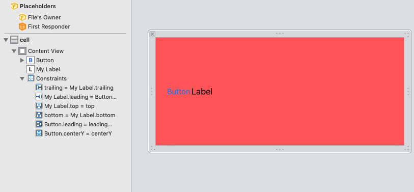
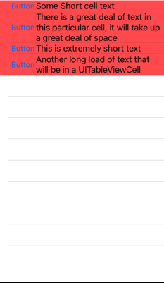

# Dynamic Row Heights for a UITableView
## Changes depending on the content

<br/>
<sub>Photo by Tamara Bellis on Unsplash<sub>

Difficulty: Beginner | Easy | **Normal** | Challenging

## Prerequisites:
* You will be expected to be aware how to make a [Single View Application](https://medium.com/swlh/your-first-ios-application-using-xcode-9983cf6efb71)
* Some knowledge of [UITableView would be useful](https://medium.com/@stevenpcurtis.sc/the-hidden-workings-of-uitableview-73feb60a13c3)

# Terminology:
UITableView: A view that presents data using rows arranged in a single column
UITableViewCell: The visual representation of a single row in a table view
awakeFromNib(): Prepares a UITableViewCell for use, after it has been loaded from a nib. Guaranteed to have all outlets connected.

## The problem
So many times I've used something like:

```swift 
func tableView(_ tableView: UITableView, heightForRowAt indexPath: IndexPath) -> CGFloat {
    20
}
```

to set the height of my `UITableViewCell`. This is (I suppose) fine, but I've often needed to have complex calculations within `heightForRowAt` to work out what the function should return for a wide variety of use cases.

As you might guess, this works out awfully for me. There must be a better way!

Let me explain it...

## The setup (UITableView)
The `UITableView` isn't special in the case of this demo code. 

The data that is going to be displayed are some strings that are intended to give a variety of different cell sizes

```swift
let data = ["Some Short cell text","There is a great deal of text in this particular cell, it will take up a great deal of space", "This is extremely short text", "Another long load of text that will be in a UITableViewCell"]
```

The only other section that isn't completely ordinary, is retrieving the cell - this is done from the `nib`. 

```swift
let nib = UINib(nibName: "CustomTableViewCell", bundle: nil)
tableView.register(nib, forCellReuseIdentifier: "cell")
```

Then this is dequeued in the `cellForRowAt` data source function.

```swift
let cell = tableView.dequeueReusableCell(withIdentifier: "cell", for: indexPath) as! CustomTableViewCell
``` 

the we can set up the cell as we might like.

Within the `CustomTableViewCell` itself there is just a button. Nothing special, but in the `xib` file using interface builder constraints are set on the top, leading, trailing and bottom to make the size of the cell hug the `UILabel` (although the fact is that I've added in a `UIButton` here just complicates things).



Oh, and to make it easy to see what we are doing because the background colour of the cell has been chosen as red. Sorry about that!

Here is the result of the code:


So it's really looking good! Different heights for 1 or 2 lines of text on the `UILabel`. Which is nice.

# Conclusion

I hope this article has been of help to you.
Happy programming!
Subscribing to Medium using this link shares some revenue with me.
You might even like to give me a hand by buying me a coffee https://www.buymeacoffee.com/stevenpcuri.
Any questions? You can get in touch with me HERE
