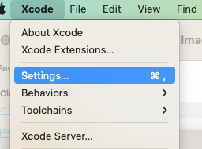
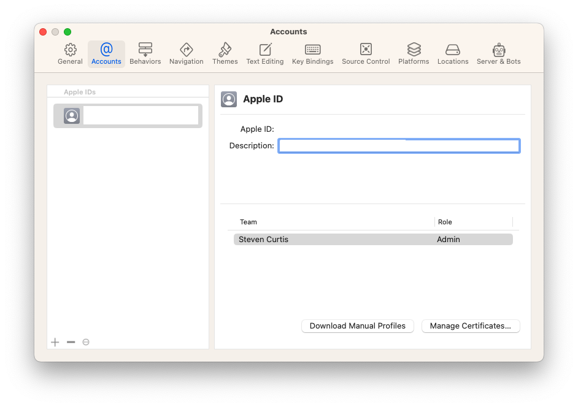
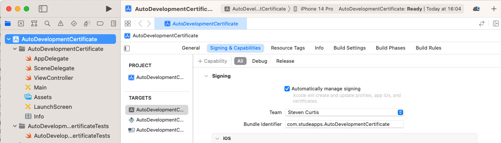
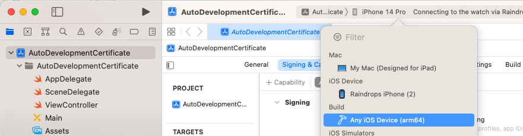
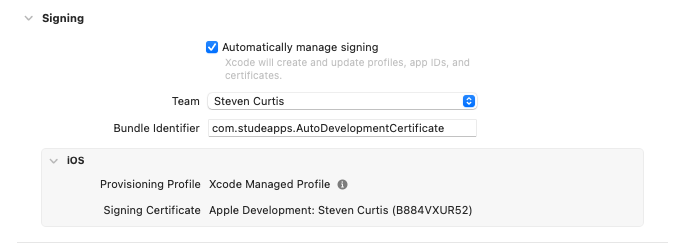

# Set up an Xcode development certificate

In this article I'll walk you through how to set up a development certificate and provisioning profile. I'll go slow and explain things on the way. Xcode does much of this work, so it should be a reasonable tutorial to follow for beginners!

Difficulty: **Beginner** | Easy | Normal | Challenging

## Prerequisites
- Be able to produce a ["Hello, World!" SwiftUI project](https://stevenpcurtis.medium.com/hello-world-swiftui-92bcf48a62d3) or using [UIKit](https://medium.com/swlh/your-first-ios-application-using-xcode-9983cf6efb71)
- Access to Xcode, which requires a [download](https://developer.apple.com/support/xcode/#:~:text=To%20download%20Xcode%2C%20simply%20sign,Program%20membership%20is%20not%20required.)

## Keywords and Terminology
App ID: An identifier assigned by Apple to one or more iOS App. It allows apps to communicate with Apple's servers and access certain services, such as push notifications and in-app purchases.
Bundle ID: A unique identifier assigned to an iOS app that specifies the app's identity and distinguishes it from other apps, and is used in various contexts such as code signing and provisioning.
Certificate: A certificate is a digital file used to identify the developer or organization and verify the authenticity of an iOS app, obtained from a trusted third-party certificate authority.
Digital Certificate: A file that contains information about the developer or organization, and is used to verify the authenticity of the iOS app. It is obtained from a CA and used to sign the app.
Development Certificate: A digital certificate issued by Apple that includes a public-private key pair and is used to sign iOS apps during the development and testing phase, ensuring their authenticity and integrity.
Provisioning profile: A file that specifies which devices or users are allowed to run a specific iOS app, and includes information about the app's code signing certificate, app identifier, and entitlements.

# Set up your development account
You need to set up a development account from Apple's website. There is a free account called the Apple Developer Program which allows you to access Xcode and the simulator.

However in order to obtain a developer certificate (and be able to use a physical device and upload to the App store) you'll need to pay an annual fee. Currently $100 dollars this includes the ability to create and manage developer certificates, provisioning profiles and app IDs.

From here you'll be able to download and install Xcode (although this tutorial doesn't cover that ground).

# Link to your developer account
You'll need to open up Xcode, and we'll link the IDE to your developer account.

We go to the `Settings...` in the Xcode menu

Now you're able to click on Accounts at the top.

I've amazingly hidden my email and Apple ID there. If you're on a fresh setup you'll need to click the '+' on the left-hand side. This allows you to sign into your Apple ID which is good stuff.

# Create a Bundle ID
A bundle ID uniquely identifies each App on Apple's side. You will need to choose the bundle ID within Xcode, unless you wish to use the automatically set version by Xcode.

If you click on the project name in the project navigator, then select the project target. You can then select `Signing & Capabilities` on th inner tab in Xcode.

A bundle identifier is usually written as a reverse domain name.

# Generate a Development Certificate
If your App has a unique Bundle ID, you will be able to generate a development certificate. Under *Team* you can select your Apple ID from the drop-down list. If you're signed in Xcode goes to the Developer Portal and creates a certificate for you.

# Create a Provisioning Profile
If you wish to deploy your App to a real, physical device you will need a provisioning profile.

You'll get prompts if you plug your device into your machine and "trust" your machine. If you do that, your device can be selected from within Xcode. You do need to ensure that your device is not sleeping. 

Which Xcode then shows against your provisioning profile.

Which is nice!

# Conclusion
That's it! Most of this work is done for you, and this is therefore an almost academic exercise at this point. In any case, I hope this article helps you out!
