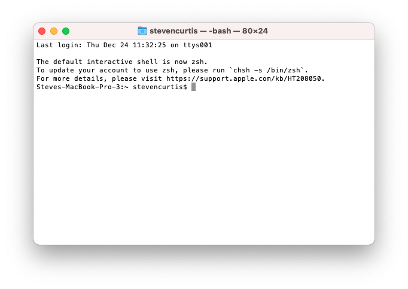

# What the ZSH is ZSH, and what is BASH anyway? An iOS developer's guide
## A simple comparison

# Before we start
Difficulty: Beginner | **Easy** | Normal | Challenging 

## Keywords and Terminology:
Bash: Bash, which stands for Bourne Again SHell, is a command-line interpreter that runs on Unix, Linux, and Apple computers
Shell: a computer program which exposes an operating system' s services to a human user or other program
Terminal: an interface that allows you to access the command line
ZSH: The Z shell, more commonly referred to as zsh , is a UNIX shell that is built on top of the Bourne shell (macOS default shell), better known as bash

# What is this about?
I've previously written about [Bash scripts](https://medium.com/@stevenpcurtis.sc/bash-scripts-with-arguments-719d3fe8fdb1), yet for a long time I've had the following message everytime that I've started up terminal:

 

yet I've never really understood what it meant, and looking at the link it only happened because I've upgraded my Mac's OS over time. The Apple link happliy points me to the manual for ZSH, but why why why would I need to change the default shell?

# The difference
**What didn't change**
Now in some sense Bash and Zsh are the same - since Zsh is built on Bash almost everything that worked in Bash works in Zsh. Later in this article I talk about how to change shells to make things even easier. Even scripts are unaffected, and scripts with a shebang line (`#!/`) will keep working as before.  

**What did change**
ZSH is not 100% compatible with bash, and the main differences are in the interactive configuration features. 

**The difference between the two**
ZSH has a load of features that are considered to be improvements on the default BASH implementation you might have on your Mac. 

Here is a small selection:
* Automatic cd - type the name of a directory (by running `setopt auto_cd` on the command line)
* File globbing (the * and ? pattern matching in paths)
* Spelling correction (run `setopt correct` and now it will match gate as date!)
* Statup and shutdown scripts can be used by using `zshenv`, `zprofile`, `zshrc`, `zlogin`, and `zlogout`
* mass [rename files](http://zsh.sourceforge.net/Doc/Release/User-Contributions.html#index-zmv) 
* Using [configuration files can help you get your work done fast](https://github.com/topics/zsh-configuration), including [Oh My Zsh](https://ohmyz.sh) to manage your configuration and get loads of different options that are easy to use

Oh and if you wish to have git completion, you can turn on the feature. Make sure you have a `~/.zshrc` file by using:
` touch ~/.zshrc`
You can then use nano to add in the appropriate line into the file
`nano ~/.zshrc`
and then add the following to the file
`autoload -Uz compinit && compinit`
a quick (control-x) will exit nano, you can save and then restart the shell (~/.zdhrc) for autocompletion to help you out!

# The configuation
** The configuration of Bash **

*.profile*

`.profile` is for environment variables `PATH` and similar. `.profile` dates back from the original Bourne shell (`sh`), but `bash` will read it due to compatibility with `sh` . This can be edited with NANO through `nano ~/.profile` - mine has a path to ruby version manager. (exit from nano with control-x). `.profile` is run at the start of a new login shell.

** When the `.bashrc` and `.bash_profile` files are loaded **
Each time you log into the terminal both the bash_profile and the bashrc files are loaded. You decide whether a command goes in `.bashrc` or `.bash_profile` depending on whether you want it to run once or when every interactive shell starts.

*.bashrc*

This is for configuring the interactive bash usage as the interactive non-login shell. This can be edited with NANO through `nano ~/.bashrc`. `bashrc` is a script that bash runs whenever it is started interactively.
This means that commands that should run every time a new shell is launched should be in the `.bashrc` 
(exit from nano with control-x)

*.bash_profile*

This is used for login shells, and is read and executed when bash is invoked as an interactive login shell. This can be edited with NANO through `nano ~/.bash_profile`
(exit from nano with control-x)

** The order **
The original `sh` looked at `.profile` on startup, and due to compatibility `bash` can use this file. So `bash` will try `.bash_profile` first, but if that does not exist it will move to `.profile`. 

** Reload the profile**
 You can reload .bash_profile from the command line with `source ~/.bash_profile`

**Configuration files**
Bash generally uses `.bashrc` 

** The configuration of ZSH **

*.zshrc*
This file works for the login shell, interactive shell and termianal.It's a script that is run whenever you start zsh. If you have certain paths to set, or initializations you want performed at the start-up of the shell, they are put in ~/. zshrc.
The `~/.zshrc` file does not exist by default on the mac and can be added with `touch ~/.zshrc` and edited with `nano ~/.zshrc` (exit from nano with control-x) 

Details:
* ~/.profile is not loaded by zsh at login.
* zsh loads ~/.zprofile at login.
* zsh loads ~/.zshrc when starting a new terminal session.

# Switching between shells
** Which shell are you using? **
In your terminal or in `iTerm` you can execute the following:
`echo $SHELL`

Now if you are using `/bin/zsh` you can switch to bash:
`exec bash`

if you are using `/bin/zsh` you can Switch to zsh:
`exec zsh` 

of course this only works in your current session. If you wish to change the defaults (this will ask you for your password in order to make these changes):

Change to bash:
`chsh -s /bin/bash`

Change to zsh:
`chsh -s /bin/zsh`

# Conclusion
There isn't a right and a wrong choice when selecting your shell of choice. You might just settle on one or the other, which is going to be your goto for the future. Whichever, whenever - it's your choice.

I hope that this article has been of help to you, and I guess I'll see you in the next article!

If you've any questions, comments or suggestions please hit me up on [Twitter](https://twitter.com/stevenpcurtis)
