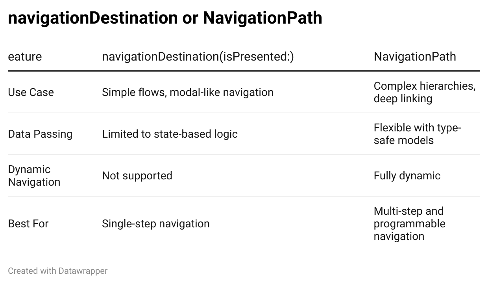

# Getting Started with NavigationStack in SwiftUI
## Game-Change

`NavigationStack` is described in the documentation as "A view that displays a root view and enables you to present additional views over the root view". That doesn't really cover the functionality of this API that effectively replaces `NavigationView` in terms of app navigation for SwiftUI.

This article is going to cover what you need to know to get started with `NavigationStack`.

# What is NavigationStack?

`NavigationStack` is a SwiftUI component that manages navigation hierarchies in an app.

`NavigationStack` gives access to dynamic navigation, deep linking and type safety within it's APIs.

To effectively use `NavigationStack` as a container you need to use `NavigationPath` to track the stack of views and `navigationDestination(for:)` for the destination views.

# Choices, Choice, Choices

There are a couple of approaches to navigation here: `navigationDestination` or `NavigationPath`. It's a choices depending on the problem you are solving, and don't worry there is an example of each further down this article.



# Example: Simple Passing Data with navigationDestination(isPresented:)

You can pass data by using a model and initializing the destination with it.

The a `@State` Binding `showDetails` tracks whether the destination should be presented. When a button changes this value to true navigation is triggered, and `navigationDestination(isPresented:)` specifies the view to show.

```swift
struct ContentIsPresented: View {
    let mainOrder: Order
    @State private var showDetails = false
    @State private var selectedItem: Order?

    var body: some View {
            VStack {
                Button("Show Main Order Details") {
                    selectedItem = mainOrder
                    showDetails = true
                }
                Button("Change Main Order Details") {
                    selectedItem = Order(id: 2, description: "Alternative")
                    showDetails = true
                }
            }
            .navigationDestination(isPresented: $showDetails) {
                if let item = selectedItem {
                    Text("Order Details: \(String(describing: item.description))")
                }
            }
    }
```

# Example: Dynamic Navigation with Multiple Destinations

`NavigationStack` handles complex hierarchies and deep linking. You can programmatically manage the navigation stack using type-safe paths.

`NavigationPath` is tracked with an `@State` variable to track the stack of navigation elements, `path.append()` programmatically pushes new elements onto the stack and `navigationDestination(for:)` handles each type of data.

```swift
struct ContentView: View {
    @State private var path = NavigationPath()

    var body: some View {
        NavigationStack(path: $path) {
            VStack {
                Button("Go to User Profile") {
                    let user = User(id: 1, name: "Ahmed")
                    path.append(user)
                }
                Button("Go to Order Details") {
                    let order = Order(id: 1, description: "Cheese")
                    path.append(order)
                }
            }
            .navigationDestination(for: User.self) { user in
                Text("User Profile: \(user.name)")
            }
            .navigationDestination(for: Order.self) { order in
                ContentIsPresented(mainOrder: order)
            }
        }
    }
}
```

# Conclusion

`NavigationStack` offers powerful ways to handle navigation in SwiftUI, and typically you would use `navigationDestination(isPresented:)` for simple state-driven navigation and `NavigationPath` for type-safe dynamic navigation flows.

Stay tuned for the next article, where we'll explore integrating `NavigationStack` with the MVVM-C architecture to create scalable and testable SwiftUI applications!
