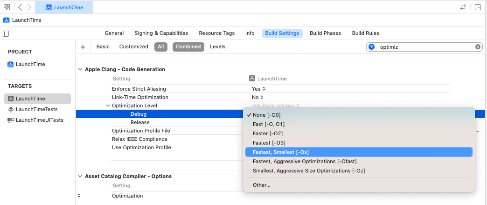
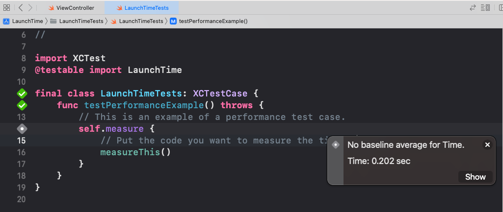
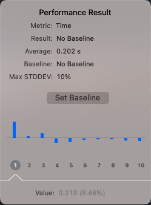

# Benchmark Swift Code
## See if it works well!


Difficulty: Beginner | **Easy** | Normal | Challenging<br/>
This article has been developed using Xcode 14.2, and Swift 5.7.2

Xcode has Instruments that can be used to improve your App's performance and get it working just as it should.

That is great, however sometimes we need to go further. Sometimes we need to *benchmark* our code.

# Terminology
Benchmark: The act of running a program in order to assess the relative performance

# The Clue In The Code
Once you've created a new project you automatically get some tests written for you.

You'll get the following code snippet in your project
```swift
func testPerformanceExample() throws {
    // This is an example of a performance test case.
    self.measure {
        // Put the code you want to measure the time of here.
    }
}
```

Which is super nice! You write your code in here that you wish to test! Wow!

However there is something *wrong* about this. At least potentially.

You should always measure speed setting the optimization is set to [-Os].



You might also wish to set the build configuration to release for testing (and the optimizations for that configuration as well).

A release build executable is likely to execute faster, but this is not always a significant different. Also if you attempt to run unit tests with a debug release you'll get the rather upsetting error message. `Module 'YourModule' was not compiled for testing`.

Once your test is run you'll likely get the error `No baseline average for Time.`



Don't worry, if we click on the friendly Show button.



Now when you run, you'll compare the execution with the baseline setting. Which is nice.

# Benchmark App Launch Time
You might like to benchmark you App launch time. After all, it is a good idea for your end user to wait the least amount of time possible.

You might have noticed that in any project where you use Xcode's templates the following is snugly added to your `UITest` class. 

```swift
func testLaunchPerformance() throws {
    if #available(macOS 10.15, iOS 13.0, tvOS 13.0, watchOS 7.0, *) {
        // This measures how long it takes to launch your application.
        measure(metrics: [XCTApplicationLaunchMetric()]) {
            XCUIApplication().launch()
        }
    }
}
```

If you pull the same baseline trick as above, you'll be able to measure how long it takes to launch your application and measure it. Which would be really really nice.

# Conclusion
I hope this article has been of help to you. Testing? Don't leave it to the end of your work. Do it all the time, improve, improve improve. Please.

If you've any questions, comments, or suggestions please hit me up on [Twitter](https://twitter.com/stevenpcurtis) 
