# Debug using Breakpoints in Xcode
## Stop-start
 
Photo by bruce mars on Unsplash

Difficulty: Beginner | Easy | **Normal** | Challenging 
This article has been developed using Xcode 11.4.1, and Swift 5.2.2

Coding is important, as you are building a product. Testing is also a crucial part of creating code, that is you are creating a project that is validated and in some sense correct.

Debugging helps you to work out those little problems and errors that exist in your project.

How are you going to do that, why are you going to do that and what does it give you?

## Prerequisites:
* You will be expected to be aware how to make a [Single View Application](https://medium.com/swlh/your-first-ios-application-using-xcode-9983cf6efb71) in Swift, including adding `UILabels` and `UIButtons`
* The code uses Force Unwrapping liberally, avoiding that is covered [HERE](https://medium.com/@stevenpcurtis.sc/the-lazy-variables-what-and-why-in-swift-619cb951ee0f)
* I've made the keyboard resign with [THIS](https://medium.com/better-programming/generics-in-swift-aa111f1c549) technique

## Terminology
Breakpoints: a debugging tool that allows you to pause the execution of your program at a specific point in time

## Why?
We all make mistakes. In programming these mistakes are often known as "bugs" that get into our software and cause problems. 

So how can we know where our particular program is going wrong? One strategy is to see what the particular state of our program is at any particular time.

This article will refer to the `debug area` , which is highlighted in Blue in the image below

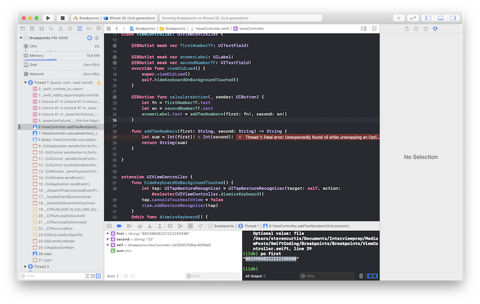 

If it isn't there in the top-right hand corner of Xcode you can select the following icon, and then the bottom bar should appear in you Xcode view.

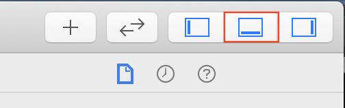 

Both logging to the console and breakpoints are ways that we can find out what is going on under the surface in our App. This article explains how they might be used!

## The quality of life improvement
When using breakpoints Xcode will stop whatever you are doing, and automagically move to the point in the code where the breakpoint is. Wouldn't it be better to open a new tab weher the breakpoint stops?

Go to the menu Xcode>Behaviors>Edit Behaviors...
 

In `Pauses` click the checkbox `Show tab named` and write `Debug` into the box.

Now trust me, your life will be slightly (very slightly) easier AND better.
Anyway...

## The example
This App is a particularly simple one - and it does not use the principles of [Dependency Injection](https://medium.com/@stevenpcurtis.sc/learning-dependency-injection-using-swift-c94183742187) or similar - in that it adds together two user input numbers.

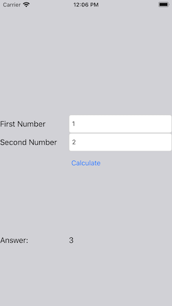 

Now the more observant reader will see there is too much force-unwrapping going on, and we are asking for a crash (SPOILER: Validation) 

If we make the first number `88339858222222255588`, or a similar large number you will experience a crash.

Xcode will help us out and make it immediately obvious where the problem is

 

but what if we want to know why?

## Strategy 1 - Print log
You can print out to the console by using `print (first, second)` in the code (I'm putting this into the `addTwoNumbers` function). This would give us some insight into the state at the time that the print function is run.

However, if we don't remove the print statement when we upload to the App Store we will suffer a performance penalty.

So this, works but it isn't the most professional way to move forwards with your bug hunt.

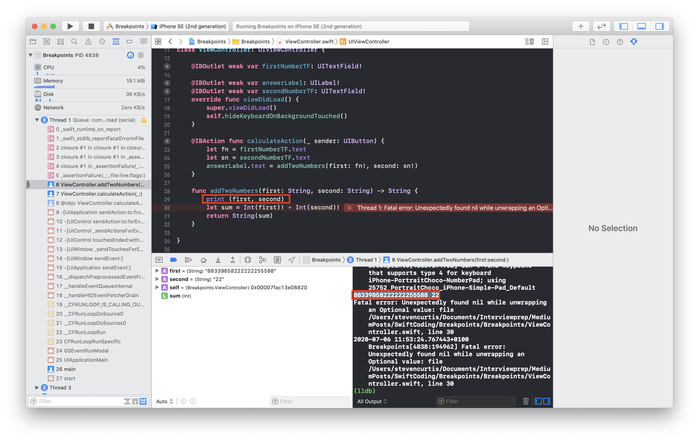 

You can just about see the two red boxes in the image above - the one in the code is where the `print` function is run, the second is in the debugging area of Xcode.

## Strategy 2 - breakpoint & po
You can add a breakpoint by clicking in the gutter of Xcode. In my case I clicked line 29 (actually on the 29)

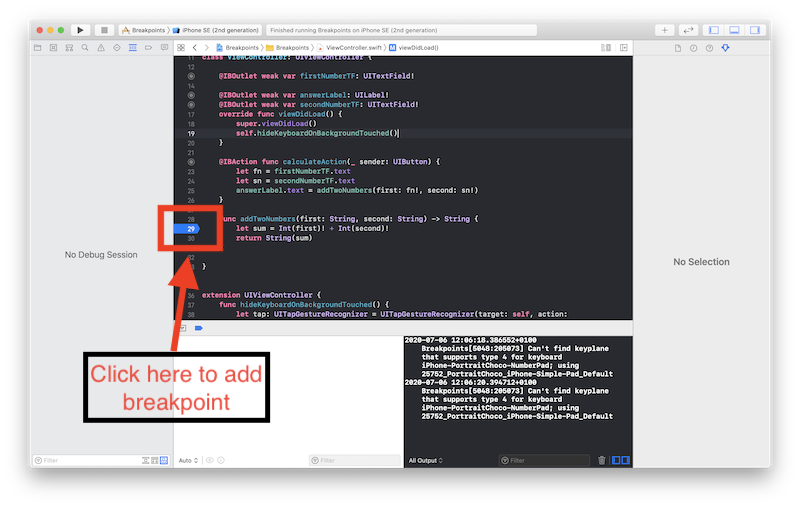 

Now we need to run the program, and Xcode will stop nicely at this breakpoint, well, point. This will only happen once you have written in the two numbers, and pressed calculate.

Something like the following will display, presenting us with lldb (the Low Level Debugger)

 

Of course we need to make sure the active breakpoints icon is selected!

Now, back on track in that `debug area` we can type 

`po first`

which returns (in that part of the screen)

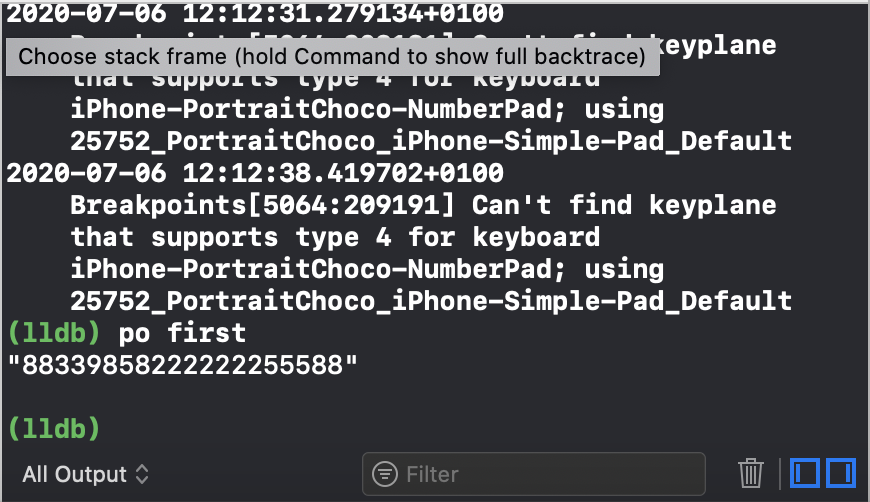 

where we can also `po second`.

Need some shortcuts? Everyone loves shortcuts!
* Continue / Pause = (⌃ + ⌘ + Y)
* Step Over = (F6)
* Step Into = (F7)
* Step Out = (F8)

So if you are on a breakpoint you can move to the next one by using the shortcut ⌃ + ⌘ + Y. Awesome!

You can even list breakpoints by writing `breakpoint list` in the debug area.

You can delete breakpoints by right-clicking on the breakpoint and choosing one of the following options:

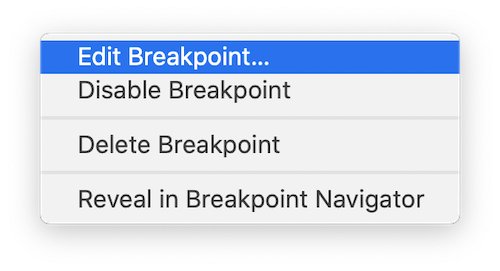 

As you can see there is a rather lovely `Delete Breakpoint` option. Want to wipe them all? You can use `breakpoint disable` in the debug area (The confirmation message is `All breakpoints disabled. (1 breakpoints)`), and can be undone with `breakpoint enable`.

*Did you know...*

You can set breakpoints up in the `debug area`. Say we have already set a breakpoint at line 23 and the code stops then - we can type `breakpoint set - file ViewController.swift - line 24` which adds the breakpoint on the next line. Now unfortunately it doesn't appear with the nice graphic - but it does rather tell you it has nicely been added.

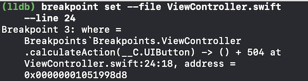 

You can then continue (`⌃ + ⌘ + Y`) and you will top at line 24. Awesome!

With breakpoints enabled you can do far more. A Quicklook of a variable (particularly with something like a UIBezierPath) 

The quick look icon is rather small, but it is an eye as highlighted in a red box below:

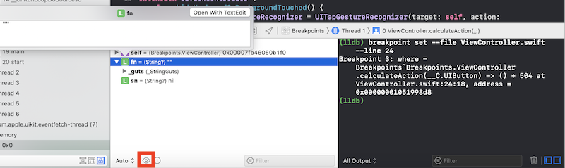 

## Strategy 3 - conditional breakpoint & lldb actions
You can make a breakpoint that only stops code under a certain condition. 

You can setup a breakpoint and then right-click on that breakpoint and select:
 

You can then write in Swift expressions!
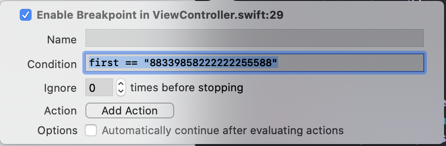 

Here the breakpoint will only stop if the first variable is `88339858222222255588`.
We can further improve this, and write an action - this can be an lldb action.

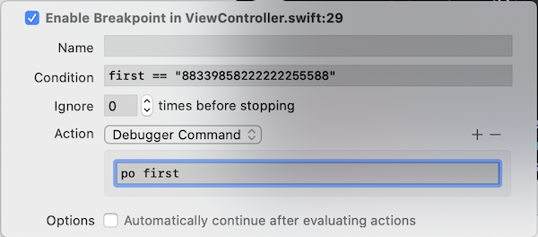 

This will print the `first` variable to the lldb console - but this would only happen if first is `88339858222222255588` (which renders logging that a little pointless, but you get the idea!).

A better way to get the same result might be to select the action `log message` which would (obvs. like) log the message to the console that you would like. You can even set `sounds` or run a shell command.

# Conclusion
Printing to the console seems all very interesting. However, if you leave them in your code they can impact the efficiency of your code.

Breakpoints are automatically removed from your production code - you can leave them in while you build and deploy. Perhaps for that reason alone, it is a good idea to use breakpoints in your App to see where you might have an error in your code, and how you might work to get rid of those little annoying bugs.

Good luck in finding them!

If you've any questions, comments or suggestions please hit me up on [Twitter](https://twitter.com/stevenpcurtis) 
