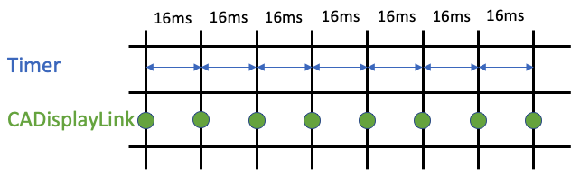

# Stop Using Timers: Use CADisplayLink
## Hyperbole, but based in truth

# Before we start
Some basic animations, like [my loading animation](https://medium.com/@stevenpcurtis.sc/create-a-loading-animation-in-swift-75788a488fdb) run fine using times to repeat the code blocks and make a UI that looks rather nice to the user.

But this has nothing to do with the framerate of the user's device, and this may produce a rather horrible drift of the expected animation. In other words, we can do better!

Difficulty: Beginner | Easy | **Normal** | Challenging<br>
This article has been developed using Xcode 12.2, and Swift 5.3

## Keywords and Terminology
CADisplayLink: A timer object that allows your application to synchronize its drawing to the refresh rate of the display 

## The Repo
I've prepared a [Repo](https://github.com/stevencurtis/SwiftCoding/tree/master/CADisplayLinkExamples)  

## The theory
A timer isn't locked to the screen redraws, and if we think about the standard 60fps that Apple devices tend to work at, we could have a timer fire right after a screen refresh.

In order to do just that, `CADisplayLink` calls a method that you define when a redraw happens.

We can compare an implementation of a timer updating at 1 / 60 with an implementation of `CADisplayLink`?

Spoiler:


One of these does not work as we expected it to! Before we look at the code, we can see what we *expect* to happen with both a `Timer` and a `CADisplayLink`.



We can't guarantee when the `Timer` will start - so we don't know exactly when the `Timer` will fire. Worse than this, the `Timer` can have a tolerance and the system reserves the right to apply a [small tolerance to any timer](https://developer.apple.com/documentation/foundation/timer) - meaning that the resultant `Timer` may not fire at the exact time that you might expect.

This has resulted in the console log above showing that the print logs are not reliable - for the `Timer`

## Basic code
The example here is a complete `UIViewController` instance. this shows that we can set up a timer with code that looks something like the following:

```swift
timer = Timer.scheduledTimer(withTimeInterval: 1 / 60,
      repeats: true) { timer in
      print ("Timer update animation")
    }
```

and the `CADisplayLink` separates out the declaration of the `CADisplayLink`:

```swift
let displayLink = CADisplayLink(target: self, selector: #selector(updateAnimation))
displayLink.add(to: .current, forMode: .common)
```

and the code that will be executed

```swift
@objc func updateAnimation() {
    print("CADisplayLink Update animation")
}
```

[The Repo](https://github.com/stevencurtis/SwiftCoding/tree/master/CADisplayLinkExamples) shows this, but for completeness here is a full `UIViewController` instance:

```swift
final class ViewController: UIViewController {
    
    // the timer instance
    var timer = Timer()
    
    // the function that the CADisplayLink will fire
    @objc func updateAnimation() {
        print("CADisplayLink Update animation")
    }

    override func viewDidLoad() {
        super.viewDidLoad()
        
        // set up the CADisplayLink
        let displayLink = CADisplayLink(target: self, selector: #selector(updateAnimation))
        displayLink.add(to: .current, forMode: .common)
        
        // set up the timer
        timer = Timer.scheduledTimer(withTimeInterval: 1 / 60,
              repeats: true) { timer in
              print ("Timer update animation")
            }
    }
}
```

## The better example
You may be aware that timers require you to hit `timer.invalidate()` to stop the timer from firing and remove it. There is an equivalent `displayLink?.invalidate()` removes the display link from all run loop modes.

As a demo, I've decided to use a simple stopwatch demo. Now it should be very clear that this isn't a full production App, and also within this code we aren't using [MVVM-C](https://medium.com/@stevenpcurtis.sc/mvvm-c-architecture-with-dependency-injection-testing-3b7197eb2e4d) or any other interesting architecture - it's just relatively simple code.

The main parts of the code - the timer and the CADisplayLink - are covered in the previous section. So with that clear, here is the `FullExampleViewController` to let you get right to the code:

```swift
final class FullExampleViewController: UIViewController {

    @IBOutlet private var startButton: UIButton!
    @IBOutlet private var resetButton: UIButton!
    @IBOutlet private var timerLabel: UILabel!
    
    @IBAction func segmentedAction(_ sender: UISegmentedControl) {
        resetAll()
    }
    
    @IBOutlet weak var semgentedControl: UISegmentedControl!
    
    // seconds for the time, 60th of a second for CADisplayLink
    var seconds = 0
    
    // the timer instance
    var timer = Timer()
    
    // set up the CADisplayLink
    var displayLink: CADisplayLink?

    override func viewDidLoad() {
        super.viewDidLoad()
    }

    @IBAction func startAction(_ sender: UIButton) {
        switch semgentedControl.selectedSegmentIndex {
        case 0:
            runTimer()
        default:
            runCADisplay()
        }
        startButton.isEnabled = false
    }
    
    @IBAction func resetAction(_ sender: UIButton) {
        resetAll()
    }
    
    // invalidate the timers and reset the time
    func resetAll() {
        // invalidate displayLink
        displayLink?.invalidate()
        // invalidate the timer
        timer.invalidate()
        // reset the seconds
        seconds = 0
        // set the label to be zero again
        timerLabel.text = Double(seconds).asTime(style: .positional)
        // enable the startbutton
        startButton.isEnabled = true
    }
    
    func runCADisplay() {
        // setup the displaylink
        displayLink = CADisplayLink(target: self, selector: #selector(updateCADisplayLink))
        // preferred framerate, the default is 0 which is the device's maximum
        displayLink?.preferredFramesPerSecond = 0
        // register the displayLink with a runLoop. Common is the mode to use for timers
        displayLink?.add(to: .current, forMode: .common)
    }
    
    func runTimer() {
        // set up the timer to run updateTimer every second
        timer = Timer.scheduledTimer(timeInterval: 1, target: self, selector: (#selector(FullExampleViewController.updateTimer)), userInfo: nil, repeats: true)
    }
    
    // the function that the CADisplayLink will fire
    @objc func updateCADisplayLink() {
        // increment the number of seconds, actually a screen refresh here
        seconds += 1
        // each "second" here is actually a screen refresh, so /60 of a second
        // we can use mod and / to convert to seconds
        if seconds % 60 == 0 {
            // update the timerLabel
            timerLabel.text = Double(seconds / 60).asTime(style: .positional)
        }
    }
    
    @objc func updateTimer() {
        // increment the number of seconds, actually a screen refresh here
        seconds += 1
        // update the timerLabel
        timerLabel.text = Double(seconds).asTime(style: .positional)
    }
}
```

## If you want to use a Timer...
A timer should be a multiple of the frame rate (16.67ms), but if you want to create good quality animations you may well be better to use `UIview.animate(withDuration:...)`, but for granular animation you should be looking at `CADisplayLink` because you just can't rely on a `Timer` to be called at a specific time that you would like an animation to be called at.

# Conclusion

The [Repo](https://github.com/stevencurtis/SwiftCoding/tree/master/CADisplayLinkExamples) makes things rather easier to understand.

Many people use timers for various things in their Apps. That is fine, but if you want that granular detail use `CADisplayLink` to make sure your animations update with the screen.

Worth doing? 

If you've any questions, comments or suggestions please hit me up on [Twitter](https://twitter.com/stevenpcurtis) 
