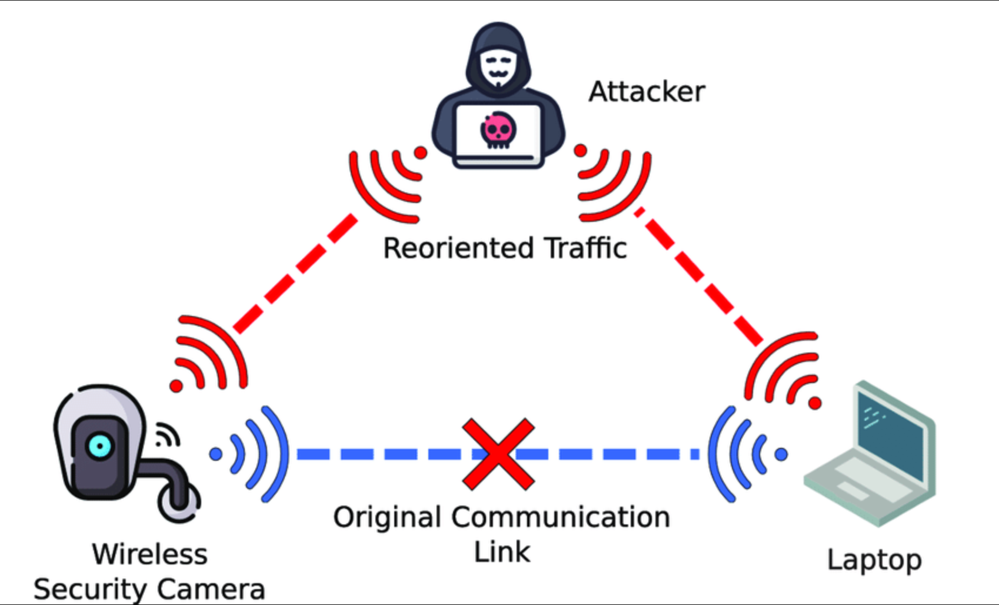
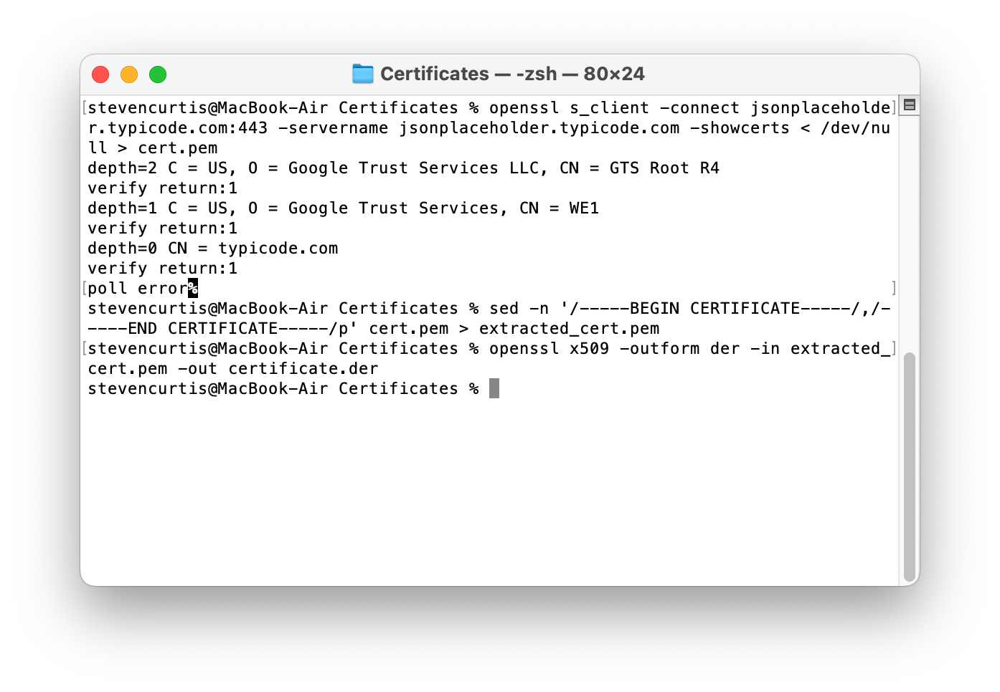

# Certificate Pinning in iOS (Implementation)
## I got this working


Source: https://www.researchgate.net/figure/Illustration-of-a-Man-in-the-Middle-attack_fig4_353723022

Difficulty: Beginner | Easy | **Normal** | Challenging<br/>
This article has been developed using Xcode 15.0, and Swift 5.9

So I thought it would be great to implement certificate pinning (SSL pinning or app pinning) in iOS. 

This provides protection against ‘man-in-the-middle’ (MITM) attacks, which can only be a good thing and enhance the security of your app. These types of attacks occur when a malicious actor intercepts communication between a user and the server they intend to connect to, rerouting the traffic to a different server controlled by the attacker for their own purposes (identity theft, stealing data or identities).

# Understanding Certificate Pinning
When we transmit sensitive data to and from a backend server, securing this communication using SSL/TLS is a common practice. However, SSL/TLS alone may not be sufficient to protect against all types of attacks, particularly the MITM attack.

## What is a Man-in-the-Middle Attack?

A MITM attack occurs when an attacker secretly intercepts and possibly alters the communication between two parties who believe they are directly communicating with each other. In the context of mobile apps and web services, an attacker could intercept the communication between the app and the backend server, potentially decrypting sensitive information.

## The Role of Certificate Pinning

Certificate pinning is a technique used to enhance the security of SSL/TLS connections. It involves the server providing a specific set of trusted certificates or public keys that the client (e.g., a mobile app) should expect from the server during the SSL/TLS handshake. By doing this, the client can verify that it is indeed communicating with the intended server and not an impostor, even if an attacker has managed to get a fraudulent certificate issued by a compromised or rogue Certificate Authority (CA).

## Here are a couple of real-world examples
### Superfish Adware (2015)
In 2015, an adware program called Superfish, which was pre-installed on Lenovo machines since 2014, was discovered to be scanning SSL traffic and installing fake certificates that allowed third-party eavesdroppers to intercept and redirect secure incoming traffic. The fake certificates also functioned to introduce ads even on encrypted pages. 
### Mobile Banking Apps Vulnerability (2017)
A major vulnerability in mobile banking apps was discovered for a number of high-profile banks, exposing mobile customers with iOS to man-in-the-middle attacks. The flaw was tied to the certificate pinning technology used to prevent the use of fraudulent certificates, in which security tests failed to detect attackers due to the certificate pinning hiding a lack of proper hostname verification. This ultimately enabled MITM attacks to be performed.

# The Project
I've taken one of my [MVVM-C template projects](https://github.com/stevencurtis/DependencyInjectionContainer) and worked on it to use "jsonplaceholder.typicode.com" to make a request. Nothing special nat all, and all I've done with this request is write it to the console.

Sure, I'm using my [network client](https://github.com/stevencurtis/NetworkClient) and that means I'm using a service to perform the request.

My request:

```swift
typealias UserRequest = BasicRequest<[UserDTO]>
```

That retrieves my data transfer object.

```swift
struct UserDTO: Decodable {
    let id: Int
    let username: String
}
```

and I call this from my service.

```swift
protocol ListAPIServiceProtocol {
    func getUsers() async throws -> [UserDTO]
}

final class ListAPIService {
    private let networkClient: NetworkClient
    init(
        networkClient: NetworkClient = MainNetworkClient()
    ) {
        self.networkClient = networkClient
    }
}

extension ListAPIService: ListAPIServiceProtocol {
    func getUsers() async throws -> [UserDTO] {
        let userRequest = UserRequest()
        let api = API.users
        let users = try await APIService().performRequest(
            api: api,
            request: userRequest,
            networkClient: networkClient
        )
        return users
    }
}
```

This is all very nice, but I want to implement certificate pinning.

So I'll need a certificate for the website (I'll use the Mac for this, as I'm an iOS developer), and I'll need to write some code. Since I'm using my own network client I'm going to use `URLSession` rather than anything fancy (or Alamofire or anything third-party).

# The Implementation
## Getting the certificate
    1. Open Terminal 

    2.    Capture the Certificate Output:
Run the openssl s_client command and save the certificate output to a file (in PEM format).

openssl s_client -connect jsonplaceholder.typicode.com:443 -servername jsonplaceholder.typicode.com -showcerts < /dev/null > cert.pem

    3.    Extract the Certificate:
Use the sed command to extract the certificate from cert.pem.

sed -n '/-----BEGIN CERTIFICATE-----/,/-----END CERTIFICATE-----/p' cert.pem > extracted_cert.pem

    4.    Convert PEM to DER:
Use the openssl command to convert the PEM file to DER format.

openssl x509 -outform der -in extracted_cert.pem -out certificate.der

<br>
<br>

Which certificate should we use? The final one we created, `certificate.der`.

This needs to be available in the app bundle. So drag it into the project navigator!
<br>[Images/certificateinproject.png](Images/certificateinproject.png)

## Code it!

Here is my `PinningDelegate`, with comments to help with the clarity of what is happening. 
```swift
// Our class conforms to `NSObject` and `URLSessionDelegate`, and handles certificate pinning
final class PinningDelegate: NSObject, URLSessionDelegate {
    // Retrieves the pinned certificate from the app's bundle in der format.
    // This certificate will later be used for comparison to ensure server validity
    private func getPinnedCertificate() -> Data? {
    // Find the path of the certificate within the app bundle
        guard let certPath = Bundle.main.path(forResource: "certificate", ofType: "der") else {
            return nil
        }
    // Reads the contents of the certificate into a `Data` object 
        return try? Data(contentsOf: URL(fileURLWithPath: certPath))
    }
    
    // This method is called whenever a server's authentication challenge is received. This handles the certificate validation.
    func urlSession(_ session: URLSession, didReceive challenge: URLAuthenticationChallenge, completionHandler: @escaping (URLSession.AuthChallengeDisposition, URLCredential?) -> Void) {
        
        // NSURLAuthenticationMethodServerTrust indicates that the server's SSL/TLS certificate needs to be validated
        guard challenge.protectionSpace.authenticationMethod == NSURLAuthenticationMethodServerTrust,
                // extract the server certificate from the serverTrust item
                // also get the pinned certificate
              let serverTrust = challenge.protectionSpace.serverTrust,
              SecTrustGetCertificateCount(serverTrust) > 0,
              let pinnedCertificate = getPinnedCertificate() else {
            completionHandler(.cancelAuthenticationChallenge, nil)
            return
        }
        
        var serverCertificates: [SecCertificate] = []
        // Copy the certificate chain
        if let certificateChain = SecTrustCopyCertificateChain(serverTrust) as? [SecCertificate] {
            serverCertificates = certificateChain
        }
        
        // If the first certificate cannot be retrieved the authentication challenge is cancelled
        // the first certificate is the server's won certificate (lead certificate)
        guard let serverCertificate = serverCertificates.first else {
            completionHandler(.cancelAuthenticationChallenge, nil)
            return
        }
        
        // Copy the server certificate and cast as Data
        let serverCertificateData = SecCertificateCopyData(serverCertificate) as Data
        
        // If we have a match, we trust the server
        if pinnedCertificate == serverCertificateData {
            let credential = URLCredential(trust: serverTrust)
            completionHandler(.useCredential, credential)
        } else {
        // Cancel the challenge
            completionHandler(.cancelAuthenticationChallenge, nil)
        }
    }
}
```
To use the `PinningDelegate` I will create an extra initializer to instantiate my `URLSession` with the pinning delegate - I'll make this a convenience initializer.

```swift
final class ListAPIService {
    private let networkClient: NetworkClient
    convenience init() {
        let session = URLSession(configuration: .default, delegate: PinningDelegate(), delegateQueue: nil)
        let networkClient = MainNetworkClient(urlSession: session)
        self.init(networkClient: networkClient)
    }
    
    init(networkClient: NetworkClient) {
        self.networkClient = networkClient
    }
}

extension ListAPIService: ListAPIServiceProtocol {
    func getUsers() async throws -> [UserDTO] {
        let userRequest = UserRequest()
        let api = API.users
        let users = try await APIService().performRequest(
            api: api,
            request: userRequest,
            networkClient: networkClient
        )
        return users
    }
}
```

This works! As before we retrieve the `User` objects from the endpoint, the server is valid and the sun is shining!

```swift
[CertificatePinning.User(username: "Bret"), CertificatePinning.User(username: "Antonette"), CertificatePinning.User(username: "Samantha"), CertificatePinning.User(username: "Karianne"), CertificatePinning.User(username: "Kamren"), CertificatePinning.User(username: "Leopoldo_Corkery"), CertificatePinning.User(username: "Elwyn.Skiles"), CertificatePinning.User(username: "Maxime_Nienow"), CertificatePinning.User(username: "Delphine"), CertificatePinning.User(username: "Moriah.Stanton")]
```

# Conclusion
Certificate pinning is a crucial security measure for protecting sensitive data in transit.

This is a demonstration about how iOS can verify a server's certificate agains a known public key and significantly reduce the risk of MITM attack.

I hope this helps someone out.
