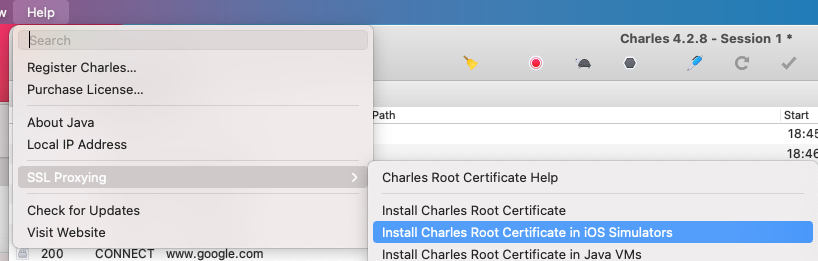
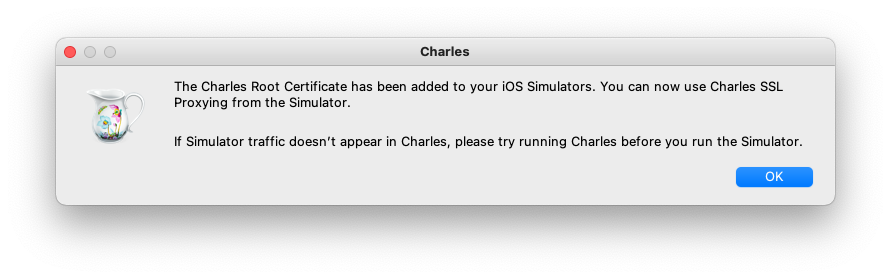
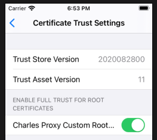
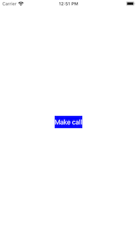
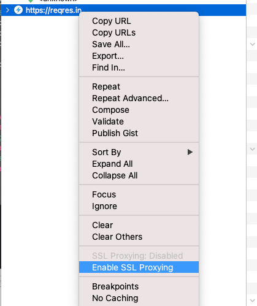
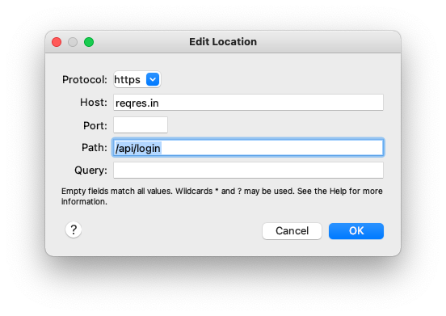
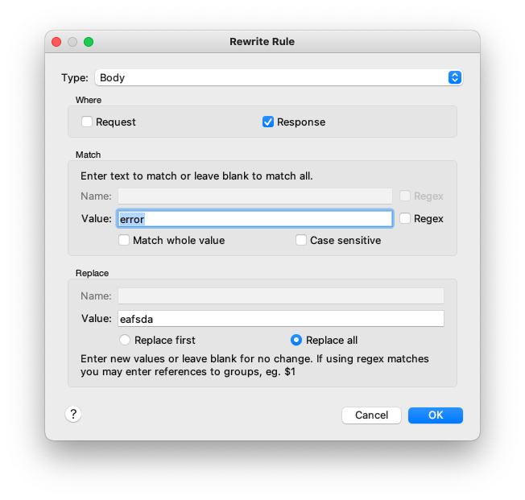
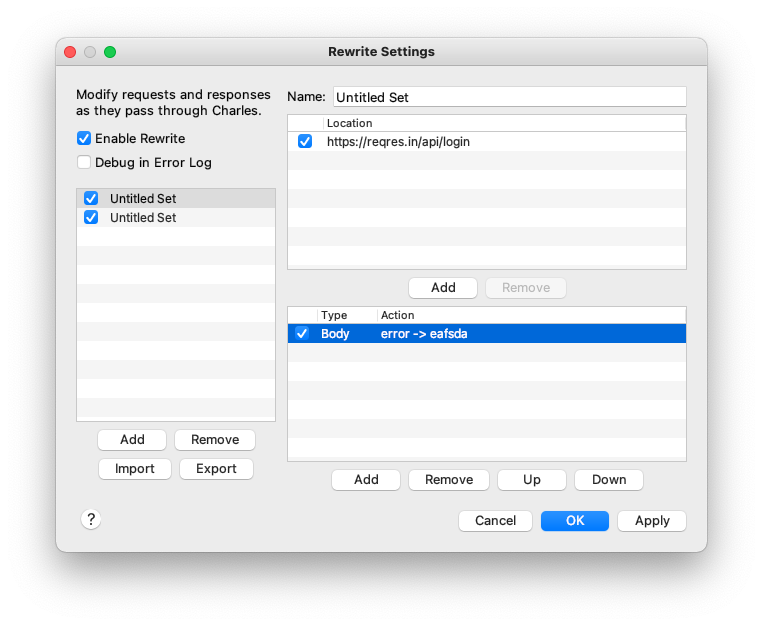

# Use Charles to Rewrite Responses Developing iOS Apps
## Create Apps without a complete backend


Difficulty: Beginner | **Easy** | Normal | Challenging<br/>
This article has been developed using Xcode 12, and Swift 5.3

# Prerequisites:
- Be able to produce a "Hello, World!" iOS application (guide [HERE](https://medium.com/@stevenpcurtis.sc/your-first-swift-application-without-a-mac-79598ad839f8))
However, the implementation for this uses [my network manager](https://github.com/stevencurtis/NetworkManager), [my API builder](https://medium.com/swlh/building-urls-in-swift-51f21240c537) and a [snippet to parse data](https://github.com/stevencurtis/SwiftCoding/tree/master/Tips/CodeSnippets)

# Terminology
Charles: A HTTP proxy for development

A warning:
Be careful because many guides instruct developers to turn off the mac proxy, but using this simulator this prevents the developer seeing the data from their target App!<br>
<br>

The original App:
The original App makes a network call and prints the following to the console:
```swift
{
    error = "user not found";
}
```
We are going to change that response!

#Step-by step instructions to change a response
1. Download [Charles](https://www.charlesproxy.com). It has a free trial, and after that has run it's course you are able to still use it (with restrictions)
2. Get the Root Certificate for iOS simulators (this downloads the certificate straight to the simulator, without any work from you). This is avaliable from the menu Help>SSL Proxying<br>
<br>
This is confirmed with the following notification:<br>
<br>
Now open the iOS simulator an enable the proxy certificate through Settings>General>About>Certificate Trust Settings you can then click the toggle to enable the proxy<br>
<br>
You will be asked to confirm that you wish to do this in the simulator. Of course you should agree to this
3. Then run the App. You might like to run your own app that makes an API call, but [I've created a usable App in the repo](https://github.com/stevencurtis/SwiftCoding/tree/master/CharlesExample)
4. Run on both Xcode and Charles<br>
You can now run the App from Xcode, and at the same time run Charles.

If you press the request button on the App, you should see a request for `regres.in`.
<br>

You can now see the request and the response!
Right-click on the `regres.in` request and enable SSl proxying.
<br>

5. Enable rewriting<br>
To mock Tools > Rewrite.
Check Enable Rewrite.

Edit the location (this is the correct protocol, host and path for `regres.in`)

We can then modify the query parameter

and then remember to click apply


6. Run again - and we should have a result in the console of
```Swift
{
    eafsda = "user not found";
}
```


# Conclusion
Charles is a great way of changing responses

 If you've any questions, comments or suggestions please hit me up on [Twitter](https://twitter.com/stevenpcurtis)
