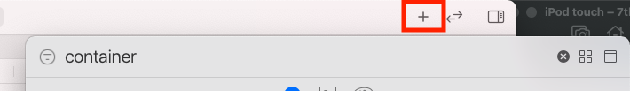
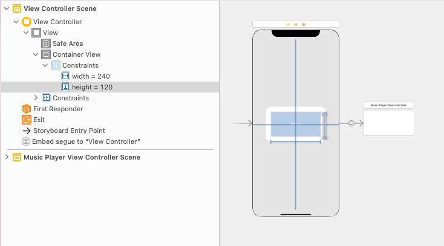

# Containing Child View Controllers for iOS Apps
## Place a ViewController in another

<br> 

Difficulty: Beginner | **Easy** | Normal | Challenging<br/>
This article has been developed using Xcode 12.4, and Swift 5.3.2

There are many reasons that you might wish to reduce the amount of code and complexity contained within any particular view controller. 

One approach that you should have in your amoury is that of splitting a view controller into mutliple smaller ones - but we should be careful of HOW we do tht in order to avoid just moving code around and instead put code into more sensible homes. 

*this article, hopefully, can help you out*

# Prerequisites:
* You will be expected to be aware how to make a [Single View Application](https://medium.com/swlh/your-first-ios-application-using-xcode-9983cf6efb71) or a Playground to run Swift code

# Terminology:
* UIViewController: A view controller is an intermediary between the views it manages and the data of your app
* UIView: Presents information to the user. Views are, well, UIViews and their subclasses. Think of it as the UI components that have to be controlled by the controller

# But why?
You might want to add a view controller as a subviewcontroller in order to avoid the "Massive View Controller" problem that can arise from having a view controller perofrming too many responsibilities.

Now it can be argued that we can do much of this with a sub `UIView`, and this is a valid comment. However, a viewcontroller explicity has the `viewDidLoad` and `viewWillAppear` lifecycle functions, and of course itself can have sub `UIView` components. 

Also a child view controller needs no constraints (or the frame to be set), as it will fill the avaliable space! Awesome!

The reusability of a `UIViewController` as a child is very flexibile, especially since it can be used in any situation any `UIViewController` might be used in. That is, using a `UIViewController` helps you create modular code!

# Example: A ViewController to represent loading
If you wish to reuse a ViewController in many places within your App, you might use a child view controller. This enables us to have a modular UI, and one where the SpinnerViewController can be used as a child view as well as a full view controller in it's own right. 

You might set up a view controller that contains a spinner, to indicate that something is being loaded. Rather than using a real network call, here I can use `DispatchQueue.main.asyncAfter` to wait for 2 seconds, and then remove the loading view controller.

```swift
class ViewController: UIViewController {
    let loadingVC = SpinnerViewController()

    override func viewDidLoad() {
        super.viewDidLoad()
        self.view.backgroundColor = .red
        loadContentViewController()
        
        DispatchQueue.main.asyncAfter(deadline: .now() + 2, execute: {
            self.removeContentViewController()
        })
    }

    func loadContentViewController() {
        addChild(loadingVC)
        loadingVC.view.frame = self.view.frame
        view.addSubview(loadingVC.view)
        loadingVC.didMove(toParent: self)
    }
    
    func removeContentViewController() {
        willMove(toParent: nil)
        loadingVC.view.removeFromSuperview()
        loadingVC.removeFromParent()
    }
}
```

the child view controller (with an added spinner) will look something like the following:

```swift
class SpinnerViewController: UIViewController {
    let spinner = UIActivityIndicatorView(style: .medium)

    override func viewDidLoad() {
        super.viewDidLoad()
        setupHierarchy()
        setupComponents()
        setupConstraints()
    }
    
    func setupHierarchy() {
        view.addSubview(spinner)
    }
    
    func setupComponents() {
        spinner.translatesAutoresizingMaskIntoConstraints = false
        spinner.startAnimating()
        self.view.backgroundColor = .systemGray
    }
    
    func setupConstraints() {
        NSLayoutConstraint.activate([
            spinner.centerXAnchor.constraint(equalTo: view.centerXAnchor),
            spinner.centerYAnchor.constraint(equalTo: view.centerYAnchor)
        ])
    }
}
```

# Example: A portion of the screen
In my [Deezer music App](https://github.com/stevencurtis/DeezerMVVMArchitectureExample) demo I used a music player that can appear from the bottom of the screen when music is played. Wonderful! Now, we can expand this into being it's own `UIViewController`.

So if you wished to have such functionality, you could take the modular approach and swap out a music player (or video player) while keeping the rest of the interface unchanged.

One of the nicest ways of doing that is using a container view on the Storyboard. To do so, select the storyboard and the + on the right-hand corner of the screen. Then search for container - and then drag and drop this onto the view controller:

<br> 

I've then added constraints to put the view controller centered (X & Y) onto the view controller, and I've set up a height and width of 240 * 120. If you would like a guide on constraints take a look at [this one](https://stevenpcurtis.medium.com/storyboard-constraints-18bcf6c5b0f9).

<br>

We can then select the container class, and choose a custom class for it (I've chosen my MusicPlayerViewController class).

<br>

Speaking of which, I've created a rather basic view controller with a single simple button that the user is able to tap.

```swift
class MusicPlayerViewController: UIViewController {
    lazy private var playButton = UIButton()
    private let largeConfig = UIImage.SymbolConfiguration(pointSize: 40, weight: .medium, scale: .medium)

    override func viewDidLoad() {
        super.viewDidLoad()
        self.view.backgroundColor = .systemGray
        setupComponents()
        setupConstraints()
    }
    
    func setupConstraints() {
        NSLayoutConstraint.activate([
            playButton.centerXAnchor.constraint(equalTo: view.centerXAnchor),
            playButton.centerYAnchor.constraint(equalTo: view.centerYAnchor),
            playButton.heightAnchor.constraint(equalToConstant: 50),
            playButton.widthAnchor.constraint(equalToConstant: 200)
        ])
    }
    
    func setupComponents() {
        self.view.addSubview(playButton)

        playButton.setImage(
            UIImage(
                systemName: "pause.fill",
                withConfiguration: largeConfig)?.withTintColor(.black, renderingMode: .alwaysOriginal
                ),
            for: .normal
        )
        playButton.addTarget(self, action: #selector(tapped(_:)), for: .touchDown)
        playButton.translatesAutoresizingMaskIntoConstraints = false
    }
    
    @objc func tapped(_ sender: AnyObject) {
        print("tapped")
    }
    
    required init?(coder: NSCoder) {
        super.init(coder: coder)
    }
}
```

Flexible? Well you could add instances of this `MusicPlayerViewController` wherever you would like. That is all kinds of awesome!

# Conclusion


If you've any questions, comments or suggestions please hit me up on [Twitter](https://twitter.com/stevenpcurtis)
