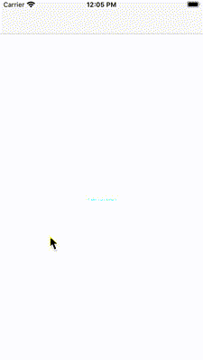

# Create a Circular Transition in Swift
## Circular? Sounds Great

<br/>

Difficulty: Beginner | Easy | **Normal** | Challenging<br/>
This article has been developed using Xcode 11.4.1, and Swift 5.2.2

This animation allows us to have a circular transition. In this case the transition moves from the centre of a `UIViewController` which is embedded in a `UINavigationController`. The `UIViewController` instances are pretty boring, and are only really featured in the [Repo](https://github.com/stevencurtis/SwiftCoding/tree/master/CircularTransition).

# The Initial View Controller
That was a lie. The initial `UIViewController` is sitting in a `UINavigationController` so we need to set the delegate of the latter. This means that the following has been placed in the `viewDidLoad()` function

```swift
navigationControllerDelegate = CircularCoordinator()
self.navigationController?.delegate = navigationControllerDelegate
```
which relates to a `var` property in the `UIViewController`

```swift
var navigationControllerDelegate: UINavigationControllerDelegate?
```

which is necessary since the `UINavigationControllerDelegate` is a weak reference and will be immediately deallocated unless there is a strong reference. So that has been created.

# The Circular Coordinator
The coordinator is simply a `UINavigationControllerDelegate`, so not much to see here, and move on nicely.

The animation is similar to the [Loading animation article](https://medium.com/@stevenpcurtis.sc/create-a-loading-animation-in-swift-75788a488fdb) which has the same idea that when we animate the appearance we need to make sure that  `circleMaskPathFinal` is set to the final path. That would be useful, wouldn't it?

```swift
class CircularCoordinator: NSObject, UINavigationControllerDelegate {
    func navigationController(_ navigationController: UINavigationController,
                              animationControllerFor operation: UINavigationController.Operation,
                              from fromVC: UIViewController,
                              to toVC: UIViewController) -> UIViewControllerAnimatedTransitioning? {
        return CircularAnimator()
    }
}
```

# The Circular Animator
In full, this isn't too much of an issue. We are leveraging `CABasicAnimation` and 

```swift
class CircularAnimator: NSObject, UIViewControllerAnimatedTransitioning {
    func transitionDuration(using transitionContext: UIViewControllerContextTransitioning?) -> TimeInterval {
        TimeInterval(UINavigationController.hideShowBarDuration)
    }
    
    weak var context: UIViewControllerContextTransitioning?
    
    func animateTransition(using transitionContext: UIViewControllerContextTransitioning) {
        // save the context
        context = transitionContext
        
        let containerView = transitionContext.containerView
        
        guard
            let toView = transitionContext.view(forKey: UITransitionContextViewKey.to)
            else {
                // We only complete transition with success if the transition was executed.
                transitionContext.completeTransition(false)
                return
        }
        
        containerView.addSubview(toView)
        
        let radius: CGFloat = 100
        let toHeight = toView.bounds.height
        
        let circleMaskPathInitial = UIBezierPath(
            ovalIn: CGRect(origin:
                CGPoint(x: toView.frame.midX - (radius / 2),
                        y: toHeight / 2
                ),
                           size: CGSize(width: radius, height: radius)
            )
        )
        
        let maskLayer = CAShapeLayer()
        maskLayer.path = circleMaskPathInitial.cgPath
        toView.layer.mask = maskLayer
        
        let circleMaskPathFinal = UIBezierPath(
            ovalIn: CGRect(origin:
                CGPoint(x: -toView.bounds.width,
                        y: -toView.bounds.height / 2
                ),
                           size: CGSize(
                            width: toHeight * 2,
                            height: toHeight * 2)
            )
        )
        
        let maskLayerAnimation = CABasicAnimation(keyPath: "path")
        maskLayerAnimation.fromValue = circleMaskPathInitial.cgPath
        maskLayerAnimation.toValue = circleMaskPathFinal.cgPath
        maskLayerAnimation.delegate = self
        maskLayerAnimation.duration = TimeInterval(UINavigationController.hideShowBarDuration)
        maskLayer.path = circleMaskPathFinal.cgPath
        maskLayer.add(maskLayerAnimation, forKey: "path")
    }
}
```

with an extension to tell the delegate when the animation is complete

```swift
extension CircularAnimator: CAAnimationDelegate {
    func animationDidStop(_ anim: CAAnimation, finished flag: Bool) {
        context?.completeTransition(true)
    }
}
```

# Conclusion
Thank you for reading.

It is rather complex in the description, but rather easy in the implementation. Take a look at the attached [Repo](https://github.com/stevencurtis/SwiftCoding/tree/master/CircularTransition). It is a rather wonderful thing! Happy coding!

If you've any questions, comments or suggestions please hit me up on [Twitter](https://twitter.com/stevenpcurtis) 
