# Create the App Store with UICollectionView Compositional Layouts
## Compositional Layouts with UICollectionView

 
Photo by Neven Krcmarek on Unsplash

Long live the King: `UIKit` is not yet dead, and creating great `UICollectionView` layouts is certinly part of that.

Here I'm going to re-create the App Store using Compositional Layouts. Oh, and `DiffableDataSource`. This is going to be ace!

Difficulty: Beginner | Easy | **Normal** | Challenging 
This article has been developed using Xcode 11.4.1, and Swift 5.2.2

## Prerequisites: 
* You will be expected to create a [Single View Application](https://medium.com/swlh/your-first-ios-application-using-xcode-9983cf6efb71) and be comfortable with [UICollectionView](https://medium.com/@stevenpcurtis.sc/create-a-horizontally-scrolling-uicollectionview-with-dynamic-cell-sizes-284fa3c81f72) 

## Terminology:
UICollectionViewCell: The on-screen cell for the UICollectionView type
UICollectionView: An object that manages an ordered collection of data items and presents them using customizable layouts

# The Approach
`UICollectionFlowLayout` is great and is a concrete Layout given to you for use creating your Apps. But what if you want to create a more complex layout (the App Store layout is an often-chosen example of this)  including multiple scrolling sections you're likely to run into a problem (or two). In steps *Compositional Layouts* to help you with just that. 

*Compositional Layouts* are a peer of `UICollectionFlowLayout` so we can take the theory we already know from that layout here - Composition instead of subclassing. 

So `UICollectionViewCompositionalLayout` has `Groups` that allow different layouts within a section in a `UICollectionView`. 

## The classes for compositional layouts
`NSCollectionLayoutSize` The size
`NSCollectionLayoutItem` The cell that is rendered on screen
`NSCollectionLayoutGroup` The group that contains the `NSCollectionLayoutItem`
`NSCollectionLayoutSection` Sections compose composational layouts

## Diffable data source
The data source for this solution is a `DiffableDataSource` (sorry for those not familiar with this). However since `UITableViewDataSource` replaced by `DiffableDataSource` this is a more [declarative](https://medium.com/@stevenpcurtis.sc/imperative-vs-declarative-swift-programming-7e3c77309f76) way of using the  `UICollectionView` API. 

Diffable data source uses `NSDiffableDataSourceSnapshot` and sections are appended to it before the result is rendered to the screen. The `UICollectionViewDiffableDataSource` itseld allows you to render the cells for the `UICollectionView`. There is a full guide for [DiffableDataSource](https://medium.com/@stevenpcurtis.sc/using-uicollectionview-and-uicollectionviewdiffabledatasource-1cf877a9f1f3) that you can peruse.

You'll see how these are used, right below!

# The code
The UIViewController where I have placed the code for the Apps page is in `AppsCompositionalLayout.swift` in the repo.
## Placing a button on the navigation bar
An initial issue with creating this - the large navbar title disappears when the user scrolls, and the profile image slides up. 

Know what I mean? Here is the animated GIF:

 

This is using SF Symbols (so `UIImage(systemName: "person.crop.circle")` works) to provide the icon on the top right hand corner.

My approach has been to create a function to `setupNavBar()` as an extension on the relavent view controller. The icon is then pinned to the `UILabel` so it can slide nicely.

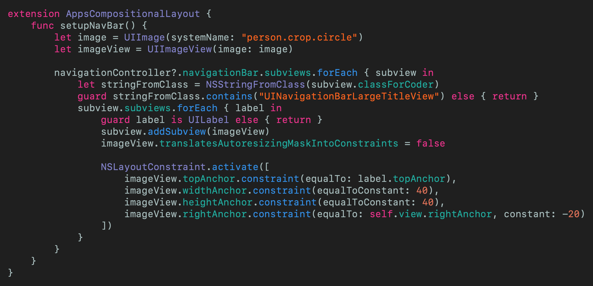 
[Click for Gist](https://gist.github.com/stevencurtis/1782c03a5997331314581d114923d35f)

In the repo I've named this rather attractively as `AppsCompositionalLayout-setupNavBar.swift`, for your convenience.

## Sections
I've created a `protocol` called `LayoutSection` that each section of my little App store will conform to. By section I mean in the following image there are two sections - the red section is `FeatureSection` and the purple section is `NewUpdatedSection`

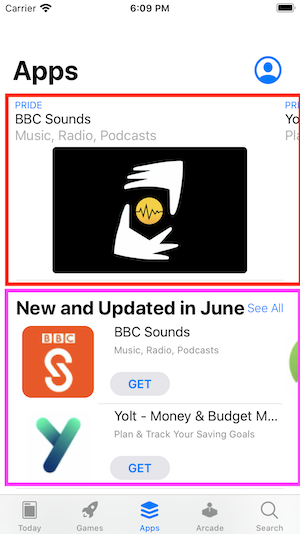 

So each of these conforms to the protocol as shown here:

 
[Click for Gist](https://gist.github.com/stevencurtis/af816045192163ecd931891f9d387148)

Which announces that anything conforming to the `protocol` means it must return an `NSCollectionLayoutSection` which will inform the `UICollectionViewCompositionalLayout` which layout is going to be used (it will be called from the view controller, more on that later).

Now I have 7 sections that conform to this `protocol`, and of course they are all available in the repo that I really recommend you download. 

Within AppsCompositionalLayout.swift an enum has been defined to indicate these 7 sections
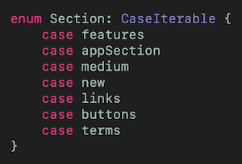 
[Click for Gist](https://gist.github.com/stevencurtis/b2d354bb4f737b4290d3c342a790672d)

which are then placed in a `lazy var` which also derives the order of the sections

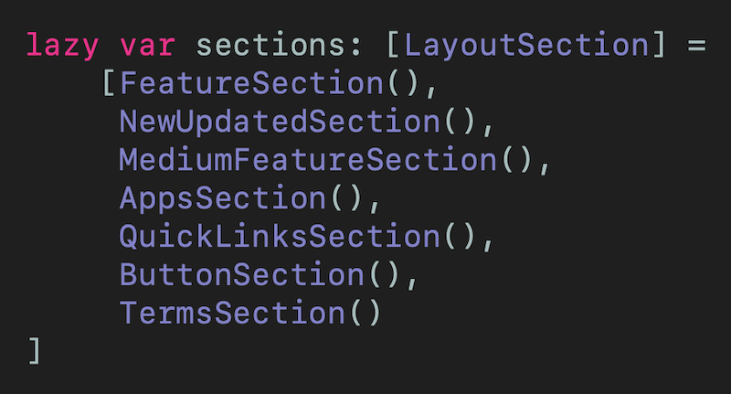 
[Click for Gist](https://gist.github.com/stevencurtis/cc469eb074dc6bac98021a864cc8dc4c)

Let us see how an individual `LayoutSection` can be created, as shown in the code snippet below:

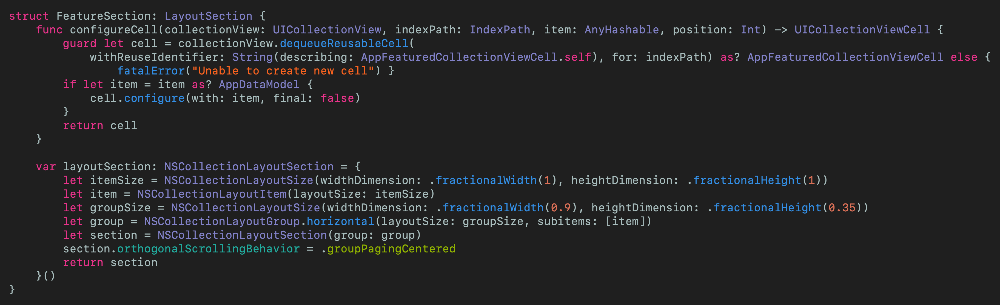 
[Click for Gist](https://gist.github.com/stevencurtis/e510eaab083336e68426131c528c77b8)

This is a practical example (yes!) of formulating the section.

But what of the other sections? Some of these need headers and footers. These conform to `UICollectionReusableView` but look much like any `UIView` I've made this reusable so it is quite long for something that appears to create just a title as a heading. Take a look at the repo for details - The file name is `TitleSupplementaryView.swift` (but you must remember to register it like a `UICollectionViewCell`.

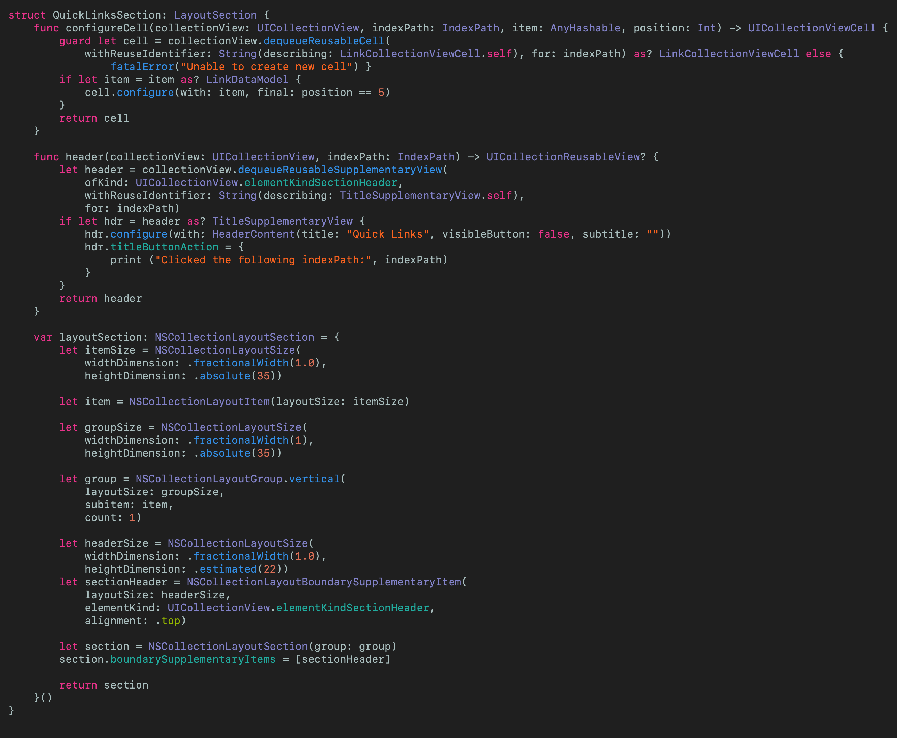 
[Click for Gist](https://gist.github.com/stevencurtis/d1ab6a6327250b5656ed01e27b841f63)

## The datasource
The `UICollectionViewDiffableDataSource` leverages the sections `enum` defined, and the `Sections` `protocol` that allows us to configure each cell for the relevant index path. The use of `AnyHashable` is covered in the why why why section below!

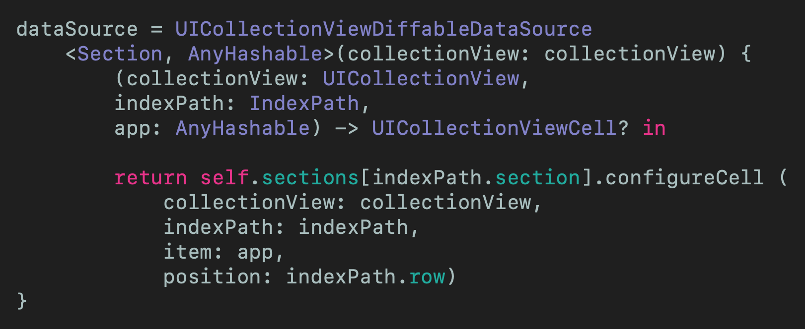 
[Click for Gist](https://gist.github.com/stevencurtis/9c4be327803ea5316b96546b64802407)

## Configuring the header
The header is a property of the `dataSource`, as in this example we can return the appropriate header for each `Section` that is available from the `enum` here featured in the relevant `UIViewController`. I did put this into a function that is called in `viewDidLoad()`

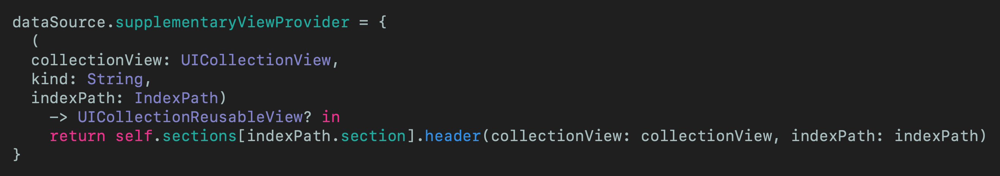 
[Click for Gist](https://gist.github.com/stevencurtis/5017c28590c1611e83b07668ad0f7967)

## The snapshot
Once the header has been set up (this, one again, has been performed in `viewDidLoad()`). As you can see a snapshot has been set up and each `Section` is appended to to it - before being applied to the `dataSource`.

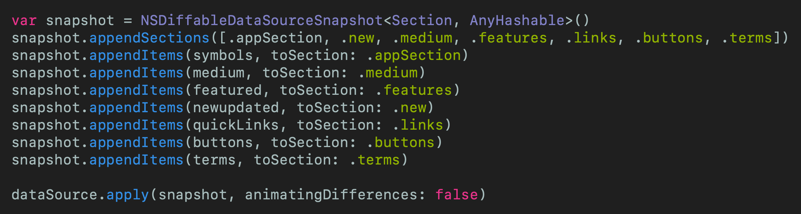 
[Click for Gist](https://gist.github.com/stevencurtis/ab9f612e827476f77bd98883fa730467)

## Cells
I'd put the `UICollectionViewCell` instances in the pot as "nothing interesting". I have created some programatically with constraints, and raised others from the `xib` file. 

This isn't the focus of this article, but to save everyone having to download from the repo here is how I created the standard App Cell:

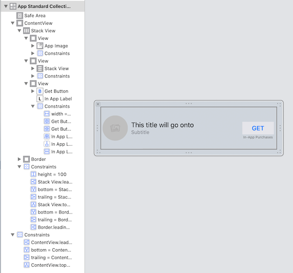 

with the code (including a closure for clicking on the button of the cell)

Oh,  the cell modifies it's own size so needs `func preferredLayoutAttributesFitting(_ layoutAttributes: UICollectionViewLayoutAttributes) -> UICollectionViewLayoutAttributes` in the `.swift` file.

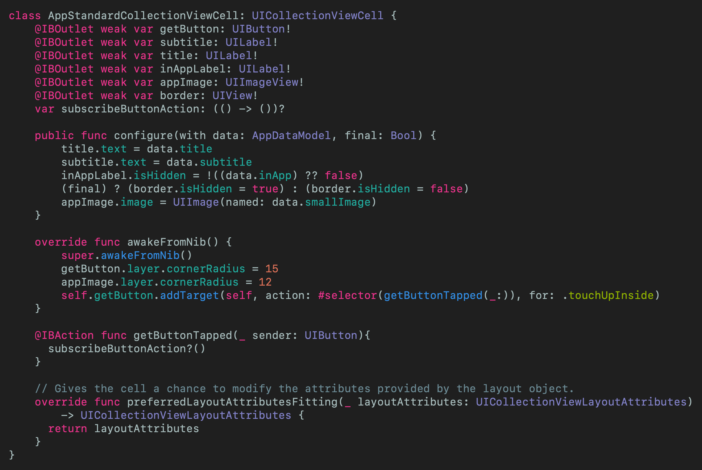 
[Click for Gist](https://gist.github.com/stevencurtis/9d30d10f148d8ac20452367c6738dcfd)

## WHY WHY WHY
This is an article rather than production code. I developed this for an iPhone SE, and some of the padding for the `Layout` is absolute no matter the size of the device - this is something that should be thought about if you are thinking of doing something like this for production code.

`AnyHashable` has been chosen for the type in the snapshot and datasource: `var dataSource: UICollectionViewDiffableDataSource<Section, AnyHashable>!` . Now usually instead of choosing `AnyHashable` it would be pertinent to choose the model type of the data being displayed. However, in this case I have used `AnyHashable` to be able to display any type of data in the cells (so display both single links and the more complex App types). Would you use `AnyHashable` in production code? Probably not, and might come up with a `protocol` that all the display types could conform to. In this case, however, it is probably easier to read and understand `AnyHashable` for beginners. You can should me on [Twitter](https://medium.com/r/?url=https%3A%2F%2Ftwitter.com%2Fstevenpcurtis) any time you'd like.

Oh, and I didn't implement all of the buttons one each cell (or on the `UINavigationBar`), but indicated how that might be done with the closures on one or two of the cells. 

Yes, the way I've created the data to be displayed makes me feel sick. It will make you feel sick to. In real life this will come from an API and be [decoded in Swift](https://medium.com/@stevenpcurtis.sc/decode-json-with-swift-and-test-it-e2d26dfafd6d).

These in totality would be a great extension to this, as would producing all of the other tabs of the project - perhaps someone wants to help me out with this (or not!)

# Conclusion
This article uses `UICollectionViewDiffableDataSource` AND `UICollectionViewDiffableDataSource` to create a clone of the Apple App Store. This has given a good opportunity to use features of iOS13 in quite a creative way.

What really surprised me is my main `UIViewController` `AppsCompositionalLayout` is so small - there is a great separation of concerns here and this is a really easy project to debug and add to.

Isn't this what we are all looking for when we produce software? This is why these APIs are so nice and we should think about incorporating them into a project. At least consider it, and having this type of example will only help us all (I hope).

I hope this article has been of use to you, and that you have enjoyed reading it.

The code from this is included in the attached [Repo]().
If you've any questions, comments or suggestions please hit me up on [Twitter](https://twitter.com/stevenpcurtis) 

I hope this article has been of use to you, and that you have enjoyed reading it.

