# From Idea to App Store: How to Build an iOS App Using AI-Powered Development with OpenAI and ChatGPT Part 1
## As a beginner!

Difficulty: Beginner | Easy | Normal | Challenging
This article has been developed using Xcode 14.2, and Swift 5.7.2
AI. How hard can it be to write an entire App using AI.

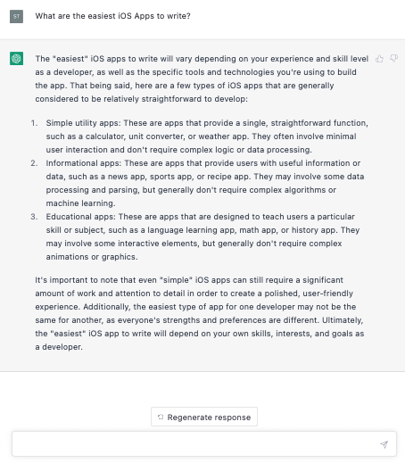

What if I make a flashcards App?

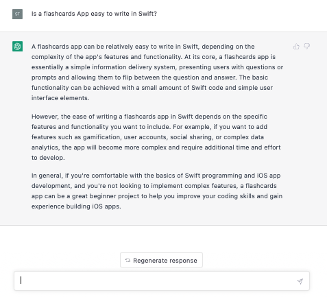

It's a little to simple perhaps to have a static flashcards App. I want to use an API for this project. What about asking ChatGPT for an endpoint? I don't want to signup (so no unsplash or similar). Let us find out:

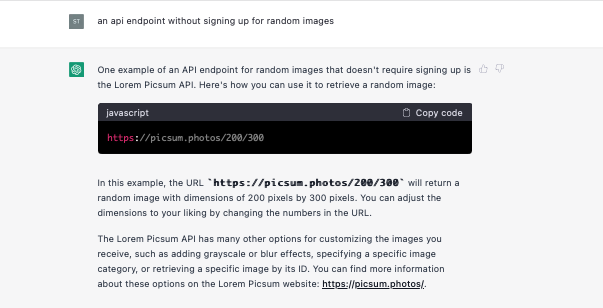

Let's get started

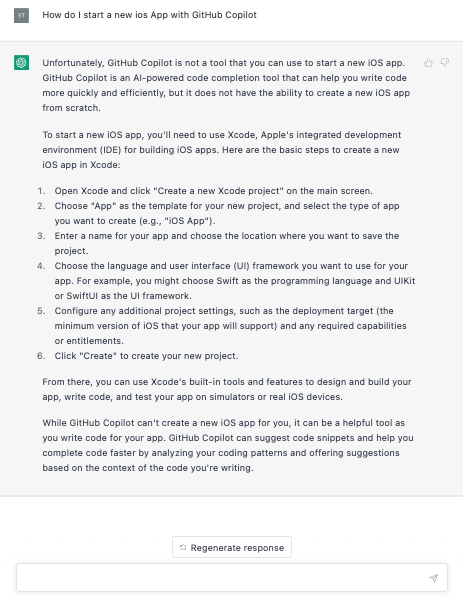

Starting a new iOS App is fine. I'm going to call my App AIFlashcards.
Wait though, there's an issue.

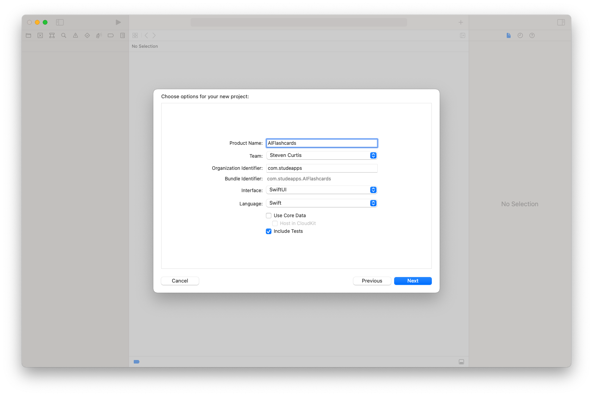

Should I use Swift or Objective-C? Should I use SwiftUI or UIKit? I'll ask ChatGPT!

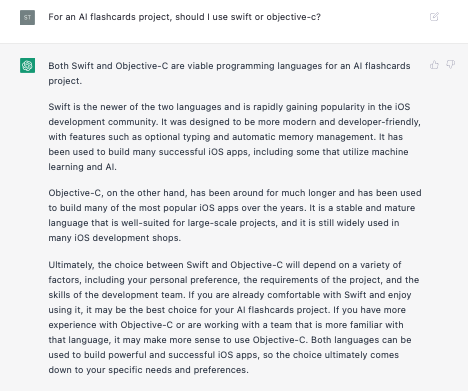


My preference is Swift. ChatGPT didn't help much.
Will ChatGPT be more helpful for choosing my UI framework?

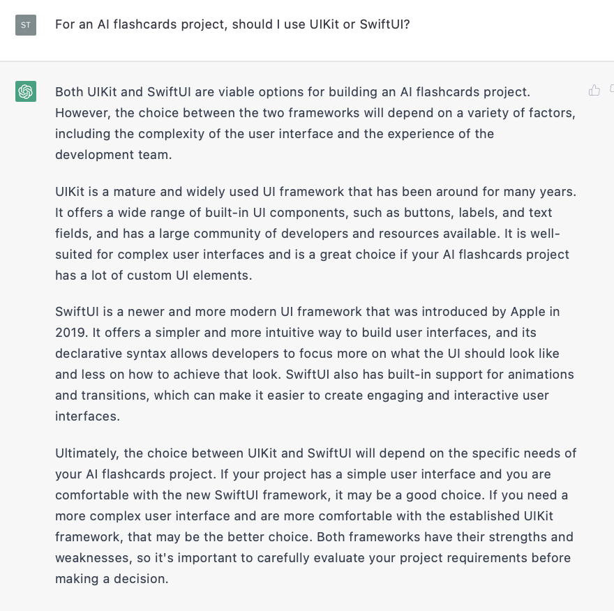

Not sure here either. SwiftUI is probably easier to get GitHub Copilot to write the interface as it's programmatic (although I could write UIKit code programmatically). Still everything is is pretty clear to me.

-

I've now opened the project in Xcode. Great! How do I link this to GitHub Copilot?

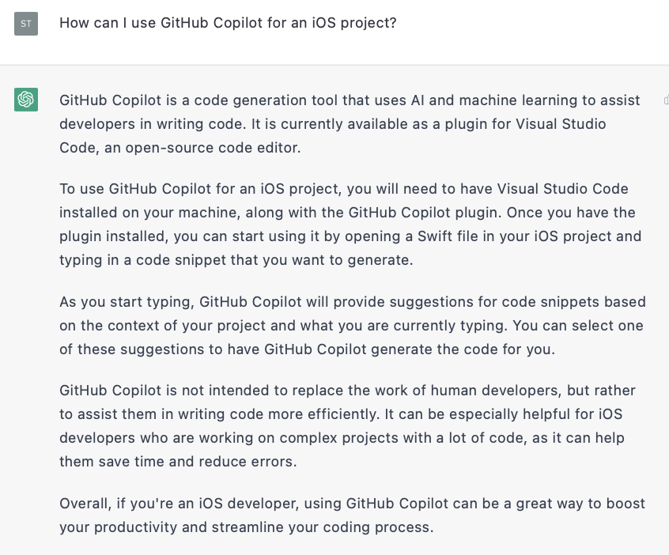

I feel almost as if I'm cheating here, as I've already got Copilot installed (and Visual Studio Code). 
I'm going to whack the projects side-by-side.

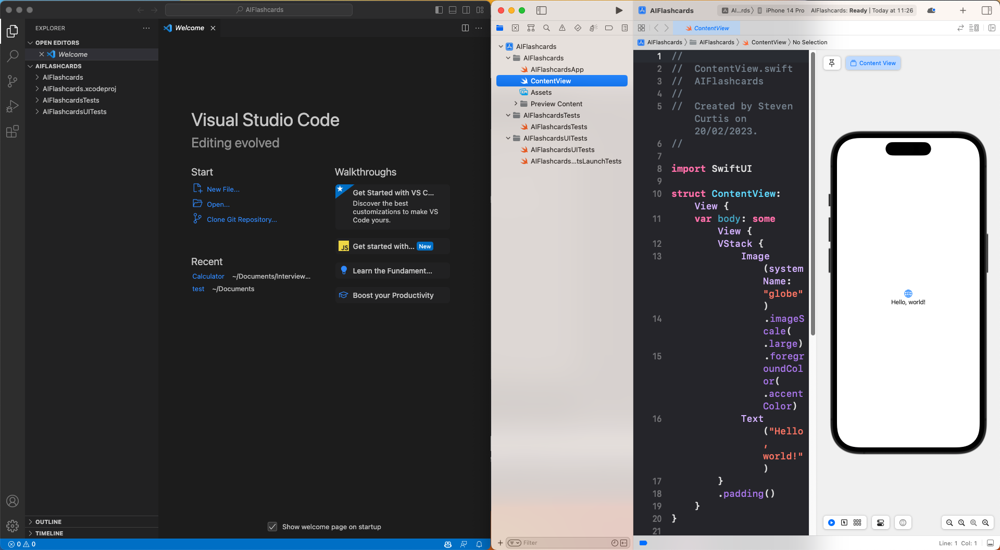

Then let's get ChatGPT on the case for creating this project.

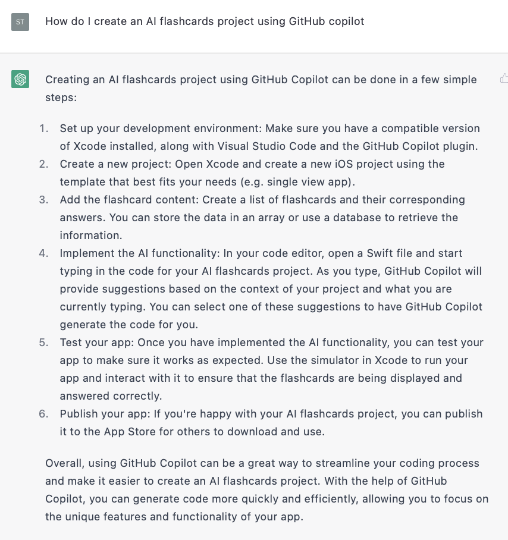

Fair enough. I'd done step 1 and step 2. I want the flashcard content mentioned in step 3. Can ChatGPT help out?

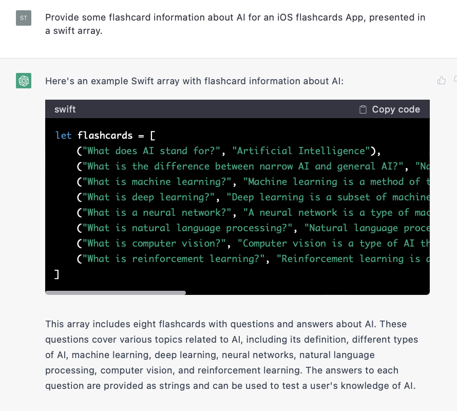<br>

That looks…reasonable. Where should I put it in the App?

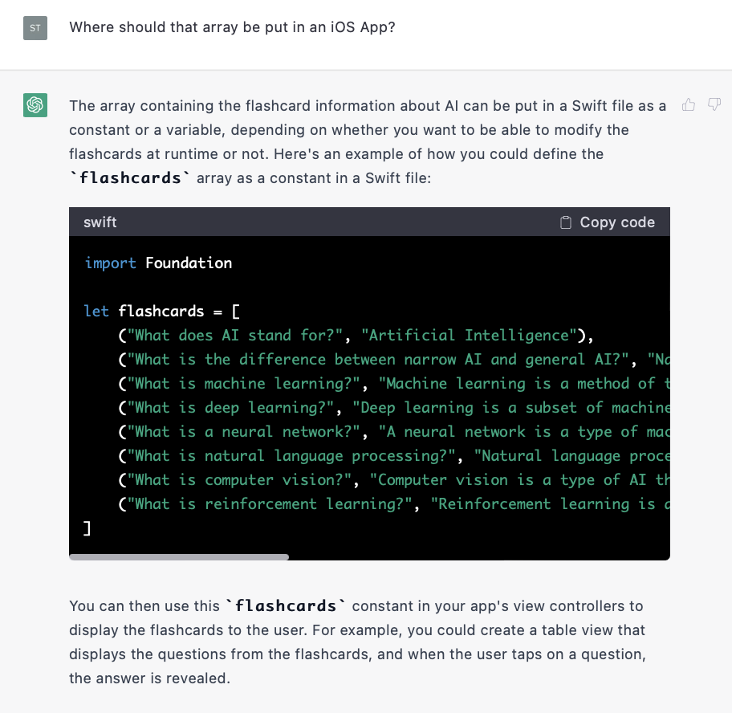<br>

So what should I name this file?

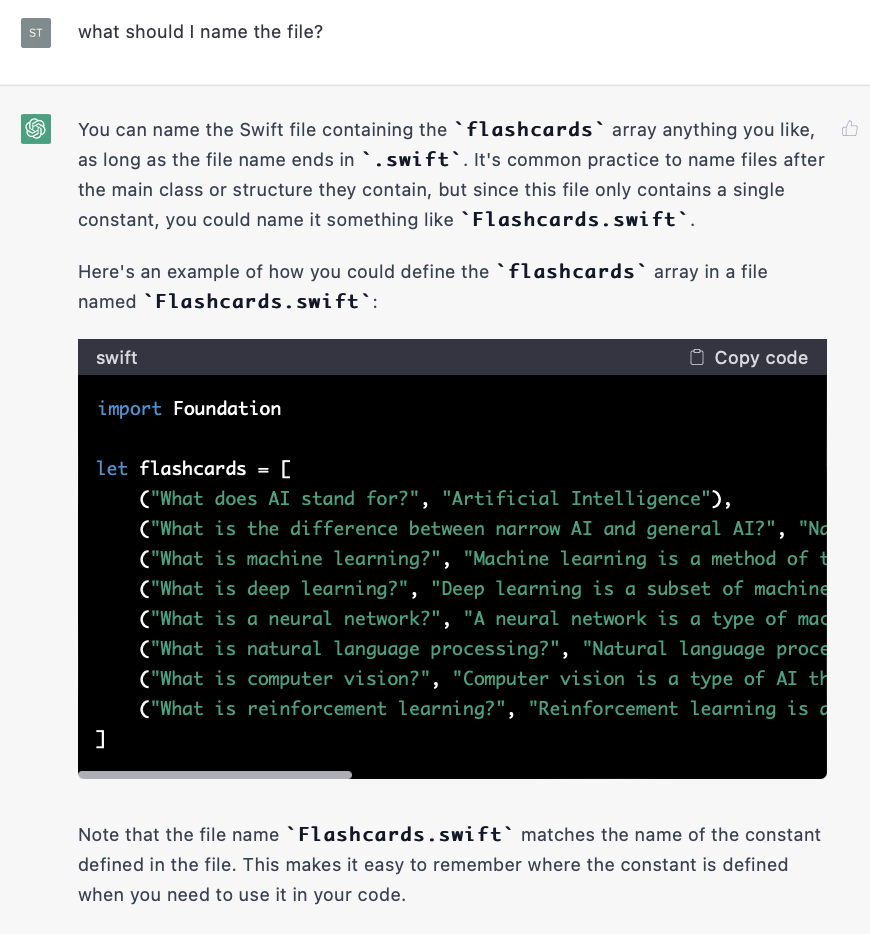<br>

Fair enough. I'll put that into my project.

<br>

What are you talking about ChatGPT? Import the file? What?

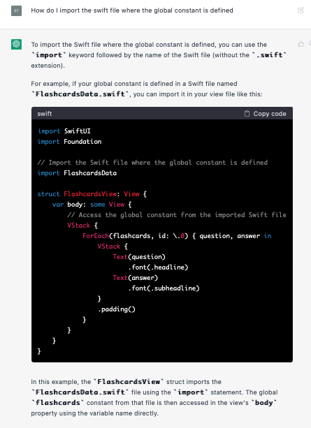<br>

So trying this leaves us with an error. Yes, there isn't a file (or module) like that.

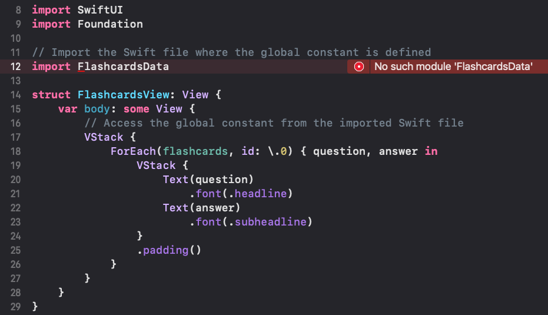<br>

At this point I have to use some of my "Swifty" skills to get this to work. ChatGPT can only get me so far it seems.
Unless I tell it to write the whole thing for me?

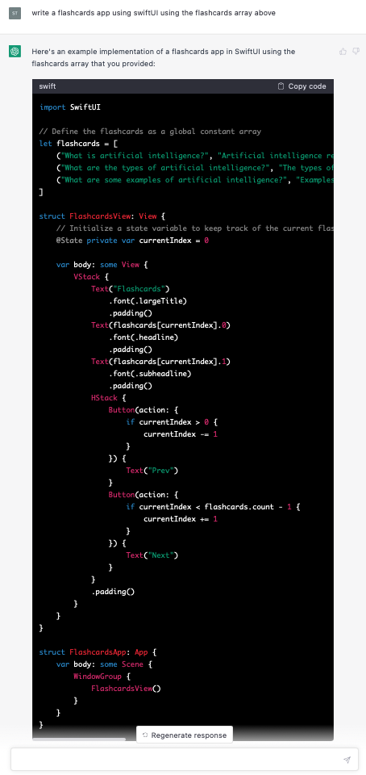<br>

Which, kind of works.
I did change the name `FlashcardsView` to `ContentView`, don't remember quite why bit it's there so…there!

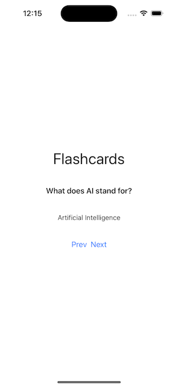<br>

Yes, the previous button doesn't work when we are on the first card. 

**But it works!**

## What doesn't work?
We don't have SwiftUI Previews. But I've got GitHub Copilot to help me!
I give the prompt

```swift
// SwiftUI preview for ContentView
```

And you know what? It works.

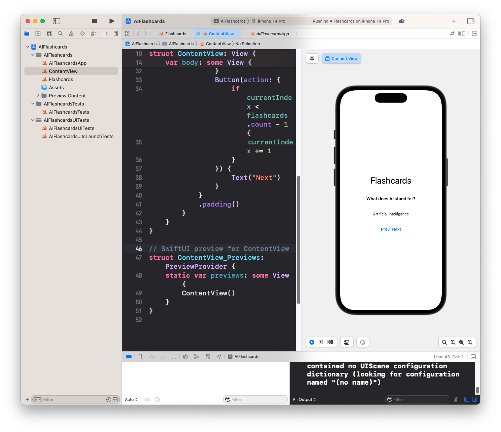<br>

Let's take this to a new article to start the networking.

# Conclusion
Thank you for reading.

Building an iOS application with OpenAI and ChatGPT has been a unique experience so far, and one that is powerful for beginners. However, I did lose some functionality like the SwiftUI preview by following this approach and it seems like AI might not yet be a full replacement for a developer's technical skills and knowledge.

This article is just the beginning of making a flashcards App using AI, and I would argue it has made it easier to this point but there's still a long way to go. In the next article I'll cover networking, and I hope to have you along for the ride!
