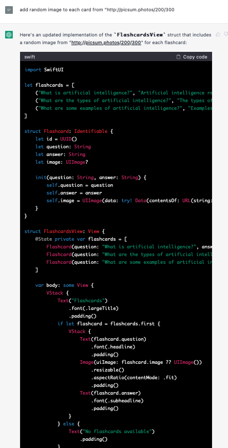
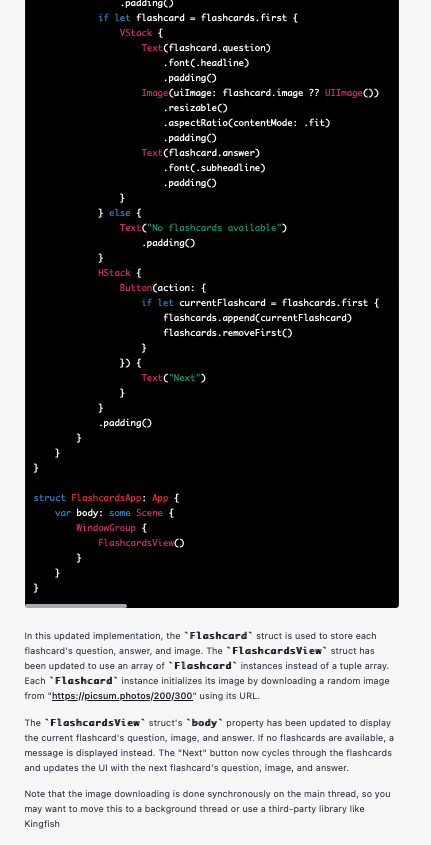
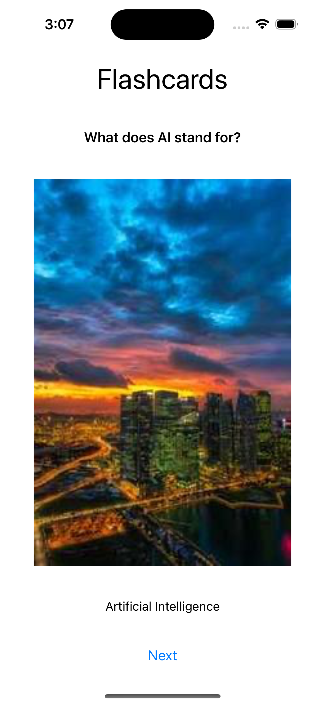
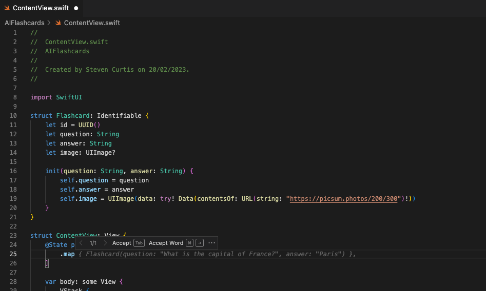
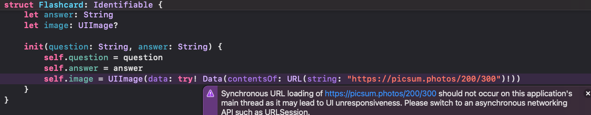
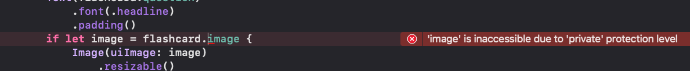
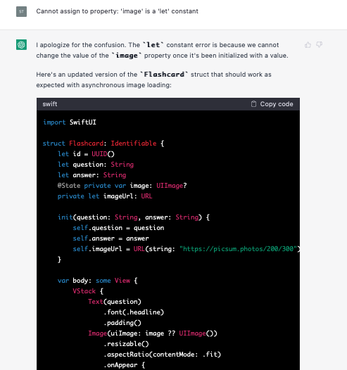

# From Idea to App Store: How to Build an iOS App Using AI-Powered Development with OpenAI and ChatGPT Part 2
## Networking to the App Store

This is a continuation of a project where I build an AI-assisted App from idea to App store. [Part 1](https://medium.com/@stevenpcurtis/from-idea-to-app-store-how-to-build-an-ios-app-using-ai-powered-development-with-openai-and-6aac336dfb3) got us a working App, but unfortunately didn't have any networking. Part 2 is going to put that right!

I've already started the project but want to add images from a BE endpoint. I chose [http://picsum.photos](http://picsum.photos) because I'm aware that endpoint will return different random image each time it's called. Unfortunately I didn't choose to get ChatGPT to help with that choice. I did however ask ChatGPT to use this code to improve my work!

<br>
<br>

I can only assume the third-party library is Kingfisher.

<br>

I don't know where the back button is now, but OK. It's fine.

Anyway, we can ask ChatGPT to use asynchronous loading for the images but I don't like the *repetition of code for the flashcards data*. It's just not right!

Surely I can map the flashcards into that struct?

I can use GitHub Copilot to help me. To be honest, I needed to give Copliot much more information than I thought it would need

<br>

Which of course won't work. A classic Cannot use instance member 'flashcards' within property initializer; property initializers run before 'self' is available

No problem. We'll use an initializer to sort this problem right out

```swift
struct ContentView: View {
    @State private var flashcards: [Flashcard]
    
    init(flashcards: [(String, String)]) {
        self.flashcards = flashcards.map { Flashcard(question: $0, answer: $1) }
    }
...
```
Notice that the AI has gone slightly to the side here.
This issue:

<br>

I'll tell you what I've given ChatGPT. It's this

```swift
for this code: import SwiftUI

struct Flashcard: Identifiable {
    let id = UUID()
    let question: String
    let answer: String
    let image: UIImage?
    
    init(question: String, answer: String) {
        self.question = question
        self.answer = answer
        self.image = UIImage(data: try! Data(contentsOf: URL(string: "https://picsum.photos/200/300")!))
    }
}

struct ContentView: View {
    @State private var flashcards: [Flashcard]
    
    init(flashcards: [(String, String)]) {
        self.flashcards = flashcards.map { Flashcard(question: $0, answer: $1) }
    }
    
    var body: some View {
        VStack {
            Text("Flashcards")
                .font(.largeTitle)
                .padding()
            if let flashcard = flashcards.first {
                VStack {
                    Text(flashcard.question)
                        .font(.headline)
                        .padding()
                    Image(uiImage: flashcard.image ?? UIImage())
                        .resizable()
                        .aspectRatio(contentMode: .fit)
                        .padding()
                    Text(flashcard.answer)
                        .font(.subheadline)
                        .padding()
                }
            } else {
                Text("No flashcards available")
                    .padding()
            }
            HStack {
                Button(action: {
                    if let currentFlashcard = flashcards.first {
                        flashcards.append(currentFlashcard)
                        flashcards.removeFirst()
                    }
                }) {
                    Text("Next")
                }
            }
            .padding()
        }
    }
}

use asynchronous loading for the images
```

Copy and paste this into Xcode and…

<br>

Please fix that ChatGPT!

<br>

This is madness? Another error which we need to fix.

<br>

ChatGPT can't.
Luckily, I actually can. You can use AsyncImage to do this. Since I'm using the same URL "https://picsum.photos/200/300" for the images I need to get a way for it to refresh each time. I'll use the UUID() in the Flashcard struct in order to do this.
I can't think of a way that GitHub Copilot can actually help me to do this.
I did it straight in Xcode as a result, but at least it works even if it's not AI-assisted!

```swift
import SwiftUI

struct Flashcard: Identifiable {
    let id = UUID()
    let question: String
    let answer: String
    
    init(question: String, answer: String) {
        self.question = question
        self.answer = answer
    }
}

struct ContentView: View {
    @State private var flashcards: [Flashcard]
    
    init(flashcards: [(String, String)]) {
        self.flashcards = flashcards.map { Flashcard(question: $0, answer: $1) }
    }
    
    var body: some View {
        VStack {
            Text("Flashcards")
                .font(.largeTitle)
                .padding()
            if let flashcard = flashcards.first {
                VStack {
                    Text(flashcard.question)
                        .font(.headline)
                        .padding()
                    AsyncImage(url: URL(string: "https://picsum.photos/200/300"))
                        .id(flashcard.id)
                    Text(flashcard.answer)
                        .font(.subheadline)
                        .padding()
                }
            } else {
                Text("No flashcards available")
                    .padding()
            }
            HStack {
                Button(action: {
                    if let currentFlashcard = flashcards.first {
                        flashcards.append(currentFlashcard)
                        flashcards.removeFirst()
                    }
                }) {
                    Text("Next")
                }
            }
            .padding()
        }
    }
}

// SwiftUI preview for ContentView
struct ContentView_Previews: PreviewProvider {
    static var previews: some View {
        ContentView(flashcards: flashcards)
    }
}
```

Which I guess brings us to a hard stop for this particular article. There will be a part 3, and that will tell us if this particular article makes it onto the App store.

# Conclusion

Thank you for reading.

In this second part of the series "From Idea to App Store: How to Build an iOS App Using AI-Powered Development with OpenAI and ChatGPT", the focus was on networking and adding images from a backend endpoint.

Part 3? I'm sure you can't wait. [Part 1](https://medium.com/@stevenpcurtis/from-idea-to-app-store-how-to-build-an-ios-app-using-ai-powered-development-with-openai-and-6aac336dfb3)? Always there for you to read.
Anyway, happy coding!
