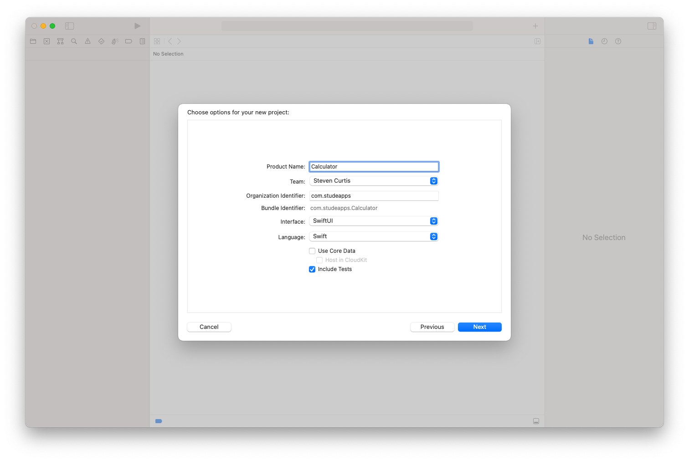
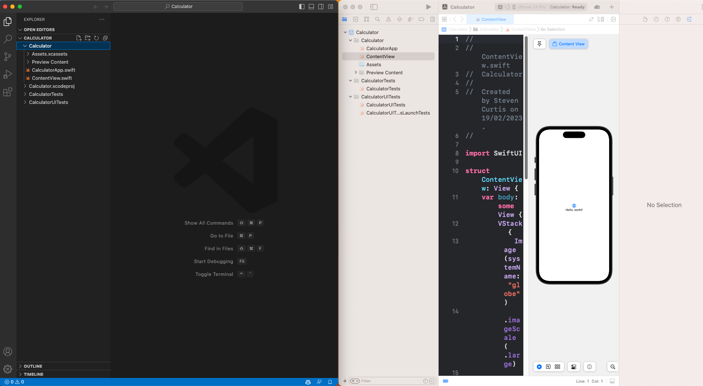
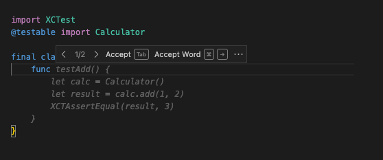
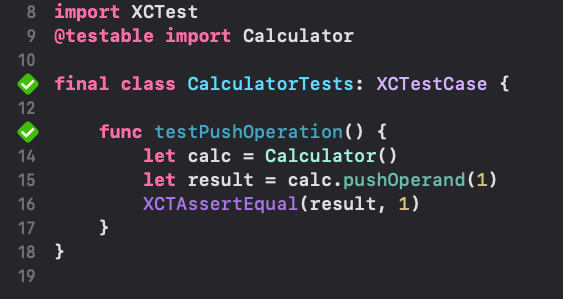
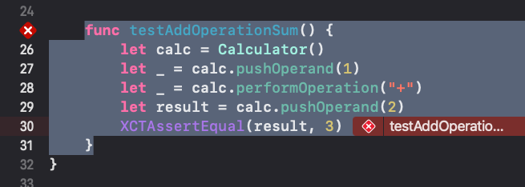
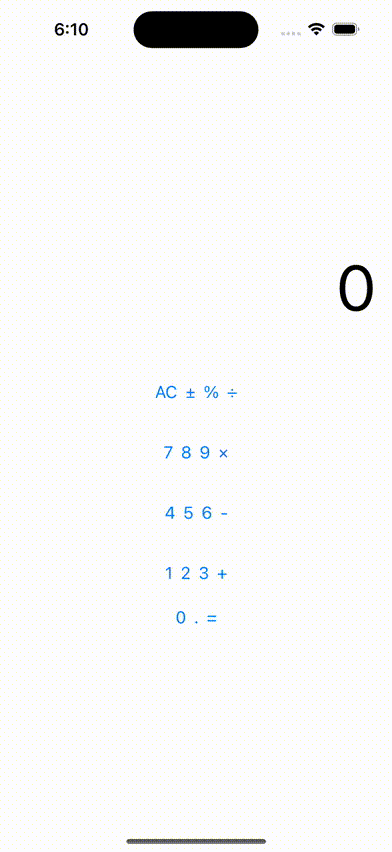

# Levelling up Swift Development with Test-Driven GitHub Copilot
## AI We Go

TDD is awesome. You catch bugs before you've written them. You're forced to think about code design. Your code is well-tested from the beginning.
GitHub Copilot is also awesome.
So can I combine the two?
You bet. Let's dive in.

Difficulty: Beginner | *Easy* | Normal | Challenging

# Prerequisites:
It would be good to setup GitHub Copilot first.

## A calculator example
I always recommend that new iOS developers study CS193p https://cs193p.sites.stanford.edu/ which is not only free, but is fantastic. In one variation of that course they go through a calculator App.
It's a student classic. So am I able to create a simple calculator by using Copilot and TDD?

**The steps**
I created a new project in Xcode and then opened the same project in Visual Studio Code. 
The project? A SwiftUI Project.

<br>

<br>

I can open up the `CalculatorTests` in both IDEs. I'm going to delete the generated tests to make things a little easier to see. Note that I find it easier (for this tutorial) to delete the functions in Visual Studio Code and then save (the changes then appear in Xcode).
I tehn start writing my first test and I get an initial suggestion:

<br>

I'm not satisfied with this. My calculator isn't going to have a number of functions that relate to each operation, that's not the way we are going. 
I'm going to need to write my own test.
I'm going to push an operand onto the calculator

```swift
func testPushOperation() {
    let calc = Calculator()
    let result = calc.pushOperand(1)
    XCTAssertEqual(result, 1)
}
```

So I start writing my `Calculator` class. I prefer to add the class in Swift, but you could add it in VSC. I open that empty file in VSC, and use Copilot.

GitHub Copilot can provide suggestions for setting up the `Calculator` object and the `pushOperand` method. Once the method has been defined, Copilot can suggest the minimum amount of code necessary to make the test pass.

<br>

I accept this class suggestions saving the test and then check the test in Xcode.
The tests pass!

<br>

I'm not going to test an add operation. That is, +.
The code complete suggests the following:

```swift
func testAddOperation() {
    let calc = Calculator()
    let result = calc.performOperation("+")
    XCTAssertEqual(result, 0)
}
```

If we are perform an operation without two operands, I'd prefer my calculator to return nil (zero makes no sense here). So I make the change.
Copilot suggests the following code:

```swift
func performOperation(_ operation: String) -> Double? {
    return nil
}
```

That's not quite what I would like. I need to type in a calculation like 2+3 and return the result.

I can write a test for that!

Or, rather I give `Copilot` a helping hand a tell it I want to create a test `testAddOperationSum` and it seems to read my mind with the following suggestion

```swift
func testAddOperationSum() {
    let calc = Calculator()
    let _ = calc.pushOperand(1)
    let _ = calc.pushOperand(2)
    let result = calc.performOperation("+")
    XCTAssertEqual(result, 3)
}
```

That's not quite what I want. I want to pushOperand, pushOperand and then pushOperation. I'll hand-craft this:

```swift
func testAddOperationSum() {
    let calc = Calculator()
    let _ = calc.pushOperand(1)
    let _ = calc.performOperation("+")
    let result = calc.pushOperand(2)
    XCTAssertEqual(result, 3)
}
```

Of course, the test now fails

<br>

I need to write some code to get this to work!

I'm back to the `calculator.swift` file in VSC, and what I really want to do is when we push the operand or operator we calculate the result. We'll need an evaluate function which is called by both of the functions.

Copilot isn't quite right here

```swift
private func evaluate() -> Double {
    return 0
}
```

We might not have a calculation to return here. So we will return an optional `Double`.

I'll then get `pushOperand` and `performOperation` to return the result of the evaluate function. I'll tidy `pushOperand` so that returns a `Double` too.

```swift
final class Calculator {
    func pushOperand(_ operand: Double) -> Double? {
        return evaluate()
    }

    func performOperation(_ operation: String) -> Double? {
        return evaluate()
    }
    
    private func evaluate() -> Double? {
        return 0
    }
}
```

The first two tests pass, the last still fails. 
Evaluate is going to need to know the operation and have two operators. 
I can use an array to store the operands. I'd need to store the operation too.

```swift
import Foundation

final class Calculator {
    var operands: [Double] = []
    func pushOperand(_ operand: Double) -> Double? {
        operand.append(operand)
        return evaluate()
    }

    func performOperation(_ operation: String) -> Double? {
        return evaluate()
    }
    
    private func evaluate() -> Double? {
        return 0
    }
}
```

Copilot doesn't help much here!

Hmm. I need to convert OpCode to a function. No problem. I'll get copilot to do it

`// private function to convert String opCode to a function`

Which gives:

```swift
private func convertOpCodeToFunction(_ opCode: String) -> (Double, Double) -> Double {
    switch opCode {
    case "+":
        return (+)
    case "-":
        return (-)
    case "*":
        return (*)
    case "/":
        return (/)
    default:
        return (+)
    }
}
```

A bit of code completion on evaluate(), and a crash when didn't have tow operands means we have the following overall code (some Copilot code completion was used)

```swift
final class Calculator {
    var operands: [Double] = []
    var opCode: String? = nil
    func pushOperand(_ operand: Double) -> Double? {
        operands.append(operand)
        return evaluate()
    }

    func performOperation(_ operation: String) -> Double? {
        opCode = operation
        return evaluate()
    }
    
    private func evaluate() -> Double? {
        guard operands.count == 2 else {
            return nil
        }
        return convertOpCodeToFunction(opCode ?? "+")(operands[0], operands[1])
    }

    // private function to convert String opCode to a function
    private func convertOpCodeToFunction(_ opCode: String) -> (Double, Double) -> Double {
        switch opCode {
        case "+":
            return (+)
        case "-":
            return (-)
        case "*":
            return (*)
        case "/":
            return (/)
        default:
            return (+)
        }
    }
}
```

Run the tests, and the first now fails (although the other two pass). if there's only one operand, I wish to return that operand rather than nil. 
Now all these tests pass!

```swift
final class CalculatorTests: XCTestCase {

    func testPushOperation() {
        let calc = Calculator()
        let result = calc.pushOperand(1)
        XCTAssertEqual(result, 1)
    }
    
    func testAddOperation() {
        let calc = Calculator()
        let result = calc.performOperation("+")
        XCTAssertEqual(result, nil)
    }
        
    func testAddOperationSum() {
        let calc = Calculator()
        let _ = calc.pushOperand(1)
        let _ = calc.performOperation("+")
        let result = calc.pushOperand(2)
        XCTAssertEqual(result, 3)
    }
}
```

# The UI
Let's try this with the following prompt

`// a body var that returns a 0–9 View containing a keypad and a +, linking to the Calculator`
The result is, interesting:

```swift
struct ContentView: View {
    // a body var that returns a 0-9 View containing a keypad and a +, linking to the Calculator
    @State private var brain = Calculator()
    @State private var userIsInTheMiddleOfTyping = false
    @State private var display = "0"

    var body: some View {
        VStack {
            Text(display)
                .frame(minWidth: 0, maxWidth: .infinity, alignment: .trailing)
                .padding(.trailing)
                .font(.system(size: 64))
            HStack {
                Button("AC") {
                    brain.clear()
                    display = "0"
                }
                Button("±") {
                    if let operand = brain.operands.first {
                        brain.operands[0] = -operand
                    }
                }
                Button("%") {
                    if let operand = brain.operands.first {
                        brain.operands[0] = operand / 100
                    }
                }
                Button("÷") {
                    brain.performOperation("÷")
                    display = String(brain.evaluate() ?? 0)
                }
            }
            .padding()
            HStack {
                Button("7") {
                    enterNumber(7)
                }
                Button("8") {
                    enterNumber(8)
                }
                Button("9") {
                    enterNumber(9)
                }
                Button("×") {
                    brain.performOperation("×")
                    display = String(brain.evaluate() ?? 0)
                }
            }
            .padding()
            HStack {
                Button("4") {
                    enterNumber(4)
                }
                Button("5") {
                    enterNumber(5)
                }
                Button("6") {
                    enterNumber(6)
                }
                Button("-") {
                    brain.performOperation("-")
                    display = String(brain.evaluate() ?? 0)
                }
            }
            .padding()
            HStack {
                Button("1") {
                    enterNumber(1)
                }
                Button("2") {
                    enterNumber(2)
                }
                Button("3") {
                    enterNumber(3)
                }
                Button("+") {
                    brain.performOperation("+")
                    display = String(brain.evaluate() ?? 0)
                }
            }
            .padding()
            HStack {
                Button("0") {
                    enterNumber(0)
                }
                Button(".") {
                    if !display.contains(".") {
                        display += "."
                    }
                }
                Button("=") {
                    display = String(brain.evaluate() ?? 0)
                }
            }
        }
    }
}
```

This doesn't quite work, at all. It's a shame.

I'm not going to run into each change I've completed to make this work, but I do find it odd that Copilot as attempted to call a *private* function with `brain.evaluate()`, and using a function in `brain.clear()` that doesn't even exist.

Here is my quick hacky solution to get this code to work. This involved me running through the code and fixing what I could (as fast as possible):

```swift
import SwiftUI

struct ContentView: View {
    // a body var that returns a 0-9 View containing a keypad and a +, linking to the Calculator
    @State private var brain = Calculator()
    @State private var userIsInTheMiddleOfTyping = false
    @State private var display = "0"

    var body: some View {
        VStack {
            Text(display)
                .frame(minWidth: 0, maxWidth: .infinity, alignment: .trailing)
                .padding(.trailing)
                .font(.system(size: 64))
            HStack {
                Button("AC") {
                    display = "0"
                }
                Button("±") {
                    if let operand = brain.operands.first {
                        brain.operands[0] = -operand
                    }
                }
                Button("%") {
                    if let operand = brain.operands.first {
                        brain.operands[0] = operand / 100
                    }
                }
                Button("÷") {
                    display = String(brain.performOperation("÷") ?? 0)
                }
            }
            .padding()
            HStack {
                Button("7") {
                    display = String(brain.pushOperand(7) ?? 0)
                }
                Button("8") {
                    display = String(brain.pushOperand(8) ?? 0)
                }
                Button("9") {
                    display = String(brain.pushOperand(9) ?? 0)
                }
                Button("×") {
                    display = String(brain.performOperation("×") ?? 0)
                }
            }
            .padding()
            HStack {
                Button("4") {
                    display = String(brain.pushOperand(4) ?? 0)
                }
                Button("5") {
                    display = String(brain.pushOperand(5) ?? 0)
                }
                Button("6") {
                    display = String(brain.pushOperand(6) ?? 0)
                }
                Button("-") {
                    display = String(brain.performOperation("-") ?? 0)
                }
            }
            .padding()
            HStack {
                Button("1") {
                    display = String(brain.pushOperand(1) ?? 0)
                }
                Button("2") {
                    display = String(brain.pushOperand(2) ?? 0)
                }
                Button("3") {
                    display = String(brain.pushOperand(3) ?? 0)
                }
                Button("+") {
                    
                    display = String(brain.performOperation("+") ?? 0)
                }
            }
            .padding()
            HStack {
                Button("0") {
                    brain.pushOperand(0)
                }
                Button(".") {
                    if !display.contains(".") {
                        display += "."
                    }
                }
                Button("=") {
                    display = String(brain.performOperation("=") ?? 0)
                }
            }
        }
    }
}

struct ContentView_Previews: PreviewProvider {
    static var previews: some View {
        ContentView()
    }
}
```

1+2? It equals 3 (although I don't need to press the equals key, but that was kind of my design).
It does work if I perform 1 + 2, but yeah. It's not great.

<br>

# So, Copilot with TDD Best Practices
Best Practices for Using GitHub Copilot with TDD While GitHub Copilot can be a useful tool for TDD, it's important to use it responsibly and in conjunction with established best practices.

Here are some best practices to keep in mind:

Start with the test: When using GitHub Copilot with TDD, it's important to start by writing the test first. This ensures that the code meets the requirements of the project and is thoroughly tested.
Always review the generated code: GitHub Copilot can provide suggestions for writing code, but it's important to review the generated code and ensure that it meets the project's requirements and is easy to maintain.
In production, use code reviews: These should be part of your development process anyway but when using Copilot with TDD it's a must. When you involve another developer you've another set of coding eyes on your work, and that's a great thing.

# Conclusion
Hmm. Copilot seems like a great way to turbo charge TDD. However, it's still a little bit like a student copy-pasting from the Internet when faced with the UI in this example so I'd say it really needs to be used with care.
Yet for the calculator class it did a pretty good job, and made me feel really good about following a TDD process. By streamlining the process, Copilot really did increase by productivity and potentially would improve my code quality.
So…I guess a mixed picture?
Let me know if you're using Copilot and how you're finding coding with AI.
Anyway, happy coding!
