# From Idea to App Store: How to Build an iOS App Using AI-Powered Development with OpenAI and ChatGPT Part 3
## App Store

So how can I get this wonderful App onto the Apple App store?
I'm going to of course ask ChatGPT.

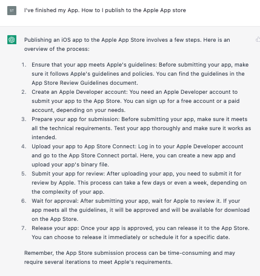 

) We'll let Apple decide (so ever professional!)
) I (luckily) already have the developer account
) Unfortunately our App doesn't have any tests at all. Never mind!
) Upload your App to App Store Connect?

Let's do it!
I dust off my password for App Store Connect and get right here:

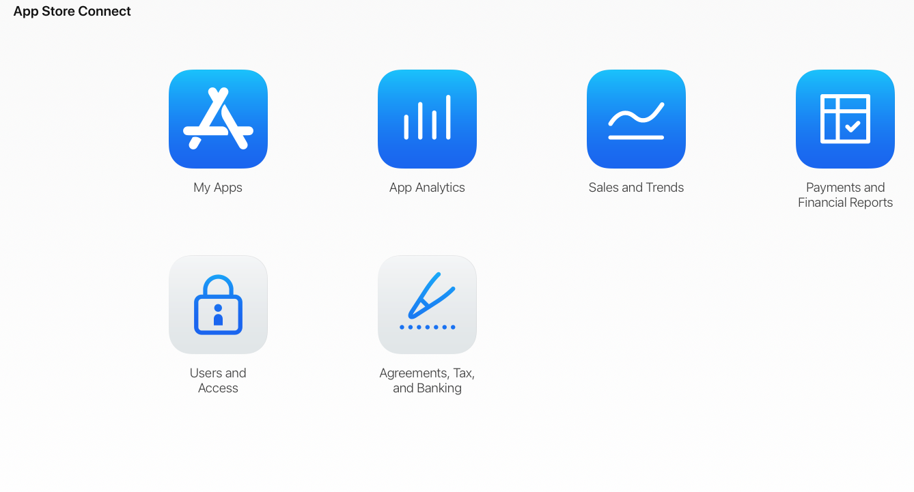 

What to do?

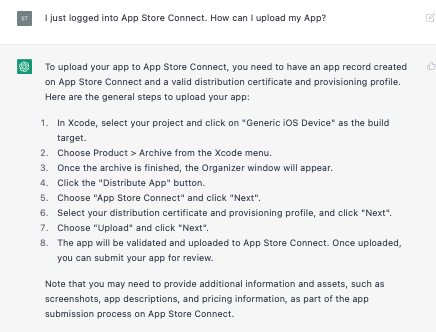 

App record?

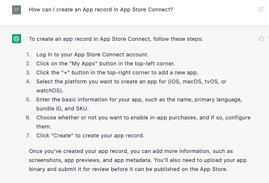 

Fair enough
Sure, I'd done that
That's the first icon on my screen! Great
That's not the top-right hand corner. But Ok, fine.

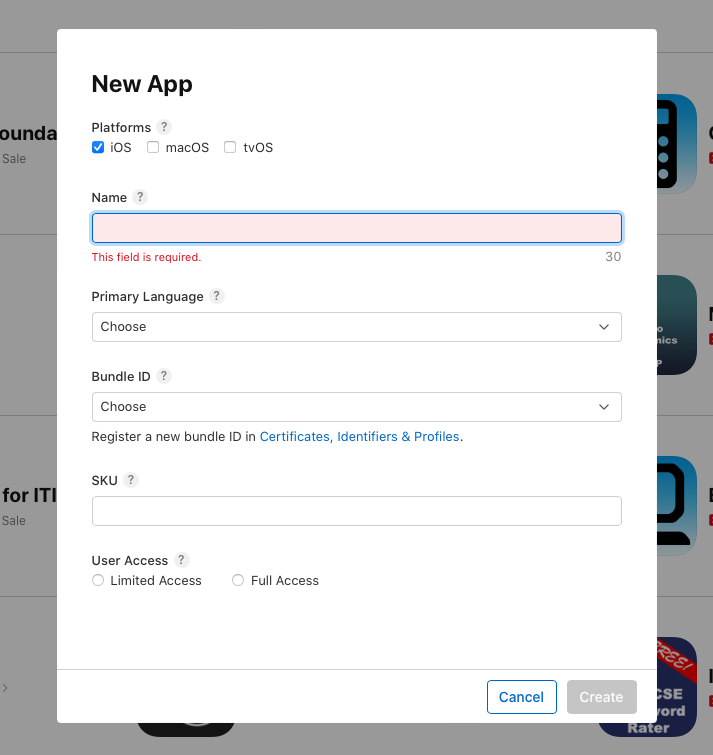 

I need a name for this App

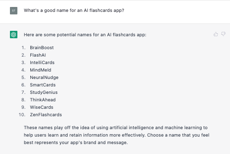 

FlashAI it is then.
I needed to choose a new certificate, but this is suggested by Apple's form so no issue there.

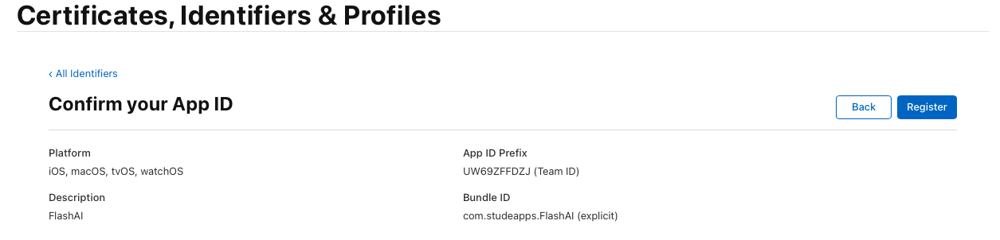 

This is going to be awesome!

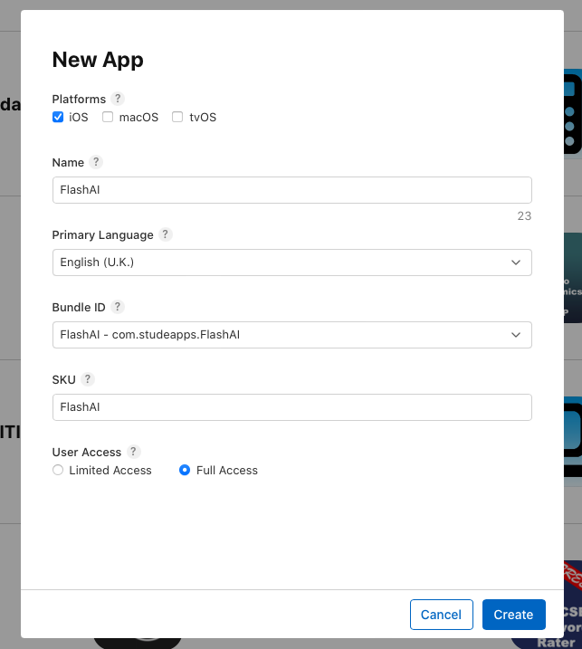 

Upload my App's binary fine?

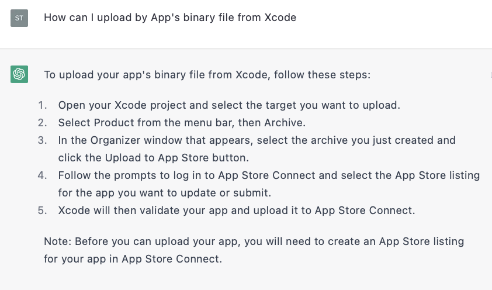 

Luckily I can remember you don't archive to a simulator.

It takes me though some questions (please, no Xcode cloud right now). I do know to ignore most of these questions, but I'm not sure how you would know this as ChatGPT hasn't really given any guidance on this.

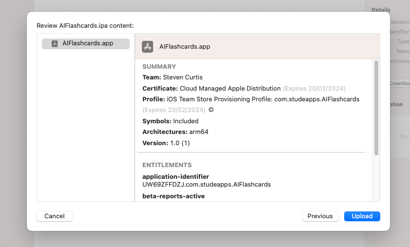 

We can then upload…

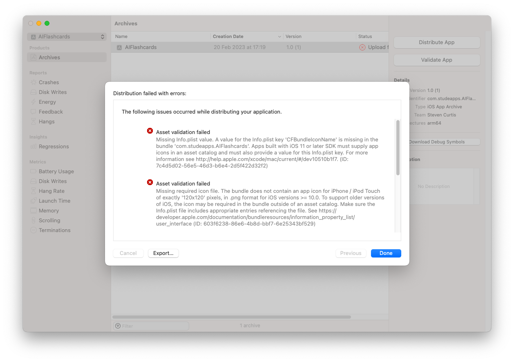 

Ah yes. I don't have any icons. How can I create them?

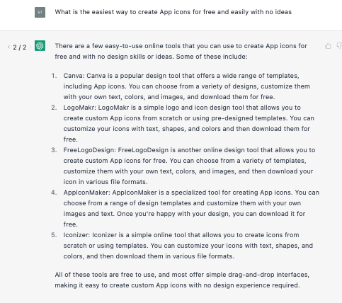 

AppIconMaker?

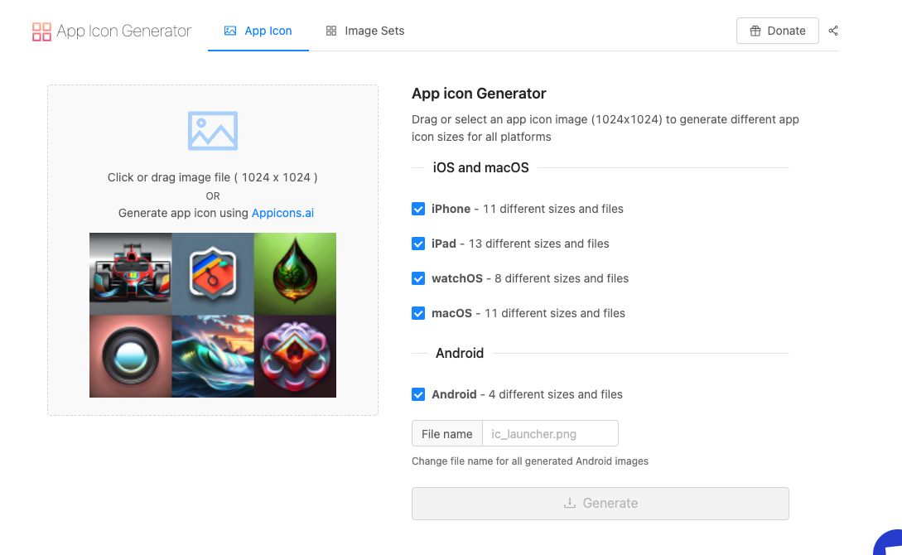 

An AI generator?

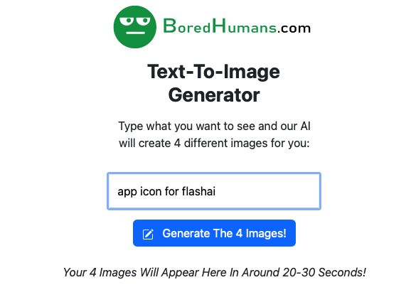 

There's one particular winner for the icon. I'm sure you know which one it is.

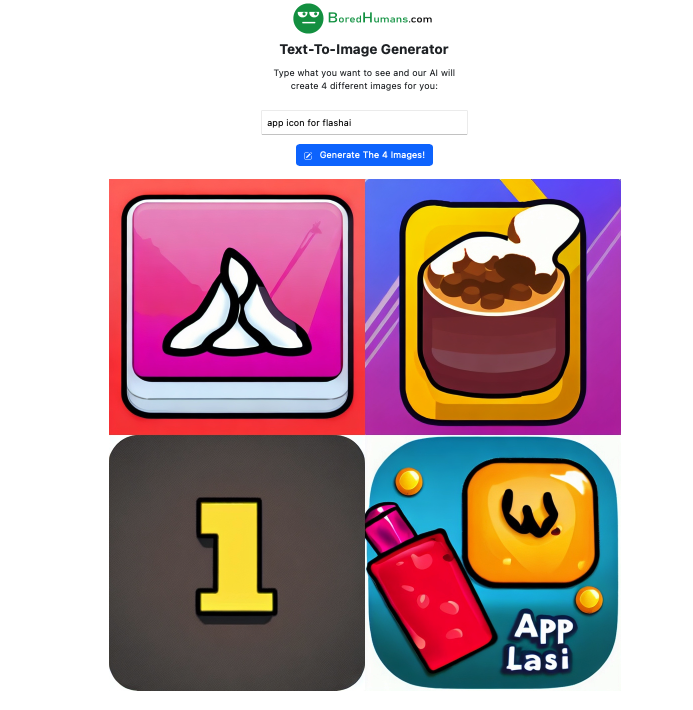 

Let's make those images!

 

They gave me the zip file for the App icons. Awesome! I dragged this into the Xcode App and feel excited, this is going to be awesome!

Another archive, another attempt

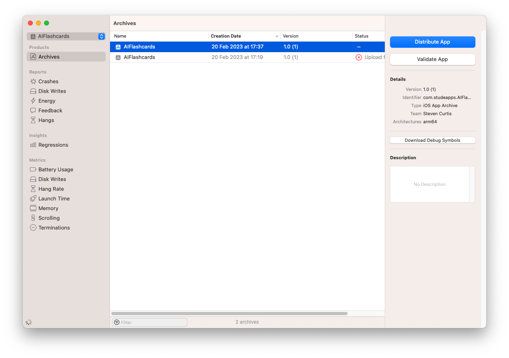 

You're kidding right?

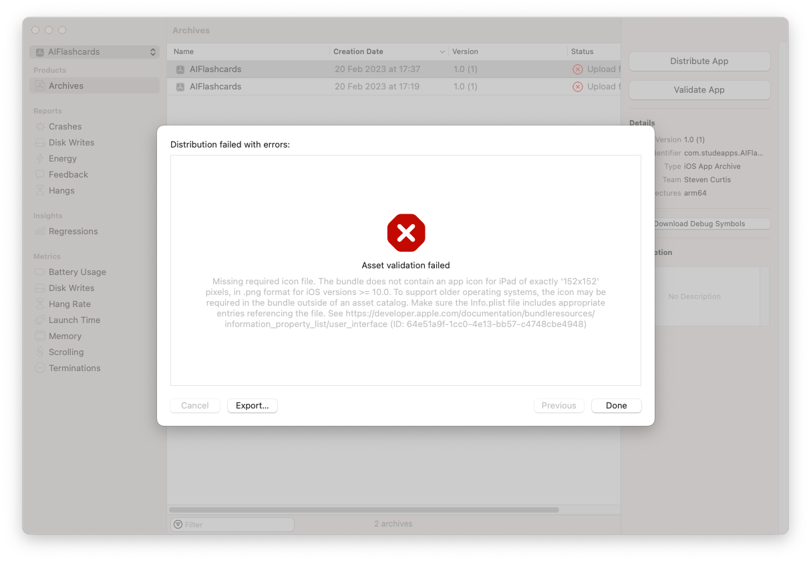 

I then removed support for iPad and MacOS (of course I should). So I remove those, and try again.

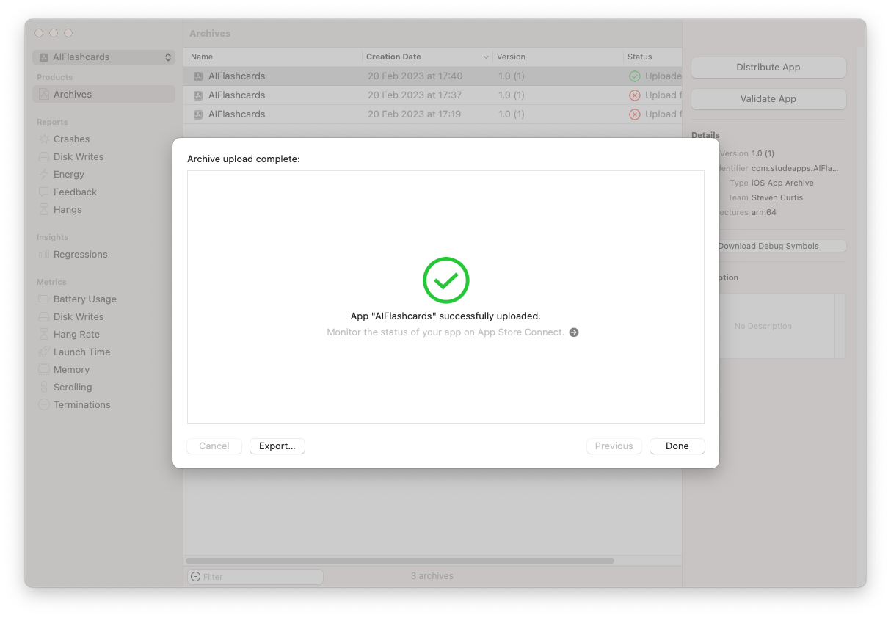 

Yes!
I'll need a screenshot from the simulator, I'll take one and add that to the upload

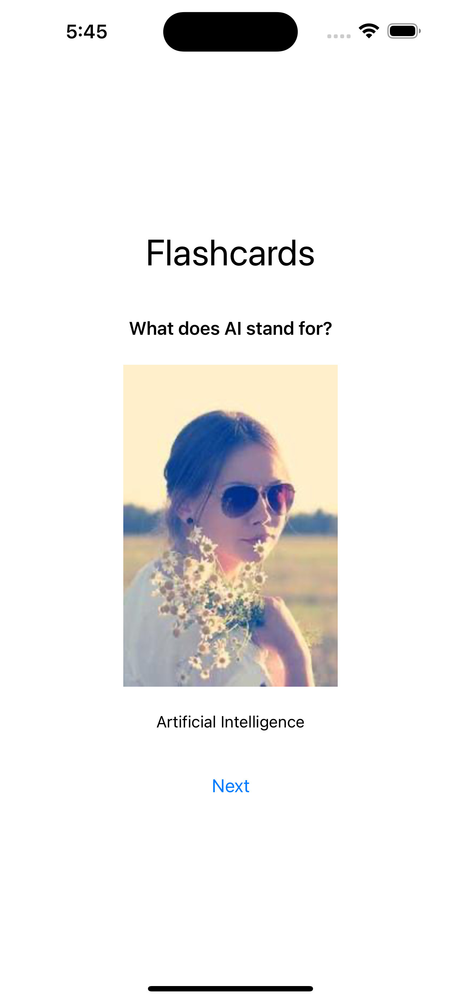 

I click Add for Review, and we are waiting for review!

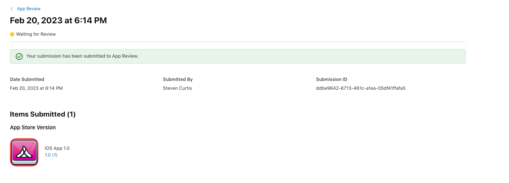 

Let us see whether this submission will make it though! I suspect not!

# Conclusion

Thank you for reading.

Submitting an app to the Apple App Store can be an exciting and nerve-wracking experience. It's important to ensure that your app meets Apple's guidelines and requirements before submitting it for review. This includes having a developer account, creating an app record, uploading your app's binary, providing app icons, and taking a screenshot from the simulator.

While ChatGPT didn't provide much guidance on the specific questions and steps involved in submitting an app to the App Store, there are many resources available online that can provide more detailed information and step-by-step instructions. Apple's developer documentation is a great place to start, as it provides detailed information on the app submission process and requirements.

Once your app has been submitted, it will go through a review process by Apple. This process can take anywhere from a few days to several weeks, depending on the complexity of your app and the volume of apps being reviewed by Apple. If your app is approved, it will be available for download on the App Store. If it is rejected, Apple will provide feedback on the reasons for rejection and what changes need to be made before resubmitting.

Overall, submitting an app to the Apple App Store can be a challenging but rewarding experience. By following Apple's guidelines and requirements, and ensuring that your app meets the needs of your users, you can increase your chances of success and create an app that people love.
