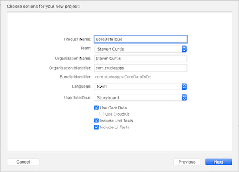

# Core Data basics: Testing
## Yeah, testing is important

<br/>
<sub>Photo by Billy Chester on Unsplash<sub>

# Prerequisites:
* You will be expected to be aware how to make a [Single View Application](https://medium.com/swlh/your-first-ios-application-using-xcode-9983cf6efb71) in Swift
* You'll need to know about the [basics of Core Data](https://medium.com/better-programming/core-data-basics-swift-persistent-storage-ba3185fe7061). 
* You'll find this easier if you know something about [Dependency Injection](https://medium.com/@stevenpcurtis.sc/learning-dependency-injection-using-swift-c94183742187) and [Protocols](https://medium.com/@stevenpcurtis.sc/protocols-in-swift-f46c31283b18), but of course you can read on and find how they are used in this project
* This article does use a custom alertview, but if you want a full guide to that I've written just that [here](https://medium.com/@stevenpcurtis.sc/create-a-custom-uialertview-in-swift-e272a714abd1).

# Terminology
Core Data: A framework that allows you to manage the model layer objects in your application. Core Data does this by being an object graph management and persistence framework.

# Why test?
You should be testing! Right? [TDD](https://medium.com/@stevenpcurtis.sc/test-driven-development-tdd-in-swift-b903b31598b6) has gone from something reserved for the cool kids to something that you should be doing in your personal projects (I wonder if I'll get comments from the Wrong Brigade about this? It's a pity comment, person I'm imagining)

By storing Core Data files there are difficulties in isolating the database from the tests. Each test should be repeatable and it would be quite heavyweight to delete the whole database after every test.

# The example App
I created an App that represents a rather simple ToDo App. The implementation is not all that great - I mean it's using [MVC](https://medium.com/swift-coding/mvc-in-swift-a9b1121ab6f0) for a start, and the less said about the functionality, the better.

Still, this is here to demonstrate *testing* core data. Can it be done, and can we use the principes of [Dependency Injection?](https://medium.com/@stevenpcurtis.sc/learning-dependency-injection-using-swift-c94183742187). SPOILER: You're reading this, so it can!

## The setup
When you create a new project you have the option to add `core data` to your fledgling project. Now certainly with many new things to cope with, like sceneDelegate - I'd advise you to tick that box!

<br/>

This gives the `persistent container` in the `App Delegate` as well as a rather nice `xcdatamodeld` model for you to use nestled in your project.

# The App setup: make it testable with a protocol
This has often been my mantra - use [DI](https://medium.com/@stevenpcurtis.sc/learning-dependency-injection-using-swift-c94183742187) through the use of [Protocols](https://medium.com/@stevenpcurtis.sc/protocols-in-swift-f46c31283b18). In fact this approach mirrors my [Network Manager](https://medium.com/@stevenpcurtis.sc/my-basic-httpmanager-in-swift-db2be1e340c2)


The `protocol` looks like the following:

```swift
public protocol CoreDataManagerProtocol {
    func getTasks() -> [NSManagedObject]
    func save(task: String)
    init()
}
```

Any `class` (and in this example it will be a `class`) that conforms to this `protocol` must be able to return the tasks as an array of `NSManagedObject`, and be able to save a particular task represented by a `String`, as well as having a visible initialiser. 

**The CoreDataManager**
Note: It is temping to use a `Singleton` instance of a core data manager here. However this is *not* the correct strategy as there is only a single instance of the core data stack this is not necessary. Apple's documentation covers passing around a managed object context, and I recommend you too follow this approach in your software.

Therefore...

This  has a rather spectacularly uneventful initialiser. However, `getTasks` provides us with an array of managed objects - but has cached any previous fetch (excuse the lack of error handling here), and save indeed does save using the `func save(task: String)` function to our single context. On to the code!

```swift
class CoreDataManager: CoreDataManagerProtocol {
    private var tasks = [NSManagedObject]()
    private var managedObjectContext: NSManagedObjectContext! = nil
    private var entity: NSEntityDescription! = nil
    
    init (objectContext: NSManagedObjectContext, entity: NSEntityDescription) {
        self.managedObjectContext = objectContext
        self.entity = entity
    }
    
    required init() {
        guard let appDelegate = UIApplication.shared.delegate as? AppDelegate else { return }
        managedObjectContext = appDelegate.persistentContainer.viewContext
        entity = NSEntityDescription.entity(forEntityName: Constants.entityName, in: managedObjectContext)!
    }
    
    func getTasks() -> [NSManagedObject] {
        if tasks.count > 0 {return tasks}
        let fetchRequest = NSFetchRequest<NSManagedObject>(entityName: Constants.entityName)
        do {
            tasks = try managedObjectContext.fetch(fetchRequest)
        } catch let error as NSError {
            print("Could not fetch. \(error), \(error.userInfo)")
        }
        return tasks
    }
    
    func save(task: String) {
        let taskObject = NSManagedObject(entity: entity, insertInto: managedObjectContext)
        taskObject.setValue(task, forKeyPath: Constants.entityNameAttribute)
        do {
            try managedObjectContext.save()
            tasks.append(taskObject)
        } catch let error as NSError {
            print("Could not save. \(error), \(error.userInfo)")
        }
    }
}
```

**The ViewController**
The core of this `UIViewController` instance is about using the core manager (or anything that conforms to that handy `CoreDataManagerProtocol`) to populate the `UITableView` - and here if the `CoreDataManagerProtocol` doesn't return us any tasks then we display a placeholder (note to self: Would be nice to make this animated, wouldn't it?)

```swift
class ViewController: UIViewController {
    @IBOutlet weak var tableView: UITableView!
    var alert: AlertViewController?
    var coreDataManager: CoreDataManagerProtocol?
    
    override public func viewDidLoad() {
        super.viewDidLoad()
        tableView.register(UITableViewCell.self, forCellReuseIdentifier: "Cell")
    }

    @IBAction func addItem(_ sender: Any) {
        alert = UIStoryboard(name: Constants.alertStoryBoard, bundle: nil).instantiateViewController(withIdentifier: Constants.alerts.mainAlert) as? AlertViewController
        alert?.title = "Enter your task"
        alert?.presentToWindow()
        alert?.delegate = self
    }
}

extension ViewController: UITableViewDataSource {
    func tableView(_ tableView: UITableView, numberOfRowsInSection section: Int) -> Int {
        let rows = coreDataManager?.getTasks().count ?? 0
        return (rows == 0 ? 1 : rows)
    }
    
    func tableView(_ tableView: UITableView, cellForRowAt indexPath: IndexPath) -> UITableViewCell {
        let cell = tableView.dequeueReusableCell(withIdentifier: "Cell", for: indexPath)
        guard let tasks = coreDataManager?.getTasks() else {return cell}
        if tasks.count == 0 {
            cell.textLabel?.text = "Press + to enter your task"
            return cell
        }
        let data = coreDataManager?.getTasks()[indexPath.row]
        cell.textLabel?.text = data?.value(forKey: Constants.entityNameAttribute) as? String
        return cell
    }
}
```

Now my method for this particular article is to add the dependencies through dependency injection, here not even using `Storyboards` (sorry!). I'm not particularly proud of this code, but the following does the job:

```swift
final public class ViewControllerFactory
{
    private var coreManagerClass: CoreDataManagerProtocol?
    
    func create(_ dataManager : CoreDataManagerProtocol? = nil) -> ViewController? {
        let vc = UIStoryboard(name: "Main", bundle: nil).instantiateViewController(withIdentifier: "ViewController") as? ViewController
        
        if let dataManager = dataManager {
            vc?.coreDataManager = dataManager
            return vc
        }
        vc?.coreDataManager = CoreDataManager()
        return vc
    }
}
```

# The setup for the tests
Testing in Xcode is lovely, or something. This means that I always need to remind myself to add `@testable import CoreDataToDoTesting` at the top of my test class to give visibility of the main App code.

So within the test case class will need to have it's own `NSPersistentStoreCoordinator`, `NSManagedObjectModel` and `NSManagedObjectModel` (if you'll excuse the force-unwrapping for tests):

```swift
var storeCordinator: NSPersistentStoreCoordinator!
var managedObjectModel: NSManagedObjectModel!
var store: NSManagedObjectModel!
```

Now our tests should be repeatable - that means for each test in the `tearDown()` we need to get rid of anything that is in the `NSPersistentStoreCoordinator`, and that can be done in code using the following:

```swift
override func tearDown() {
    do {
        try storeCordinator.remove(store)
    }
    catch {
        XCTFail("Failed to remove persistent store, \(error)")
    }
}
```
we then set up the `NSPersistentStoreCoordinator` and the `NSManagedObjectModel` which is going to be the same for each and every test

```swift
override func setUp() {
    super.setUp()
    managedObjectModel = NSManagedObjectModel.mergedModel(from: nil)
    storeCordinator = NSPersistentStoreCoordinator(managedObjectModel: managedObjectModel)
    do {
        store = try storeCordinator.addPersistentStore(
            ofType: NSInMemoryStoreType, configurationName: nil, at: nil, options: nil)
    } catch {
        XCTFail("Failed to create a persistent store, \(error)")
    }
}
```

Now the intention around this project is to inject a mock. So, in steps the `CoreDataManagerMock` instance

```swift
class CoreDataManagerMock: CoreDataManagerProtocol {
    var storeCordinator: NSPersistentStoreCoordinator!
    var managedObjectContext: NSManagedObjectContext!
    var managedObjectModel: NSManagedObjectModel!
    var store: NSPersistentStore!
    
    var tasks = [NSManagedObject]()

    required init() {
        managedObjectModel = NSManagedObjectModel.mergedModel(from: nil)
        storeCordinator = NSPersistentStoreCoordinator(managedObjectModel: managedObjectModel)
        managedObjectContext = NSManagedObjectContext(concurrencyType: .mainQueueConcurrencyType)
        managedObjectContext.persistentStoreCoordinator = storeCordinator
    }
   
    func getTasks() -> [NSManagedObject] {
        if tasks.count > 0 {
            return tasks
        }
        do {
            store = try storeCordinator.addPersistentStore(
                ofType: NSInMemoryStoreType, configurationName: nil, at: nil, options: nil)
            
            if tasks.count == 0 {
                let entityOne = NSEntityDescription.insertNewObject(forEntityName: Constants.entityName, into: managedObjectContext)
                entityOne.setValue(false, forKey: Constants.entityCompletedattribute)
                entityOne.setValue("Enter your task from Mock", forKey: Constants.entityNameAttribute)
                tasks.append(entityOne)
            }
        } catch {
            // catch failure here
        }
        return tasks
    }
    
    func save(task: String) {
        let entity = NSEntityDescription.entity(forEntityName: Constants.entityName, in: managedObjectContext)!
        let taskObject = NSManagedObject(entity: entity, insertInto: managedObjectContext)
        taskObject.setValue(false, forKey: Constants.entityCompletedattribute)
        taskObject.setValue(task, forKey: Constants.entityNameAttribute)
        tasks.append(taskObject)
    }
}
```
fantastic! We can now more onto the actual tests themselves!

# The tests
These tests are not intended to be production read, but rather give an indication about how testing can be performed for a core data instance. 

In theory, what we are able to do is swap out the `CoreDataManager` with our mocked version and check to see whether the view controller responds how it is expected to do so.

## Get the task from our mocked CoreDataManager

```swift
func testGetTasks() {
    let CDM = CoreDataManagerMock()
    let viewController = ViewControllerFactory().create(CDM)
    guard let vc = viewController else {
        return XCTFail("Could not instantiate ViewController")
    }
    vc.loadViewIfNeeded()
    vc.tableView?.reloadData()
    let actualCell = viewController?.tableView!.cellForRow(at: IndexPath(row: 0, section: 0) )
    XCTAssertEqual("Enter your task from Mock", actualCell?.textLabel?.text)
}
```
Here the viewcontroller uses the moccked `CoreDataManager`. Now I'm no fan of checking the `UITableViewCell` as this is a user interface element rather than something that should usually be Unit Tested, however this *does* allow us to see whether the first element is displayed from the mock (this is the assertion).

## Get a saved task from our mocked CoreDataManager

```swift
func testAddItem() {
    let CDM = CoreDataManagerMock()
    let viewController = ViewControllerFactory().create(CDM)
    guard let vc = viewController else {
        return XCTFail("Could not instantiate ViewController")
    }
    vc.loadViewIfNeeded()
    vc.tableView?.reloadData()
    vc.textValue(textFieldValue: "add ME!")
    let actualCell = viewController?.tableView!.cellForRow(at: IndexPath(row: 1, section: 0) )
    XCTAssertEqual("add ME!", actualCell?.textLabel?.text)
}
```

This is actually arguably testing the mocked `CoreDataManager` - but in this case I am reasonably certain that the View Controller instance does display the contents of the `CoreDataManager` correctly.

## Use the production CoreDataManager - but inject an entity

```swift
func testCoreDataDependency() {
    let managedObjectContext = NSManagedObjectContext(concurrencyType: .mainQueueConcurrencyType)
    managedObjectContext.persistentStoreCoordinator = storeCordinator
    
    let entity = NSEntityDescription.entity(forEntityName: Constants.entityName, in: managedObjectContext)!
    
    let CDM = CoreDataManager(objectContext: managedObjectContext, entity: entity)
    let viewController = ViewControllerFactory().create(CDM)
    guard let vc = viewController else {
        return XCTFail("Could not instantiate ViewController")
    }
    vc.loadViewIfNeeded()
    vc.tableView?.reloadData()
    
    let actualCell = viewController?.tableView!.cellForRow(at: IndexPath(row: 0, section: 0) )
    XCTAssertEqual("Enter your task", actualCell?.textLabel?.text)
}
```

This approach is not recommended, but it gives you the cance to see how you can inject an entity into the `CoreDataManager`. This is not great to use as we are using the real `CoreDataManager` - so this is dependent on the state of the actual device you are testing on - and this essentially isn't the correct approach to testing. 

# Conclusion
Testing and using [Dependency Injection](https://medium.com/@stevenpcurtis.sc/learning-dependency-injection-using-swift-c94183742187) only really makes sense with concrete examples. 

Equally if we want to test our Core Data implementation it is a good idea to use concrete examples. 

This article had given you just this!


I hope this article has been of help to you, and you can see the code from this is included in the attached [Repo](https://medium.com/r/?url=https%3A%2F%2Fgithub.com%2Fstevencurtis%2FSwiftCoding%2Ftree%2Fmaster%2FAlamofireNetworking) to get the whole lot in one go!

If you've any questions, comments or suggestions please hit me up on [Twitter](https://medium.com/r/?url=https%3A%2F%2Ftwitter.com%2Fstevenpcurtis)
