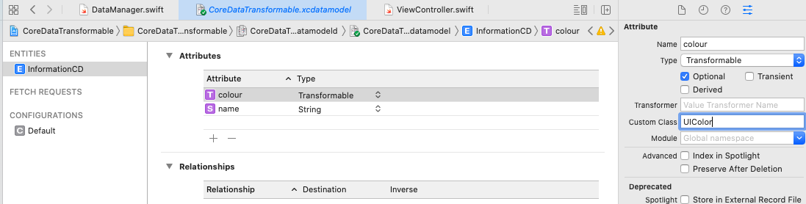
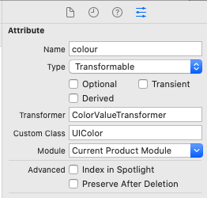

# Transformable Core Data: UIColor
## NEW: Without the Error

<br/>
<sub>Photo by Tobias Fischer on Unsplash<sub>

Difficulty: Beginner | Easy | **Normal** | Challenging

# Prerequisites:
* You will be expected to be aware how to make a [Single View Application](https://medium.com/swlh/your-first-ios-application-using-xcode-9983cf6efb71) in Swift
* You’ll need to know about the [basics of Core Data](https://medium.com/better-programming/core-data-basics-swift-persistent-storage-ba3185fe7061)
* Core Basics [testing](https://medium.com/@stevenpcurtis.sc/core-data-basics-testing-39d127380680)

# Terminology:
Core Data: A framework that allows you to manage the model layer objects in your application. Core Data does this by being an object graph management and persistence framework.

## The Aim
Imagine that you want to store data types that are not are not in the limited types that *Core Data* can usually store.

We're going to store *transformable attributes* - but if you follow many of the guides online you'll get an annoying warning about `NSKeyedUnarchiveFromData`, and this implementation avoids just that!

I'm using the same [basic Core Data Manager](https://medium.com/@stevenpcurtis.sc/core-data-basics-testing-39d127380680) that I've previously used, with some minor adjustments.

# The implementation

*The excuses*
This doesn't use [MVVM](https://github.com/stevencurtis/MVVM-CDependency) or whatever -t his is wholly about Core Data. I hope this doesn't upset the reader too much!

*Removing repeated values in Core Data*
When we save an object (and this object is only going to contain a `String` and a `UIColor`) we will make sure that there isn't an object with the same name. This can be performed with an [NSPredicate](https://medium.com/@stevenpcurtis.sc/nspredicate-with-core-data-328d9a6dd66c), which will check to see whether there is any data already in the `Core Data` store.

```swift
func save(name: String, color: UIColor, completion: @escaping  ( ()-> Void) ) {
    managedObjectContext.perform {
        
        // Only add each entity a single time
        let fetchRequest = NSFetchRequest<NSFetchRequestResult>(entityName: Constants.entityName)
        fetchRequest.predicate = NSPredicate(format: "name = '\(name)'", argumentArray: [Constants.nameAttribute])

        if let res = try? self.managedObjectContext.fetch(fetchRequest) {
            if res.count > 0 {
                completion()
                return
            }
        }
        
        // Add the single item
        let taskObject = NSManagedObject(entity: self.entity, insertInto: self.managedObjectContext)
        taskObject.setValue(name, forKeyPath: Constants.nameAttribute)
        taskObject.setValue(color, forKeyPath: Constants.colorAttribute)

        self.saveContext(completion: {
            completion()
        })
    }
}
```

which is nestled nicely in my `DataManager` - although I'd usually use Unique constraints do do such things in `Core Data`. 

**Transformable in the Entity**
We have a rather simple set of attributes for the entity, but 

With CodeGen Class Generation we set the following for the colour attribute


Note that the colour is set to **Transformable**, but we also set up a Transformer and Custom Class.

**Setup the CreateNSManagedObjectSubclass**
Xcode helps us out with setting up a `CreateNSManagedObjectSubclass`, and we can do so with the following:

You'll note that InformationCD has a `UIColor` there, which is great!

Now we also need to create...

**Create a ColorValueTransformer class**
We can create a new class, and this is a `NSSecureUnarchiveFromDataTransformer`
```swift
@objc(UIColorValueTransformer)
final class ColorValueTransformer: NSSecureUnarchiveFromDataTransformer {

    static let name = NSValueTransformerName(rawValue: String(describing: ColorValueTransformer.self))

    override static var allowedTopLevelClasses: [AnyClass] {
        return [UIColor.self]
    }

    public static func register() {
        let transformer = ColorValueTransformer()
        ValueTransformer.setValueTransformer(transformer, forName: name)
    }
}
```

which also must be registered in the `AppDelegate`

```swift
private let transformer: Void = {
    ColorValueTransformer.setValueTransformer(ColorValueTransformer(), forName: NSValueTransformerName(rawValue: "ColorValueTransformer"))
}()
```

which must be placed within the class, not in a function.

**Running it**
I've created a way to run this from the data manager user a closure (there are other ways of doing this...but here is my quick solution):

```swift
dataManager?.save(name: "Test Name", color: UIColor.blue, completion: { [weak self] in
    let pairs = try! self?.dataManager?.getManagedObjects()
    let colour = pairs!.map{ ($0.value(forKey: Constants.colorAttribute) ) as! UIColor }.first!
    self?.view.backgroundColor = colour
})
```

# Conclusion
Doing this stuff is important - and avoiding the annoying `'NSKeyedUnarchiveFromData' should not be used to for un-archiving and will be removed in a future release.` error is important - and you can also do this stuff to avoid having to explain to your boss why you're no good...

I hope this article helps you understand the possible solution.

 If you've any questions, comments or suggestions please hit me up on [Twitter](https://twitter.com/stevenpcurtis) 
