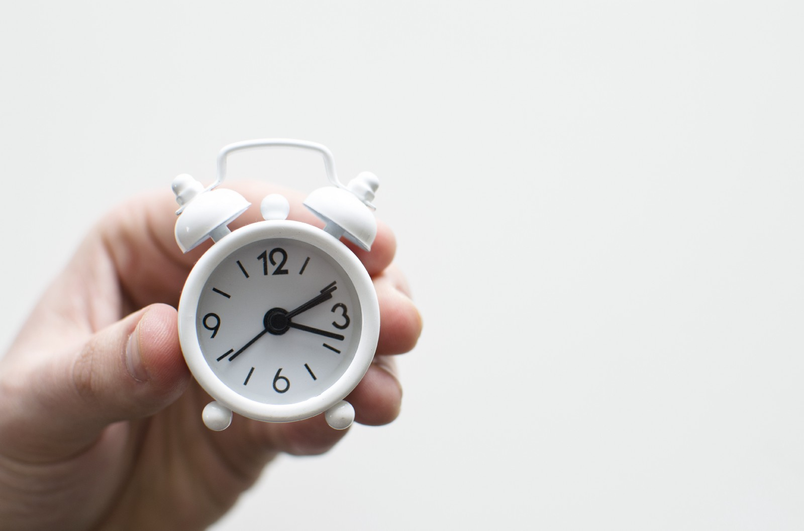
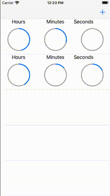
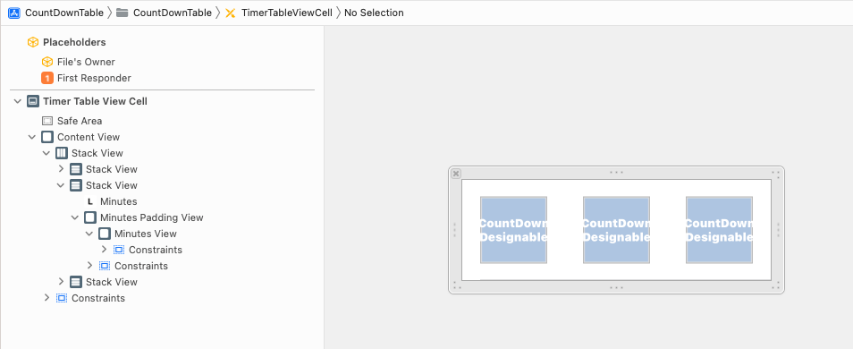
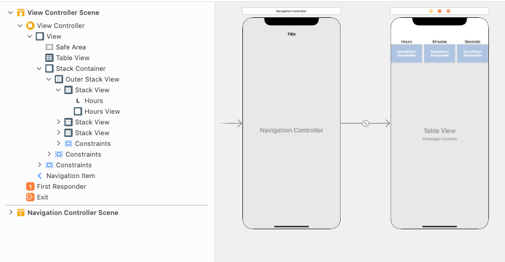

# Create Loads of CountDown Timers in iOS Swift
## In a UITableView!

<br/>
<sub>Photo by Lukas Blazek on Unsplash<sub>

# Before we start

## Prerequisites:
* You will be expected to be aware how to make a [Single View Application](https://medium.com/swlh/your-first-ios-application-using-xcode-9983cf6efb71) in Swift
* This solution uses [UITableView](https://medium.com/@stevenpcurtis.sc/the-hidden-workings-of-uitableview-73feb60a13c3) as well as [closures](https://medium.com/swift-coding/swift-closures-c14cb7aa2170) and (UIBézierPaths)[https://medium.com/@stevenpcurtis.sc/b%C3%A9zier-path-and-curves-using-core-graphics-268fbb77dd80]

# What this article is about, and what it isn't about
This article is about creating a timer and displaying the result - in a `UITableViewCell`.



This isn't an article about architecture, everything is nestled within the `UIViewController` although I've plenty of articles about [MVVM-C](https://medium.com/@stevenpcurtis.sc/mvvm-c-architecture-with-dependency-injection-testing-3b7197eb2e4d) and other architectures if you're interested.

## The countdown timer UIView subclass
At the heart of this solution is a countdown timer. We require some way to communicate that the **animation** will have finished (so `CATransaction.setCompletionBlock` will call a closure provided but the `UITableViewCell` subclass). 

The inner circle will only be set from a function `func update(time: TimeUnits, units: CGFloat, animate: Bool = false)`, which means potentially these timers could be set and reset at any time (nice!).

```swift
@IBDesignable class CountDown: UIView {

    override init(frame: CGRect) {
        super.init(frame: frame)
    }
    
    required init?(coder aDecoder: NSCoder) {
        super.init(coder: aDecoder)
    }
    
    convenience init(frame: CGRect, minutes: CGFloat) {
        self.init(frame: frame)
        self.minutes = minutes
    }

    @IBInspectable
    var seconds: CGFloat = 0 {
        didSet {
            update(time: .seconds, units: seconds, animate: true)
        }
    }
    
    @IBInspectable
    var minutes: CGFloat = 0 {
        didSet {
            update(time: .minutes, units: minutes, animate: true)
        }
    }
    
    @IBInspectable
    var hours: CGFloat = 0 {
        didSet {
            update(time: .hours, units: hours, animate: true)
        }
    }
    
    let shapeLayer = CAShapeLayer()
    var animationClosure: (() -> ())?

    enum TimeUnits {
        case hours
        case minutes
        case seconds
    }
    
    override func draw(_ rect: CGRect) {
        let shapeLayerCircle = CAShapeLayer()
        shapeLayerCircle.path = drawArc(
            startAngle: 0,
            endAngle: CGFloat.pi * 2).cgPath
        
        let halfSize = min( bounds.size.width / 2, bounds.size.height / 2)
        let radius = CGFloat( halfSize - ( 1 / 2) )

        shapeLayerCircle.strokeColor = UIColor.lightGray.cgColor
        shapeLayerCircle.fillColor = UIColor.clear.cgColor
        shapeLayerCircle.lineWidth = 3.0
        shapeLayerCircle.position = CGPoint(
            x: -((radius * 2) - rect.width) / 2,
            y: 0)
        self.layer.addSublayer(shapeLayerCircle)
    }

    func update(time: TimeUnits, units: CGFloat, animate: Bool = false) {
        var duration: CGFloat
        var divisor: CGFloat = 6
        var units = units

        switch time {
        case .hours:
            duration = units * 60 * 60
            divisor = 6
            units = units * 2.5
        case .minutes:
            duration = units * 60
            divisor = 6
        case .seconds:
            duration = units
            divisor = 6
        }

        let halfSize: CGFloat = min( bounds.size.width / 2, bounds.size.height / 2)
        let radius = CGFloat( halfSize - ( 1 / 2) )

        shapeLayer.path = drawArc(
            startAngle: (3 * CGFloat.pi) / 2,
            endAngle: CGFloat( (units * divisor) * CGFloat.pi / 180 ) - CGFloat.pi / 2).cgPath
        shapeLayer.strokeColor = UIColor.link.cgColor
        shapeLayer.fillColor = UIColor.clear.cgColor
        shapeLayer.lineWidth = 3.0
        shapeLayer.position = CGPoint(
            x: -((radius * 2) - self.bounds.width) / 2,
            y: 0)
        
        self.layer.addSublayer(shapeLayer)
        
        // ensure this layer is forwards of the grey circle layer
        shapeLayer.zPosition = 1

        if animate {
            CATransaction.begin()
            let animation = CABasicAnimation(keyPath: "strokeEnd")
            animation.fillMode = CAMediaTimingFillMode.forwards
            animation.isRemovedOnCompletion = false
            animation.toValue = 0.0
            animation.duration = CFTimeInterval(duration)

            CATransaction.setCompletionBlock {
                if let closure = self.animationClosure {
                    closure()
                }
            }

            shapeLayer.add(animation, forKey: "myStroke")
            CATransaction.commit()
        }
    }
    
    private func drawArc(startAngle: CGFloat, endAngle: CGFloat) -> UIBezierPath {
        let halfSize: CGFloat = min( bounds.size.width / 2, bounds.size.height / 2)
        let desiredLineWidth: CGFloat = 1
        
        let circlePath = UIBezierPath(
            arcCenter: CGPoint(x: halfSize, y: halfSize),
            radius: CGFloat( halfSize - ( desiredLineWidth / 2) ),
            startAngle: startAngle,
            endAngle:endAngle,
            clockwise: true)
        return circlePath
    }
}
```

The whole class is `@IBDesignable` to allow the circles to be displayed in the `UITableViewCell`, however this isn't intended to be a production-ready example and this is only here to **demonstrate** this feature rather than being something that has a current practical usage.

The cell isn't too interesting, here I'm using closures to update the view (hmm) although I guess at least it works?

```swift
class TimerTableViewCell: UITableViewCell {
    @IBOutlet weak var hoursView: CountDown!
    @IBOutlet weak var minutesView: CountDown!
    @IBOutlet weak var secondsView: CountDown!
    
    var secondsClosure: (() -> ())?
    var minutesClosure: (() -> ())?
    var hoursClosure: (() -> ())?
    
    override func awakeFromNib() {
        super.awakeFromNib()
        secondsView.animationClosure = {
            if let seconds = self.secondsClosure {
                seconds()
            }
        }
        minutesView.animationClosure = {
            if let minutes = self.minutesClosure {
                minutes()
            }
        }
        
        hoursView.animationClosure = {
            if let hours = self.hoursClosure {
                hours()
            }
        }
    }
}
```



There is some meat on the bone in the view controller.

```swift
class ViewController: UIViewController {
    
    @IBOutlet weak var hoursView: CountDown!
    @IBOutlet weak var minutesView: CountDown!
    @IBOutlet weak var secondsView: CountDown!
    @IBOutlet weak var chooseStack: UIStackView!
    @IBOutlet weak var stackContainer: UIView!
    
    var times: [(hours: Int, minutes: Int, seconds: Int)] = []
    
    var hour: Int = 0
    var minutes: Int = 0
    var seconds: Int = 0
    
    var pickerView: UIView!
    var picker: UIPickerView!
    
    @IBOutlet weak var tableView: UITableView!
    
    @IBAction func chooseTimeAction(_ sender: UIButton) {
        appearPickerView()
    }
    
    func appearCurrentChoice() {
        UIView.animate(withDuration: 0.3, animations: {
            self.chooseStack.frame = CGRect(
                x: 0,
                y: (self.navigationController?.navigationBar.frame.height ?? 0)
                + self.chooseStack.bounds.size.height,
                width: self.chooseStack.bounds.size.width,
                height: self.chooseStack.bounds.size.height
            )
            self.stackContainer.alpha = 1
        })
    }
    
    func disappearCurrentChoice() {
        UIView.animate(withDuration: 0.3, animations: {
            self.chooseStack.frame = CGRect(
                x: 0,
                y: ((self.navigationController?.navigationBar.frame.height ?? 0)
                - self.chooseStack.bounds.size.height),
                width: self.chooseStack.bounds.size.width,
                height: self.chooseStack.bounds.size.height
            )
            self.stackContainer.alpha = 0
        })
    }
    
    func appearPickerView() {
        UIView.animate(withDuration: 0.3, animations: {
            self.pickerView.frame = CGRect(x: 0, y: self.view.bounds.height - self.pickerView.bounds.size.height, width: self.pickerView.bounds.size.width, height: self.pickerView.bounds.size.height)
            self.tableView.alpha = 0.1
        })
    }
    
    func disappearPickerView() {
        UIView.animate(withDuration: 0.3, animations: {
            self.pickerView.frame = CGRect(x: 0, y: self.view.bounds.height, width: self.pickerView.bounds.size.width, height: self.pickerView.bounds.size.height)
            self.tableView.alpha = 1.0
        })
        
        picker.selectRow(0, inComponent: 0, animated: false)
        picker.selectRow(0, inComponent: 1, animated: false)
        picker.selectRow(0, inComponent: 2, animated: false)
    }
    
    @objc func action() {
        disappearPickerView()
        
        // update the sample view
        hoursView.update(time: .hours, units: CGFloat(0))
        minutesView.update(time: .minutes, units: CGFloat(0))
        secondsView.update(time: .seconds, units: CGFloat(0))
        disappearCurrentChoice()
        
        times.append((hour,minutes,seconds))
        tableView.reloadData()
        
        view.endEditing(true)
    }
    
    override func viewDidLoad() {
        super.viewDidLoad()
        
        pickerView = UIView(frame: CGRect(x: 0, y: view.frame.height + 260, width: view.frame.width, height: 260))
        
        self.view.addSubview(pickerView)
        
        pickerView.translatesAutoresizingMaskIntoConstraints = false
        
        NSLayoutConstraint.activate([
            pickerView.widthAnchor.constraint(equalTo: self.view.widthAnchor),
            pickerView.bottomAnchor.constraint(equalTo: self.view.bottomAnchor, constant: 260),
            pickerView.heightAnchor.constraint(equalToConstant: 260)
        ])
        
        pickerView.backgroundColor = .white
        
        picker = UIPickerView(frame: CGRect(x: 0, y: 0, width: view.frame.width, height: 260))
        pickerView.addSubview(picker)
        
        let toolBar = UIToolbar(frame: CGRect(x: 0, y: 0, width: UIScreen.main.bounds.width, height: 35))
        toolBar.sizeToFit()
        let button = UIBarButtonItem(title: "Done", style: .plain, target: self, action: #selector(self.action))
        toolBar.setItems([button], animated: true)
        toolBar.isUserInteractionEnabled = true
        picker.isUserInteractionEnabled = true
        pickerView.addSubview(toolBar)
        
        picker.delegate = self
        picker.dataSource = self
        
        navigationItem.rightBarButtonItem = UIBarButtonItem(barButtonSystemItem: .add, target: self, action: #selector(addTapped))
        
        let cellNib = UINib(nibName: "TimerTableViewCell", bundle: nil)
        tableView.register(cellNib, forCellReuseIdentifier: "cell")
        
        tableView.estimatedRowHeight = 120
        tableView.delegate = self
        tableView.dataSource = self
    }
    
    @objc func addTapped() {
        appearPickerView()
        appearCurrentChoice()
    }
}

extension ViewController: UIPickerViewDelegate, UIPickerViewDataSource {
    func numberOfComponents(in pickerView: UIPickerView) -> Int {
        return 3
    }
    
    func pickerView(_ pickerView: UIPickerView, numberOfRowsInComponent component: Int) -> Int {
        switch component {
        case 0:
            return 24
        case 1, 2:
            return 60
        default:
            return 0
        }
    }
    
    func pickerView(_ pickerView: UIPickerView, widthForComponent component: Int) -> CGFloat {
        return pickerView.frame.size.width / 3
    }
    
    func pickerView(_ pickerView: UIPickerView, titleForRow row: Int, forComponent component: Int) -> String? {
        switch component {
        case 0:
            return "\(row) Hour"
        case 1:
            return "\(row) Minute"
        case 2:
            return "\(row) Second"
        default:
            return ""
        }
    }
    func pickerView(_ pickerView: UIPickerView, didSelectRow row: Int, inComponent component: Int) {
        switch component {
        case 0:
            hour = row
            hoursView.update(time: .hours, units: CGFloat(hour), animate: false)
        case 1:
            minutes = row
            minutesView.update(time: .minutes, units: CGFloat(minutes), animate: false)
        case 2:
            seconds = row
            secondsView.update(time: .seconds, units: CGFloat(seconds), animate: false)
        default:
            break
        }
    }
}

extension ViewController: UITableViewDataSource, UITableViewDelegate {
    func tableView(_ tableView: UITableView, numberOfRowsInSection section: Int) -> Int {
        return times.count
    }
    
    func tableView(_ tableView: UITableView, heightForRowAt indexPath: IndexPath) -> CGFloat {
        return 120
    }
    
    func tableView(_ tableView: UITableView, cellForRowAt indexPath: IndexPath) -> UITableViewCell {
        if let cell = tableView.dequeueReusableCell(withIdentifier: "cell", for: indexPath) as? TimerTableViewCell {
            cell.hoursView.update(time: .hours, units: CGFloat(times[indexPath.row].hours), animate: true)
            cell.minutesView.update(time: .minutes, units: CGFloat(times[indexPath.row].minutes), animate: true)
            cell.secondsView.update(time: .seconds, units: CGFloat(times[indexPath.row].seconds), animate: true)
            
            cell.secondsClosure = {
                print ("seconds finished ViewController")
                // update the view
            }
            return cell
        }
        fatalError("Could not dequeue cell")
    }
}
```

Setting up the picker view and defining the subviews (and updating them?). Really no problem for me (it seems)!

Setting up the picker view and defining the subviews (and updating them?). Really no problem for me (it seems)!
Did I really use the storyboard for the chooser view. Seems I really did!

<br>

If you're after the code, get it from right here: https://github.com/stevencurtis/SwiftCoding/tree/master/CountDownTable

# Conclusion

I hope this article has been of help to you, and you can see the code from this is included in the attached [Repo](https://github.com/stevencurtis/SwiftCoding/tree/master/CountDownTable) to get the whole lot in one go!

CountDownTable

If you've any questions, comments or suggestions please hit me up on [Twitter](https://medium.com/r/?url=https%3A%2F%2Ftwitter.com%2Fstevenpcurtis)
