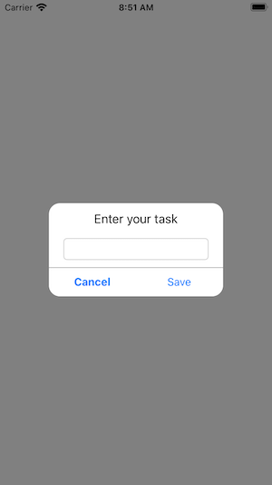
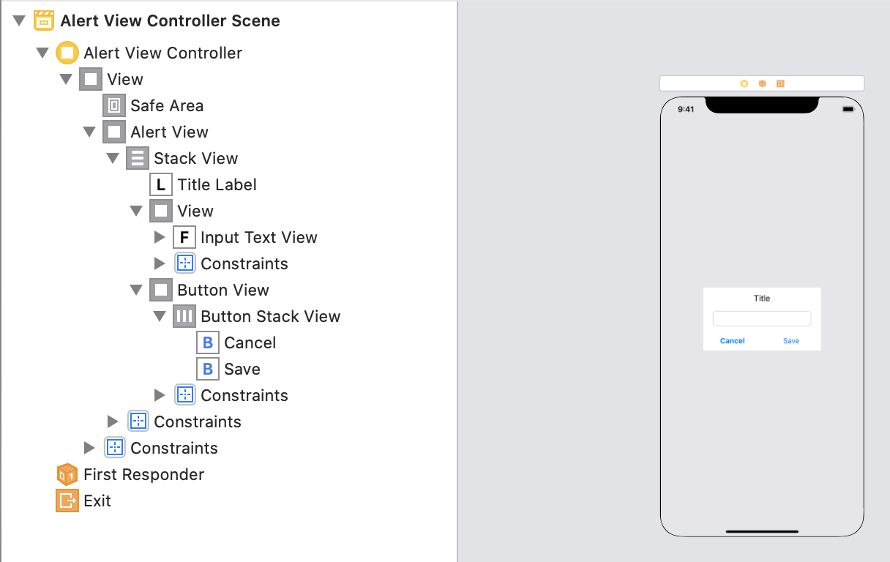

# Create a Custom UIAlertView in Swift
## Design it yourself!

<br/>
<sub>Photo by Ralph (Ravi) Kayden on Unsplash<sub>

# Prerequisites:
* You will be expected to be aware how to make a [Single View Application](https://medium.com/swlh/your-first-ios-application-using-xcode-9983cf6efb71) in Swift
* It would be useful to be familar with [UIStackView](https://medium.com/@stevenpcurtis.sc/uistackview-in-ios-7ea4617c99a5)
* I connected [storyboard objects to code](https://medium.com/@stevenpcurtis.sc/connect-storyboard-objects-to-code-4105f9b99bba), and used [delegation](https://medium.com/@stevenpcurtis.sc/delegation-in-swift-6b416bc0277c) within this solution

# Terminology
UIWindow: The basic container for an application's content on screen. iOS Apps usually have one (not always (there can be more than one), that is, usually)

# This project
This is a project that creates a custom `UIView` that is:
* Customizable
* Locks the user interface

The second of these is especially important as when the `UIView` is displayed it is good practice to prevent a user from being able to interact with the underlying interface - they should only be able to interact with the alert itself!

<br/>

# The approach
A new `storyboard` has been created to store the interface of the alert. I placed a `UIStackView` into the view to make adding further buttons possible 

<br/>

Both buttons have an [outlet from the storyboard](https://medium.com/@stevenpcurtis.sc/connect-storyboard-objects-to-code-4105f9b99bba), so then can be accessed from `AlertViewController.swift`.

The `UITextView` is more of an example than anything else, giving us a reason to copy the text back from the presented view to the host `UIViewController` - but there are plenty of uses for this (a search, for instance).

Because in this case I've set up the interface using the `storyboard` it isn't too interesting (take a look at the [repo](https://github.com/stevencurtis/SwiftCoding/tree/master/CustomAlertView) for the implementation).

## Conforming to a delegate
The custom `AlertViewController` will conform to a delegate called `AlertsDelegate`:

```swift
protocol AlertsDelegate {
    func textValue(textFieldValue: String)
}
```
The idea of this being that we can pass the `String` value back to the presenting `ViewController`.

This of course means that we need to have an `AlertsDelegate` property within the `AlertViewController` 

```swift
var delegate : AlertsDelegate?
```
which can then be called later (I've called it from `func textViewDone(_ sender: UITextField)
`, for example dragged from the [storyboard outlet ](https://medium.com/@stevenpcurtis.sc/connect-storyboard-objects-to-code-4105f9b99bba))
which can then be called:

```swift
@IBAction func textViewDone(_ sender: UITextField) {
    delegate?.textValue(textFieldValue: inputTextView.text ?? "")
    sender.resignFirstResponder()
}
```
and of course the caller `UIViewController` needs to conform to the delegate, I have done so using an [`extension`](https://medium.com/@stevenpcurtis.sc/extensions-in-swift-68cfb635688e) to keep the code together and as some people would say, "clean"

```swift
extension ViewController: AlertsDelegate {
    func textValue(textFieldValue: String) {
        // use the String
    }
}
```

Then I decided to remove this custom view from the superview by using `self.view.removeFromSuperView()` which can be implemented using the following:

```swift
@IBAction func cancelButtonPressed(_ sender: UIButton) {
    self.view.removeFromSuperview()
}
```

## Present the ViewController to the Window 
However we are adding the `AlertViewController` to the `UIWindow`, which means that we can lock the interface.

```swift
extension AlertViewController {
    func presentToWindow() {
        guard let window = UIApplication.shared.windows.filter({$0.isKeyWindow}).first else {fatalError("Called before Windows setup")}
        let newFrame = CGRect(x: 0, y: 0, width: window.frame.width, height: window
            .frame.height)
        self.view.frame = newFrame
        window.addSubview(self.view)
    }
}
```
The [guard](https://medium.com/@stevenpcurtis.sc/precondition-assert-fatal-error-or-guard-in-your-swift-code-5f9297658be0) statement makes sure that the window is avaliable before we try to add the view - now however the  [fatalError](https://medium.com/@stevenpcurtis.sc/precondition-assert-fatal-error-or-guard-in-your-swift-code-5f9297658be0) will throw an error in any case (perhaps meaning that there is an argument that there is no real point in prodicing this `fatalError` as the App would crash at this point in any case).

## Adding the custom alert from the host view controller
This can be a little tricky - since the following code is added (in my implementation) in the `func viewDidAppear(_ animated: Bool)` function. The reason for this is that the `UIWindow` needs to be setup, and this can only be guarenteed after the full interface is visible to the user. 

This is acceptable since an alert will usually be presented to the user according to some user action - which can only take place once the host view controller is visible to the user

```swift
alert = UIStoryboard(name: Constants.alertStoryBoard, bundle: nil).instantiateViewController(withIdentifier: Constants.alerts.mainAlert) as? AlertViewController
alert?.title = "Enter your task"
alert?.presentToWindow()
alert?.delegate = self
```

# Other files
There aren't too many other files here. The `Constants.swift` file contains some colours here but not that much more.

# Beware
I have changed the colours in the `AlertViewController.swift` file, so if you change them in `Alerts.storyboard` they may not reflect unless you change the code in the former.

But please, do, aways remember: take care of your user interface as your users take care of you.

# Conclusion
Taking care of the interface is really important, and alert view is one of those. But how can you make such a view entirely custom?

This article has given you some indication of how you can create such a custom view, and I hope this gives you some idea of how to do just that and how you can progress in your own project. 
Good luck!

I hope this article has been of help to you, and you can see the code from this is included in the attached [Repo](https://medium.com/r/?url=https%3A%2F%2Fgithub.com%2Fstevencurtis%2FSwiftCoding%2Ftree%2Fmaster%2FAlamofireNetworking) to get the whole lot in one go!

If you've any questions, comments or suggestions please hit me up on [Twitter](https://medium.com/r/?url=https%3A%2F%2Ftwitter.com%2Fstevenpcurtis)

