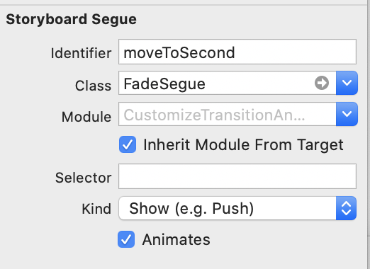
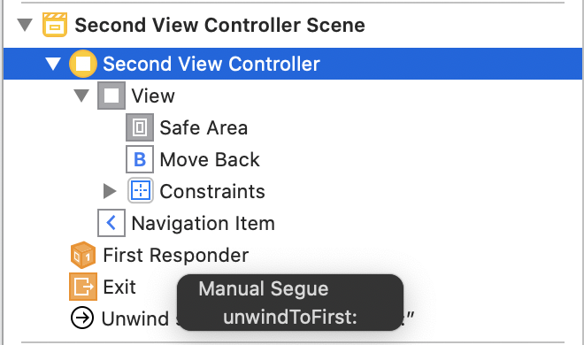

# Custom UIViewController Animations - EASY
## A nice little guide for you

<br/>
<sub>Photo by Hello I'm Nik 🎞 on Unsplash<sub>

Difficulty: Beginner | Easy | **Normal** | Challenging

If you want to have custom transitions between your view controllers, this is the article for you! Equally the repo might [help you out](https://github.com/stevencurtis/SwiftCoding/tree/master/CustomizeTransitionAnimations)

# Prerequisites:
* You will need to be familar with the basics of [Swift and able to start a Playground (or similar)](https://medium.com/@stevenpcurtis.sc/coding-in-swift-playgrounds-1a5563efa089)
* You can follow along with how to create [segues here:](https://medium.com/@stevenpcurtis.sc/segues-in-swift-8a7933c1242c)


# Terminology:
Transition animation: The animation that is displayed while a ViewController is displayed with `PUSH`, `POP` or other transitions

# The theory
## Transitioning Delegate:
We start an animation (which is often triggered with a `segue`. When you present or dismiss a `UIViewController`, `UIKit` asks the transitioning delegate `UIViewControllerTransitioningDelegate` for the animation controller to use. 

## Animation Controller:
`UIViewControllerAnimatedTransitioning` is returned from the `UIViewControllerTransitioningDelegate` from the `public func animationController(forPresented presented: UIViewController, presenting: UIViewController, source: UIViewController) -> UIViewControllerAnimatedTransitioning?` function. 

# The steps
* A transaction is triggered, typically be a transition
* `UIKit` asks the `segue` for the transitioning delegate
* The transitioning delegate uses  `public func animationController(forPresented presented: , presenting: , source: ) -> UIViewControllerAnimatedTransitioning?`  for the animation
* `UIKit` constructs the transitioning context
* `UIKit` uses `animateTransition(using:)` to perform the animation
* The animation constroller calls `completeTransition(_:)`


# A custom segue
## Through the Storyboard
The segue needs to be created with it's own class, and also the segue needs to be set in the `Storyboard`.

```swift
class FadeSegue: UIStoryboardSegue {
    private var selfRetainer: FadeSegue? = nil

    override func perform() {
        destination.transitioningDelegate = self
        selfRetainer = self
        destination.modalPresentationStyle = .overCurrentContext
        source.present(destination, animated: true, completion: nil)
    }
}

extension FadeSegue: UIViewControllerTransitioningDelegate {
    public func animationController(forPresented presented: UIViewController, presenting: UIViewController, source: UIViewController) -> UIViewControllerAnimatedTransitioning? {
        return Presenter()
    }
    
    public func animationController(forDismissed dismissed: UIViewController) -> UIViewControllerAnimatedTransitioning? {
        selfRetainer = nil
        return Dismisser()
    }
    
    private class Presenter: NSObject, UIViewControllerAnimatedTransitioning {
        func transitionDuration(using transitionContext: UIViewControllerContextTransitioning?) -> TimeInterval {
            return 1.5
        }
        
        func animateTransition(using transitionContext: UIViewControllerContextTransitioning) {
            guard
                let toViewController = transitionContext.viewController(forKey: .to)
            else {
                return
            }
            transitionContext.containerView.addSubview(toViewController.view)
            toViewController.view.alpha = 0

            let duration = self.transitionDuration(using: transitionContext)
            UIView.animate(withDuration: duration, animations: {
                toViewController.view.alpha = 1
            }, completion: { _ in
                transitionContext.completeTransition(!transitionContext.transitionWasCancelled)
            })
        }
    }
    
    private class Dismisser: NSObject, UIViewControllerAnimatedTransitioning {
        func transitionDuration(using transitionContext: UIViewControllerContextTransitioning?) -> TimeInterval {
            return 0.2
        }
        
        func animateTransition(using transitionContext: UIViewControllerContextTransitioning) {
            let container = transitionContext.containerView
            let fromView = transitionContext.view(forKey: .from)!
            UIView.animate(withDuration: 0.2, animations: {
                fromView.frame.origin.y += container.frame.height - fromView.frame.minY
            }) { (completed) in
                transitionContext.completeTransition(completed)
            }
            
        }
    }
}
```

<br/>

The `Segue` to the next `UIViewController` is performed with the following code in the `FirstViewController.swift` file.

```swift
    @IBAction func goToSecondVC(_ sender: UIButton) {
        performSegue(withIdentifier: "moveToSecond", sender: nil)
    }

    override func prepare(for segue: UIStoryboardSegue, sender: Any?) {
        if segue.identifier == "moveToSecond" {
            if let destination = segue.destination as? SecondViewController {
                destination.dataSent = "This is being sent"
            }
        }
    }
```

Here of course we are using a property on the `SecondViewController`, this is only necessary if you actually want to pass data to one of the other `UIViewController` classes within your project!

**Unwinding from the `UIViewController`**

In the destination view controller, that is `FirstViewController` in this example, we set up an `@IBAction` like the following:
```swift
    @IBAction func unwindToFirst( _ seg: UIStoryboardSegue) {
    }
```
This gives us the opportunity to use the unwind segue in order to return back to the `FirstViewController`, which is done in the Storyboard by Control-dragging from the Second View Controller to Exit. This looks something like the following:

<br/>

Where the unwind segue can be chosen - `unwindToFirst` would be the option we would choose there. 

## Creating the transition programatically
Here we can transition programatically, however we need to create a reference for `UIViewControllerTransitioningDelegate` in the `UIViewController`

```swift
    let transitionDelegate: UIViewControllerTransitioningDelegate = TransitionDelegate()
    
    @IBAction func goToSecondVCProgramatically(_ sender: UIButton) {
        if let vc = UIStoryboard(name: "Main", bundle: nil).instantiateViewController(withIdentifier: "SecondViewController") as? SecondViewController
        {
            present(vc, animated: true, completion: nil)
        }
    }
```

Where the following `TransitionDelegate` is used:
```swift
class TransitionDelegate: NSObject, UIViewControllerTransitioningDelegate {
    
    func animationController(forPresented presented: UIViewController, presenting: UIViewController, source: UIViewController) -> UIViewControllerAnimatedTransitioning? {
        return FadeAnimator()
    }
    
    func animationController(forDismissed dismissed: UIViewController) -> UIViewControllerAnimatedTransitioning? {
        return FadeAnimator()
    }
}
```

Which of course implies that we have the `SecondViewController` in the Storyboard, and have added `SecondViewController` as a Storyboard ID.

# A custom segue
## Through the Stroyboard

The `ThirdViewController` is embedded in a `UINavigationController`. This uses a `UINavigationControllerDelegate`:

```swift
extension ThirdViewController: UINavigationControllerDelegate {
    func navigationController(_ navigationController: UINavigationController,
                              animationControllerFor operation: UINavigationController.Operation,
                              from fromVC: UIViewController,
                              to toVC: UIViewController) -> UIViewControllerAnimatedTransitioning? {
        return FadeAnimator()
    }
}
```

Which is used as the segue is run through the storyboard - however, it should be noted that no custom segue is used, rather the  `FadeAnimator()` is used as defined here:

```swift
class FadeAnimator: NSObject, UIViewControllerAnimatedTransitioning {
    func transitionDuration(using transitionContext: UIViewControllerContextTransitioning?) -> TimeInterval {
        return 1.5
    }
    
    func animateTransition(using transitionContext: UIViewControllerContextTransitioning) {
        let containerView = transitionContext.containerView
        let toView = transitionContext.view(forKey: .to)!
        
        containerView.addSubview(toView)
        toView.alpha = 0.0
        UIView.animate(withDuration: 1.5,
                       animations: {
                        toView.alpha = 1.0
        },
                       completion: { _ in
                        transitionContext.completeTransition(true)
        }
        )
    }
}
```

## Creating the transition programatically
Since the `UINavigationControllerDelegate` is set as an extension we can set up a button action (as we would for any project - and the animation will just work-me-do!

```swift
    @IBAction func moveToVC(_ sender: UIButton) {
        if let vc = UIStoryboard(name: "Main", bundle: nil).instantiateViewController(withIdentifier: "ForthViewController") as? ForthViewController
        {
            self.navigationController?.pushViewController(vc, animated: true)
        }
    }
```


# Conclusion
This article has covered two different ways to create custom transitions - whether you are enclosed in a `UINavigationController` or not, this article has something for you.

It's always a little easier to read these articles if you have repo at hand, so here it is! [repo](https://github.com/stevencurtis/SwiftCoding/tree/master/CustomizeTransitionAnimations)

If you've any questions, comments or suggestions please hit me up on [Twitter](https://medium.com/r/?url=https%3A%2F%2Ftwitter.com%2Fstevenpcurtis)
