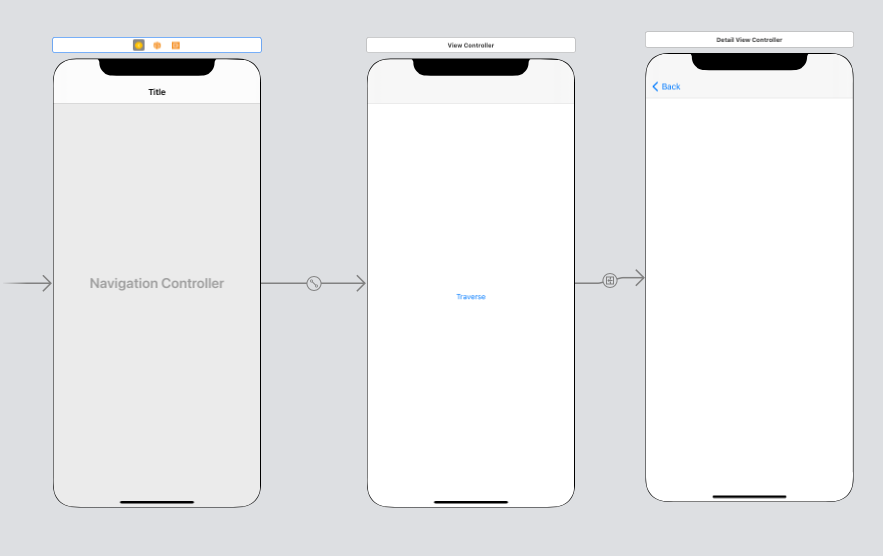
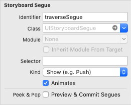
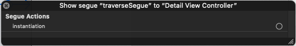

# Dependency Injection using Storyboards
## You're not restricted anymore!

<br/>
<sub>Photo by Ben Wicks on Unsplash<sub>

Difficulty: Beginner | Easy | **Normal** | Challenging<br/>
This article has been developed using Xcode 12.0, and Swift 5.3

## Prerequisites:
* You will be expected to be aware how to make a [Single View Application](https://medium.com/swlh/your-first-ios-application-using-xcode-9983cf6efb71
* You should be able to handle [segues](https://medium.com/@stevenpcurtis.sc/safe-segues-in-swift-6b38e08bdb9c), but I'm sure you can do that already
* You should be aware of, or have some interest in [Dependency Injection](https://stevenpcurtis.medium.com/learning-dependency-injection-using-swift-c94183742187))

# Dependency Injection
## Motivation
High level modules should not be dependent on low-level modules, but rather abstractions. If this is true, we can swap out classes rather than making a fixed dependency for a concrete class.

## Why it matters
If you are using a network service (say to make those [GET requests](https://stevenpcurtis.medium.com/http-methods-for-restful-services-50f4c41c383f)) to test screens that depend on data from the network service you will need to wait for the request to be made. Now not only is that rather boring to wait for (in larger projects this will take a great deal of time), but is seen as unprofessional as if your network goes down your tests will fail - but the problem actually isn't your code so the test isn't performing it's job!

The final conceptual idea might look like the following:

<br>

although the whole process is covered in my article about [Dependency Injection](https://stevenpcurtis.medium.com/learning-dependency-injection-using-swift-c94183742187)) 

# The implementation!
## iOS 13 and above
Whacking a Master-Detail couplet into a storyboard is something that most iOS developers are familiar with:

<br>

I gave the segue the attractive name **traverseSegue**, which moves<br>
<br>

this should allow us to nicely traverse from the amazingly named `ViewController` to `DetailViewController`. It's an awesome. But wait, I want to have a property that is set in the initializer of `DetailViewController`! It turns out that this isn't a real problem - we can create an initializer that requires this item to be added

```swift
class DetailViewController: UIViewController {
    override func viewDidLoad() {
        super.viewDidLoad()

        self.view.backgroundColor = .purple
    }
    
    let item: String

    required init?(coder: NSCoder, item: String) {
      self.item = item
      super.init(coder: coder)
    }

    required init?(coder: NSCoder) {
      fatalError("init(coder:) has not been implemented")
    }
}
```

Now to use this requires a touch-of-magic. We go to the storyboard and right-click on the segue and we can see where we can hook up a custom instantiation!<br>
<br>

So we can do just that - in the `ViewController` 

```swift
class ViewController: UIViewController {
    override func viewDidLoad() {
        super.viewDidLoad()
        self.view.backgroundColor = .red
    }
    
    @IBSegueAction
    func createDetailViewController(coder: NSCoder, sender: Any?, segueIdentifier: String?) -> DetailViewController? {
      return DetailViewController(coder: coder, item: "Test")
    }
}
```

This is the `IBSegueAction` that can be connected to the `Storyboard` - which is an *awesome*!

Note that the system always looks for the segue action in the source of the presentation.

## iOS 12 and below
**Segue**
You'll need to change `DetailViewController`
```swift
class DetailViewController: UIViewController {
    var item: String?
    override func viewDidLoad() {
        super.viewDidLoad()
        self.view.backgroundColor = .purple
    }
}
```

`ViewController`

```swift
class ViewController: UIViewController {
    override func viewDidLoad() {
        super.viewDidLoad()
        self.view.backgroundColor = .red
    }
    
    override func prepare(for segue: UIStoryboardSegue, sender: Any?) {
        if segue.identifier == "traverseSegue" {
            if let detail = segue.destination as? DetailViewController {
                detail.item = "test"
            }
        }
    }
}
```

note that we've used a rather annoying. This can be rather annoying, and involves an optional (which is not optional as it needs to be set when we instantiate the `ViewController`. 

**Instantiation**
Instead of using a segue, we can instead instantiate a view controller (raise it from the `Storyboard`)
```swift
@IBAction func buttonAction(_ sender: UIButton) {
    let detailViewController: UIViewController = UIStoryboard(name: "Main", bundle: nil).instantiateViewController(withIdentifier: "DetailViewController") as UIViewController

    if let detail = detailViewController as? DetailViewController {
        detail.item = "test"
    }

    self.navigationController?.pushViewController(detailViewController, animated: true)
}
```

This pretty much has the same disadvantages as the `segue` described above for iOS12. Hmm. 

There **must** be a better way.

**Using a Factory**
We can set up a factory method for the property initialization, this lives inside an abstract factory.

```swift
class ViewControllerFactory {
    func createInfoViewControllerWith(item: String) -> UIViewController {
        let vc = UIStoryboard(name: "Main", bundle: nil).instantiateViewController(withIdentifier: "InfoViewController") as! InformationViewController
        vc.item = item
        return vc
    }
}
```

which means that our `InformationViewController` can be rather basic and force-unwrap the `item` since we are guarenteed that it is avaliable!

```swift
class InformationViewController: UIViewController {
    var item: String!
    override func viewDidLoad() {
        super.viewDidLoad()
        self.view.backgroundColor = .green
        print (item!)
    }
}
```

This doesn't provide us with a solution for using `segues` but...still...there you go.

Of course we can do even better - This should conform to a [protocol](https://medium.com/@stevenpcurtis.sc/protocols-in-swift-f46c31283b18) that would enhance testing possibilities, as would allowing us to use any storyboard:

```swift
protocol ViewControllerFactoryProtocol {
    func createInfoViewControllerWith(item: String) -> UIViewController
}

class ViewControllerFactory: ViewControllerFactoryProtocol {
    let storyboard: UIStoryboard

    func createInfoViewControllerWith(item: String) -> UIViewController {
        let vc = UIStoryboard(name: "Main", bundle: nil).instantiateViewController(withIdentifier: "InfoViewController") as! InformationViewController
        vc.item = item
        return vc

    }
    
    init(storyboard: UIStoryboard = UIStoryboard(name: "Main", bundle: nil)) {
        self.storyboard = storyboard
    }
}
```

Now testing this will involve injecting a **Mock** factory which might look something like the following:

```swift
class MockFactory: ViewControllerFactoryProtocol{
    var didCreateInfo = false
    func createInfoViewControllerWith(item: String) -> UIViewController {
        didCreateInfo = true
        return UIViewController()
    }
}
```

and an example test (just an example of what you might do, I'm not usually in the habit of raising a View Controller from a test...)

```swift
func testExample() throws {
    let injectedFactory = MockFactory()
    let viewController = ViewController()
    viewController.viewControllerFactory = injectedFactory
    viewController.traverseToInfo()
    XCTAssertEqual((injectedFactory as MockFactory).didCreateInfo, true)
}
```

YesL this does involve setting a property directly on the view controller and even an extra function in there. That means the `View Controller` looks like the following:

```swift
class ViewController: UIViewController {
    override func viewDidLoad() {
        super.viewDidLoad()
        self.view.backgroundColor = .red
    }
    
    override func prepare(for segue: UIStoryboardSegue, sender: Any?) {
        if segue.identifier == "traverseSegue" {
            if let detail = segue.destination as? DetailViewController {
                detail.item = "test"
            }
        }
    }
    @IBAction func buttAction(_ sender: UIButton) {
        let detailViewController: UIViewController = UIStoryboard(name: "Main", bundle: nil).instantiateViewController(withIdentifier: "DetailViewController") as UIViewController

        if let detail = detailViewController as? DetailViewController {
            detail.item = "test"
        }
        self.navigationController?.pushViewController(detailViewController, animated: true)
    }
    @IBAction func infoButtonAction(_ sender: UIButton) {
        traverseToInfo()
    }
     @IBAction func infoButtonAction(_ sender: UIButton) {
        traverseToInfo()
    }   
 ```
 
 Good times!

# Conclusion
This has been a rather long article, and hopefully has been some help to you. Not many articles cover Testing so hopefully this offers some value for you!

Dependency injection is something that is important when you want to test your project, and that is something which you should always be doing (even if the tests are rather basic in the beginning, you should spend some time making sure your code is up to scratch!).

The implementation of the this article is avaliable at the [repo](https://github.com/stevencurtis/SwiftCoding/tree/master/DIStoryboards), and I would recommend you download that if you wish to have a working project with this code to help you step through the work.

In any case, I hope this article has helped you out in your project, learning journey or even just satisfied your curiosity. Thank you for reading.

If you've any questions, comments or suggestions please hit me up on [Twitter](https://twitter.com/stevenpcurtis)
