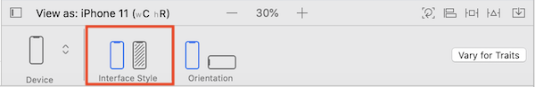
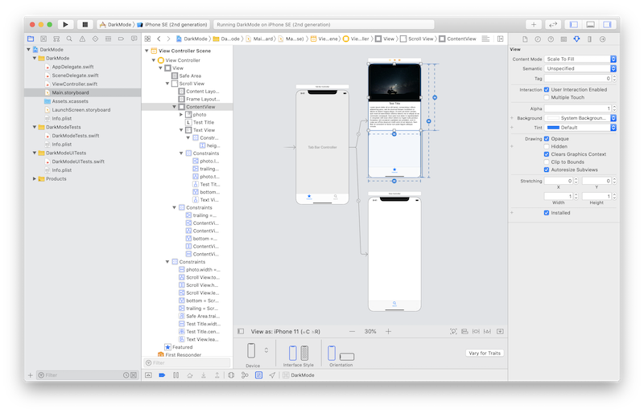
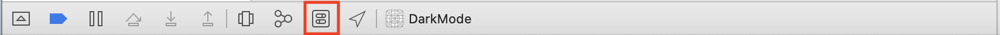
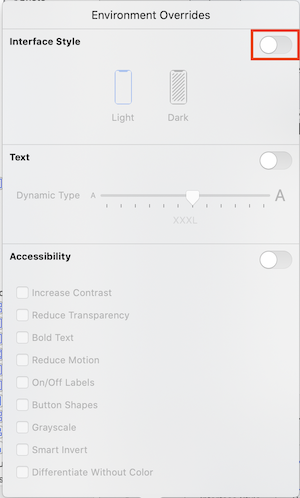
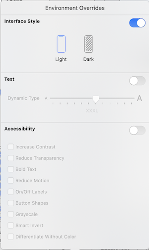
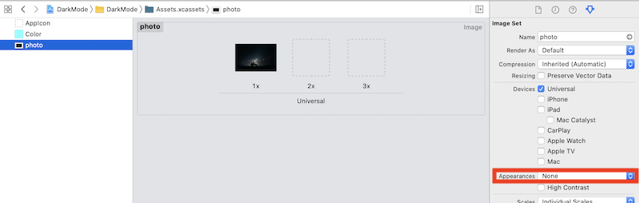
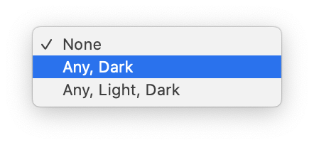
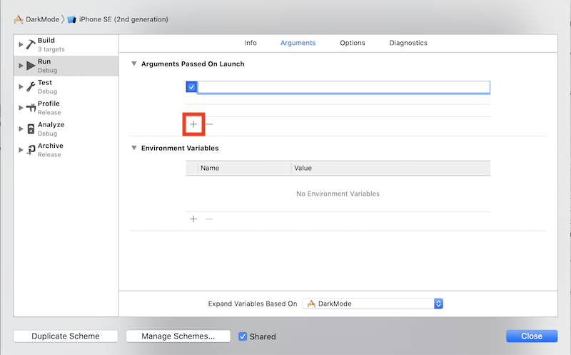

# Dark Mode iOS
## Go dark (not psychologically)

<br/>
<sub>Photo by Jonatan Pie on Unsplash<sub>

Difficulty: Beginner | Easy | **Normal** | Challenging<br/>
This article has been developed using Xcode 11.4.1, and Swift 5.2.2

## Prerequisites: 
* You will be expected to be aware how to make a [Single View Application](https://medium.com/swlh/your-first-ios-application-using-xcode-9983cf6efb71) in Swift.

## Terminology:
Dark mode: A darker color visual palette for users 

## The Approach
Light and dark mode puts your app at the mercy of users. They can easily change the look and feel of the app. So how can you make sure that you App will be prepared for this brave new world? There is just one way of doing this:

- Avoid hard-coded colors

So how would we do that? How would we make a `UILabel` change for both dark mode and light mode - so label has a default color for each?

Well you could choose one of the following colors *semantic colors*

* label
* systemGroupedBackground
* systemBlue
* systemBackground
* secondarySystemBackground
* tertiarySystemBackground

So we should think about implementing UI picking an appropriate semantic color. UIKit does the work for you, don't need to know the mode and when changes the work is done for you. Dark Mode is not a simple inversion of light colours, and we are often given versions of color that fall into one of the following iOS color categories:

* Primary
* Secondary
* Tertiary
* Quaternary

Views and controls are designed to fit together

## Designing for Dark Mode
* Use UIKit colors and controls
* Customize colors and images where necessary
* Decide on the color and appearance of the App
 
 Each color can have a value for dark and light mode, the color is set one time only.

## Switching to dark mode in the Storyboard
Still using the Storyboard? We can view a dark or light interface style! The requisite option is highlighted below

<br/>

Which means we can switch from a light view:

<br/>

to a dark view

<br/>

If you look at the demo in the Repo `System Background color` has already been used for the background, and `Label color` for the label colour - these are semantic colors so automatically has a light and a dark variant!

## Switching to dark mode dynamically in Xcode
From iOS13 we have had a rather attractive `Environment Overrides` button, and can switch between dark and light mode in real time.

We must first run our App, and then select the `Environment Overrides` button on the bottom toolbar (highlighed with a red rectangle below)

<br/>

from there we can select the `Environment Overrides` slider (once again highlighted with a red rectangle)

<br/>

which then allows us to select either dark or light mode

<br/>

If you look at the demo in the Repo `System Background color` has already been used for the background, and `Label color` for the label colour - these are semantic colors so automatically has a light and a dark variant!

## Dynamic images
I've noticed that my image doesn't really match the light mode. Xcode has me covered here, and can switch the image according to the light or dark mode. 

<br/>

I (luckily perhaps) put my image in the `Assets` folder. Now we can select an alternative appearance (highlighted in red)

<br/>

Here I select `Any, Dark`

<br/>

This is all sorts of awesome!
If you want to do this in code, you can!

```swift
let image = UIImage(named: "photo")
let asset = image?.imageAsset
let resolvedImage = asset?.image(with: traitCollection)
```

## Make your own dynamic colors
In Xcode you can add your own color set in the asset catalog. The colors can also be written in code!

```swift
let myColor = UIColor { (traitCollection: UITraitCollection) -> UIColor in
    if traitCollection.userInterfaceStyle == .dark {
        return .black
    } else {
        return .white
    }
}
```
which can then be accessed through code

```swift
print (myColor.cgColor.components)
```

which will be then drawn again when the user switches between light and dark mode.

however `cgColor` can't be dynamic. We will need to get a trait collection from a view - and we can ask the color to resolve itself using a trait collection.

There are few options for this, so let us explore them all!

```swift
// 1
let traitCollection = view.traitCollection
let resolvedColor = myColor.resolvedColor(with: traitCollection

// 2
traitCollection.performAsCurrent {
    // set border color, or similar Core Graphics color
}

// 3
UITraitCollection.current = traitCollection
// set border color, or similar Core Graphics color
```
1. resolve the color
2. `performAsCurrent`
3. set the current `UITraitCollection`

The first one is tricky for many colors, however. Setting `UITraitCollection` only affects the current thread. For the third option you probably want to change the `UITraitCollection` back again once you have finished, so should save this as a temporary property.


When we override `traitCollectionDidChange` we might have the following function, and we only want to resolve dymanic colours when the appearance has changed. There is no problem, we can do this using `traitCollection.hasDifferentColorAppearance`, which is called when the trait collection changes.

```swift
override func traitCollectionDidChange(_ previousTraitCollection: UITraitCollection?) {
    super.traitCollectionDidChange(previousTraitCollection)
    
    if traitCollection.hasDifferentColorAppearance(comparedTo: previousTraitCollection) {
        // reset dynamic colors
    }
}
```

**Did you know** you can enable debug logging with the launch argument `-UITraitCollectionChangeLoggingEnabled YES` which can be set through `Edit Scheme...>Arguments` which you can then press the addition button (highlighted in red):

<br/>

and then enter the argument, which then will log changes to the console as you would expect.

Traits are updated before layout occurs - meaning that the right colors are used at any time.


# Make your whole App light or dark mode
You can set, in the `info.plist`, `UIUserInterfaceStyle` to either light or dark.
Done!

# Conclusion
Dark Mode has been around for a while, and users expect this. Therefore you should be implementing this in your own applications to give uses that choice and flexibility.

Happy users mean good reviews, and ultimately this means more users.

This has to be good for everyone!

If you've any questions, comments or suggestions please hit me up on [Twitter](https://twitter.com/stevenpcurtis) 
