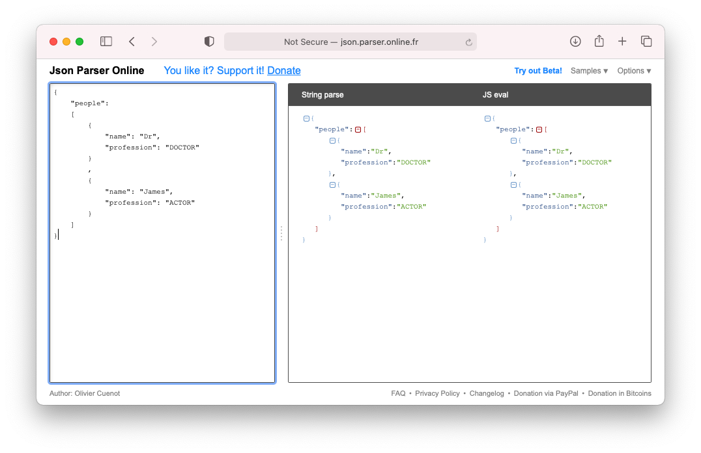

# Use an Enum to Decode JSON
## It really makes sense!

<br/>
<sub>Photo by Ravi Singh on Unsplash<sub>

# Before we start
Difficulty: Beginner | **Easy** | Normal | Challenging<br/>

## Prerequisites:
* There is a less simpler of decoding JSON

## Keywords and Terminology:
Decodable: A type that can decode itself from an external representation
JSON: JavaScript Object Notation, a lightweight format for storing and transporting data

# The project
This article uses a Playground and in order to avoid downloading from the Network or similar this is using a hard-coded JSON String:

```swift
let json = """
{
    "people":
    [
        {
            "name": "Dr",
            "profession": "DOCTOR"
        }
        ,
        {
            "name": "James",
            "profession": "ACTOR"
        }
    ]
}
"""
```

This JSON String can be validated by using one of the available online parsers (I use [http://json.parser.online.fr](http://json.parser.online.fr))

<br/>

## The first attempt
The JSON is an Array, with a name and profession each defined as a `String`.

The **basic struct**s need to both conform to `Decodable` so it can be decoded.

```swift
struct People: Decodable {
    let people: [Person]
}

struct Person: Decodable {
    let name: String
    let profession: String
}
```

which can then be decoded using the `JSONDecoder()` and then for simplicity this is printed to the screen:

```swift
let decoder = JSONDecoder()
let person = try! decoder.decode(People.self, from: json.data(using: .utf16)!)
print (person)
```

The force unwraps can be seen as bad form here, and I've written a [whole article about avoiding them](https://medium.com/@stevenpcurtis.sc/avoiding-force-unwrapping-in-swift-6dae252e970e) but in this case I've gone for force-unwrapping using the try as this (in the case of an error) will display that error in the console - and unwrapping the data provides an early indication that there is something wrong. This isn't production code, remember!

This gives the following output to the console:

```swift
People(people: [__lldb_expr_57.Person(name: "Dr", profession: "DOCTOR"), __lldb_expr_57.Person(name: "James", profession: "ACTOR")])
```

The output is as follows:
```swift
Dr is a doctor
James is a actor
```
## The second attempt
It is rather unsatisfying to have the professions written without a capital letter at the beginning. We **must** be able to do better.

The tool to be able to do this is Swift's `enum`!

This is a enum that will conform to `Decodable` and decode those capital letter professions.

```swift
enum Profession: String, Decodable {
    case doctor = "DOCTOR"
    case actor = "ACTOR"
}
```

This might well decode the JSON, but it does not solve the problem where the `String` isn't adequately displayed.

The answer here is to once again use `CustomStringConvertible`, and this can be done by using an extension:

```swift
extension Profession: CustomStringConvertible {
    var description: String {
        switch self {
        case .doctor:
            return "Doctor"
        case .actor:
            return "Actor"
        }
    }
}
```
Now we need to use the `Profession` type in the `Person`:

```swift
struct Person: Decodable {
    let name: String
    let profession: Profession
}
```

which then gives the following result:

```swift
People(people: [__lldb_expr_71.Person(name: "Dr", profession: Doctor), __lldb_expr_71.Person(name: "James", profession: Actor)])
```

which is almost there, but not quite good enough. We want to see a properly human-readable result. To do so we can extend the `Person` type and the `People` type:

```swift
extension People: CustomStringConvertible {
    var description: String {
        return people.map{ $0.description }.joined(separator: "\n")
    }
}
extension Person: CustomStringConvertible {
    var description: String {
        return "\(name) is a \(profession)"
    }
}
```

Which gives the following console output:

```swift
Dr is a Doctor
James is a Actor
```

Wonderful! Human readable use of an `enum`? That must be a good thing, right?

## The whole Playground
This can be copy-pasted into a Playground so you too can decode that hard-coded JSON.

```swift
import UIKit

let json = """
{
    "people":
    [
        {
            "name": "Dr",
            "profession": "DOCTOR"
        }
        ,
        {
            "name": "James",
            "profession": "ACTOR"
        }
    ]
}
"""

struct People: Decodable {
    let people: [Person]
}

extension People: CustomStringConvertible {
    var description: String {
        return people.map{ $0.description }.joined(separator: "\n")
    }
}

struct Person: Decodable {
    let name: String
    let profession: Profession
}

extension Person: CustomStringConvertible {
    var description: String {
        return "\(name) is a \(profession)"
    }
}

enum Profession: String, Decodable {
    case doctor = "DOCTOR"
    case actor = "ACTOR"
}

extension Profession: CustomStringConvertible {
    var description: String {
        switch self {
        case .doctor:
            return "Doctor"
        case .actor:
            return "Actor"
        }
    }
}

let decoder = JSONDecoder()
let person = try! decoder.decode(People.self, from: json.data(using: .utf16)!)
print(person)
```

# Conclusion
Some people claim that mobile development is nothing but taking JSON strings and displaying them on screen. In that case, this article certainly has you covered in that respect!

In any case, this is a good start in processing the data that you would need to be able to do in order to create a worthwhile project in Swift.

I hope this is of help to you.

If you've any questions, comments or suggestions please hit me up on [Twitter](https://twitter.com/stevenpcurtis)
