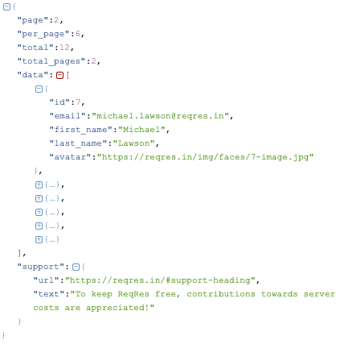

# Decode JSON in Swift: A Full Micro-Project
## A whole project?


<br/>
<sub>Photo by Michael Dziedzic on Unsplash<sub>

# Before we start
Difficulty: Beginner | Easy | **Normal** | Challenging<br/>

## Prerequisites:
* This article skips over [setting up a project](https://medium.com/swlh/your-first-ios-application-using-xcode-9983cf6efb71), and gets rid of the storyboard and uses programmatic constraints as [in this article](https://stevenpcurtis.medium.com/write-programmatic-constraints-for-swift-projects-94cf18b35511)
* Later in the article a real example is used, that is [Decoding JSON](https://medium.com/@stevenpcurtis.sc/decode-json-with-swift-test-e2d26dfafd6d) and the internal workings of this are kind of skipped over
* If you are interested in testing, or a more in-depth explanation of JSON decoding you can look at [this article](https://medium.com/@stevenpcurtis.sc/decode-json-with-swift-and-test-it-e2d26dfafd6d)

## Keywords and Terminology:
JSON: JavaScript Object Notation, a lightweight format for storing and transporting data
Swift: An open source programming language for macOS, iOS, watchOS and tvOS

# The project implementation
## The expected result
This Project is going to take data from an endpoint (the specific endpoint is one of those hosted at [reqres](https://reqres.in)) and displays the result in a `UITextView`.

The end project looks something like the following:

<br/>

So let us press on!


I've used [weak self] (the difference between weak and unowned is explained [here](https://medium.com/@stevenpcurtis.sc/swift-self-weak-or-unowned-7e2327974f36) )

## The detail

**Users Model**
The model is defined by the structure of the data from the endpoint. [https://reqres.in/api/users?page=2](https://reqres.in/api/users?page=2) is
```
{"page":2,"per_page":6,"total":12,"total_pages":2,"data":[{"id":7,"email":"michael.lawson@reqres.in","first_name":"Michael","last_name":"Lawson","avatar":"https://reqres.in/img/faces/7-image.jpg"},{"id":8,"email":"lindsay.ferguson@reqres.in","first_name":"Lindsay","last_name":"Ferguson","avatar":"https://reqres.in/img/faces/8-image.jpg"},{"id":9,"email":"tobias.funke@reqres.in","first_name":"Tobias","last_name":"Funke","avatar":"https://reqres.in/img/faces/9-image.jpg"},{"id":10,"email":"byron.fields@reqres.in","first_name":"Byron","last_name":"Fields","avatar":"https://reqres.in/img/faces/10-image.jpg"},{"id":11,"email":"george.edwards@reqres.in","first_name":"George","last_name":"Edwards","avatar":"https://reqres.in/img/faces/11-image.jpg"},{"id":12,"email":"rachel.howell@reqres.in","first_name":"Rachel","last_name":"Howell","avatar":"https://reqres.in/img/faces/12-image.jpg"}],"support":{"url":"https://reqres.in/#support-heading","text":"To keep ReqRes free, contributions towards server costs are appreciated!"}}
```
can be placed into [http://json.parser.online.fr](http://json.parser.online.fr) which gives us a clear view of the structure of the JSON. In a usual working situation you might well be given a clear API with documentation, but this online parser can still be useful.

<br/>

Now usually we might expect that the properties in our mode `struct` exactly mirror those of the endpoint. However in Swift we usually use [Camel Case](https://medium.com/@stevenpcurtis.sc/the-naming-conventions-you-must-to-know-2783d44b4a5e) rather than snake case, and this is something will we cover when we decode the data - but in this case we can manually translate the Camel Case to Snake Case (for example per_page to perPage).

In order to decode the JSON using `JSONDecoder()` the model must conform to [Codable](https://medium.com/@stevenpcurtis.sc/codable-in-swift-and-ios-12a1415b9aa6), and this applies to the `struct` of the model (called User here) and any nested `struct`.

Although in the video I decided NOT to use nested `struct` instances for `Users`, `UserData` and `Support` since the nested `struct` instances are not referenced from outside the `Struct` I feel that we are actually better to nest them.


```swift
struct Users: Codable {
    let page: Int
    let perPage: Int
    let total: Int
    let totalPages: Int
    let data: [UserData]
    let support: Support

    struct UserData: Codable {
        let id: Int
        let email: String
        let firstName: String
        let lastName: String
        let avatar: String
    }

    struct Support: Codable {
        let url: String
        let text: String
    }
}
```

**ViewController**
The view controller will instantiate the `ViewModel` through it's own initializer, requiring us to create the property and [initializer](https://medium.com/@stevenpcurtis.sc/swift-initializers-fc12908a9106)

```swift
private let viewModel: ViewModel

init(viewModel: ViewModel) {
    self.viewModel = viewModel
    super.init(nibName: nil, bundle: nil)
}

required init?(coder: NSCoder) {
    fatalError("init(coder:) has not been implemented")
}
```

Most of the rest of the details in the class are about creating (the poorly named - sorry) `UITextView`, where the action takes place mostly in `viewDidLoad`.

```swift
private lazy var text: UITextView = .init(frame: .zero)

override func viewDidLoad() {
    super.viewDidLoad()
    setupHierarchy()
    setupComponents()
    setupConstraints()
}

func setupHierarchy() {
    view.addSubview(text)
    text.translatesAutoresizingMaskIntoConstraints = false
}

func setupComponents() {
    text.textAlignment = .center
    text.isUserInteractionEnabled = false
    text.text = "Placeholder"
}

func setupConstraints() {
    NSLayoutConstraint.activate([
        text.topAnchor.constraint(equalTo: view.topAnchor),
        text.bottomAnchor.constraint(equalTo: view.bottomAnchor),
        text.leadingAnchor.constraint(equalTo: view.leadingAnchor),
        text.trailingAnchor.constraint(equalTo: view.trailingAnchor)
    ])
}
```

However the real action goes on in `viewDidAppear` - now I know this loading will happen in front of the user (after all, the view will have appeared to the user before we even make the network call)

```swift
override func viewDidAppear(_ animated: Bool) {
    super.viewDidAppear(animated)
    viewModel.completion = {
        let text = $0.data.map{ "\($0.firstName) \($0.lastName): \($0.email)" }.joined(separator: "\n")
        DispatchQueue.main.async {
            self.text.text = text

        }
    }
    viewModel.downloadFiles()
}
```

now we assign the completion hanlder in the view model (more to come of this later), which will return a `Users` object. Now instead of explicitly defining a name for the object $0 is used as a shorthand for the first argument (and represents a the `Users` array), and the second shorthand argument $0 represents each User in turn.

<br/>


## The full classes
Now there is the full code in the [repo](https://medium.com/@stevenpcurtis.sc/downloading-repos-from-github-13a017951450) at [https://github.com/stevencurtis/SwiftCoding/tree/master/DecodeReqres](https://github.com/stevencurtis/SwiftCoding/tree/master/DecodeReqres), but here is the code reproduced:

**SceneDelegate**
```swift
class SceneDelegate: UIResponder, UIWindowSceneDelegate {

    var window: UIWindow?

    func scene(_ scene: UIScene, willConnectTo session: UISceneSession, options connectionOptions: UIScene.ConnectionOptions) {
        guard let windowScene = (scene as? UIWindowScene) else { return }
        window = UIWindow(frame: windowScene.coordinateSpace.bounds)
        window?.windowScene = windowScene

        self.window = UIWindow(windowScene: windowScene)

        let viewModel = ViewModel()
        let viewController = ViewController(viewModel: viewModel)

        let nav = UINavigationController(rootViewController: viewController)

        self.window?.rootViewController = nav
        self.window?.makeKeyAndVisible()
    }

    func sceneDidDisconnect(_ scene: UIScene) {
    }

    func sceneDidBecomeActive(_ scene: UIScene) {
    }

    func sceneWillResignActive(_ scene: UIScene) {
    }

    func sceneWillEnterForeground(_ scene: UIScene) {
    }

    func sceneDidEnterBackground(_ scene: UIScene) {
    }
}
```
**ViewController**
```swift
class ViewController: UIViewController {

    private let viewModel: ViewModel

    private lazy var text: UITextView = .init(frame: .zero)

    override func viewDidLoad() {
        super.viewDidLoad()
        setupHierarchy()
        setupComponents()
        setupConstraints()
    }

    func setupHierarchy() {
        view.addSubview(text)
        text.translatesAutoresizingMaskIntoConstraints = false
    }

    func setupComponents() {
        text.textAlignment = .center
        text.isUserInteractionEnabled = false
        text.text = "Placeholder"
    }

    override func viewDidAppear(_ animated: Bool) {
        super.viewDidAppear(animated)
        viewModel.completion = {
            let text = $0.data.map{ "\($0.firstName) \($0.lastName): \($0.email)" }.joined(separator: "\n")
            DispatchQueue.main.async {
                self.text.text = text

            }
        }
        viewModel.downloadFiles()
    }

    func setupConstraints() {
        NSLayoutConstraint.activate([
            text.topAnchor.constraint(equalTo: view.topAnchor),
            text.bottomAnchor.constraint(equalTo: view.bottomAnchor),
            text.leadingAnchor.constraint(equalTo: view.leadingAnchor),
            text.trailingAnchor.constraint(equalTo: view.trailingAnchor)
        ])
    }

    override func loadView() {
        let view = UIView()
        view.backgroundColor = .red
        self.view = view
    }

    init(viewModel: ViewModel) {
        self.viewModel = viewModel
        super.init(nibName: nil, bundle: nil)
    }

    required init?(coder: NSCoder) {
        fatalError("init(coder:) has not been implemented")
    }

}
```

**ViewModel**
```swift
class ViewModel {
    var completion: ((Users) -> Void)?

    func downloadFiles() {
        guard let url = URL(string: "https://reqres.in/api/users?page=2") else {return}
        let task = URLSession.shared.dataTask(with: url, completionHandler: { [weak self] data, response, _ in
            guard let data = data,
                  let httpResponse = response as? HTTPURLResponse,
                  200..<300 ~= httpResponse.statusCode
            else {return}
            let decoder = JSONDecoder()
            decoder.keyDecodingStrategy = .convertFromSnakeCase
            if let decoded = try? decoder.decode(Users.self, from: data) {
                self?.completion?(decoded)
            }
        })
        task.resume()
    }
}
```

**Users**
```swift
struct Users: Codable {
    let page: Int
    let perPage: Int
    let total: Int
    let totalPages: Int
    let data: [UserData]
    let support: Support

    struct UserData: Codable {
        let id: Int
        let email: String
        let firstName: String
        let lastName: String
        let avatar: String
    }

    struct Support: Codable {
        let url: String
        let text: String
    }
}
```

# Conclusion
If you've any questions, comments or suggestions please hit me up on [Twitter](https://twitter.com/stevenpcurtis)
