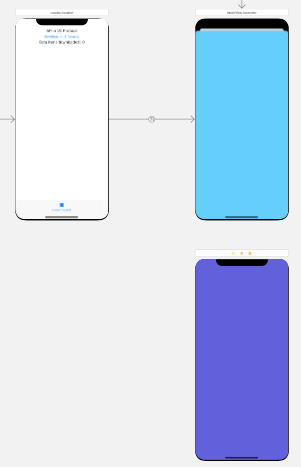

# Decouple Your Classes in Swift
## The MVC Architecture in Swift: A Practical Example

# Before we start
Difficulty: Beginner | **Easy** | Normal | Challenging
This article has been developed using Xcode 12.1, and Swift 5.3
Prerequisites:
You need to be able to create a new Swift project, and a Single View Application

# Terminology
Coupling: The degree of interdependence between software modules and classes
protocol: A blueprint on methods, properties and requirements to suit a piece of functionality

# Coupling
Coupling is the degree of interdependence between software modules, and how closely connected they are.
A low degree of coupling is seen as good design, since low coupling can assist with reuse as well as readability and maintainability.

# Coupling Using a Segue for Navigation
If we are trying to move between View Controllers using a Storyboard, we might well use code that has prepare(for:sender) and use this to pass data to a DetailViewController.

```swift
override func prepare(for segue: UIStoryboardSegue, sender: Any?) {
    if let detailVC = segue.destination as? DetailViewController {
            detailVC.data = dataDownloaded.description
        }
}
```

where the `DetailViewController` has a `data` property

```swift
class DetailViewController: UIViewController, DataViewProtocol {
    var data: String = ""
```


This code only works if the Destination is a DetailViewController, and nothing else can support having the data parameter filled in with a String.

**Argument Number 1**

Since you are performing a segue to a view controller, you know that the property exists on that view controller. You as the developer can guarantee that that the property is there, so what is the problem?
The answer to this is that we cannot easily swap out the implementation for `DetailViewController` to another View Controller. This isn't ideal!

## Solution: The Protocol
By conforming to a protocol we allow `AnyObject` that conforms to the protocol which exposes the properties that are required.
Here is an example protocol that can be used. We are specifying a getter and setter in the protocol here:

```swift
protocol DataViewProtocol: AnyObject {
    var data: String { get set }
}
```

which then we can conform to the protocol (no other changes are required in the view controller)

```swift
class DetailViewController: UIViewController, DataViewProtocol {
    var data: String = ""
```

Which means that we can change the segue in the view controller to segue to another other View Controller that Conforms to the DataViewProtocol - which is just some changes in the Storyboard

<br>

which would be to change the segue from the blue view controller to the indigo one.

# Conclusion
Decoupling is an important part of programming.
When we are programming to create iOS applications we can think about this as the ability to be able to swap out implementations. In this case, we have done so using the example of a View Controller.
