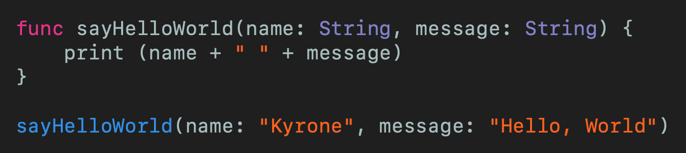
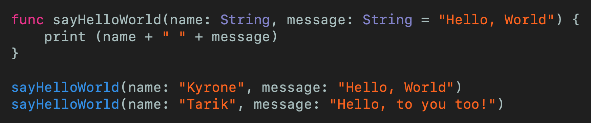

# Default arguments in Swift
## Create a flexible API

 
Photo by Max Ilienerwise on Unsplash

Default arguments are great! This article explains what they are, and why they are fantastic. Go on, take a look!

Difficulty: **Beginner** | Easy | Normal | Challenging 
This article has been developed using Xcode 11.5, and Swift 5.2.4

## Prerequisites: 
* For simplicity this article is written with the Swift [Playground](https://medium.com/@stevenpcurtis.sc/coding-in-swift-playgrounds-1a5563efa089) in mind.
* Some experience of [functions](https://levelup.gitconnected.com/functions-in-swift-7e488190a011) is assumed

# Functions
## A simple example
Imagine that we have a function that prints a name and a message to the console. That function looks like the following:

 
[Click for Gist](https://gist.github.com/stevencurtis/3508942cb6ca90fcf5a5377f4393f27b) 

This gives us an opportunity: surely in almost every case we are going to to have the "Hello, World" message (ok, a stretch but bear with me) - so we want "Hello, World" to be the *default* of the function. Is this possible? It turns out that yes, yes it is.

## Creating a default parameter
The best thing about this default parameter is that it won't change any existing calls to the function - that is, they will still work! 

 
[Click for Gist](https://gist.github.com/stevencurtis/3a52a0062685ebdb85f8a421755122d6) 

That means the code written above outputs the following two lines:
`Kyrone Hello, World`
`Tarik Hello, to you too!`

So if you have a public API ( you might want to read up about [Access Control](https://medium.com/swift-coding/access-control-in-swift-71228704654a) to think about this)

# Initialization (Class and Struct)
[Initialization ](https://medium.com/@stevenpcurtis.sc/swift-initializers-fc12908a9106) similarly can benefit from default parameters. 

Since we should always assume people are 21 if we don't use their age (Note: This doesn't apply to children, although the following `Class` does not reflect that) if the API user doesn't provide an age we set it to 21.

[persondefault](https://gist.github.com/stevencurtis/c0d4b662a4fe514b22ed9f96eea952e1)

This produces the following output:
`Chau`
`21`

We can apply the same for `Struct` objects too!

## So default parameters can be used...
Anywhere in the list of parameters
Can be used for 0 or more of the parameters
To enable API users to access functions; some might use a "simpler" version of the same API, that is complexity is reduced.

# Conclusion
You might like to use default parameters to make the use of public APIs rather more easy for your client to use. However, you should make access as easy as possible, and you should do this by making your code as readable as possible as this will make your code as easy to be created and maintained in future.

If you've any questions, comments or suggestions please hit me up on [Twitter](https://twitter.com/stevenpcurtis) 

