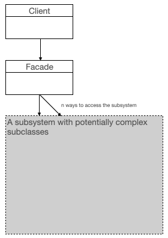
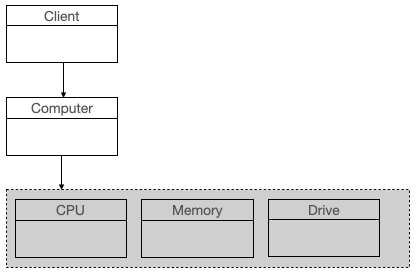

# The Façade Design Pattern in Swift  
## These command line tools are worthwhile!

<br/>
<sub>Photo by Wojtek Witkowski on Unsplash<sub>

Difficulty: Beginner | Easy | **Normal** | Challenging

This article is supported by a [Video](https://youtu.be/BiD_Y1Gvz7I)<br>

## Prerequisites:
* You will be expected to be aware how to make a [Single View Application](https://medium.com/swlh/your-first-ios-application-using-xcode-9983cf6efb71)
* You might like to see an example of the Façade Pattern from [This article]( https://medium.com/@stevenpcurtis/lazyily-load-images-in-swift-4206b5d5d754)

# Terminology:
Design Pattern: a general, reusable solution to a commonly occurring problem
The Façade Design Pattern: An object that masks complex or underlying (perhaps containing complex or multiple classes) classes

# The Façade Pattern in Swift
If you wish to obfuscate complex code it can provide an interface that masks that complexity. In other words, the façade design pattern can make your code better (and in particular it can make your code easier to read).

In the real world we see the word façade used in architecture, and on a film set many of hte buildings are a façade as there isn't a real building. In other building projects a façade of an older building which hides the modern building underneath. An example of this is shown in the following image:  

[image from I, Olahus1](1024px-Facadism_in_bucharest.jpg)

This gives the common idea of a façade hiding complexity under an outer shell.

## The detail
Any façade can provide an interface to a complex subsystem, and when you interact with that object you will use the façade to interact with the same.

This gives us the advantages:
* Improve the readability and usability of software by masking interaction with complex components
* Enable a context-specific interface to functionality
* Enable decoupling of subsystems from clients and other subsystems

Here is a rather attractive diagram that shows the façade pattern:



Use of the façade pattern can help our coding by providing a simple view of the subsystem to the client.

## The Simple Abstract Example
This is an abstract example, but don't worry it is written in Swift.

Imagine we want to create an abstract model of a computer (you know, like in the [Wikipedia article](https://en.wikipedia.org/wiki/Facade_pattern).

So we are going to create a computer facade that ultimately gives simple access to the constituent parts of a complex subsystem (The CPU, Memory and Drive)


```swift
private class CPU {
    func freeze() { }
    func jump(position: Int64) { }
    func execute() { }
}

private class Memory {
    func load(position: Int64, data: NSData) { }
}

private class Drive {
    func read(position: Int64, data: NSData) -> NSData? { return nil }
}

class Computer {
    private let BOOT_ADDRESS: Int64 = 95
    private let cpu = CPU()
    private let memory = Memory()
    private let hdd = Drive()
    func start() {
        self.cpu.freeze()
        self.memory.load(position: BOOT_ADDRESS, data: NSData())
        self.cpu.jump(position: BOOT_ADDRESS)
        self.cpu.execute()
    }
}

let computer = Computer()
computer.start()
```

Although don't expect that code to do too much - but this is the type of example that you could use as a basis to solve your own problems! If you are going to do something like this, though, you should consider using [Protocols](https://medium.com/@stevenpcurtis.sc/protocols-in-swift-f46c31283b18) and coding to those (Drive conforming to a protocol to enable [Dependency Injection](https://medium.com/@stevenpcurtis.sc/learning-dependency-injection-using-swift-c94183742187). If you wanted to make the Computer itself a protocol (not a class) be aware that a façade in an object rather than simply a protocol in Swift, which would make code taking this approach *not* conform to the façade pattern.

# A coded example
My article [lazily loading images](https://medium.com/@stevenpcurtis/lazyily-load-images-in-swift-4206b5d5d754) refers to my [VIPER example](https://medium.com/@stevenpcurtis.sc/implement-the-clean-viper-architecture-in-ios-4e457d74a8ff) and allows the downloading of an image using an `extension` - let us look at the abridged version of the code from that first article here:

```swift
extension UIImageView {
    func downloadImageFrom(with url: URL, contentMode: UIView.ContentMode) {
        downloadImageFrom(with: url, network: NetworkManager(session: URLSession.shared), contentMode: contentMode)
    }
    
    func downloadImageFrom<T: NetworkManagerProtocol>(with url: URL, network: T, contentMode: UIView.ContentMode) {
        network.fetch(url: url, method: .get, completionBlock: { result in
            switch result {
            case .failure:
                print ("failed")
            // communicate failure to the user, or silently fail
            // as it will currently (leaves placeholder)
            case .success(let data):
                DispatchQueue.main.async {
                    self.contentMode = contentMode
                    self.image = UIImage(data: data)
                }
            }
        })
    }
```

Now this code obfuscates the complexity of downloading the image and setting it to the current image (is it is settled in an extension). This is not the traditional use of a façade pattern, but can loosely be said to follow the design pattern and hide the complexity of the operations which would happen in the `UIImageView` class.

# Conclusion
This isn't necessarily the easiest concept that you will need to understand as a Swift programmer, but neither it is it the most complicated. You will need to use the Façade Design Pattern if you wish to provide a simple interface to a more complex problem. This allows consumers to avoid the complexity of interacting with complex classes (and potentially multiple classes) within a system.

If you've any questions, comments or suggestions please hit me up on [Twitter](https://twitter.com/stevenpcurtis) 
