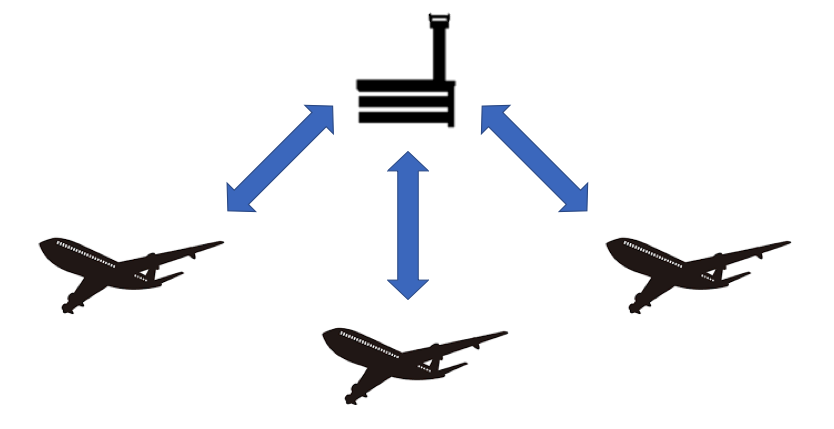

# The Mediator Design Pattern in Swift
## Loose coupling!

<br/>
<sub>Photo by Jason Rosewell<sub>

Difficulty: Beginner | Easy | **Normal** | Challenging<br/>
This article has been developed using Xcode 11.5, and Swift 5.2.4

## Prerequisites: 
* You will be expected to be aware how to make a [Single View Application](https://medium.com/swlh/your-first-ios-application-using-xcode-9983cf6efb71) in Swift

# Terminology:
Mediator Pattern: the definition of an object that encapsulates how objects interact
Design Pattern: a general, reusable solution to a commonly occurring problem
Encapsulation: the bundling of data with the methods that operate on that data, or the restriction of direct access to some of an object's components

# The problem
When two (or more!) objects communicate, we need to be mindful that if we use the adaptor pattern we may be tightly coupling objects - and it goes without saying that this isn't ideal.

One cannonical example of the mediator pattern is an aircraft control tower communicating with planes within the tower's range. The planes are required to be a certain distance apart (and certainly not crash!) but do not communicate directly with each other! In this case, they relay their position to the control tower which then communicates the relevant information to planes.  


You could probably set up an algorithm about which planes the control tower would communicate with at any given time to do with the distance of any given plane from the others.

# The Mediator Design Pattern in Swift
The following mediator does not have any special logic around which of the receivers that would be sent a request.

However, far from being entirely theoretical this is the design pattern I have used in my implementation of two-way binding.
```swift
class Request {
    var message: String
    
    init(message: String) {
        self.message = message
    }
}

protocol Mediator {
    func send(request: Request)
}

class RequestMediator: Mediator {
    func send(request: Request) {
        for receiver in receivers {
            receiver.receive(message: request.message)
        }
    }
    
    private var receivers: [Receiver] = []
    func addReceiver(receiver: Receiver) {
        receivers.append(receiver)
    }
}

class Receiver {
    func receive(message: String) {
        print ("Mess \(message)")
    }
}

let myMediator = RequestMediator()
let receiver = Receiver()

myMediator.addReceiver(receiver: receiver)

myMediator.send(request: Request(message: "Test"))
```

The code is in the [playground in the repo](https://github.com/stevencurtis/SwiftCoding/tree/master/DesignPatterns/MediatorDesignPattern), and I hope you download that and enjoy seeing it work in front of your eyes!

# Enhancing behaviour
Although the Mediator Pattern is known as a common design pattern, it really deals with the communication between objects, and does this by providing a unified interface to a set of subsystem interfaces.

This is known as a behavioral pattern, due to this inclination towards communication. 

Once implemented, the Mediator pattern is usually considered to be a good design pattern but care must be taken to make sure that the design does not lead itself to being a god object.

# Conclusion
The Mediator design pattern is rather about encapsulating the communication between objects.

It is often a good idea to use the mediator pattern to decouple classes due to their communication.

Reduce tight coupling? This is certainly something that you should be thinking about doing, and considering how your application of OO can be improved over time.

If you've any questions, comments or suggestions please hit me up on [Twitter](https://twitter.com/stevenpcurtis) 