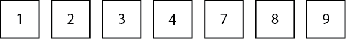
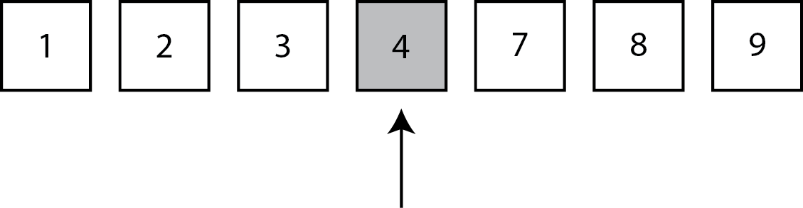
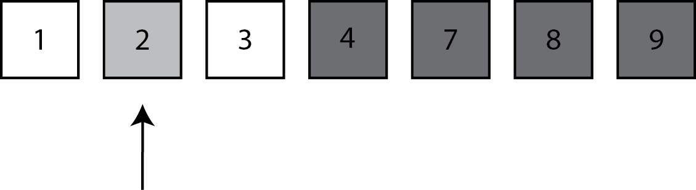
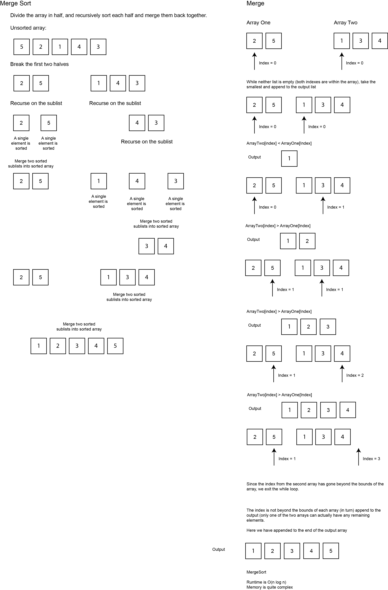
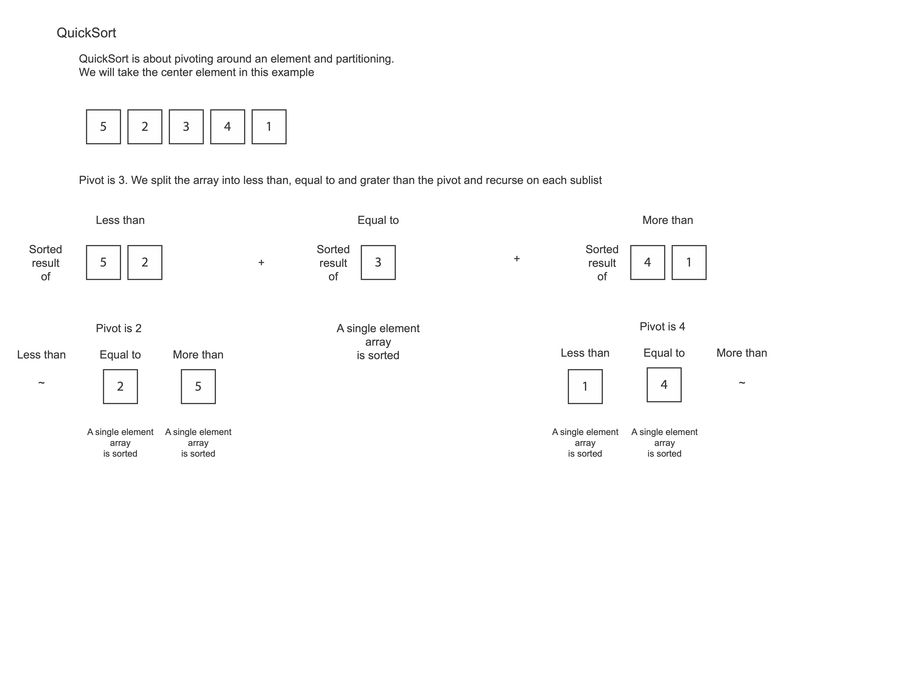

# Divide and Conquer Algorithms Using Swift
## Make it work faster!


Difficulty: **Beginner** | Easy | Normal | Challenging<br/>
This article has been developed using Xcode 12.1, and Swift 5.3

## Prerequisites:
* Some knowledge about recursion would be useful [article here](https://stevenpcurtis.medium.com/recursion-a-swift-story-about-recursion-f54fc84dd4ae) 

## Terminology
Algorithm: A process or set of rules to be followed

Divide and conquer: A problem solving method that works by breaking down a problem into two or more sub-problems which ar ethen combined to gice a solution

Subproblems: A problem whose solution contributes to the solution of a larger problem

# What is divide and conquer?
Divide and conquer is a way of solving problems. In everyday English we even use the saying "divide and rule" as the policy to maintain control over subordinates by encouraging dissent between them. Divide and conquer is similar, but we attempt to create easy to solve problems that then go back to solve the original problem we intented to solve.

# The divide and conquer strategy
* Divide the problem into smaller subproblems
* Conquer the sub-problems by solving them independently
* Combine the results of conquering the sub-problems together

# Binary Search
Binary search is probably the most common introduction to the divide and conquer strategy. For a full explanation (in Swift!) take a look at [this article](https://medium.com/swift-coding/binary-search-in-swift-f38957f23ae). An important prerequisite is the input array is in order.

The following array `[1,2,3,4,7,8,9]` is going to be searched for the element `2`: Note that it is clear on first glance that 2 is in the array, however we will follow the steps to find the element!



When we start we look for the element at the middle place of the array (position 3, element 4).



Since the element we are looking for is less than the middle element (2<4!) we know that the result is on the left hand side of the array (0..2) - so we no longer need to consider the upper half of the array.



We look at the middle element, and it is the one we are looking for so we are done!

One nice implementation of this is shown below, including the testing for the binary search:
```swift
import UIKit
import PlaygroundSupport
import XCTest

func binarySearch (arr: [Int], target : Int) -> Int? {
    guard arr.count > 0 else {return nil}
    func binarySearch (_ arr: [Int], _ target : Int, _ lowerBound: Int, _ upperBound: Int) -> Int? {
        if lowerBound > upperBound {return nil}
        let mid = lowerBound + (upperBound - lowerBound) / 2
        if arr[mid] == target {return mid}
        if arr[mid] < target {
            return binarySearch(arr, target, mid + 1, upperBound)
        } else {
            return binarySearch(arr, target, lowerBound, mid - 1)
        }
    }
    return binarySearch(arr, target, 0, arr.count - 1)
}

class binarySearchTests: XCTestCase {
    override func setUp() {
        super.setUp()
    }
    override func tearDown() {
        super.tearDown()
    }
        func testCantFind() {
            XCTAssertEqual(binarySearch(arr: [], target: 0), nil)
            XCTAssertEqual(binarySearch(arr: [1], target: 0), nil)
            XCTAssertEqual(binarySearch(arr: [1,2], target: 3), nil)
            XCTAssertEqual(binarySearch(arr: [1,2,3,4], target: 5), nil)
            XCTAssertEqual(binarySearch(arr: [1,2,3,4], target: 0), nil)
        }
        func testmidElement() {
            XCTAssertEqual(binarySearch(arr: [1], target: 1), 0)
            XCTAssertEqual(binarySearch(arr: [1,2,3], target: 2), 1)
            XCTAssertEqual(binarySearch(arr: [1,2,3,4,5], target: 3), 2)
        }
        func testElementinArray() {
            XCTAssertEqual(binarySearch(arr: [1,2], target: 2), 1)
            XCTAssertEqual(binarySearch(arr: [1,2,3,4,5,6,7,8], target: 7), 6)
            XCTAssertEqual(binarySearch(arr: [1,2,3,4,5,6,7,8,55,66,88,99,100,101,105], target: 99), 11)

            XCTAssertEqual(binarySearch(arr: [2,3,4,5,6], target: 5), 3)
            XCTAssertEqual(binarySearch(arr: [2,4,6,8], target: 6), 2)
            XCTAssertEqual(binarySearch(arr: [3,4,16,23], target: 16), 2)
        }
        func testFirstElement() {
            XCTAssertEqual(binarySearch(arr: [1,2], target: 2), 1)
            XCTAssertEqual(binarySearch(arr: [1,2,3], target: 1), 0)
            XCTAssertEqual(binarySearch(arr: [7,8,9,10], target: 7), 0)
    
        }
        func testLastElement() {
            XCTAssertEqual(binarySearch(arr: [1,2], target: 2), 1)
            XCTAssertEqual(binarySearch(arr: [1,2,3], target: 3), 2)
            XCTAssertEqual(binarySearch(arr: [1,2,3,4], target: 4), 3)
            XCTAssertEqual(binarySearch(arr: [1,2,3,4,5], target: 5), 4)
        }
}

binarySearchTests.defaultTestSuite.run()
```

## Merge Sort
A merge sort is a relatively complex sort, yet is highly efficent (at least compared to bubble sort).



This algorithm makes it clear that we combine the resultant sub-problems into the eventual result. 

```swift
import UIKit
import XCTest

func mergeSort(_ inputArray: [Int]) -> [Int] {
    guard inputArray.count > 1 else {return inputArray}
    let midpoint = inputArray.count / 2
    let firstArr = Array(inputArray[0..<midpoint])
    let secondArr = Array(inputArray[midpoint..<inputArray.count])
    return merge( mergeSort(firstArr), mergeSort(secondArr) )
}

// merge assumes the input arrays themselves are sorted
func merge(_ arrOne: [Int], _ arrTwo: [Int]) -> [Int] {
    var result = [Int]()
    var firstArr = arrOne
    var secondArr = arrTwo
    while let fa = firstArr.first, let sa = secondArr.first {
        if firstArr.first! < secondArr.first! {
            result.append(fa)
            firstArr.removeFirst()
        } else {
            result.append(sa)
            secondArr.removeFirst()
        }
    }
    
    while let fa = firstArr.first {
        result.append(fa)
        firstArr.removeFirst()
    }
    
    while let sa = secondArr.first {
        result.append(sa)
        secondArr.removeFirst()
    }
    return result
}

class sortingTests: XCTestCase {
    override func setUp() {  }
    func testSorts() {
        XCTAssertEqual( mergeSort([1,2,3,4,5]), [1,2,3,4,5] )
        XCTAssertEqual( mergeSort([3,2,1]), [1,2,3] )
        XCTAssertEqual( mergeSort([1,2,3]), [1,2,3] )
        XCTAssertEqual( mergeSort([5,4,3,2,1]), [1,2,3,4,5] )
        XCTAssertEqual( mergeSort([4,1,3,9,7]), [4,1,3,9,7].sorted() )
        XCTAssertEqual( mergeSort([10,9,8,7,6,5,4,3,2,1]), [10,9,8,7,6,5,4,3,2,1].sorted() )
    }
    
    func testMerge() {
        XCTAssertEqual( merge([1,2],[]), [1,2])
        XCTAssertEqual( merge([],[1,2]), [1,2])
        XCTAssertEqual( merge([1,2], [1,2]), [1,1,2,2] )
    }
}

sortingTests.defaultTestSuite.run()
```

## Quick Sort



Once again the algorithm works in a divide and conquer fashion: 
* Divide the problem into smaller subproblems
* Conquer the sub-problems by solving them independently
* Combine the results of conquering the sub-problems together

```swift
import UIKit
import XCTest

func quicksort(_ arr: [Int]) -> [Int] {
    if arr.count <= 1 {return arr}
    let pivot = arr.count / 2
    let fp = arr.filter{$0 < arr[pivot]}
    let equal = arr.filter{$0 == arr[pivot]}
    let lp = arr.filter{$0 > arr[pivot]}
    return  quicksort(fp) + equal + quicksort(lp)
}

quicksort([5,4,3,2,1]) // [1,2,3,4,5]

class sortingTests: XCTestCase {
    override func setUp() {  }
    func testSorts() {
        XCTAssertEqual( quicksort([1,2,3,4,5]), [1,2,3,4,5] )
        XCTAssertEqual( quicksort([3,2,1]), [1,2,3] )
        XCTAssertEqual( quicksort([1,2,3]), [1,2,3] )
        XCTAssertEqual( quicksort([5,4,3,2,1]), [1,2,3,4,5] )
        XCTAssertEqual( quicksort([4,1,3,9,7]), [4,1,3,9,7].sorted() )
        XCTAssertEqual( quicksort([10,9,8,7,6,5,4,3,2,1]), [10,9,8,7,6,5,4,3,2,1].sorted() )
    }
}

sortingTests.defaultTestSuite.run()
```

# Conclusion
By breaking down a subproblem into solvable subproblems we effectivley make a problem easier for humans to understand, but also make code more maintainable and usable for the future. 

If you've any questions, comments or suggestions please hit me up on [Twitter](https://medium.com/r/?url=https%3A%2F%2Ftwitter.com%2Fstevenpcurtis)
