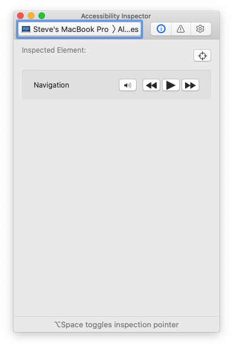
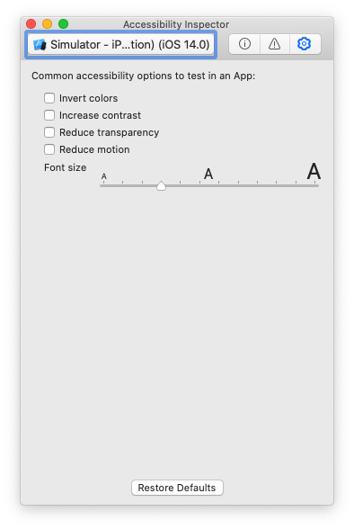

# Dynamically change fonts for your user (Dynamic type iOS)
## Make a good experience a great one

<br/>
<sub>Photo by Mario Gogh on Unsplash<sub>

Difficulty: Beginner | Easy | **Normal** | Challenging<br/>
This article has been developed using Xcode 12, and Swift 5.3

## Prerequisites: 
* You will be expected to be aware how to make a [Single View Application](https://medium.com/swlh/your-first-ios-application-using-xcode-9983cf6efb71) in Swift

## Terminology:
Dynamic type: A system that allows users to globally change the default font size used across iOS
UIFont: A font object
UIFontMetrics: A utility object for obtaining custom fonts that scale to support Dynamic Type

So many developers don't use dynamic type (still), and this means that you aren't respecting a user's decision to use their chosen font size (possibly for accessibility reasons) - this isn't a good look and is something you might want to work on!

Worse, we may (as you'll see in the example below) it is easy to implement dynamic type that does not respond to the user making changes in Settings or Control Center - which is simply an experience which isn't good enough for your users.

# Solutions
These solutions are going to move through solutions that allow the text size to be updated. did someone say observers? It's best to read on.

You'll set up a `UILabel` as usual, and crucially set up preferred font - this is your user's preferred font!

```swift
textLabel.font = UIFont.preferredFont(forTextStyle: .headline)
```

The font style gives you a choice of the following:

```swift
body
callout
caption1
caption2
footnote
headline
subheadline
largeTitle
title1
title2
title3
```

which can be your choice of font depending on the text that you are setting.

**Setting static text**

Static text will never change, and this is kind of the *default* mode in iOS. So when we set a `UILabel` with the following

```swift
textLabel.text = "this text size should not change"
textLabel.numberOfLines = 0
textLabel.font = UIFont.preferredFont(forTextStyle: .headline)
```

it won't change. Now this on a device means that the user goes to `settings>Display & Brightness>Text Size` and moves a slider to change their preference (which should look something like the following image):

<br/>

Now this might be tricky if you are using the simulator to test your App. In this case in Xcode you move to the Xcode Menu and then select `Open developer tool>Open accessibility inspector` and from there you'll need to select your simulator.

<br/>

You can then select the gears (commonly associated with settings) 

<br/>

then you can select the suitable font - and then nothing will happen (and that's an oops)!

**Adding adjustsFontForContentSizeCategory**
```swift
dynamicTextLabel.text = "this text size should change"
dynamicTextLabel.font = UIFont.preferredFont(forTextStyle: .headline)
dynamicTextLabel.adjustsFontForContentSizeCategory = true
dynamicTextLabel.numberOfLines = 0
```
this is job done!

But there are other solutions.

**Adding a NotificationCenter Observer**
In the `viewDidLoad` we can add the following:
```swift
NotificationCenter.default.addObserver(self, selector: #selector(preferredContentSizeChanged(_:)), name: UIContentSizeCategory.didChangeNotification, object: nil)
```

and then update when we receive the notification
```swift
@objc func preferredContentSizeChanged(_ notification: Notification) {
    dynamicTextLabelObserver.font = UIFont.preferredFont(forTextStyle: .headline)
}
```

**traitCollectionDidChange**
We will be informed when the traitcollection changes, and can adjust our font accordingly:
```swift
    override func traitCollectionDidChange(_ previousTraitCollection: UITraitCollection?) {
        super.traitCollectionDidChange(previousTraitCollection)
        if previousTraitCollection?.preferredContentSizeCategory != traitCollection.preferredContentSizeCategory {
            dynamicTextSizeCategory.font = UIFont.preferredFont(forTextStyle: .headline)
        }
    }
```

which all seems awesome, and is all contained in the [repo](https://github.com/stevencurtis/SwiftCoding/tree/master/DynamicType) which seems great.

But what if you are using a *custom font*??

# Coping with a custom font

I've dragged and dropped `Roboto-Regular.ttf` into my project, added `Fonts provided by application` `Roboto-Regular.ttf` into the `Info.plist`.

This should all be nice!

But the font won't change even if we set it (as usual) with something like the following:
```swift
if let font = UIFont(name: "Roboto-Regular", size: 16) {
    textLabel.font = font
}
```

rather (taking the example of using `adjustsFontForContentSizeCategory = true`) we can use `UIFontMetrics`which essentially passes the custom font and then creates a font object that can be scaled.

```swift
dynamicTextLabel.text = "this text size should change"
if let font = UIFont(name: "Roboto-Regular", size: 16) {
    let fontMetrics = UIFontMetrics(forTextStyle: .headline)
    dynamicTextLabel.font = fontMetrics.scaledFont(for: font)
}
dynamicTextLabel.adjustsFontForContentSizeCategory = true
dynamicTextLabel.numberOfLines = 0
```

This can of course be combined with any of the techniques detailed above. Isn't that nice?

# Conclusion
Creating an App that the user can use adjust to their preferences isn't a *nice to have*, but is rather essential when it involves accessibility.

Getting your App up to speed with accessibility is important, and is a great way to prevent your App putting artificial barriers in the way of people using your (no doubt great) App.

If you've any questions, comments or suggestions please hit me up on [Twitter](https://twitter.com/stevenpcurtis) 
