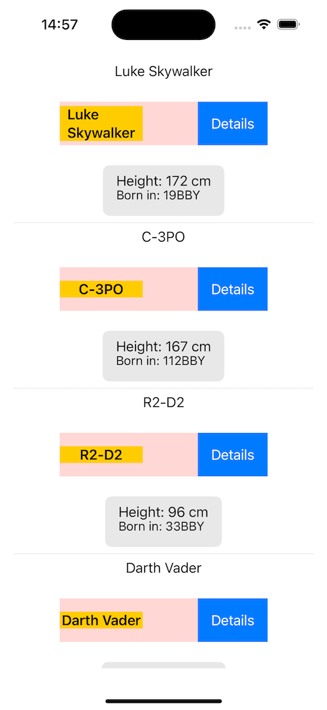
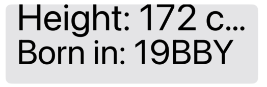
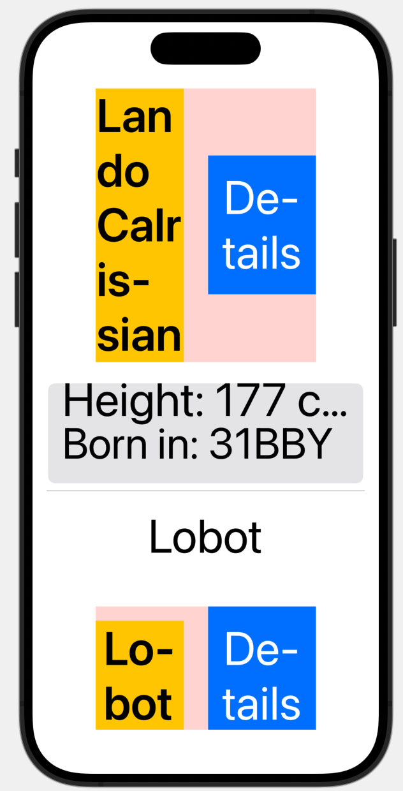
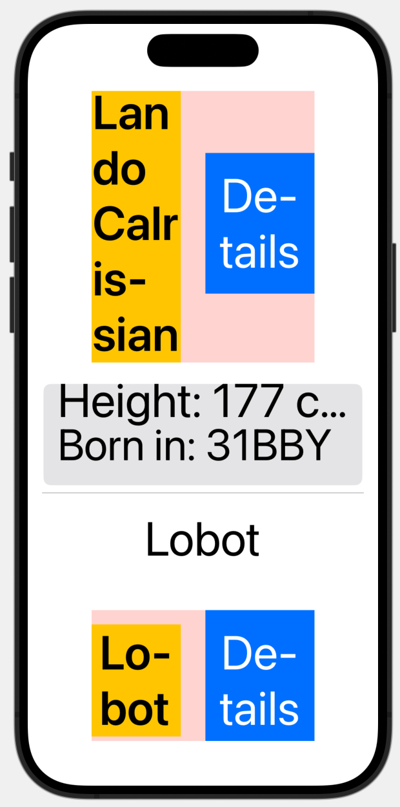

# Common Dynamic Type Pitfalls in SwiftUI and How to Avoid Them
## Make it all bigger

This article is intended to cover common issues when using dynamic type in SwiftUI.

If you're not currently enabling dynamic type in your SwiftUI applications you're missing a great opportunity to improve your code. Read on and fid out a little about this great feature!

# Terminology
Dynamic type: A feature in iOS that allows users to adjust the size of text across the system and apps to improve readability, ensuring content adapts to the user’s preferred text size for better accessibility


# Understanding Dynamic Type in SwiftUI
Dynamic type is an essential iOS feature because it allows users to customize the size of text across their system, and therefore can enhance the accessibility of a given application.

This is automatically supported in SwiftUI for system-defined fonts like `.body`, `.heading` and `.title`, so when users increase their text size preferences in system settings the text elements dynamically scale to accommodate changes ensuring better readability and accessibility.

#Enabling Dynamic Type
## Apply a predefined text style
In SwiftUI you can apply a predefined text style that automatically scales according to the user's preferred text size settings. SwiftUI has built-in text styles like `.headline` and `.body` that are designed to adapt dynamically ensuring the text resizes appropriately for dynamic type settings. 

```swift
Text(person.name)
    .font(.headline)
```

## UIFontMetrics
If you are using custom fonts, you can scale them dynamically by using `UIFontMetrics` 

```swift
Text("Hello, World!")
    .font(Font.system(size: UIFontMetrics.default.scaledValue(for: 16)))
```

# Benefits and limitations
SwiftUI provides several advantages when it comes to handling dynamic type.

- Automatic Scaling (when using system-defined fonts like `.body`).
- Automatic Layout Adjustments The layout system adapts to changes in text size, resizing elements to fit.

This is all great, but there are some challenges we need to be aware of.

- Custom fonts. SwiftUI doesn't automatically scale custom fonts.
- Complex layouts. More complex layouts may require additional testing and adjustments as well as. This is to prevent truncation, overlapping, inconsistent sizing, while taking int account performance considerations. 

To demonstrate this I decided to create a sample project

# The Project
I've used my [Network Client](https://github.com/stevencurtis/NetworkClient) and Combine to create a reasonable project that uses the `https://swapi.dev/api/people/` endpoint to display some StarWars characters. Don't panic, it uses a stripped-down version of MVVM. The colours of the components are shown to make it easier to see the changes.

Here is the example project with a standard-sized 
<br>


## Truncated Content
If we ramp up the size of the dynamic type we may have an issue with this:

<br>

```swift
struct PersonDetailView: View {
    let person: Person

    var body: some View {
        VStack(alignment: .leading) {
            Text("Height: \(person.height) cm")
                .font(.body)
                .frame(height: 5)
            
            Text("Born in: \(person.birthYear)")
                .font(.subheadline)
        }
        .padding()
        .background(Color.gray.opacity(0.2))
        .cornerRadius(8)
    }
}
```

The issue here is the `.frame(height: 5)` that limits the height of the person.height display (the same effect can be given by a `.lineLimit` modifier too).

As a result some of the content is truncated

## Inconsistent Sizing
Alternatively if we have elements that have no constraints other than their sizing may mean similar parts of the display are sized inconsistently. Such as -



which is caused by the view having no constraints here other than the width around the name.

```swift
struct PersonRowView: View {
    let person: Person

    var body: some View {
        HStack {
            Text(person.name)
                .font(.headline)
                .frame(width: 100)
                .background(Color.yellow)

            Spacer()
            
            Button(action: {}) {
                Text("Details")
                    .padding()
                    .background(Color.blue)
                    .foregroundColor(.white)
            }
        }
        .frame(width: 250)
        .background(Color.red.opacity(0.2))
        .padding()
    }
}
```

## Inconsistent Frames
If we want to have frames positioned in such a way to meet a design, the following may not be appropriate.


Since the spacer changes to fit the content, for each row it isn't consistent which may not be expected.

```swift
struct PersonRowView: View {
    let person: Person

    var body: some View {
        HStack {
            Text(person.name)
                .font(.headline)
                .frame(width: 100)
                .background(Color.yellow)

            Spacer()
            
            Button(action: {}) {
                Text("Details")
                    .padding()
                    .background(Color.blue)
                    .foregroundColor(.white)
            }
        }
        .frame(width: 250)
        .background(Color.red.opacity(0.2))
        .padding()
    }
}
```

## Scrollable Content and Performance
In this example we use a `ScrollView` to enable to user to see all of the people returned from the endpoint. This means that the view has room to grow and move according to the size of the elements. Great stuff!

Because we are using a `LazyVStack` we also only display elements when required to, and this is something that applies when we are using dynamic type too.

```swift
struct ContentView: View {
    let viewModel: ContentViewModel
    var body: some View {
        ScrollView {
            LazyVStack {
                if viewModel.isLoading {
                    ProgressView()
                } else {
                    ForEach(viewModel.people, id: \.name) { person in
                        Text(person.name)
                            .onAppear {
                                viewModel.loadMoreContentIfNeeded(person: person)
                            }
                        PersonRowView(person: person)
                        PersonDetailView(person: person)
                        Divider()
                    }
                }
            }
        }
        .onAppear(perform: viewModel.fetchPeople)
        .padding()
    }
}
```

# Best Practices for Dynamic Type
## Flexible Layouts
Use flexible layouts like HStack, VStack, and ZStack with dynamic spacing (avoid hardcoded frames).
## Use .fixedSize() When Necessary
Sometimes you might want text to take up as much space as possible, without compressing other content, by using .fixedSize(horizontal: false, vertical: true).
## Test Across Dynamic Type Settings
Emphasize the importance of testing with different Dynamic Type settings (including accessibility sizes). Show how to enable Larger Text in the simulator or device settings.
## Limit where necessary
The `dynamicTypeSize()` modifier can be used to limit how content behaves. Providing a size to the modifier will force the dynamic type size (no matter the user setting).

```swift
Text("Force small size")
    .dynamicTypeSize(.small)
```

similarly [a range can be used.](https://developer.apple.com/documentation/swiftui/view/dynamictypesize(_:)-3t03f)
## Provide Scrollable Content
Suggest that if content grows too large, it should be scrollable (e.g., using ScrollView), but only when necessary.

```swift
struct ContentView: View {
    let viewModel: ContentViewModel
    var body: some View {
        ScrollView {
            LazyVStack {
                if viewModel.isLoading {
                    ProgressView()
                } else {
                    ForEach(viewModel.people, id: \.name) { person in
                        Text(person.name)
                            .onAppear {
                                viewModel.loadMoreContentIfNeeded(person: person)
                            }
                        PersonRowView(person: person)
                        PersonDetailView(person: person)
                        Divider()
                    }
                }
            }
        }
        .onAppear(perform: viewModel.fetchPeople)
        .padding()
    }
}
```

# Conclusion

Dynamic type is not just a feature, but a critical aspect of accessibility in iOS apps. As shown in this article, while SwiftUI offers several tools that make dynamic type easier to implement, it’s crucial to recognize and address its limitations, especially with custom fonts and complex layouts. By following best practices such as testing across dynamic type settings, providing scrollable content where needed, and thoughtfully managing custom font scaling, developers can ensure a seamless and accessible user experience.
