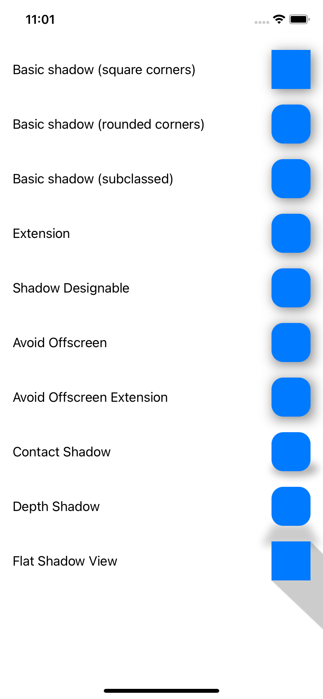
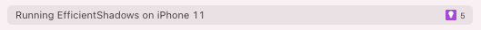

# Efficient UIKit Shadows
## Shadows have never been so much fun


<sub>Image by Katrin Leinfellner @k_ti<sub>

# Before we start
Difficulty: Beginner | **Easy** | Normal | Challenging<br>
This article has been developed using Xcode 12.2, and Swift 5.3

## Prerequisites
* You'll need to either be able to write [an iOS application](https://medium.com/swlh/your-first-ios-application-using-xcode-9983cf6efb71) or write some Swift code in [Playgrounds](https://medium.com/@stevenpcurtis.sc/coding-in-swift-playgrounds-1a5563efa089)

## Keywords and Terminology
Storyboard: A visual representation of the User Interface of an Application
UIView: An object that manages the content for a rectangular area on the screen

# This article
## Background
Oh shadows. You are likely to want to put shadows on `UIView` subclasses when you use UIKit, and it seems reasonably simple - A `UIView` has a layer and shadows can be applied programmatically using the following properties"

* shadowColor
* shadowOffset
* shadowOpacity
* shadowPath
* shadowRadius

which (as we shall see) can pretty simply create shadows.

However, what if we are (and we all should be) interested in *performance* and *rounded corners* (because you have a designer who, you know, can design).

Taking that all into account? That is the function of this article.

## The Implementation
I've put all of the views into a `UIScrollView`, and they have been added to the storyboard using [this technique](https://medium.com/@stevenpcurtis.sc/create-a-uistackview-in-a-uiscrollview-e2a959fa061), but with some layout margins around the outer `UIStackView` 
.

What does it look like? The following:



# A basic shadow view

```swift
basicView.layer.shadowRadius = 8
basicView.layer.shadowOffset = CGSize(width: 3, height: 3)
basicView.layer.shadowOpacity = 0.5
```

# A basic shadow view with rounded corners
```swift
basicViewRounded.layer.shadowRadius = 8
basicViewRounded.layer.shadowOffset = CGSize(width: 3, height: 3)
basicViewRounded.layer.shadowOpacity = 0.5
basicViewRounded.layer.cornerRadius = 15
```

# Doing better: subclassing
This is horrible?

Every time I would want to use a **ShadowView** I would need to rewrite the same code. That is pretty poor in terms of [code reuse](https://stevenpcurtis.medium.com/the-solid-principle-applied-to-swift-974e29b94d23) - so let us set up a subclass.

We should be able to set up a subclass of a `UIView` using [this technique](https://medium.com/@stevenpcurtis.sc/subclassing-a-uiview-d372c67b7f3)

```swift
class ShadowView: UIView {
    override init(frame: CGRect) {
        super.init(frame: frame)
        setupShadow()
    }
    
    func setupShadow() {
        layer.shadowRadius = 8
        layer.shadowOffset = CGSize(width: 3, height: 3)
        layer.shadowOpacity = 0.5
        layer.cornerRadius = 20
        self.backgroundColor = .white
        self.translatesAutoresizingMaskIntoConstraints = false
    }

    required init?(coder aDecoder: NSCoder) {
        super.init(coder: aDecoder)
        setupShadow()
    }
}
```

and then we can select the **ShadowView** class in Interface Builder:


# Doing better: An Extension
Can't we set up a subclass that would allow us to change properties like `cornerRadius` and `shadowOpacity` from the storyboard? 

```swift
@IBDesignable
extension UIView {

    @IBInspectable
    var cornerRadius: CGFloat {
        get {
            return layer.cornerRadius
        }
        set {
            layer.cornerRadius = newValue
        }
    }

    @IBInspectable
    var borderWidth: CGFloat {
        get {
            return layer.borderWidth
        }
        set {
            layer.borderWidth = newValue
        }
    }

    @IBInspectable
    var borderColor: UIColor? {
        get {
            if let initcolor = layer.borderColor  {
                return UIColor.init(cgColor: initcolor) }
            return nil
        }
        set {
            layer.borderColor = newValue?.cgColor
        }
    }

    @IBInspectable
    var shadowRadius: CGFloat {
        get {
            return layer.shadowRadius
        }
        set {
            layer.shadowRadius = newValue
        }
    }
    
    @IBInspectable
    var shadowOffset : CGSize{
        get {
            return layer.shadowOffset
        } set {
            layer.shadowOffset = newValue
        }
    }

    @IBInspectable
    var shadowColor : UIColor {
        get {
            if let shadow = layer.shadowColor {
                return UIColor.init(cgColor: shadow)
            }
            return UIColor.init(cgColor: layer.shadowColor ?? UIColor.blue.cgColor)
        }
        set {
            layer.shadowColor = newValue.cgColor
        }
    }
    
    @IBInspectable
    var shadowOpacity : Float {
        get {
            return layer.shadowOpacity
        }
        set {
            layer.shadowOpacity = newValue
        }
    }
}
```

# Doing better: Seeing changes with @IBDesignable
I've previously written about [IBDesignable](https://medium.com/@stevenpcurtis.sc/using-ibdesignable-and-ibinspectable-in-swift-36d3e6befaa1), and taking this knowledge we can create a Swift `UIView` subclass. Note that this only works with the `UIView` extensions described earlier in this article.

```swift
@IBDesignable
class ShadowDesignable: UIView {}
```

Now when changes are made, they are reflected dynamically in the Storyboard.

## Review so far
Each of the previous implementations works, and even works when the device is rotated. 
There is one problem, however. 

Performance.

This performance problem is flagged up by Xcode when using the Visual Debugger
.

Dynamic shadow calculation means that it is computationally expensive to create shadows. Since we are using `CALayer` shadow, we are using off-screen rendering that is wholly performed on the CPU (rather than on the GPU).

Xcode has a rather wonderful menu for this: Running on a device you can select *Debug>View Debugging>Rendering>Color Offscreen-Rendered Yellow.


Which means that we are using offscreen rendering for each of these views.

Can't we do better?

You'd better hope so!

# Avoiding offscreen rendering
Right, to avoid offscreen rendering we can take the subclassed type, and override layoutSubviews(), and (wait for it) there is one important line: `layer.shadowPath = UIBezierPath(rect: bounds).cgPath` which means that we are setting the shadowPath so that we can calculate the shadow without that offscreen pass. This is placed in `layoutSubviews` since this needs to be recalculated each time the bounds change, making `layoutsubviews` the ideal place to do it.

```swift
class ShadowViewWithPath: UIView {
    override init(frame: CGRect) {
        super.init(frame: frame)
        setupColor()
    }

    override func layoutSubviews() {
        super.layoutSubviews()
        layer.shadowPath = UIBezierPath(rect: bounds).cgPath
        layer.shadowRadius = 8
        layer.shadowOffset = CGSize(width: 3, height: 3)
        layer.shadowOpacity = 0.5
        layer.cornerRadius = 15
    }
    
    func setupColor() {
        self.backgroundColor = .systemBlue
        self.translatesAutoresizingMaskIntoConstraints = false
    }

    required init?(coder aDecoder: NSCoder) {
        super.init(coder: aDecoder)
        setupColor()
    }
}
```

# Avoiding offscreen rendering: with an extension
We use the previously defined extension (above), and once again define the shadowPath. This can be seen with the following code snippet:

```swift
@IBDesignable
class ShadowDesignableWithPath: UIView {
    override func layoutSubviews() {
        layer.shadowPath = UIBezierPath(rect: bounds).cgPath
    }
}
```

# Contact Shadow
This is a shadow designed to be a circle underneath the item. This is implemented with a `UIView` subclass and within the `layoutSubviews()` function there following has been implemented. 

```swift
let shadowSize: CGFloat = 20
// create the size of the oval to draw the oval within
let contactRect = CGRect(x: 0, y: 50 - (shadowSize * 0.5), width: 20 + shadowSize * 2, height: shadowSize)
// create the val shadowPath
layer.shadowPath = UIBezierPath(ovalIn: contactRect).cgPath
// define the radius of the shadow
layer.shadowRadius = 5
// define the shadowOpacity of the shadow
layer.shadowOpacity = 0.3
```

# Depth Shadow
This is a shadow designed with a longer shadow giving a 3D effect coming out at the user. This is implemented with a `UIView` subclass and within the `layoutSubviews()` function there following has been implemented. 

```swift
// the radius of the shadow
let shadowRadius: CGFloat = 5
// the width of the shadow
let shadowWidth: CGFloat = 1.25
// the height of the shadow
let shadowHeight: CGFloat = 0.5
// the height of the frame
let height: CGFloat = frame.height
// the width of the frame
let width: CGFloat = frame.width

// the shadowPath to be drawn
let shadowPath = UIBezierPath()
shadowPath.move(to: CGPoint(x: shadowRadius / 2, y: height - shadowRadius / 2))
shadowPath.addLine(to: CGPoint(x: width - shadowRadius / 2, y: height - shadowRadius / 2))
shadowPath.addLine(to: CGPoint(x: width * shadowWidth, y: height + (height * shadowHeight)))
shadowPath.addLine(to: CGPoint(x: width * -(shadowWidth - 1), y: height + (height * shadowHeight)))
// assign the shadowPath
layer.shadowPath = shadowPath.cgPath
// assign the shadowRadius
layer.shadowRadius = shadowRadius
// assign the shadowOffset
layer.shadowOffset = .zero
// assign the shadowOpacity
layer.shadowOpacity = 0.2
```

# Flat Shadow View
This is a shadow designed with a long straight cast shadow. This is implemented with a `UIView` subclass and within the `layoutSubviews()` function there following has been implemented. 

```swift
// the height of the frame
let height: CGFloat = frame.height
// the width of the frame
let width: CGFloat = frame.width
// assign the shadowRadius
layer.shadowRadius = 0
// assign the shadowOffset
layer.shadowOffset = .zero
// assign the shadowOpacity
layer.shadowOpacity = 0.2

// define the offset for the bottom of the shadow
let shadowOffsetX: CGFloat = 1000
// the shadowPath to be drawn
let shadowPath = UIBezierPath()
shadowPath.move(to: CGPoint(x: 0, y: height))
shadowPath.addLine(to: CGPoint(x: width, y: 0))
shadowPath.addLine(to: CGPoint(x: width + shadowOffsetX, y: 1000))
shadowPath.addLine(to: CGPoint(x: shadowOffsetX, y: 1000))
// assign the shadowPath
layer.shadowPath = shadowPath.cgPath
```

# Conclusion

If you've any questions, comments or suggestions please hit me up on [Twitter](https://twitter.com/stevenpcurtis) 
