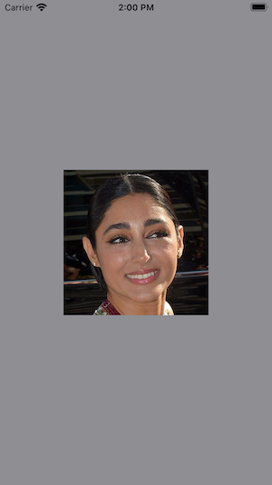
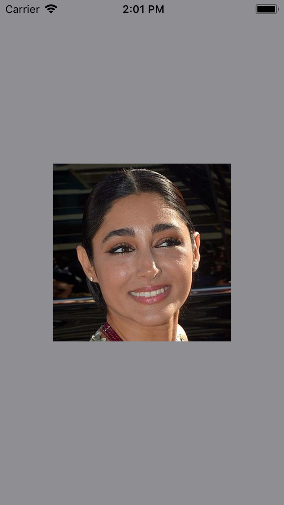

# Maintain Compatibility with iOS11 in 2020
## It CAN be done

<br/>

Difficulty: Beginner | Easy | **Normal** | Challenging<br/>
This article has been developed using Xcode 11.4.1, and Swift 5.2.2

# The example
I'm going to get rid of the `Storyboard` as I work like that [here's how to do it](https://medium.com/@stevenpcurtis.sc/avoid-storyboards-in-your-apps-8e726df43d2e). Sorry.

I'm going to have an initial view controller that just displays an image of **Golshifteh Farahani**. Sorry for lack of originality. 

# The Scene Delegate (iOS 13+)
We are going to need to launch the `InitialViewController`. This reqyures replacing

```swift
    func scene(_ scene: UIScene, willConnectTo session: UISceneSession, options connectionOptions: UIScene.ConnectionOptions) {
        // Use this method to optionally configure and attach the UIWindow `window` to the provided UIWindowScene `scene`.
        // If using a storyboard, the `window` property will automatically be initialized and attached to the scene.
        // This delegate does not imply the connecting scene or session are new (see `application:configurationForConnectingSceneSession` instead).
        guard let _ = (scene as? UIWindowScene) else { return }
    }
``` 

with 

```swift
    func scene(_ scene: UIScene, willConnectTo session: UISceneSession, options connectionOptions: UIScene.ConnectionOptions) {
        guard let windowScene = (scene as? UIWindowScene) else { return }
        window = UIWindow(frame: windowScene.coordinateSpace.bounds)
        window?.windowScene = windowScene
        self.window?.rootViewController = InitialViewController()
        window?.makeKeyAndVisible()
    }
```

but of course we will also need an instance variable to hold the reference for the window.

```swift
var window: UIWindow?
```

But what about iOS11? 

If we change the deployment target in the project 

[DeploymentTarget](Images/DeploymentTarget.png)

which then allows you to choose iOS11 simulators (as long as you have them added in Xcode.

Then...

Oh dear!

[ohdear](Images/ohdear.png)

So we need to work through the App delegate!

# The Aoo Delegate
We are going ahead to fix those errors.

We add a property for `UIWindow`:

```swift
    var window: UIWindow?
```

and change the `func application(application: didFinishLaunchingWithOptions:) -> Bool` function to 

```swift 
func application(_ application: UIApplication, didFinishLaunchingWithOptions launchOptions: [UIApplication.LaunchOptionsKey: Any]?) -> Bool {
     if #available(iOS 13.0, *) {
        // move to SceneDelegate
    } else {
        // Support for iOS11
        self.window = UIWindow(frame: UIScreen.main.bounds)
        self.window!.rootViewController = InitialViewController()
        self.window?.makeKeyAndVisible()
    }
    return true
}```

and both of the subsequent functions are only supported from iOS13, and need to be marked as such:

```swift
@available(iOS 13.0, *)
```

**Fix the SceneDelegate**
We only wish to use the `SceneDelegate` if it is avaliable, so we can put the following statement
`@available(iOS 13.0, *)`
just above the `SceneDelegate` class declaration.

Now this works on iOS11 devices!

<br/>

# Conclusion
It is rather complex in the description, but rather easy in the implementation. Take a look at the  attached [Repo](https://github.com/stevencurtis/SwiftCoding/tree/master/ElevenCompatibility). It is a rather wonderful thing.

If you've any questions, comments or suggestions please hit me up on [Twitter](https://twitter.com/stevenpcurtis) 