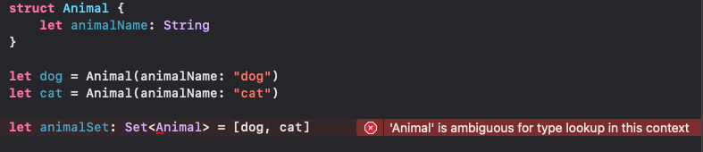

# Do enum Types Conform to Hashable in Swift?
## Is autoconformance enough?

<br/>
<sub>Photo by kaleb tapp on Unsplash<sub>

Items in a [set or a dictionary need to conform to Hashable](https://betterprogramming.pub/swifts-hashable-fd57e6cd6426)


Usually this means that we need to make sure our type conforms to `Hashable`. In this example, we are going to put a simple Animal `struct` into a set. If we do not declare conformance to `Hashable` Swift gives us a rather reassuring error:

<br/>

however the compiler can give us automatic `Hashaable` conformance, we tell the compiler that we require `Hashable` conformance (as indeed we do, to place instances of the `struct` into the set). This looks like the following code snippet:


```swift
struct Animal: Hashable {
    let animalName: String
}

let dog = Animal(animalName: "dog")
let cat = Animal(animalName: "cat")

let animalSet: Set<Animal> = [dog, cat]
```

Since the `String` property conforms to `Hashable` by default there is no more work to do (check out [this article](https://betterprogramming.pub/swifts-hashable-fd57e6cd6426) for the work that may need to be done for more complex types to conform to the Hashable protocol).

This is absolutely fine. But what about using an `enum`? We might want to do this to add types to a `set` which is, of course a slightly different situation. However, for the purposes of this article this will show the point:

```swift
enum Animal {
    case dog
    case cat
}

let animalSet: Set<Animal> = [.cat, .dog]
```

The difference here is that the enumeration (`enum`) gains `Hashable` conformance automatically - you don't even need to declare that the `enum` conforms to `Hashable`! Awesome!

What about *associated types*? 

We could add that into our `enum`, however we don't get the automatic conformance:

```swift
enum Animal {
    case dog(breed: String)
    case cat(breed: String)
}

let animalSet: Set<Animal> = [.cat(breed: "moggy"), .dog(breed: "lab")]
```

Happily, since the associated value is (in this case) `Hashable` since they are simply a `String` we can (in this case) declare conformance to `Hashable` with the same ease as in the `struct` above:

```swift
enum Animal: Hashable {
    case dog(breed: String)
    case cat(breed: String)
}

let animalSet: Set<Animal> = [.cat(breed: "moggy"), .dog(breed: "lab")]
```

# Conclusion
It is very tempting to use the compiler to overcome errors in your code, and this prevents you needing to think in order to solve code problems quickly. However, knowing what is happening when we get those `Hashable` errors and how we might solve them is a key to producing great code at speed.

Certainly we shouldn't stop thinking about our code, and in the case of `enum` getting something "for free" does not mean that we shoudn't consider what is going on under the hood.

I hope this article has been of use to you.

If you've any questions, comments or suggestions please hit me up on [Twitter](https://twitter.com/stevenpcurtis)
