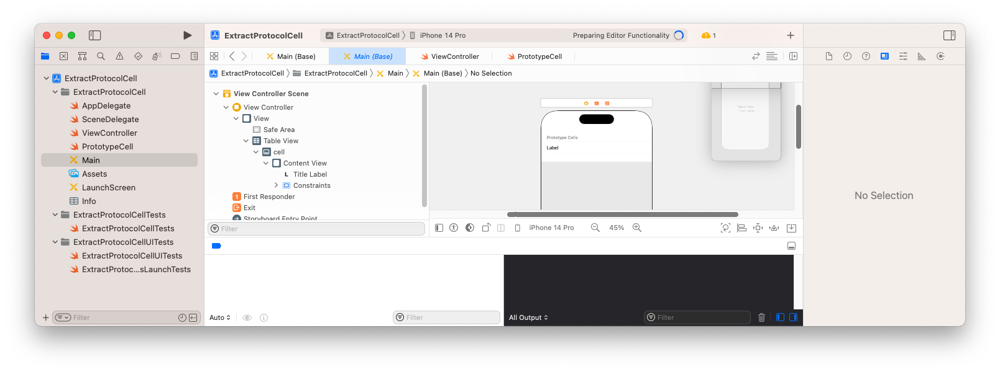
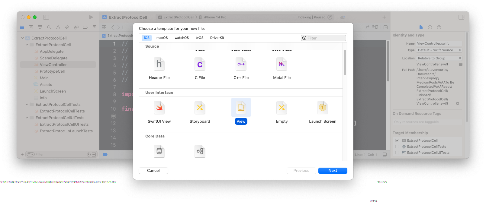
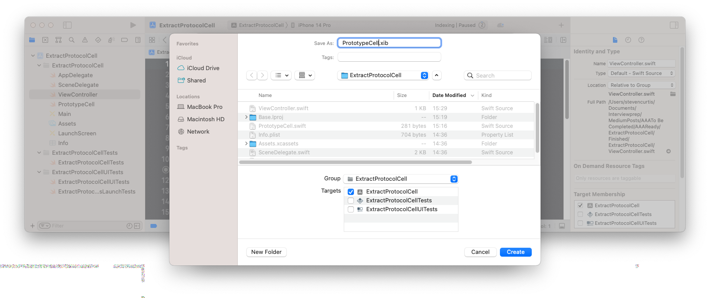
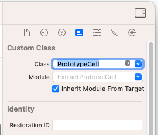
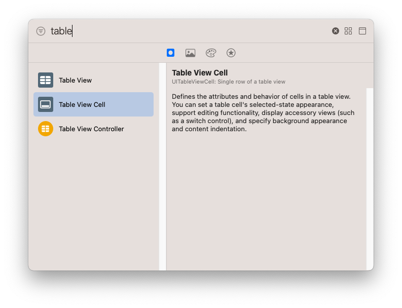
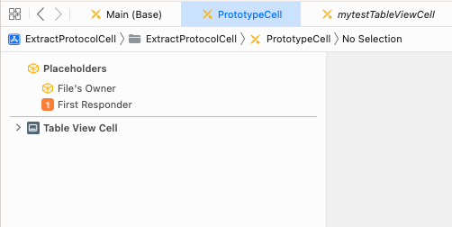
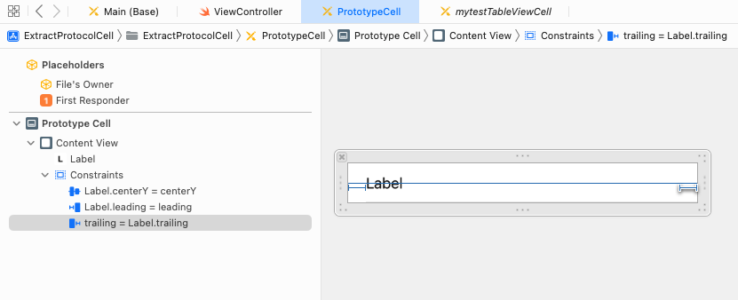
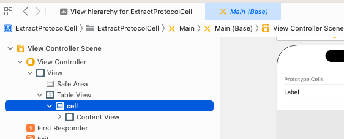
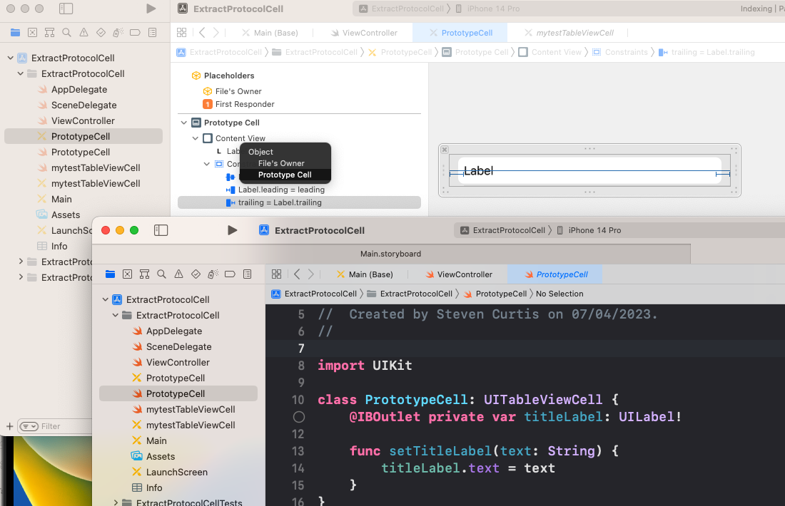

# Extract A Swift Prototype Cell
## Working in an old codebase?

If you're working in an older codebase you might have prototype cells to deal with.

Then you might need to reuse some of those cell classes. It might be a good idea to reuse code.

Here's a short demo of how that might be done!

# The existing project
It is a really simple project. Two cells in the `UITableViewCell`.


```swift
import UIKit

class ViewController: UIViewController {
    @IBOutlet private var tableView: UITableView!
    private var dataSource: [String] = ["First Title", "Second Title"]
    override func viewDidLoad() {
        super.viewDidLoad()
        tableView.dataSource = self
        tableView.delegate = self
    }
}

extension ViewController: UITableViewDataSource {
    func tableView(_ tableView: UITableView, numberOfRowsInSection section: Int) -> Int {
        return dataSource.count
    }
    
    func tableView(_ tableView: UITableView, cellForRowAt indexPath: IndexPath) -> UITableViewCell {
        let cell = tableView.dequeueReusableCell(withIdentifier: "cell", for: indexPath) as? PrototypeCell
        cell?.setTitleLabel(text: dataSource[indexPath.row])
        return cell ?? UITableViewCell()
    }
}

extension ViewController: UITableViewDelegate {
    func tableView(_ tableView: UITableView, didSelectRowAt indexPath: IndexPath) {
        print("didSelectRowAt")
    }
}
```

Which is fine. Yet oh. This implementation uses a prototype cell. That is it is a subclassed `UITableViewCell`.

```swift
import UIKit

class PrototypeCell: UITableViewCell {
    @IBOutlet private var titleLabel: UILabel!

    func setTitleLabel(text: String) {
        titleLabel.text = text
    }
}
```

But also, it's *in the storyboard*



That means I can' treally reuse that cell component. Yes, the code is subclassed but the UI is tightly coupled to the storyboard. Bad times.
Let's get that out of there and use the cell as a reusable component.

# Converting
We're going to need a new xib for the `PrototypeCell`. `File>New File…>` then choose View.



Which can then be called `PrototypeCell.xib` (to match the subclassed cell).



Then we can link this to the prototype cell in `File's Owner`.



I can then delete the cell view, and add a tableview cell



I can then add a tableviewcell



I need to then add the `UILabel` into the cell.



Delete the cell from the tableview in the Storyboard (we don't need that anymore)



We need to register the cell. I'll put this in viewDidLoad() in the viewController.

```swift
tableView.register(UINib(nibName: "PrototypeCell", bundle: nil), forCellReuseIdentifier: "cell")
```

I'll need to connect the `@IBOutlet private var titleLabel: UILabel!` to the storyboard.



Which then…works


# Conclusion
I hope this article has been of use to you. Happy reusability! 
Anyway, happy coding!

Subscribing to Medium using this link shares some revenue with me.

You might even like to give me a hand by buying me a coffee https://www.buymeacoffee.com/stevenpcuri.

If you've any questions, comments or suggestions please hit me up on Twitter
