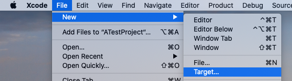
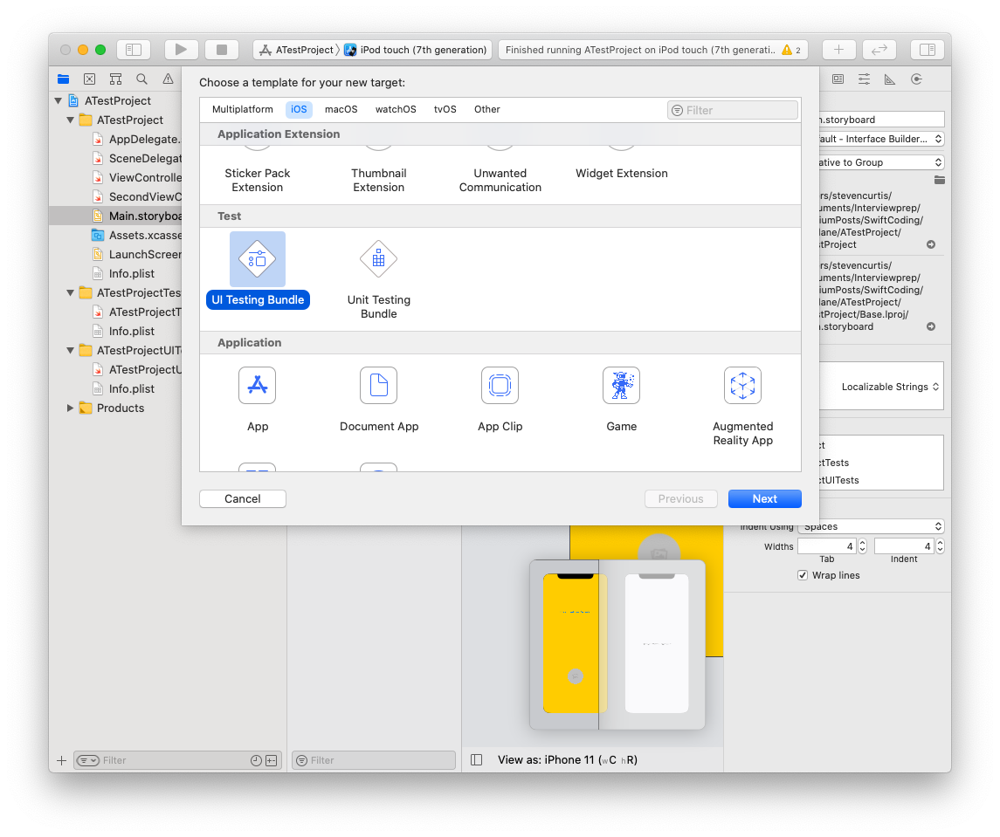
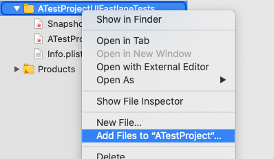
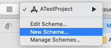
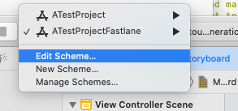
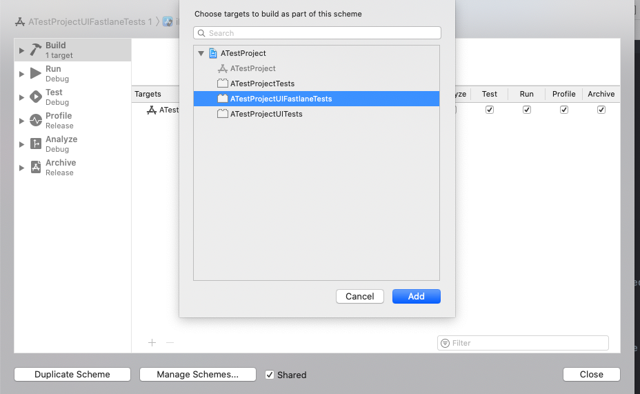

# Fastlane: Simplify Deployment
## Can you even install it?

<br/>
<sub>Photo by Z S on Unsplash<sub>

Difficulty: Beginner | **Easy** | Normal | Challenging<br/>
This article has been developed using Xcode 12, and Swift 5.3

Want to speed up your deployment? Fastlane is the key!

## Prerequisites:
* You will be expected to be aware how to make a [Single View Application](https://medium.com/swlh/your-first-ios-application-using-xcode-9983cf6efb71), or a [Playground](https://medium.com/@stevenpcurtis.sc/coding-in-swift-playgrounds-1a5563efa089) to run Swift code
* The installation of Fastlane is dependent on [Homebrew](https://brew.sh) so follow the installation instructions there first 

# Why Fastlane
Fastlane allows you to create Ruby scripts which (amongst other things) can automate the process of sending your builds to TestFlight and the App Store.

"What else Daddy?"
- Simplify provisioning profiles
- Generate and renew push notification profiles
- Increment the build number and commit changes to Git after releasing builds
- Screenshots
- Releasing
- Of course there are more listed in the [documentation](https://docs.fastlane.tools/actions/)

# The language
A `Lane` is a set of build steps, which each step represents a Fastlane Action.

# Installation
```swift
brew install fastlane
```

If you've previously installed `brew` you will get there!

Then traverse to your application directory - I happened to call mine `ATestProject`.

We then run 

```swift
fastlane init swift 
```

although this is in Beta, it is a great idea to have the setup files in Swift. 

# Automate Screenshots
My particular simple App has just two view controllers. This is no problem. We run the fastlane installation and then are given the rather terse request to add a new UITest target.



We then choose `UITesting Bundle`


I happened to call mine `ATestProjectUIFastlaneTests` - what a great name! (I'm sure you're thinking)

You can then do a right-click on the new test target to add new folders - and then add the `./SnapshotHelper.swift` file from the fastlane folder.



We then add a new scheme 



I've called my new scheme `ATestProjectFastlane`



You have to make sure that the target is in 



Select the new UITests (in my case this file is called `ATestProjectUIFastlaneTests.swift`) - then you can select the red record button at the bottom of the `Xcode` window (it will only work if the application is not running at that point in time).

This gives me the following:

```swift
let app = XCUIApplication()
snapshot("01InitialScreen")
XCUIApplication()/*@START_MENU_TOKEN@*/.staticTexts["Move to next View Controller"]/*[[".buttons[\"Move to next View Controller\"].staticTexts[\"Move to next View Controller\"]",".staticTexts[\"Move to next View Controller\"].tap()
snapshot("02MainScreen")
app.launch()
```

Within `setUpWithError()` we have:

```swift
let app = XCUIApplication()
setupSnapshot(app)
app.launch()
```

You're then asked which UITest target to use - in my case I selected `2. ATestProjectFastlane`
and decided to NOT automatically upload screenshots to the AppStore.

We then type the following into the terminal

```swift
fastlane screenshots
```

to use this setup and get those pesky screenshots 


# Conclusion
Fastlane? It's not that difficult to set up.

It's also got a great deal of features other than simply taking screenshots. I hope this article helps you get it working, and speed your production of great Apps!
 
 If you've any questions, comments or suggestions please hit me up on [Twitter](https://twitter.com/stevenpcurtis) 
