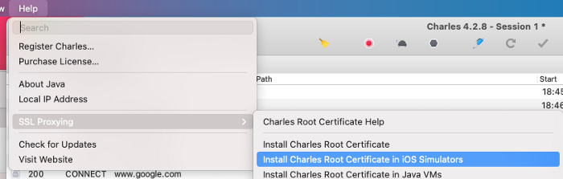
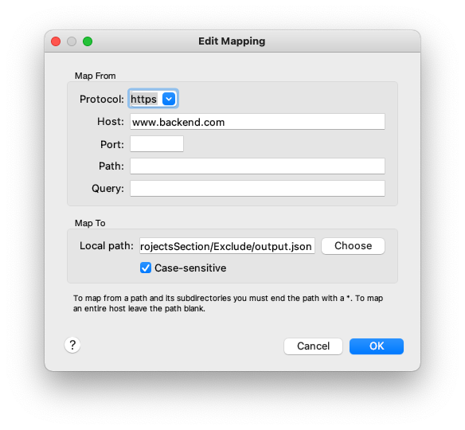
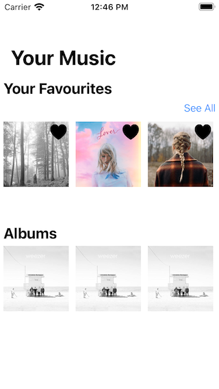
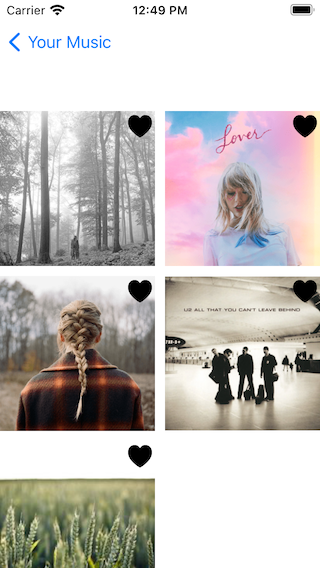

# Create Your Own Backend for Swift using Charles
## Create a music favourites section with a temporary backend

<br/>
<sub>Photo by Raphael Lovaski on Unsplash<sub>

Difficulty: Beginner | Easy | **Normal** | Challenging<br/>
This article has been developed using Xcode 12.0, and Swift 5.3

This article has a supporting video at the following link:

https://youtu.be/q3CiYzJlJkk

## Prerequisites:
* You will be expected to be aware how to make a [Single View Application](https://medium.com/swlh/your-first-ios-application-using-xcode-9983cf6efb71)
* Setting up Charles is covered here, but for more detail take a look at my [Charles article](https://stevenpcurtis.medium.com/use-charles-to-rewrite-responses-while-developing-ios-apps-3d1e7a8b068a)
* I've imported `SDWebImage` using Pods, you may need to install CocoaPods with `sudo gem install cocoapods` and then perform a `pod install` from inside the downloaded directory from [the repo](https://github.com/stevencurtis/SwiftCoding/tree/master/FavouriteProjectsSection), if you decide to download my version of this code (I didn't include the Pods in the upload).

## Terminology
Charles: A HTTP proxy for development

# The Motivation
At work we might be expected to demo either internally or to a specific client. What if you don't yet have a backend to support your shiny new feature? Mocking your responses in this case *isn't* enough as you need to live demonstrate your project feature.

Now this has already been covered in [this article](https://itnext.io/quickly-switch-between-local-mocks-with-charles-51ffda2d8a29), but I'm going to show how this might actually be used with project code given to you.

# Implementing the Fake Backend
## Charles
**Create the local mapping**
Charles will use a local mapping, and this can be any particular file on your disk. Now I recommend using `output.json` and this code is pretty much taken from [Max Chuquimia's article](https://itnext.io/quickly-switch-between-local-mocks-with-charles-51ffda2d8a29). This is written in Swift, and is named `mock-swapper.swift` as the filename.

```swift
let mappings = [
    "output.json": [
        "0.json",
        "1.json",
        "2.json",
        "3.json",
        "4.json",
        "5.json",
        "6.json",
        "7.json",
        "8.json",
        "9.json",
        "10.json",
        "11.json",
        "12.json",
        "13.json"
    ]
]

extension String {
    var path: String {
        return FileManager.default.currentDirectoryPath + "/\(self)"
    }
}

func readInt() -> Int {
    return Int(readLine()!)!
}

func menu(options: [String]) -> String {
    options.enumerated().forEach { idx, option in
        print("\(idx) - \(option)")
    }

    print("> ", terminator: "")
    let option = readInt()
    return options[option]
}

let source = menu(options: Array(mappings.keys))
let options = mappings[source]!

print("Output to: \(source.path)")

while true {
    let file = menu(options: options)
    try! FileManager.default.removeItem(atPath: source.path)
    try! FileManager.default.copyItem(atPath: file.path, toPath: source.path)
    print("\nCopied \(file) to \(source)\n")
}
```
There are 13 files, and these contain album information for 13 different albums. To keep this short, here is the `json` for two albums which is creatively named as `2.json`:

```swift
{"favourites": [
    {"identifier": "AAA", "name": "TayTay Folklore", "image": "https://upload.wikimedia.org/wikipedia/en/f/f8/Taylor_Swift_-_Folklore.png"}, 
    {"identifier": "BBB", "name": "TayTay Lover", "image": "https://upload.wikimedia.org/wikipedia/en/c/cd/Taylor_Swift_-_Lover.png"}
    }
}
```

the overall code can then be run from your target directory by running `swift mock-swapper.swift` from the comand line. We would choose for the output.json to be the output file, and then 2 to deliver two albums to `output.json`.

Of course, Charles needs to know where that file actually is, so let us do just that now

**Setup Charles to point to the local mapping**
Charles needs to be setup to point to this file, and this is covered in the Swift Project section below.

# The Swift Project
## Charles
You can [download Charles](https://www.charlesproxy.com/) and install to your machine. From within the program, you need to go to `Help>SSL Proxying>Install Charles Root Certificate` in iOS Simulators 

<br/>

Then from within your simuator traverse to `Setting>General>About>Certificate Trust Settings` and click the toggle to enable the proxy.

Within Charles you need to go to `Proxy>macOS Proxy` and make sure it is ticked. 

We are going to mock `www.backend.com`, so within the menu system go to `Proxy>SSL Proxy Settings...` and add - the host will be `www.backend.com` and the port `443`.

We then need to map local, so select `Tools>Map Local...`  and you will need to select the protocol as `https`, the host as `www.backend.com` and the local path to the file you created with the script above
<br/>
and of course make sure that the `Enable Map Local` checkbox is ticked in the map local settings.


## Using our little tool
As you remove a favourite from your Application, you can make sure that the backend that you have created returns the correct JSON String. For example, if you remove one of the favourites I would return the JSON String of favourites - with precisely one less favourite returned.

## Why would you want to do this?
I think the answer is quite clear. When you are demonstrating your work, perhaps an internal demo or to a client you want to have a working App. How might you do this if the backend has not yet been produced? You are expected to provide a live demo, and mocking is simply not enough.
This is where this article has stepped in, and I hope, helped you out.

# Conclusion
That's it! You are now ready for some mocking of live data!
*Where can I use this data?*

I've covered it in my YouTube video, right [HERE](https://youtu.be/q3CiYzJlJkk). During that video I create a favourites section like the following:

<br/>

Which then moves onto a screen that covers all of the favourites

<br/>

If you've any questions, comments or suggestions please hit me up on [Twitter](https://twitter.com/stevenpcurtis)
