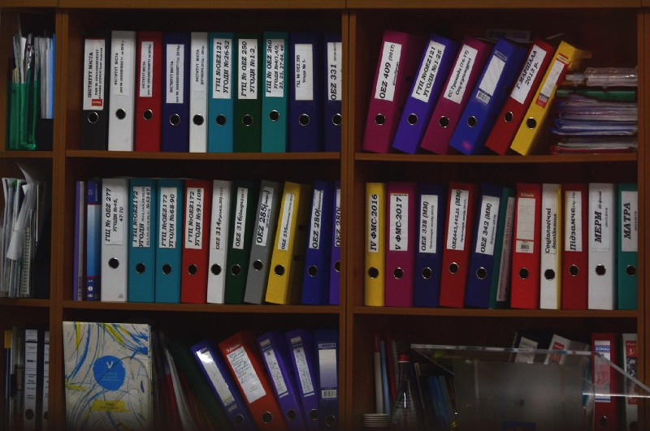
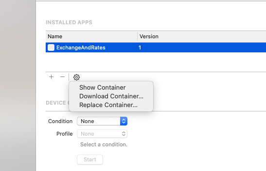

# File Persistence in Swift
## Persistence to store data

<br/>
<sub>Photo by Viktor Talashuk on Unsplash<sub>

Directly saving files of types to the file system is one way that you can avoid CoreData if you are so inclined (it would be better to learn CoreData, wouldn't it?). Let's take a look at the sandbox for the file system in iOS application. Great!

# The Sandbox
The  iOS application sandbox is divided into the `Bundle Container` and the `Data Container`. We shall explore these components in detail.

## Bundle Container
The Application Bundle contains the application and all of the resources that are needed for the application to run. You can't write directly to this directory because this is signed during installation - so any hacks to change the application bundle will result in the application failing to launch. 

```swift
let path: String? = Bundle.main.path(forResource: "file", ofType: "txt")
```

## Data Container
We, of course, are able to write files to the data container. to do so but there are several options in order to be able to.

*Documents Directory*
Files can be stored here, but these are visible to use user in the *Files* application which is available to the user on their device. Application developers can create sub-directories to provide nicely organised application (which you should be doing). The disk space used is logged to the App's *Documents and Data* total. A fantastic place to store images, or files that the user might like to read in another App.

**Application Support Directory AKA Library/Application support/**
This folder can be used to store files which are not visible to the end user. This folder is not present by default, and the application developer is therefore required to make it first (in the file system) before storing files - and the contents of this folder are backed up by default. iOS itself can remove files if the device is running low. The disk space used is logged to the App's *Documents and Data* total. Fantastic for large media files - but these would really need to be excluded from the backup (which can be done at the developer's discretion).

**tmp**
Surprisingly enough temporary data does not persist for an extended period of time. The system also purges these files when the app is not running, so this is NOT the place to put files that your App requires on after the App has terminated.

**Cache AKA Library/Caches/**
The cache can really be used for, well, a cache. This is a store for temporary data so might be a database or an image cache. Therefore the App would need to be able to recreate these files as needed.

# The associated file article
How might we use these files? I've pre-prepared a [File Handling](https://medium.com/swlh/file-handling-using-swift-f27895b19e22?source=your_stories_page---------------------------) article

# Did you know?
You can see the package contents of your files from the simulator?

The shortcut `⇧⌘2` brings up the `Device and Simulators` window. 

If you are using a *real device* (that is, not a simulator) you can select it from the left hand side, select installed Apps and download your container by selecting the gears icon.

<br/>

Then a right>click and `Show Package Contents` will show you the constituent folders. Awesome!

What's that? You want to see the data from the simulator? Easily possible. `⌘,` will allows you to get to Xcode preferences. Locations>Derived Data will take you to the application - you can find the application binary and do a right-click>Show Package Contents and you'll see the package structure.

That's even better!

# Conclusion
You're likely to use a form of persistent storage in your App. Now you can start to reason about the Application and the folders you might use to store this information - wouldn't that be wonderful?

Anyway....
 
 If you've any questions, comments or suggestions please hit me up on [Twitter](https://twitter.com/stevenpcurtis)
