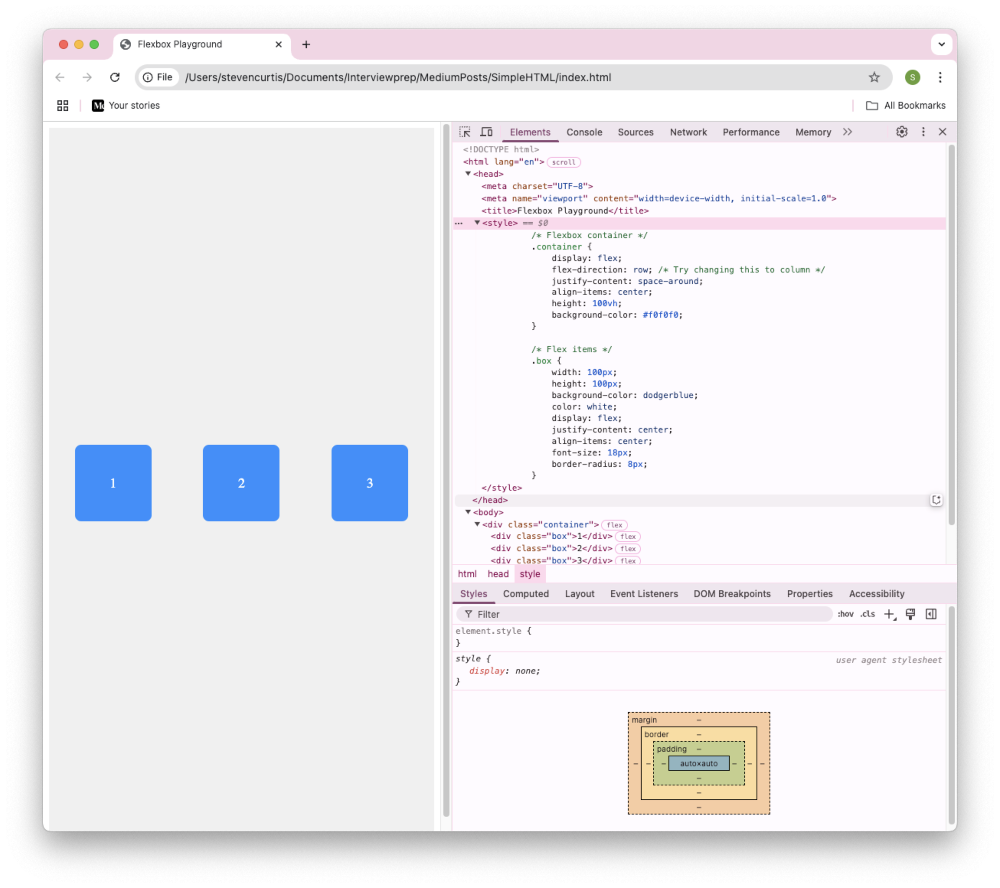
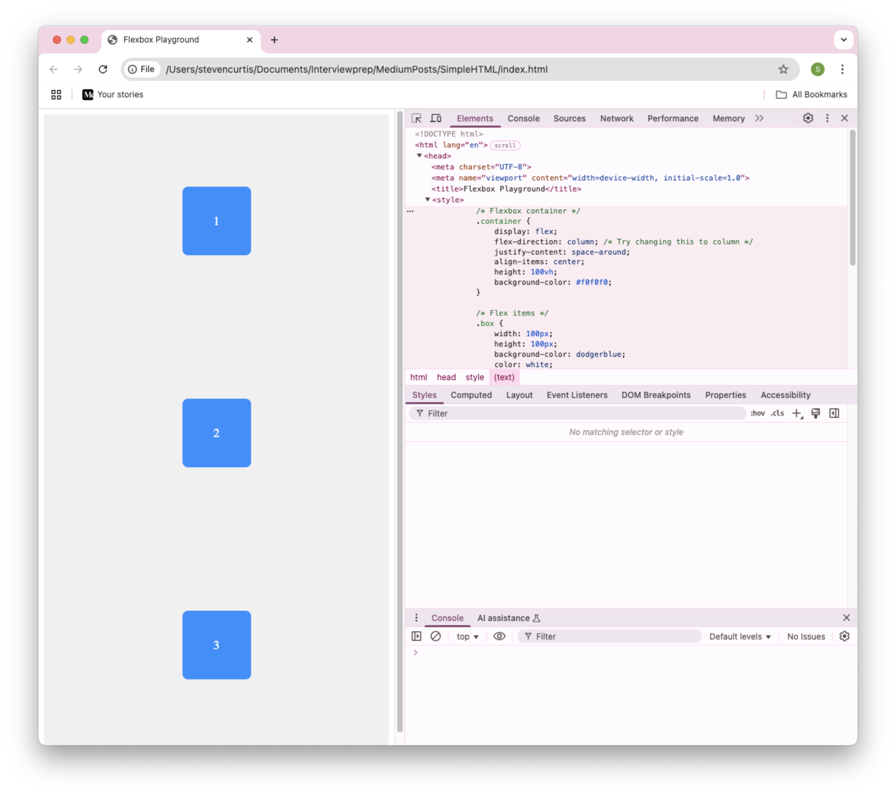

# How to Set Up a Simple HTML File to Experiment with Flexbox in Chrome

I'm an iOS developer, and I'm not that familiar with HTML and CSS. So I thought it would be fun to set up some code and play around with Flexbox using Chrome's developer tools.
How hard could it be?

# The Guide
I'm going to start off with the most simple (that I can think of) basic `HTML` file.

We first need to create a file (in a spiffing new folder) with a `.html` suffix. An appropriate name for this is `index.html`, and this can be done with `nano`, `vim`, `Xcode` or you favourite text editor. 

The file will contain the following HTML code.

```swift
<!DOCTYPE html>
<html lang="en">
<head>
    <meta charset="UTF-8">
    <meta name="viewport" content="width=device-width, initial-scale=1.0">
    <title>Flexbox Playground</title>
    <style>
        .container {
            display: flex;
            flex-direction: row;
            justify-content: space-around;
            align-items: center;
            height: 100vh;
            background-color: #f0f0f0;
        }

        .box {
            width: 100px;
            height: 100px;
            background-color: dodgerblue;
            color: white;
            display: flex;
            justify-content: center;
            align-items: center;
            font-size: 18px;
            border-radius: 8px;
        }
    </style>
</head>
<body>

    <div class="container">
        <div class="box">1</div>
        <div class="box">2</div>
        <div class="box">3</div>
    </div>

</body>
</html>
```

`.container` is the flexbox container (an area of a document that is laid out using flexbox is called a flex container) and `.box` is the flex item.

Crucially to create a flex container we set the display property to flex meaning that the elements immediately inside the flex container in the HTML hierarchy are flex items. Here are those direct children.

```swift
<div class="container">
    <div class="box">1</div>
    <div class="box">2</div>
    <div class="box">3</div>
</div>
```

# Open the File in Chrome
`File> Open File…` allows you to (well) open files in Chrome.

<br>

Then find the file in your computer's file system. 

# Use Chrome Developer Tools to Experiment
Chrome DevTools allows you to modify Flexbox properties live without editing your file manually. That's awesome (although you can also make changes in the file, save and then reload (F5) in Chrome.
Developer Tools will help you out with this, and will also
##
Open Developer Tools
Right-click anywhere on the page and choose Inspect 
Click on the Elements tab
Find the `<div class="container">` element
In the Styles pane (on the right), look for the `.container` styles.

<br>

## Modify Flexbox Properties

Click on `display: flex` in the Styles panel.

Add or modify properties:
 • Change `flex-direction: row`; to `column`;
 • Adjust `justify-content: space-around`; to `center`;
 • Modify `align-items: center`; to `flex-start`;

The layout will update instantly.

Watch how the layout updates instantly!

So here are the differences.

`flex` is the default. The container behaves like a block-level element, meaning it takes up the full width available and starts on a new line. It allows its child elements (the "flex items") to align, distribute, and resize dynamically according to flex properties.

`inline flex` Similar to `flex`, but the flex container itself behaves like an inline element. This means it does not take up the full width and only occupies as much space as needed. The child elements inside still follow the Flexbox layout rules.

## Splitting HTML and .css files
For separation of concerns we should split out our content and layout. So that will be an `index.html` and a `style.css` file.

index:

```swift
<!DOCTYPE html>
<html lang="en">
<head>
    <meta charset="UTF-8">
    <meta name="viewport" content="width=device-width, initial-scale=1.0">
    <title>Flexbox Playground</title>
    <link rel="stylesheet" href="styles.css">
</head>
<body>

    <div class="container">
        <div class="box">1</div>
        <div class="box">2</div>
        <div class="box">3</div>
    </div>

</body>
</html>
```
style:
```swift
.container {
    display: flex;
    flex-direction: row; /* Try changing this to column */
    justify-content: space-around;
    align-items: center;
    height: 100vh;
    background-color: #f0f0f0;
}

.box {
    width: 100px;
    height: 100px;
    background-color: dodgerblue;
    color: white;
    display: flex;
    justify-content: center;
    align-items: center;
    font-size: 18px;
    border-radius: 8px;
}
```

So we can use that instead of the combined file above, which will make things slightly nicer.

# Conclusion
Flexbox is a powerful tool for arranging UI elements dynamically. Now I'm going to play with this and see when changes I can make.
Fun!
