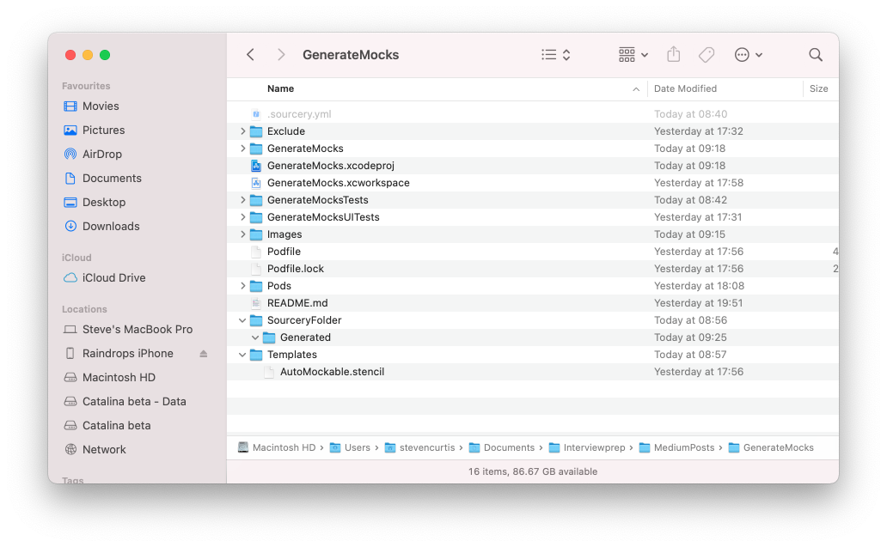
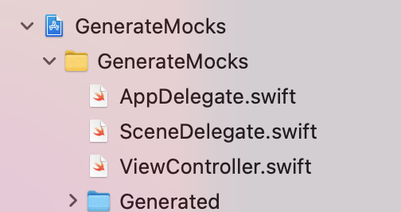

# Auto Mocking with Sourcery
## Make your life easier

# Before we start
Difficulty: Beginner | Easy | **Normal** | Challenging<br/>

## Keywords and Terminology:
Mocking: A fake response to the method call for of an object, allowing the checking of a particular method call or property

## Prerequisites:
* None, although knowing [something about Mocking](https://medium.com/swlh/stubbing-mocking-or-faking-5674a07bc3db) would be useful, and if you are interested I've mocked using [this set of techniques](https://medium.com/@stevenpcurtis.sc/mocking-network-calls-in-swift-ad04b59e79)

# The need
So I've been hand crafting mocks for some time. It is quite time-consuming.

[Sourcery can help us out here](https://github.com/krzysztofzablocki/Sourcery) and this article goes into detail about how it can help you out (as well as how you might set this up)

To experiment I've created a small project which has a single label on the screen:

<br>

Which is both unexciting and not something which you might usually test. However, my plan here is to have such a visual test to make it clear that "Hello dave" is the standard text returned by the software onto the label and then test that.

# The setup
For this article I've decided to use cocoapods, which itself can be installed from [this guide](https://guides.cocoapods.org/using/getting-started.html).

Then (after setting up a new project) I used the following [Terminal](https://medium.com/@stevenpcurtis.sc/the-mac-terminal-998eb9f42b5) commands.

```swift
pod init
```

which generates a pod file, which I modified to look like the following:

```swift
# Uncomment the next line to define a global platform for your project
# platform :ios, '9.0'

target 'GenerateMocks' do
  # Comment the next line if you don't want to use dynamic frameworks
  use_frameworks!

  # Pods for GenerateMocks
  pod 'Sourcery'
  target 'GenerateMocksTests' do
    inherit! :search_paths
    # Pods for testing
  end

  target 'GenerateMocksUITests' do
    # Pods for testing
  end

end
```

I then ran the following:

```swift
pod install
```

You will then need to open the workspace in Xcode, which in my case (due to calling the project `GenerateMocks`) means the following needs to be opened: `GenerateMocks.xcworkspace`.

We need to add the following build script, and it is important that this build script is run before compile sources (so it can be drag-dropped above compile sources).

```swift
"$PODS_ROOT/Sourcery/bin/sourcery"
```

which can be done by following the steps in the following image
<br>

We then set up a `.sourcery.yml` configuration file. This file tells sourcery where to look for files. The sources are the files we would want sourcery to can, templates are the templates sourcery uses to generate it's generated files and output is where the the generated files will be sent to.

```swift
sources:
    - GenerateMocks
templates:
    - Templates
output: SourceryFolder/Generated
```

In this article I'm using `AutoMockable`, so we need to copy `AutoMockable.stencil` from Pods which can be done in the finder (from Pods>Sourcery>Templates>AutoMockable.stencil), and do a copy-paste into a templates folder.

My directory will be something like the following:

<br>

We are going to add a folder reference for the generated files. This is done by `File>Add Files to...`<br>
and make sure that you have `create groups` chosen.


This adds a yellow folder to your directory structure in Xcode - this is a reference so this is correct. My folder is created as in the next image:
<br>
Note that this folder is empty; don't worry, we are going to get sourcery to generate files.

## Add a protocol
If we add the most basic protocol that I can think of - a TestProtocol in a new file (so File>New File...) and write the following in the file:

```swift
import Foundation

// sourcery: AutoMockable
protocol TestProtocol {}
```

## Build the project
In order to tempt Sourcery into creating a mock for our `TestProtocol` we just need to build.

Command ⌘ - B

And...like magic a new file has appeared in our Generated folder.

You can look at it, it isn't too exciting. That's because our protocol is not too useful at this point.

```swift
// Generated using Sourcery 1.0.2 — https://github.com/krzysztofzablocki/Sourcery
// DO NOT EDIT

// swiftlint:disable line_length
// swiftlint:disable variable_name

import Foundation
#if os(iOS) || os(tvOS) || os(watchOS)
import UIKit
#elseif os(OSX)
import AppKit
#endif


class TestProtocolMock: TestProtocol {

}
```

## Create a protocol that might be of use
In order to do this I've programatically created a view controller. Now, this is just an example for this article, I really don't architect my projects like this nor test UI components like this. It is simply an example.

My greeting protocol looks like the following (and it is AutoMockable)

```swift
import Foundation

// sourcery: AutoMockable
protocol GreetingProtocol {
    func sayHello() -> String
}

struct Greeting: GreetingProtocol {
    func sayHello() -> String {
         return "Hello \(name)"
    }
    var name: String
}
```

This is then used by a programatically created View Controller:

```swift
class ViewController: UIViewController {
    let greeting: GreetingProtocol!
    init(greeting: GreetingProtocol) {
        self.greeting = greeting
        super.init(nibName: nil, bundle: nil)
    }

    required init?(coder: NSCoder) {
        fatalError("init(coder:) has not been implemented")
    }

    lazy var basicLabel: UILabel = {
        let lab = UILabel()
        lab.text = "initial"
        return lab
    }()

    override func loadView() {
        let view = UIView()
        view.backgroundColor = .red
        self.view = view
    }

    override func viewDidLoad() {
        super.viewDidLoad()
        self.view.addSubview(basicLabel)
        basicLabel.translatesAutoresizingMaskIntoConstraints = false
        NSLayoutConstraint.activate([
            basicLabel.centerXAnchor.constraint(equalTo: view.centerXAnchor),
            basicLabel.centerYAnchor.constraint(equalTo: view.centerYAnchor)
        ])

        let hi = greeting.sayHello()
        print (hi)
        basicLabel.text = hi
    }
}
```

Of course we need to build to make the automocking happen. However, when we do we create the following:

```swift
import XCTest
@testable import GenerateMocks

class VCTests: XCTestCase {
    var viewController: ViewController?
    var greeting: GreetingProtocolMock!

    override func setUpWithError() throws {
        // Put setup code here. This method is called before the invocation of each test method in the class.
        greeting = .init()
        greeting.sayHelloReturnValue = "test"
        viewController = .init(greeting: greeting)
    }

    override func tearDownWithError() throws {
        // Put teardown code here. This method is called after the invocation of each test method in the class.
    }

    func testLab() {
        viewController?.viewDidLoad()
        XCTAssertEqual(viewController!.basicLabel.text, "test")
    }
}
```

Which...actually works since we are injecting our automocked Greeting. Which is nice! We Simply tell the mock what we need to actually return.

The `testLab()` `test` (as shown above now does indeed return the rather exciting String test that you'd expect when using the mock instead of the standard.


# Conclusion

You might choose to install through brew `brew install sourcery` instead, but the general gist of this article still stands. Yes, you also wouldn't always test the UI in this way, but I felt this was a reasonable example to show the use of Sourcey (sorry).

You might choose to install through brew `brew install sourcery` instead, but the general gist of this article still stands.

I hope this article has been of use to you, and I might see you again on one of these articles.

If you've any questions, comments or suggestions please hit me up on [Twitter](https://twitter.com/stevenpcurtis)
