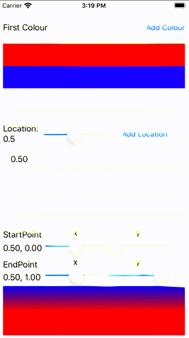
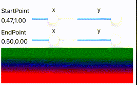

# The Only CAGradientLayer Guide You Will Ever Need
## An App to help you? Why not?

<br/>
<sub>Photo by JD Chow on Unsplash<sub>

Difficulty: Beginner | Easy | **Normal** | Challenging<br/>
This article has been developed using Xcode 11.4.1, and Swift 5.2.2

Wouldn't it be great if someone gave you an article that explained much about `CAGradientLayer`, and even created an App that enables you to experiment with the same? This article is just that. You're welcome.

## Prerequisites: 
* You will be expected to be aware how to make a [Single View Application](https://medium.com/swlh/your-first-ios-application-using-xcode-9983cf6efb71) in Swift.

## Terminology:
CAGradientLayer: A layer that draws a colour gradient over any background colour

# The App
The images used in this article are form a little App that has been knocked up. You can download it from the [repo](https://github.com/stevencurtis/SwiftCoding/tree/master/GradientLayerDeepDive), and essentially I'd recommend you do.

Essentially the App shows what can be changed in respect of a `CAGradientLayer` - the locations, `StartPoint`, `EndPoint` and colours. 

<br/>

so let us look at this App in stages.

*Notes*
Core Graphics speaks in Core Graphics- that means that colours are the CG variants rather than the `UIColor` variants. This means that in this App we have an array of `UIColor`, and then map this to the requisite array of `cgColor`. You know, something like:

```swift
gradient.colors = colours.map{ $0.cgColor }
```

Animations have been used for the gradient, let me give you an example of this:

``` swift 
let animation = CABasicAnimation(keyPath: "endPoint")
animation.fromValue = gradient.endPoint
animation.toValue = endPoint.point
animation.duration = 5.0
self.gradient.endPoint = endPoint.point
self.gradient.add(animation, forKey:"animateendpoint")
```
using `CABasicAnimation` (here for endPoint) makes it very obvious the value we are moving *from* and the value we are moving *to* - but here is the secret sauce - you need to make sure that after the `fromValue` and `toValue` that the actual (in this case) `endPoint` is set (if not the gradient will just flash back and go back to the previous state!).

Let us look through these properties

## location (which is linked to colour)
Location is a value between 0 and 1, and provide a separation between colour spaces (so the number of locations are tightly coupled to the colours).

So if we don't have a location, we are left with a solid colour. 

<br/>

If we set a single location at 0.25, two colours will blend 25% of the way through the colour

<br/>

If we have two locations, one at 0.25 and one at 0.5 one colour will begin to change at 0.25, one at 0.5

<br/>

Likewise three locations, 0.25, 0.5 and 0.75 will change the colours at those, well, locations

<br/>

## startPoint and endPoint
The start point is where the gradient starts, within the bounds of the `layer` coordinate space. 
The best explaination? A showing the different values and animate it.

<br/>

Clear? If not download the App from the  [repo](https://github.com/stevencurtis/SwiftCoding/tree/master/GradientLayerDeepDive).

## type
Not captured in this App (apart from the default `axial` type), you can choose `conic` and `radial` are fairly self-explanatory. 

## Tips to recreate the App
* I used [two tableviews](https://medium.com/@stevenpcurtis.sc/two-uitableviews-one-uiviewcontroller-a98181246164) in one view controller
* The colour picker uses [delegation](https://medium.com/@stevenpcurtis.sc/delegation-in-swift-6b416bc0277c)

# Conclusion
Gradients are extremely important in iOS, and you might just have a live designer who goes all in on the style. 

What are you to do? Well, we can resolve this by creating a great App, and using the knowledge that we have gained from this article. 

Which I hope has been helpful for you.

If you've any questions, comments or suggestions please hit me up on [Twitter](https://twitter.com/stevenpcurtis) 
