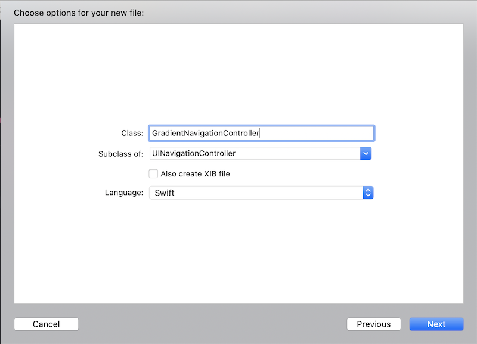
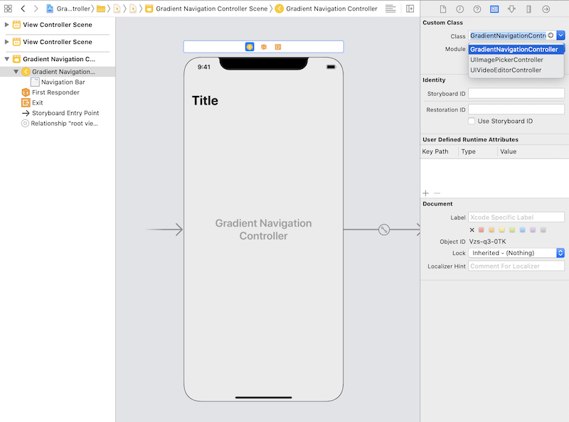

# Create a UINavigationController With a Gradient as a Background
## Not as difficult as it sounds!

<br/>
<sub>Photo by Joshua Earle on Unsplash<sub>

Difficulty: Beginner | Easy | **Normal** | Challenging<br/>
This article has been developed using Xcode 11.4.1, and Swift 5.2.2

## Prerequisites: 
* You will be expected to be aware how to make a [Single View Application](https://medium.com/swlh/your-first-ios-application-using-xcode-9983cf6efb71) in Swift.

## Terminology:
UINavigationController: A container for view controllers that defines a method for navigating content based around a stack

# The process

## Setting up the UINavigationController subclasses

Where `UINavigationController` subclasses have been used is it required to create the subclass - for example `GradientNavigationController` is created through

`File>New>File...`

then creating a `UINavigationController` 

<br/>

Which then, while using the `Storyboard` the subclass is chosen as in the following image

<br/>

So we can set the `UINavigationController` subclass using the `storyboard`, simple stuff, right?

With all that said, shall we go?

## The requirements
* Create a gradient for the `UINavigationController`
* Allow the back button to work
* Solution should work on Large Titles 
* Only set the gradient in one place, preferably in a `UINavigationController` subclass
* Handles orientation changes
* Covers the status bar (but not the icons there, obviously)

## The background gradient
The idea behind this is to create a `UINavigationController` subclass, and set a background image.

This is called `BackgroundNavigationController` in the repo.

This seems to work great!

<br/>

So this works by taking a `CAGradientLayer` and converting it to a `UIImage` using `UIGraphicsBeginImageContext` creates a bitmap context and then a gradient is rendered into an image which is then set as the background image. 

The code?

```swift
class BackgroundNavigationController: UINavigationController {
    override func viewDidLoad() {
         super.viewDidLoad()
         let gradient = CAGradientLayer()
         var bounds = navigationBar.bounds
         bounds.size.height += view.window?.windowScene?.statusBarManager?.statusBarFrame.height ?? 0
         gradient.frame = bounds
         gradient.colors = [UIColor.green.cgColor, UIColor.blue.cgColor]
         gradient.startPoint = CGPoint(x: 0, y: 0)
         gradient.endPoint = CGPoint(x: 1, y: 0)

         if let image = getImageFrom(gradientLayer: gradient) {
             navigationBar.setBackgroundImage(image, for: UIBarMetrics.default)
         }
     }

     func getImageFrom(gradientLayer: CAGradientLayer) -> UIImage? {
         var gradientImage:UIImage?
         UIGraphicsBeginImageContext(gradientLayer.frame.size)
         if let context = UIGraphicsGetCurrentContext() {
             gradientLayer.render(in: context)
             gradientImage = UIGraphicsGetImageFromCurrentImageContext()?
                .resizableImage(
                    withCapInsets: UIEdgeInsets.zero,
                    resizingMode: .stretch
            )
         }
         UIGraphicsEndImageContext()
         return gradientImage
     }
}
```

We use `viewDidLoad()` and as `UINavigationController` is a `UIViewController` we know this will be called much as in the [UIViewController lifecycle](https://medium.com/@stevenpcurtis.sc/the-uiviewcontroller-lifecycle-b964cf18256b).

We set up a `CAGradientLayer` (which functions as a specialized `CALayer` on a `UIView` ) and draw out the bounds as the enclosing `UINavigationBar` and expand the frame to include the status bar and set the properties of the gradient.

We then retrieve the `UIGraphicsGetCurrentContext`, and create an image in the `graphicsContext`, which is then set as the background image for the `UINavigationController`.  

We then create a `UIImage` from the gradient, and set it to the `UINavigationBar` background image for `UIBarMetrics.default`.

**The issue**

This should work according to the specification, specifically for for Large Titles. And...it doesn't work.

✅ Create a gradient for the `UINavigationController`
✅ Allow the back button to work
❌ Solution should work on Large Titles 
✅ Only set the gradient in one place, preferably in a `UINavigationController` subclass
✅ Handles orientation changes
✅ Covers the status bar (but not the icons there, obviously)


<br/>


## Second Attempt 
So what is going on?

The property `UINavigationController` has a new couple of properties - `standardAppearance` and `scrollEdgeAppearance`. These are both of the class `UINavigationBarAppearance`, and looking at the [documentation](https://developer.apple.com/documentation/uikit/uinavigationbarappearance) we can see the following clue:

```
Use the inherited properties from UIBarAppearance to configure the background and shadow attributes of the navigation bar itself.
```

The background! This is what we need to set!

Therefore we can add the following

```swift
let appearance = navigationBar.standardAppearance.copy()
appearance.backgroundImage = image
navigationBar.standardAppearance = appearance
navigationBar.scrollEdgeAppearance = appearance
```

giving us the whole code:

```swift
class BackgroundNavigationController: UINavigationController {
    override func viewDidLoad() {
         super.viewDidLoad()

         let gradient = CAGradientLayer()
         var bounds = navigationBar.bounds
         bounds.size.height += view.window?.windowScene?.statusBarManager?.statusBarFrame.height ?? 0
         gradient.frame = bounds
         gradient.colors = [UIColor.green.cgColor, UIColor.blue.cgColor]
         gradient.startPoint = CGPoint(x: 0, y: 0)
         gradient.endPoint = CGPoint(x: 1, y: 0)

         if let image = getImageFrom(gradientLayer: gradient) {
            navigationBar.setBackgroundImage(image, for: UIBarMetrics.default)
            
            let appearance = navigationBar.standardAppearance.copy()
            appearance.backgroundImage = image
            navigationBar.standardAppearance = appearance
            navigationBar.scrollEdgeAppearance = appearance
         }
     }

     func getImageFrom(gradientLayer: CAGradientLayer) -> UIImage? {
         var gradientImage:UIImage?
         UIGraphicsBeginImageContext(gradientLayer.frame.size)
         if let context = UIGraphicsGetCurrentContext() {
             gradientLayer.render(in: context)
             gradientImage = UIGraphicsGetImageFromCurrentImageContext()?
                .resizableImage(
                    withCapInsets: UIEdgeInsets.zero,
                    resizingMode: .stretch
            )
         }
         UIGraphicsEndImageContext()
         return gradientImage
     }
}
```

We therefore have setup the appearance (`standardAppearance` and `scrollEdgeAppearance`) for the `UINavigationController`. 

This works great!

Let us look at the criteria:

What is happening here is the frame is set 

✅ Create a gradient for the `UINavigationController`
✅ Allow the back button to work
✅  Solution should work on Large Titles 
✅ Only set the gradient in one place, preferably in a `UINavigationController` subclass
✅ Handles orientation changes
✅ Covers the status bar (but not the icons there, obviously)

However we need to make sure that the code can be set in a single place - this implementation would need to be set in `viewDidLoad` for each and every `UIViewController` where you would like the gradient to be set. 

# Conclusion
This article is useful to apply a gradient to a `UINavigationController` - something that your designer insisted that you should be doing. Didn't they? 

We all know that you can't stop those designers, so getting used to gradients with `UIKit` will definitely pay off. Yes it will.

If you've any questions, comments or suggestions please hit me up on [Twitter](https://twitter.com/stevenpcurtis) 
