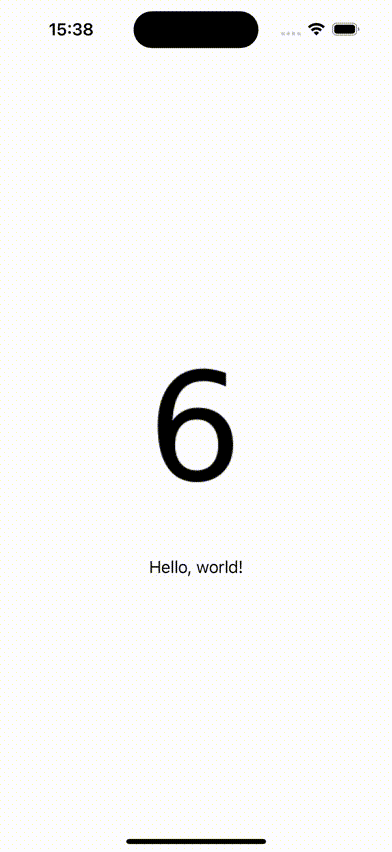

# Crafting Custom Image Sequences Animation in SwiftUI: A Frame-by-Frame Approach
# Animating!

This article dives into how to create custom animations in SwiftUI by sequencing images, effectively crafting a frame-by-frame animation similar to an animated GIF but with greater flexibility and control.

Difficulty: Beginner | Easy | **Normal** | Challenging<br/>
This article has been developed using Xcode 15.0, and Swift 5.9



## Terminology:
`StateObject`:  A SwiftUI property wrapper for persisting reference-type model data across view updates.
Factory Pattern: A design pattern for creating objects without specifying their exact classes, often used for abstraction and flexibility in object creation. [Article.](https://github.com/stevencurtis/SwiftCoding/tree/master/DesignPatterns/FactoryPattern/)

# The Idea
Animations can be awesome! In my example (in the repo) my animation simply flicks through the numbers one to ten. However your animation might be something rather more exciting (I hope it is!).

Traditional approaches to animations, such as using GIFs or built-in animation frameworks, often come with limitations—be it in terms of file size, quality, or control over the animation.

The approach described leverages SwiftUI's capabilities to manipulate images in a sequence over time, akin to the frames of an animated GIF. However, instead of relying on a pre-made GIF file, this method uses an array of individual image assets. 

This frame-by-frame method empowers developers to:

- Control Animation Speed: Adjust the duration each frame is displayed, allowing for dynamic changes based on user interactions or other app states.
- Optimize Performance and Resources: By loading only the necessary images and controlling the timing programmatically, this approach can be more efficient than playing a GIF, especially for long or complex animations.
- Improve Image Quality: Unlike GIFs, which are limited to 256 colors, using individual images allows for the full color spectrum, supporting higher quality visuals.
- Customize Playback: Easily implement functionalities like pausing, reversing, or skipping frames within the animation, offering a level of interaction not possible with standard GIFs.

The described method uses a combination of SwiftUI's View, @StateObject, and timers to control the sequence in which images appear, creating an animation effect. This approach takes full advantage of Swift's and SwiftUI's strengths—declarative syntax, state management, and the seamless integration of timers to manage the animation loop. The use of a TimerFactory and protocols further encapsulates the timing logic, making the animation logic both testable and reusable across different parts of an app or even across different projects.

My approach provides ways to create high-quality animations in SwiftUI apps while being testable. I hope you like this approach!

# The Code
## AnimatedImage
**AnimatedImageView**
This is a `view` to display the sequence of images. By utilizing SwiftUI's `@StateObject` to keep track of the current image index, it cycles through the images to create the animation effect.

```swift
Image(imageNames[viewModel.currentIndex])
    .onChange(of: animating) { newValue in
        if newValue {
            viewModel.start()
        } else {
            viewModel.stop()
        }
    }
```

Here is the full struct:

```swift
public struct AnimatedImageView: View {
    @Binding var animating: Bool
    @StateObject private var viewModel: AnimatedImageViewModel
    private let imageNames: [String]
    init(
        duration: TimeInterval,
        imageNames: [String],
        repeats: Bool = true,
        animating: Binding<Bool>
    ) {
        self.imageNames = imageNames
        _viewModel = StateObject(
            wrappedValue: AnimatedImageViewModel(
                interval: duration / Double(
                    imageNames.count
                ),
                imageCount: imageNames.count,
                repeats: repeats
            )
        )
        _animating = animating
    }
    
    public var body: some View {
        Image(imageNames[viewModel.currentIndex])
            .onChange(of: animating) {
                if animating {
                    viewModel.start()
                } else {
                    viewModel.stop()
                }
            }
            .onAppear {
                if animating {
                    viewModel.start()
                }
            }
    }
}
```

**AnimatedImageViewModel**
`AnimatedImageViewModel` is a class that serves as the view model for the `AnimatedImageView`. It uses a timer to change the current image index at regular intervals, thereby animating the sequence of images. This model is an  example of separating the animation logic from the view, adhering to the MVVM design pattern for clearer code organization and better maintainability.

In order to periodically update the `currentIndex` a timer is used through the timerFactory using the following code:

```swift
timer = timerFactory.createTimer(withTimeInterval: interval, repeats: repeats) { [weak self] _ in
    self?.currentIndex = (self?.currentIndex ?? 0 + 1) % imageCount
}
```

Here is the full class:

```swift
final class AnimatedImageViewModel: ObservableObject {
    @Published var currentIndex: Int = 0
    private var timer: TimerProtocol?
    private let imageCount: Int
    private let interval: TimeInterval
    private let repeats: Bool
    private let timerFactory: TimerFactoryProtocol
    
    init(
        interval: TimeInterval,
        imageCount: Int,
        repeats: Bool,
        timerFactory: TimerFactoryProtocol = TimerFactory()
    ) {
        self.interval = interval
        self.imageCount = imageCount
        self.repeats = repeats
        self.timerFactory = timerFactory
    }
    
    func start() {
        guard timer == nil else { return }
        timer = timerFactory.createTimer(withTimeInterval: interval, repeats: repeats) { [weak self] _ in
            guard let self else { return }
            currentIndex = (currentIndex + 1) % imageCount
        }
    }
    
    func stop() {
        timer?.invalidate()
        timer = nil
    }
}
```

## TimerFactory

**TimerFactory**
The `TimerFactory` class illustrates the Factory Pattern by abstracting the creation of timer objects. This allows for more flexible timer management and makes the animation logic more testable by decoupling it from the concrete implementation of timers in Swift.

Here, the factory creates a scheduled timer that calls a block of code at specified intervals, demonstrating how timers are abstracted and can be manipulated through the factory.

```swift
Timer.scheduledTimer(withTimeInterval: interval, repeats: repeats) { timer in
    block(timer as TimerProtocol)
}
```

Here is the full class:

```swift
public final class TimerFactory: TimerFactoryProtocol {
    public func createTimer(withTimeInterval interval: TimeInterval, repeats: Bool, block: @escaping @Sendable (TimerProtocol) -> Void) -> TimerProtocol {
        Timer.scheduledTimer(withTimeInterval: interval, repeats: repeats) {
            block($0 as TimerProtocol)
        }
    }
    
    public init() {}
}
```
**TimerFactoryProtocol**
```swift
public protocol TimerFactoryProtocol {
    func createTimer(withTimeInterval interval: TimeInterval, repeats: Bool, block: @escaping @Sendable (TimerProtocol) -> Void) -> TimerProtocol
}
```
## Timer

The extension of Timer to conform to TimerProtocol and the definition of TimerProtocol itself are critical for making the timer functionality in AnimatedImageViewModel testable and flexible. By defining a protocol for timers, different implementations, including mock timers for testing, can be used interchangeably.

This extension and protocol definition enable the use of timers in a way that is decoupled from their concrete implementation, allowing for better testing and modularity.

Here is the full code:

**Timer**
```swift
extension Timer: TimerProtocol {}
```
**TimerProtocol**
```swift
public protocol TimerProtocol {
    func invalidate()
}
```

## Tests
The MockTimer and MockTimerFactory classes are used for testing the animation logic without relying on actual timers. This is a key aspect of making the animation code testable, as it allows the simulation of timer behavior in a controlled test environment.

Here is the full code:

**MockTimer**
```swift
final class MockTimer: TimerProtocol {
    public private(set) var invalidateCalled = false
    
    func invalidate() {
        invalidateCalled = true
    }
}
```

**MockTimerFactory**
```swift
final class MockTimerFactory: TimerFactoryProtocol {
    var numberOfRepeats: Int = 1
    var timerInvalidateCalled: Bool? {
        (timer as? MockTimer)?.invalidateCalled
    }
    
    private(set) var createTimerCallCount = 0
    private let timer: TimerProtocol
    
    func createTimer(withTimeInterval interval: TimeInterval, repeats: Bool, block: @escaping (TimerProtocol) -> Void) -> TimerProtocol {
        createTimerCallCount += 1
        for _ in 0 ..< numberOfRepeats {
            block(timer)
        }
        return timer
    }
    
    init(timer: TimerProtocol = MockTimer()) {
        self.timer = timer
    }
}
```

**AnimatedImageViewModelTests**
```swift
final class AnimatedImageViewModelTests: XCTestCase {
    func test_timerStart_createsTimer() {
        let mockTimerFactory = MockTimerFactory()
        let sut = makeSUT(timerFactory: mockTimerFactory)
        sut.start()
        XCTAssertEqual(mockTimerFactory.createTimerCallCount, 1)
    }

    func test_timerStartTwice_createsTimer() {
        let mockTimerFactory = MockTimerFactory()
        let sut = makeSUT(timerFactory: mockTimerFactory)
        sut.start()
        sut.start()
        XCTAssertEqual(mockTimerFactory.createTimerCallCount, 1)
        XCTAssertEqual(mockTimerFactory.timerInvalidateCalled, false)
    }
    
    func test_timerStop_invalidatesTimer() {
        let mockTimer = MockTimer()
        let mockTimerFactory = MockTimerFactory(timer: mockTimer)
        let sut = makeSUT(timerFactory: mockTimerFactory)
        sut.start()
        sut.stop()
        XCTAssertEqual(mockTimerFactory.createTimerCallCount, 1)
        XCTAssertEqual(mockTimer.invalidateCalled, true)
    }
    
}

extension AnimatedImageViewModelTests {
    func makeSUT(
        interval: TimeInterval = 1.0,
        imageCount: Int = 2,
        repeats: Bool = false,
        timerFactory: TimerFactoryProtocol = MockTimerFactory()
    ) -> AnimatedImageViewModel {
        AnimatedImageViewModel(
            interval: interval,
            imageCount: imageCount,
            repeats: repeats,
            timerFactory: timerFactory
        )
    }
}
```

# Conclusion

That's your lot. I wanted to make a fun way of providing SwiftUI animations and think I've succeeded. I hope you liked it!
